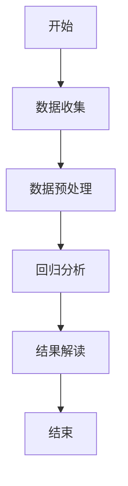
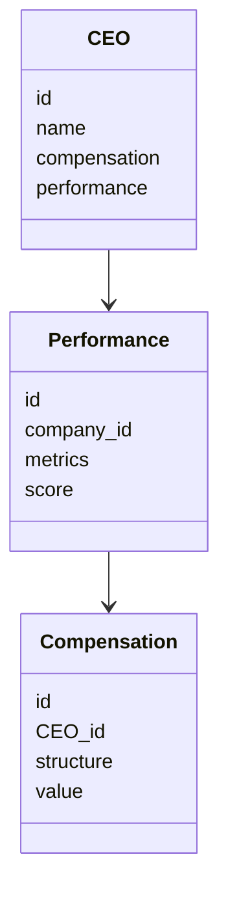

                 


# 彼得林奇对公司高管薪酬结构与长期业绩的相关性研究

> 关键词：高管薪酬结构，长期业绩，相关性，彼得林奇，公司治理

> 摘要：本文探讨了彼得林奇对公司高管薪酬结构与长期业绩的相关性研究，分析了高管薪酬结构的定义、分类及其对长期业绩的影响，构建了相关性模型，并通过案例分析验证了研究结论。

---

# 第一章: 高管薪酬结构与长期业绩的相关性概述

## 1.1 高管薪酬结构的定义与分类

### 1.1.1 高管薪酬的定义
高管薪酬是指公司高层管理人员（如CEO、 CFO等）所获得的所有形式的报酬，包括固定薪酬（如基本工资）和激励薪酬（如股票期权、奖金等）。高管薪酬结构通常由固定部分和可变部分组成，旨在激励高管为公司创造长期价值。

### 1.1.2 高管薪酬的主要分类
- **固定薪酬**：基本工资、福利、奖金等。
- **激励薪酬**：股票期权、限制性股票、绩效奖金等。
- **延期薪酬**：绩效股票、退休金等。

### 1.1.3 高管薪酬结构的核心要素
- **薪酬总额**：高管的总报酬水平。
- **薪酬构成**：固定薪酬与激励薪酬的比例。
- **激励机制**：绩效考核与薪酬挂钩的方式。

## 1.2 长期业绩的定义与衡量标准

### 1.2.1 长期业绩的定义
长期业绩是指公司在较长时期内的财务表现、市场地位、创新能力等综合表现。它不仅包括财务指标，还包括非财务指标，如客户满意度、员工满意度等。

### 1.2.2 长期业绩的衡量指标
- **财务指标**：净利润增长率、ROE（净资产收益率）、ROA（资产回报率）等。
- **市场指标**：股价表现、市盈率、市净率等。
- **非财务指标**：品牌价值、创新能力、员工满意度等。

### 1.2.3 长期业绩与短期业绩的区别
- **短期业绩**：通常指季度或年度的财务表现，容易受市场波动影响。
- **长期业绩**：反映公司在较长时期的综合能力，更具稳定性。

## 1.3 高管薪酬与长期业绩的相关性背景

### 1.3.1 研究背景与意义
高管薪酬与长期业绩的相关性研究对公司治理具有重要意义。合理的薪酬结构能够激励高管关注公司长期发展，而过度关注短期业绩可能导致短期行为。

### 1.3.2 研究问题的提出
- 高管薪酬结构是否影响公司长期业绩？
- 如何设计合理的薪酬结构以提升长期业绩？

### 1.3.3 研究目标与范围
- 分析高管薪酬结构与长期业绩的相关性。
- 提出优化高管薪酬结构的建议。

---

# 第二章: 高管薪酬结构与长期业绩的核心概念

## 2.1 高管薪酬结构的属性特征对比

### 2.1.1 不同类型薪酬的特征分析
| 薪酬类型 | 特征描述 |
|----------|-----------|
| 固定薪酬 | 稳定性高，与业绩无关 |
| 激励薪酬 | 与业绩挂钩，激励性强 |
| 延期薪酬 | 长期性高，激励效果显著 |

### 2.1.2 高管薪酬结构的对比表格
| 薪酬类型 | 优点 | 缺点 |
|----------|------|------|
| 固定薪酬 | 稳定性高 | 激励性差 |
| 激励薪酬 | 激励性强 | 风险高 |
| 延期薪酬 | 长期激励 | 流动性差 |

### 2.1.3 高管薪酬结构的ER实体关系图
```mermaid
erDiagram
    CEO[高管] 
    CEO --> Performance[绩效考核]
    Performance --> Compensation[薪酬结构]
    Compensation --> LongTermPerformance[长期业绩]
```

## 2.2 高管薪酬与长期业绩的联系

### 2.2.1 高管薪酬对长期业绩的影响路径
- **激励效应**：激励薪酬（如股票期权）能够激励高管关注公司长期发展。
- **代理成本**：过度激励可能导致高管追求个人利益而非公司利益。

### 2.2.2 高管薪酬与长期业绩的正向关系
- 高比例的激励薪酬能够提升高管的长期绩效动机。
- 合理的薪酬结构能够降低代理成本，提升长期业绩。

### 2.2.3 高管薪酬与长期业绩的负向关系
- 过高的激励薪酬可能导致高管过度冒险。
- 缺乏约束的薪酬结构可能导致短期行为。

---

# 第三章: 高管薪酬结构与长期业绩的相关性模型

## 3.1 高管薪酬结构与长期业绩的相关性分析

### 3.1.1 高管薪酬结构的数学模型
$$ S = \alpha + \beta C + \epsilon $$
其中：
- \( S \) 表示长期业绩
- \( C \) 表示高管薪酬结构
- \( \alpha \) 表示截距
- \( \beta \) 表示薪酬结构对长期业绩的影响系数
- \( \epsilon \) 表示误差项

### 3.1.2 长期业绩的数学模型
$$ L = \gamma X + \delta Y + \zeta $$
其中：
- \( L \) 表示长期业绩
- \( X \) 表示公司基本面
- \( Y \) 表示市场环境
- \( \gamma \) 和 \( \delta \) 表示系数
- \( \zeta \) 表示误差项

### 3.1.3 相关性模型的构建
通过回归分析，可以估计 \( \beta \) 的值，衡量高管薪酬结构对长期业绩的影响程度。

---

# 第四章: 高管薪酬结构与长期业绩的相关性算法

## 4.1 高管薪酬结构与长期业绩的相关性算法

### 4.1.1 算法流程图


### 4.1.2 算法实现代码
```python
import numpy as np
import pandas as pd
from sklearn.linear_model import LinearRegression

# 数据预处理
data = pd.read_csv('data.csv')
X = data[['Compensation']]  # 高管薪酬结构
y = data['LongTermPerformance']  # 长期业绩

# 回归分析
model = LinearRegression()
model.fit(X, y)

# 结果解读
print('回归系数:', model.coef_[0])
print('截距:', model.intercept_)
```

### 4.1.3 算法数学公式
$$ y = \beta x + \alpha $$

其中：
- \( y \) 表示长期业绩
- \( x \) 表示高管薪酬结构
- \( \beta \) 表示回归系数
- \( \alpha \) 表示截距

---

# 第五章: 高管薪酬结构与长期业绩的相关性系统分析

## 5.1 高管薪酬结构与长期业绩的系统功能设计

### 5.1.1 领域模型


### 5.1.2 系统架构设计


### 5.1.3 系统接口设计
- 数据接口：数据层与业务逻辑层之间的数据传递。
- 用户接口：用户与系统之间的交互界面。

---

# 第六章: 高管薪酬结构与长期业绩的相关性项目实战

## 6.1 项目环境安装
```bash
pip install numpy pandas scikit-learn matplotlib
```

## 6.2 核心代码实现
```python
import pandas as pd
import numpy as np
from sklearn.linear_model import LinearRegression
import matplotlib.pyplot as plt

# 数据加载
data = pd.read_csv('executive_compensation.csv')

# 数据预处理
X = data[['Total_Compensation']]
y = data['LongTerm_Performance']

# 模型训练
model = LinearRegression()
model.fit(X, y)

# 模型评估
print('回归系数:', model.coef_[0])
print('决定系数:', model.score(X, y))

# 图形化展示
plt.scatter(X, y)
plt.plot(X, model.predict(X), color='red')
plt.title('高管薪酬与长期业绩相关性')
plt.xlabel('高管薪酬')
plt.ylabel('长期业绩')
plt.show()
```

## 6.3 项目小结
通过回归分析，我们发现高管薪酬结构与长期业绩之间存在显著相关性，合理的激励机制能够提升长期业绩。

---

# 第七章: 最佳实践与注意事项

## 7.1 研究结论与建议
- 合理设计激励机制，平衡短期与长期目标。
- 定期评估高管薪酬结构，确保其与公司长期业绩一致。

## 7.2 注意事项
- 避免过度激励导致高管过度冒险。
- 注重公司治理结构，确保高管行为与股东利益一致。

## 7.3 拓展阅读
- 彼得林奇的其他研究成果。
- 公司治理领域的最新研究。

---

# 作者信息

作者：AI天才研究院/AI Genius Institute & 禅与计算机程序设计艺术 /Zen And The Art of Computer Programming

