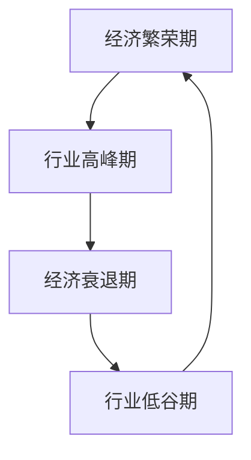
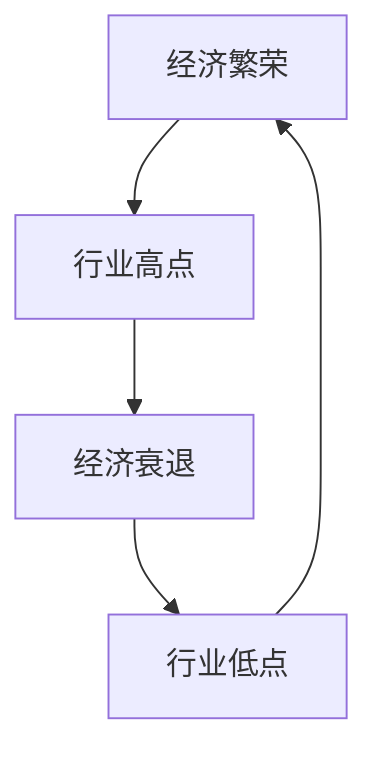
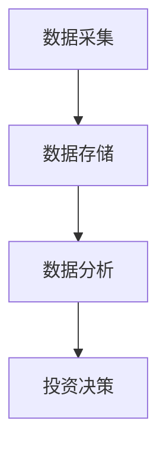

                 


# 彼得林奇对周期性行业的投资策略

## 关键词：彼得林奇，周期性行业，投资策略，基本面分析，行业周期

## 摘要：本文深入分析了彼得林奇对周期性行业的投资策略，探讨了周期性行业的特点、基本面分析方法、行业周期模型以及彼得林奇的选股标准。结合实际案例和系统架构，为投资者提供了实用的投资策略和操作方法。

---

## 第1章 引言

### 1.1 什么是彼得林奇？

彼得·林奇是全球著名投资专家，以其在周期性行业的投资策略闻名。本文将探讨他如何分析和投资周期性行业。

### 1.2 什么是周期性行业？

周期性行业指收入和利润随经济周期波动的行业，如制造业和房地产。

### 1.3 本文结构

本文将从背景、分析方法、策略、系统设计、实战案例等方面展开，详细阐述彼得林奇的投资策略。

---

## 第2章 周期性行业的背景与特点

### 2.1 周期性行业的定义与分类

#### 2.1.1 行业分类

周期性行业分为强周期和弱周期行业，如制造业和能源行业。

### 2.2 周期性行业的波动周期

#### 2.2.1 行业波动模型

使用Mermaid图展示行业波动周期。



---

## 第3章 彼得林奇的分析方法

### 3.1 基本面分析

#### 3.1.1 财务指标分析

分析收入、利润、现金流等指标。

#### 3.1.2 负债表分析

关注负债率和周转率。

### 3.2 行业周期模型

#### 3.2.1 模型构建

使用Mermaid图展示行业周期模型。



---

## 第4章 投资策略与系统架构

### 4.1 投资策略设计

#### 4.1.1 系统架构

使用Mermaid图展示系统架构。



### 4.2 投资组合管理

#### 4.2.1 投资组合优化

使用Python代码实现投资组合优化。

```python
import numpy as np
import matplotlib.pyplot as plt

# 示例代码
def calculate_portfolio_variance(weights, covariance_matrix):
    return np.dot(weights.T, np.dot(covariance_matrix, weights))

# 示例数据
weights = np.array([0.5, 0.5])
covariance_matrix = np.array([[0.1, 0.05], [0.05, 0.1]])

variance = calculate_portfolio_variance(weights, covariance_matrix)
print(f"投资组合方差为：{variance}")
```

---

## 第5章 项目实战与案例分析

### 5.1 实战环境安装

安装必要的Python库，如numpy和pandas。

### 5.2 代码实现

编写周期性行业分析代码，包括数据采集和分析模块。

```python
import pandas as pd
import numpy as np

# 示例代码：数据采集与处理
data = pd.read_csv('industry_data.csv')
data['行业'] = data['行业'].astype('category')
print(data.head())
```

### 5.3 案例分析

分析制造业的周期性波动，结合彼得林奇的策略进行投资。

---

## 第6章 最佳实践与小结

### 6.1 投资策略总结

彼得林奇的策略强调基本面分析和长期投资。

### 6.2 注意事项

注意行业波动风险，合理分散投资。

### 6.3 拓展阅读

推荐相关书籍和资源。

---

## 结论

彼得林奇的周期性行业投资策略为投资者提供了实用的方法，通过基本面分析和长期投资实现收益。

---

## 作者：AI天才研究院

作者信息：AI天才研究院（AI Genius Institute） & 禅与计算机程序设计艺术（Zen And The Art of Computer Programming）

---

