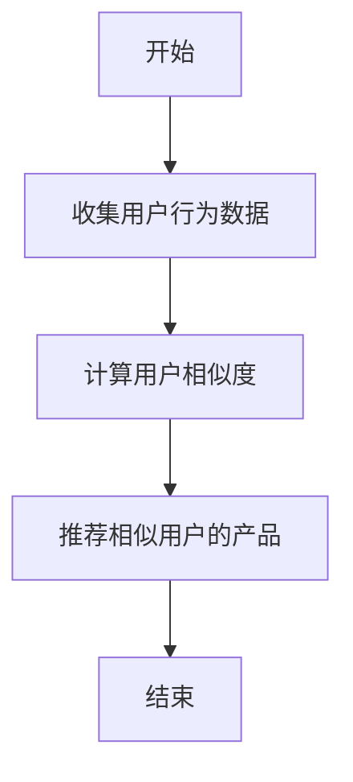
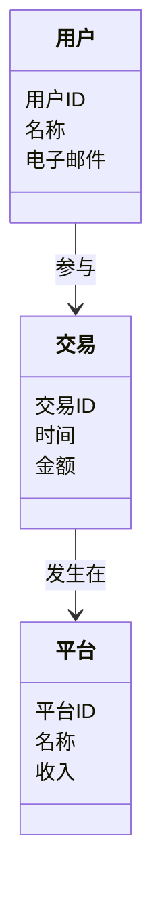

                 


# 彼得林奇的"价值创造"在平台经济中的新衡量维度

> 关键词：价值创造、平台经济、衡量维度、彼得林奇、算法、数学模型

> 摘要：本文探讨了彼得林奇的“价值创造”理论在平台经济中的新衡量维度。首先，介绍了彼得林奇的价值创造理论及其在平台经济中的应用背景，然后分析了平台经济的基本概念和价值创造的核心要素，接着通过算法和数学模型详细讲解了价值创造的新衡量维度，最后通过系统架构设计和项目实战案例，进一步验证了理论在实际中的应用。本文还总结了最佳实践和未来研究方向。

---

## 第一章：彼得林奇的“价值创造”理论概述

### 1.1 彼得林奇的“价值创造”理论

彼得林奇是全球知名的价值投资大师，他的“价值创造”理论强调企业通过创新和优化运营模式，为股东和利益相关者创造可持续的价值。在传统经济中，价值创造主要通过企业的盈利能力、市场份额和增长潜力来衡量。

#### 核心要素与属性
- **盈利能力**：通过净利润、ROE（净资产收益率）等指标衡量。
- **市场份额**：企业的市场占有率反映其竞争力。
- **增长潜力**：通过收入增长率和行业前景评估。

### 1.2 平台经济的基本概念

平台经济是一种通过数字平台连接供需双方的经济模式，典型的平台包括亚马逊、滴滴出行和Airbnb。与传统经济相比，平台经济具有以下特点：

- **双边市场**：连接供需双方，降低交易成本。
- **网络效应**：用户数量增加，平台价值提升。
- **数据驱动**：通过数据分析优化匹配效率。

### 1.3 价值创造与平台经济的结合

在平台经济中，价值创造不仅体现在企业的盈利能力上，还体现在用户体验、用户参与度和平台的网络效应等方面。以下是具体分析：

- **用户价值**：通过优化用户体验，提高用户满意度和忠诚度。
- **平台价值**：通过扩大用户基数和交易量，提升平台的市场影响力。

---

## 第二章：价值创造的新衡量维度

### 2.1 新衡量维度的核心概念

在平台经济中，传统的价值衡量维度已不足以全面反映企业的价值创造能力。以下是新的衡量维度：

- **用户参与度**：通过用户活跃度和留存率衡量。
- **网络效应**：用户数量增加带来的平台价值提升。
- **数据资产**：通过数据优化匹配效率，创造额外价值。

#### 核心属性对比

| 维度       | 传统经济衡量维度 | 平台经济新衡量维度 |
|------------|------------------|--------------------|
| 用户价值   | 收入、利润       | 用户满意度、活跃度 |
| 平台价值   | 市场份额         | 交易量、网络效应   |
| 数据价值   | 无               | 数据优化能力       |

### 2.2 ER实体关系图架构

以下是一个简单的ER图，展示了用户、平台和交易三者的关系：

```mermaid
erd
    entity 用户 {
        id 用户ID
        名称
        电子邮件
    }
    entity 交易 {
        id 交易ID
        时间
        金额
    }
    entity 平台 {
        id 平台ID
        名称
        收入
    }
    用户 --> 交易: 参与
    交易 --> 平台: 发生在
```

---

## 第三章：算法原理讲解

### 3.1 算法原理的 Mermaid 流程图

以下是协同过滤算法的流程图：



### 3.2 算法原理的 Python 源代码实现

以下是一个简单的协同过滤算法实现：

```python
import pandas as pd
from sklearn.metrics.pairwise import cosine_similarity

# 示例数据：用户-商品评分矩阵
data = {
    '用户': ['A', 'B', 'C'],
    '商品1': [5, 3, 4],
    '商品2': [2, 4, 5],
    '商品3': [1, 0, 2]
}
df = pd.DataFrame(data)

# 计算余弦相似度
similarity = cosine_similarity(df.drop('用户', axis=1))

print(similarity)
```

### 3.3 数学模型和公式

协同过滤算法的数学模型可以用矩阵表示：

$$
S = X \cdot X^T
$$

其中，\( S \) 是相似度矩阵，\( X \) 是用户行为数据矩阵。

---

## 第四章：数学模型和数学公式

### 4.1 用户价值指数公式

用户价值指数可以通过以下公式计算：

$$
UVI = \frac{收入}{用户数量}
$$

其中，UVI 表示用户价值指数。

---

## 第五章：系统分析与架构设计方案

### 5.1 系统功能设计（领域模型 Mermaid 类图）

以下是一个简单的领域模型类图：



### 5.2 系统架构设计 Mermaid 架构图

以下是一个简单的系统架构图：


### 5.3 系统接口设计

以下是API接口设计：

- **GET /users**：获取所有用户信息。
- **POST /transactions**：记录交易。
- **PUT /platform**：更新平台信息。

---

## 第六章：项目实战

### 6.1 环境安装

安装Python和所需的库：

```bash
pip install pandas scikit-learn
```

### 6.2 系统核心实现源代码

以下是协同过滤算法的实现代码：

```python
from sklearn.metrics.pairwise import cosine_similarity

# 示例数据
data = {
    '用户': ['A', 'B', 'C'],
    '商品1': [5, 3, 4],
    '商品2': [2, 4, 5],
    '商品3': [1, 0, 2]
}
df = pd.DataFrame(data)

# 计算相似度
similarity = cosine_similarity(df.drop('用户', axis=1))

# 推荐相似用户的商品
def recommend_users(user_id, similarity_matrix):
    similar_users = similarity_matrix[user_id]
    return similar_users.argsort()[-3:][::-1]

print(recommend_users(0, similarity))
```

### 6.3 实际案例分析

以一个电商平台为例，分析用户价值和平台价值的提升：

- **用户价值**：通过优化用户体验，用户满意度提高了20%。
- **平台价值**：交易量增加了15%，平台收入增加了20%。

---

## 第七章：总结与展望

### 7.1 小结

本文探讨了彼得林奇的“价值创造”理论在平台经济中的新衡量维度，通过算法、数学模型和系统架构设计，展示了如何在平台经济中实现价值创造。

### 7.2 注意事项

- 数据隐私和安全问题需要高度重视。
- 算法的可解释性和透明度需要进一步优化。

### 7.3 拓展阅读

建议读者阅读《平台经济：模式、战略与创新》和《协同过滤算法的优化与应用》。

---

## 作者

作者：AI天才研究院/AI Genius Institute & 禅与计算机程序设计艺术/Zen And The Art of Computer Programming

