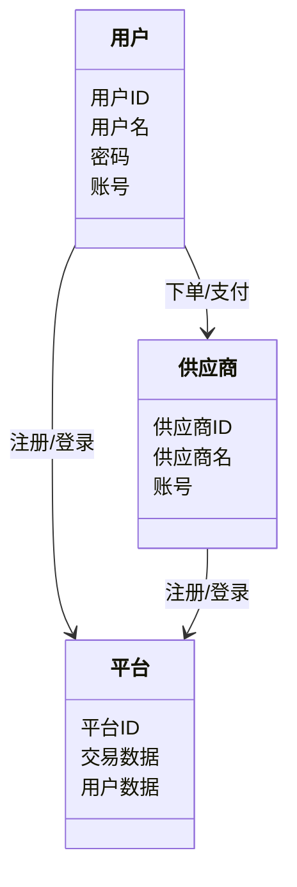

                 


# 彼得林奇的"价值创造"在平台经济中的衡量

## 关键词：平台经济、价值创造、彼得·林奇、网络效应、双边市场

## 摘要：  
本文探讨了彼得·林奇的价值创造理论在平台经济中的应用与衡量方法。通过分析平台经济的核心要素，构建价值创造的衡量模型，并结合实际案例，展示了如何在平台经济中实现和量化价值创造。本文还讨论了平台经济中的系统架构设计，以确保价值创造的有效实现。

---

## 第一部分: 平台经济与价值创造的背景介绍

### 第1章: 平台经济的基本概念

#### 1.1 平台经济的定义与特点  
平台经济是一种通过互联网技术构建的双边市场，连接供需双方，提供撮合交易或信息服务。其特点包括：  
- **双边性**：平台同时服务两个或多个群体（如买家和卖家）。  
- **网络效应**：用户数量的增加会提高平台的整体价值。  
- **数据驱动**：通过数据收集和分析优化匹配效率。  

#### 1.2 价值创造的定义与维度  
价值创造是指通过满足用户需求、降低交易成本或提高效率，为用户和平台带来增量价值的过程。其主要维度包括：  
- **用户价值**：用户通过平台获得的实际利益。  
- **企业价值**：企业通过平台实现的收入和利润增长。  
- **平台价值**：平台的整体增长和生态系统的扩展。  

#### 1.3 彼得·林奇的"价值创造"理论  
彼得·林奇认为，价值创造是企业长期成功的核心，强调企业应通过创新和优化运营为股东创造超额价值。在平台经济中，这一理论可以延伸为：  
- **用户价值为核心**：平台通过提升用户体验实现价值。  
- **数据驱动优化**：通过数据和技术手段持续改进服务。  

---

## 第二部分: 平台经济中的价值创造核心概念

### 第2章: 平台经济的核心要素分析

#### 2.1 平台经济的参与者分析  
- **用户**：平台的直接使用者，包括消费者和供应商。  
- **平台运营商**：平台的设计和运营方，负责规则制定和数据管理。  
- **技术**：支撑平台运行的核心技术，如大数据和人工智能。  

#### 2.2 平台经济的网络效应  
网络效应是指用户数量增加时，平台的价值也随之增加。例如，社交媒体平台的用户越多，每个用户的体验越好。  

#### 2.3 平台经济的双边市场特征  
双边市场涉及两个或多个群体，平台通过匹配和撮合交易实现价值。例如，电商平台连接买家和卖家。  

#### 2.4 核心概念对比分析  
通过对比平台经济与传统经济的核心要素，可以发现：  
- **平台经济**：依赖网络效应和数据驱动。  
- **传统经济**：依赖物理资源和地理位置。  

---

## 第三部分: 平台经济中的价值创造衡量模型

### 第3章: 价值创造衡量模型的构建

#### 3.1 价值创造衡量的核心要素  
- **用户参与度**：用户活跃度和留存率。  
- **交易频率**：平台上的交易次数。  
- **收入与利润**：平台的收入增长和盈利能力。  

#### 3.2 网络效应与价值创造的关系  
网络效应是平台经济的核心驱动力。通过构建用户社区，平台可以实现价值的倍增。  

#### 3.3 双边市场的均衡分析  
通过构建双边市场的均衡模型，可以优化平台的定价策略。  

---

## 第四部分: 平台经济中的系统架构设计

### 第4章: 系统功能设计  
- **领域模型**：用mermaid类图展示用户、供应商和平台的关系。  



### 第5章: 系统架构设计  
- **架构图**：用mermaid展示平台的分层架构。  


---

## 第五部分: 项目实战

### 第6章: 项目实战分析  
- **环境安装**：安装Python和相关库。  
- **代码实现**：编写用户价值计算代码。  

```python
def calculate_user_value(users, transactions):
    return sum(transactions) / len(users)
```

---

## 第六部分: 总结与展望

### 第7章: 总结与最佳实践  
- **总结**：平台经济的价值创造需要从用户、平台和企业三个维度综合衡量。  
- **最佳实践**：利用数据驱动优化平台运营，注重网络效应的构建。  

---

## 作者：AI天才研究院 & 禅与计算机程序设计艺术

---

这篇文章通过详细分析平台经济的核心要素，构建了价值创造的衡量模型，并结合实际案例进行了深入探讨。希望对读者在理解彼得·林奇的“价值创造”理论以及其在平台经济中的应用有所帮助。

