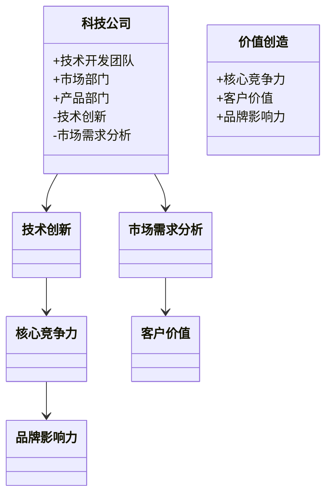

                 


# 彼得林奇的"价值创造"在科技公司中的应用

> **关键词**: 价值创造，彼得·林奇，科技公司，投资策略，价值评估

> **摘要**: 本文探讨了彼得·林奇的价值创造理念在科技公司中的应用，分析了科技公司的特点、价值驱动因素以及如何评估和实现价值创造。通过系统分析和具体案例，文章展示了如何将彼得·林奇的投资策略与科技公司的实际情况相结合，为投资者和企业管理者提供了实用的指导。

---

## 第一部分: 彼得林奇的"价值创造"概述

### 第1章: 价值创造的核心概念

#### 1.1 价值创造的定义与背景

价值创造是指通过一系列活动和策略，为公司、股东或利益相关者创造额外价值的过程。彼得·林奇是价值投资的代表人物，他强调通过深入分析公司基本面，寻找被市场低估的股票进行长期投资。

**背景介绍**: 价值创造的核心在于识别公司的潜在价值，并通过合理的投资策略实现价值增长。在科技公司中，价值创造尤为重要，因为科技行业变化快、创新能力强，价值评估需要考虑技术发展、市场需求和公司战略等多方面因素。

#### 1.2 价值创造的关键要素

- **核心竞争力**: 公司在技术和市场上的独特优势。
- **可持续增长**: 公司能否在长期实现稳定增长。
- **价值实现路径**: 如何通过市场、产品和管理将潜在价值转化为实际收益。

### 第2章: 科技公司的特点与价值创造

#### 2.1 科技公司的定义与分类

科技公司主要通过技术创新提供产品或服务，涵盖软件、硬件、互联网等多个领域。科技公司的特点包括高成长性、高风险性和高创新性。

**系统分析**: 科技公司的价值创造依赖于技术创新和市场需求的结合。领域模型的Mermaid类图如下：



#### 2.2 科技公司的价值创造机制

- **技术创新**: 技术创新是科技公司价值创造的核心驱动力。通过不断的技术研发，公司可以提供更优质的产品和服务，从而实现价值增长。
- **市场需求**: 了解市场需求是价值创造的关键。科技公司需要通过市场调研和用户反馈，不断调整产品策略，满足市场需求。

---

## 第二部分: 价值创造的评估标准

### 第3章: 财务指标分析

#### 3.1 净利润与价值创造的关系

净利润是衡量公司盈利能力的重要指标，反映了公司在一定时期内的经营成果。净利润的持续增长表明公司价值的提升。

**数学模型**: 净利润（Net Income）= 营业收入 - 营业成本 - 税费 - 利息支出

#### 3.2 股东权益回报率（ROE）的计算

ROE是衡量公司使用股东资金效率的重要指标，公式为：

$$ ROE = \frac{净利润}{股东权益} $$

### 第4章: 非财务指标分析

#### 4.1 创新能力的评估

创新能力强的公司能够快速适应市场变化，推出新产品和新服务。创新能力的评估可以从研发投入、专利数量和新产品推出速度等方面进行。

#### 4.2 品牌价值的衡量

品牌价值是公司无形资产的重要组成部分，可以通过品牌知名度、品牌忠诚度和品牌影响力等指标进行评估。

---

## 第三部分: 科技公司的价值驱动因素

### 第5章: 技术创新的核心作用

#### 5.1 技术创新的定义与分类

技术创新是指公司通过改进技术或开发新技术来提高产品或服务的性能和质量。技术创新可以分为产品创新和流程创新。

#### 5.2 技术创新对价值创造的推动

技术创新能够提高公司的竞争力，降低生产成本，提升产品附加值。例如，一家科技公司通过技术创新降低了生产成本，从而提高了利润率。

### 第6章: 客户价值的实现

#### 6.1 客户价值的定义与层次

客户价值是指客户从购买和使用产品或服务中获得的实际利益和感知价值。客户价值的层次包括功能价值、情感价值和象征价值。

#### 6.2 客户价值的实现路径

- 提供高质量的产品和服务。
- 建立良好的客户关系，提高客户满意度和忠诚度。
- 不断创新，满足客户的多样化需求。

---

## 第四部分: 彼得林奇投资策略在科技公司的应用

### 第7章: 长期投资策略

#### 7.1 长期投资的核心理念

彼得·林奇强调长期投资，他认为短期市场波动会影响股价，但长期来看，公司的基本面才是决定股价的关键因素。

#### 7.2 价值投资的实施步骤

1. **基本面分析**: 通过分析公司的财务报表、管理层素质和行业地位，识别具有潜力的公司。
2. **选择低估股票**: 找到市场价格低于内在价值的股票进行投资。
3. **长期持有**: 避免频繁交易，耐心等待公司价值的实现。

---

## 第五部分: 价值评估模型的设计与应用

### 第8章: 价值评估模型的构建

#### 8.1 模型设计思路

价值评估模型需要综合考虑财务指标和非财务指标，全面评估公司的价值。模型设计步骤包括：

1. 确定评估指标。
2. 收集相关数据。
3. 建立评估模型。
4. 进行模型验证。

#### 8.2 模型的具体实现

使用Python进行价值评估模型的实现，代码如下：

```python
import pandas as pd

# 假设df是包含公司财务数据的DataFrame
# 计算ROE
df['ROE'] = df['净利润'] / df['股东权益']

# 计算客户满意度
df['客户满意度'] = (df['客户投诉率'] + df['客户忠诚度']) / 2

# 综合价值评分
df['综合价值评分'] = 0.5 * df['ROE'] + 0.5 * df['客户满意度']
```

---

## 第六部分: 案例分析

### 第9章: 科技公司价值创造的案例

#### 9.1 苹果公司的价值创造

苹果公司通过不断创新，推出iPhone、iPad等产品，成功实现了价值创造。公司的ROE和客户满意度均处于行业领先水平。

#### 9.2 微软公司的转型

微软通过Azure云服务的开发，成功实现了从传统软件公司向云服务提供商的转型，提升了公司的整体价值。

---

## 第七部分: 风险管理与投资策略

### 第10章: 科技公司的风险管理

#### 10.1 市场风险

市场风险是科技公司面临的主要风险之一，包括市场需求变化和技术更新换代带来的风险。

#### 10.2 创新风险

创新失败可能导致公司失去市场竞争力，因此科技公司需要在技术创新和风险管理之间找到平衡。

---

## 第八部分: 总结与展望

### 第11章: 总结与投资建议

#### 11.1 总结

彼得·林奇的价值创造理念在科技公司中具有重要的应用价值。科技公司需要通过技术创新、客户需求满足和长期投资来实现价值创造。

#### 11.2 投资建议

- **选择具有强大技术创新能力的公司**。
- **关注公司的财务健康状况**。
- **长期持有优质股票**。

---

## 作者信息

**作者**: AI天才研究院/AI Genius Institute & 禅与计算机程序设计艺术 /Zen And The Art of Computer Programming

---

通过以上内容，我们可以看到，彼得·林奇的价值创造理念在科技公司中的应用是一个复杂但极具挑战性的任务。科技公司的特点和独特性要求投资者和企业管理者具备深入的分析能力和长期的战略眼光。希望本文能为读者提供有益的指导和启发。

