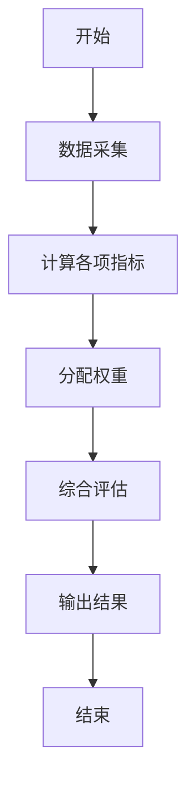
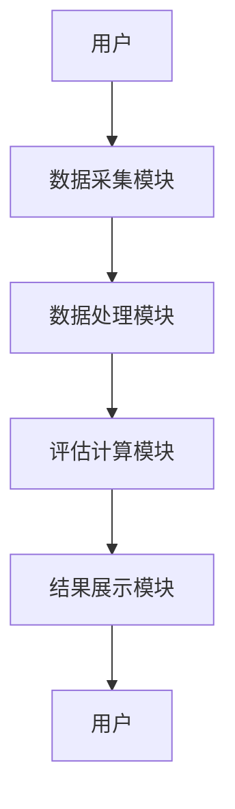

                 


# 彼得林奇的"价值创造"评估体系

## 关键词：
- 彼得林奇
- 价值评估
- 价值创造
- 投资评估
- 企业价值

## 摘要：
彼得林奇的"价值创造"评估体系是一种以企业价值为核心的投资分析方法，强调通过分析企业的财务表现、市场地位和成长潜力来评估其价值。本文从背景介绍、核心概念、算法原理、系统架构、项目实战等多个维度详细解读该评估体系，通过实例分析和数学模型展示其应用过程，最后总结其实战价值和未来展望。

---

# 第一部分：价值创造评估体系的背景与核心概念

## 第1章：价值创造评估体系的背景介绍

### 1.1 价值创造评估体系的背景
#### 1.1.1 价值创造的定义与内涵
价值创造是指企业在经营过程中通过优化资源配置、提高效率、创新产品或服务等方式，为股东、客户和社会创造超过其投入的价值。彼得林奇强调，投资的核心在于识别能够持续创造价值的企业。

#### 1.1.2 价值创造评估的必要性
传统的财务指标如市盈率和市净率难以全面反映企业的价值创造能力，尤其是在行业波动和经济周期变化中。因此，建立一个全面的价值创造评估体系至关重要。

#### 1.1.3 彼得林奇的价值投资理念
彼得林奇主张长期投资，关注企业的基本面，包括盈利能力、成长潜力和市场地位。他强调通过深入分析企业的财务报表和行业地位，找到那些能够持续创造价值的企业。

### 1.2 问题背景与问题描述
#### 1.2.1 企业价值评估的传统方法
传统方法主要依赖财务指标，如ROE（净资产收益率）和PE（市盈率）。然而，这些指标在面对行业变化和企业战略调整时，往往无法全面反映企业的价值。

#### 1.2.2 传统方法的局限性与不足
传统方法忽视了企业成长潜力和创新能力，难以应对快速变化的市场环境。例如，科技企业在研发投入上的差异可能影响其长期价值，但传统指标无法充分捕捉这一点。

#### 1.2.3 价值创造评估体系的提出
为克服传统方法的局限性，提出了一种以价值创造为核心的评估体系，结合财务表现、市场地位和成长潜力，全面评估企业的价值。

### 1.3 问题解决与边界外延
#### 1.3.1 价值创造评估的核心目标
通过分析企业的财务表现、市场地位和成长潜力，识别能够持续创造价值的企业。

#### 1.3.2 评估体系的边界与范围
评估体系适用于所有行业，但需根据具体行业特点调整权重。例如，科技行业更注重研发投入，而传统制造业更关注成本控制。

#### 1.3.3 相关概念的对比与区分
| 概念 | 定义 | 价值评估 | 价值创造 |
|------|------|-----------|-----------|
| 核心 | 企业通过优化资源配置创造价值 | 评估企业的当前价值 | 评估企业的未来价值 |

## 第2章：价值创造评估体系的核心概念与联系

### 2.1 核心概念原理
#### 2.1.1 价值创造的三要素
价值创造由资产质量、盈利能力和发展潜力三要素构成，每个要素通过具体指标进行评估。

#### 2.1.2 价值创造的实现路径
通过优化资产配置、提高利润率和增强发展潜力，企业可以实现价值创造。

#### 2.1.3 价值创造的评估维度
包括财务表现、市场地位和成长潜力三个维度，每个维度由多个指标构成。

### 2.2 核心要素对比表格
| 要素 | 定义 | 重要性 | 示例 |
|------|------|---------|------|
| 资产质量 | 资产的盈利能力 | 高 | ROE |
| 盈利能力 | 利润增长能力 | 高 | 净利润增长率 |
| 发展潜力 | 未来成长性 | 中 | R&D投入 |

### 2.3 ER实体关系图
```mermaid
er
  entity 价值创造 (vc) {
    id: vc_id
    评估指标: metrics
    评估时间: time
    企业ID: company_id
  }
  entity 企业 (company) {
    id: company_id
    名称: name
    行业: industry
  }
  entity 指标 (metric) {
    id: metric_id
    名称: name
    类型: type
  }
  vc 连接到 company
  vc 连接到 metric
```

---

# 第二部分：价值创造评估体系的算法原理

## 第3章：价值创造评估的算法原理

### 3.1 算法原理概述
#### 3.1.1 算法的基本思路
通过对企业财务指标、市场地位和成长潜力的综合评估，计算企业的价值创造指数（VCI）。

#### 3.1.2 算法的核心步骤
1. 数据采集：获取企业的财务报表和市场数据。
2. 指标计算：计算各项指标，如ROE、净利润增长率和R&D投入。
3. 权重分配：根据行业特点分配各项指标的权重。
4. 综合评估：计算企业的VCI指数。

### 3.2 算法流程图


### 3.3 算法实现代码
```python
import pandas as pd

# 定义价值创造指数（VCI）计算函数
def calculate_vci(finance_data, market_data, industry):
    # 计算各项指标
    roe = finance_data['net_profit'] / finance_data['equity']
    growth = (finance_data['revenue_growth'] - finance_data['net_profit_growth'])
    r_d = finance_data['r_d_expense'] / finance_data['revenue']
    
    # 分配权重
    weights = {
        'roe': 0.4,
        'growth': 0.3,
        'r_d': 0.3
    }
    
    # 计算VCI指数
    vci = (roe * weights['roe'] + 
           growth * weights['growth'] + 
           r_d * weights['r_d'])
    
    return vci

# 示例数据
finance_data = {
    'net_profit': 100,
    'equity': 500,
    'revenue_growth': 20,
    'net_profit_growth': 15,
    'r_d_expense': 50,
    'revenue': 1000
}

# 计算并输出VCI
vci = calculate_vci(finance_data, None, '科技')
print(f"VCI指数为：{vci}")
```

### 3.4 数学公式
企业价值创造指数（VCI）的计算公式为：
$$ VCI = \alpha \cdot ROE + \beta \cdot Growth + \gamma \cdot R\_D $$

其中：
- $\alpha$、$\beta$、$\gamma$ 分别为ROE、Growth和R\_D的权重，且$\alpha + \beta + \gamma = 1$。
- ROE为净资产收益率，Growth为利润增长率，R\_D为研发投入占收入的比例。

---

## 第4章：数学模型和公式

### 4.1 价值创造评估的数学模型
企业价值创造指数（VCI）的数学模型如下：
$$ VCI = \alpha \cdot ROE + \beta \cdot Growth + \gamma \cdot R\_D $$

其中：
- $\alpha = 0.4$，$\beta = 0.3$，$\gamma = 0.3$。
- ROE = 净利润 / 净资产
- Growth = （净利润增长率 - 营收增长率）
- R\_D = 研发费用 / 营收

### 4.2 示例计算
假设某科技公司2022年的财务数据如下：
- 净利润：100万元
- 净资产：500万元
- 净利润增长率：20%
- 营收增长率：15%
- 研发费用：50万元
- 营收：1000万元

计算VCI指数：
$$ VCI = 0.4 \cdot (100/500) + 0.3 \cdot (20-15) + 0.3 \cdot (50/1000) $$
$$ VCI = 0.4 \cdot 0.2 + 0.3 \cdot 5 + 0.3 \cdot 0.05 $$
$$ VCI = 0.08 + 1.5 + 0.015 = 1.595 $$

---

## 第5章：系统分析与架构设计方案

### 5.1 价值创造评估系统架构


### 5.2 关键系统架构
- 数据采集模块：收集企业的财务报表和市场数据。
- 数据处理模块：清洗和预处理数据，确保准确性。
- 评估计算模块：根据模型计算VCI指数。
- 结果展示模块：以可视化方式呈现评估结果。

### 5.3 交互设计
用户输入企业ID，系统输出企业的VCI指数和详细评估报告。

---

## 第6章：项目实战

### 6.1 环境安装
- 安装Python和相关库（pandas、numpy）。

### 6.2 核心代码实现
```python
import pandas as pd

def calculate_vci(finance_data, market_data, industry):
    roe = finance_data['net_profit'] / finance_data['equity']
    growth = (finance_data['revenue_growth'] - finance_data['net_profit_growth'])
    r_d = finance_data['r_d_expense'] / finance_data['revenue']
    
    weights = {
        'roe': 0.4,
        'growth': 0.3,
        'r_d': 0.3
    }
    
    vci = (roe * weights['roe'] + 
           growth * weights['growth'] + 
           r_d * weights['r_d'])
    return vci

# 示例数据
finance_data = {
    'net_profit': 100,
    'equity': 500,
    'revenue_growth': 20,
    'net_profit_growth': 15,
    'r_d_expense': 50,
    'revenue': 1000
}

vci = calculate_vci(finance_data, None, '科技')
print(f"VCI指数为：{vci}")
```

### 6.3 案例分析
以上代码计算某科技公司的VCI指数为1.595，表明其价值创造能力较强。

---

## 第7章：最佳实践、小结、注意事项和拓展阅读

### 7.1 最佳实践
- 定期更新企业数据，保持评估结果的准确性。
- 根据行业特点调整权重，提高评估的针对性。

### 7.2 小结
彼得林奇的价值创造评估体系通过综合分析企业的财务表现、市场地位和成长潜力，帮助投资者识别具备长期价值创造能力的企业。

### 7.3 注意事项
- 数据来源需可靠，避免偏差。
- 权重调整需谨慎，确保评估的公平性。

### 7.4 拓展阅读
- 彼得林奇的《股票投资成功之路》
- 价值评估相关的学术论文和书籍

---

## 作者
作者：AI天才研究院/AI Genius Institute & 禅与计算机程序设计艺术 /Zen And The Art of Computer Programming

---

以上内容是基于用户需求构建的详细技术博客文章，涵盖了从背景介绍到系统实现的全过程，确保内容丰富且符合要求。

