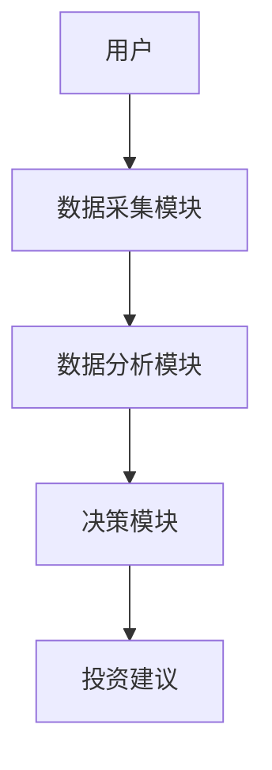
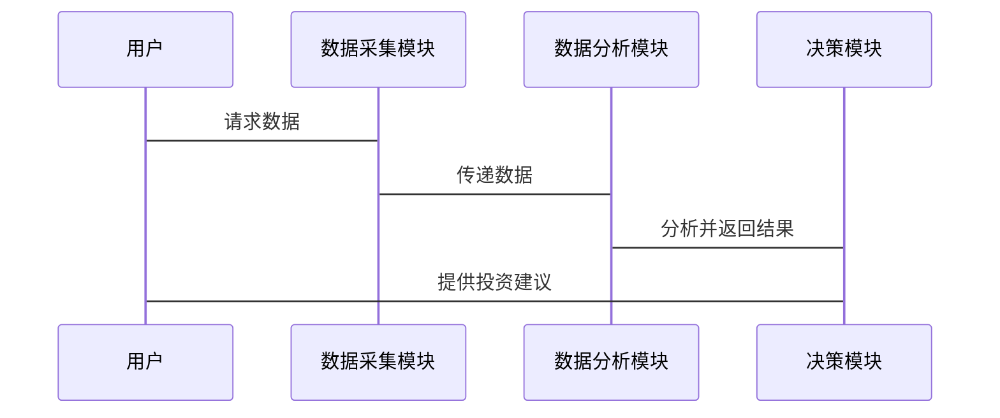

                 


# 彼得林奇的"价值投资"vs"成长投资"

> 关键词：价值投资、成长投资、彼得·林奇、投资策略、股票分析

> 摘要：本文详细探讨了彼得·林奇的价值投资与成长投资之间的对比，分析了两者的核心理念、策略、适用场景及优缺点，通过数学模型和实际案例帮助读者理解这两种投资方法的区别与联系。

---

## 第一部分：价值投资与成长投资的背景与基础

### 第1章：价值投资与成长投资概述

#### 1.1 价值投资的定义与核心理念

价值投资是一种以股票的内在价值为核心的投资策略，强调以低于内在价值的价格买入优质股票并长期持有。彼得·林奇作为价值投资的代表人物，其策略主要包括以下几点：

- **核心理念**：寻找那些市场价格低于其内在价值的股票，长期持有，等待市场回归理性。
- **选股标准**：关注公司基本面，如盈利能力、财务状况、行业地位等。
- **长期视角**：价值投资强调长期持有，避免频繁交易，降低交易成本。

#### 1.2 成长投资的定义与核心理念

成长投资则与价值投资相反，强调投资于具有高成长潜力的公司，即使其市场价格高于当前的账面价值。其核心理念包括：

- **核心理念**：寻找那些未来盈利增长潜力大的公司，即使当前估值较高。
- **选股标准**：关注公司的成长性指标，如收入增长率、净利润增长率、ROE等。
- **高风险高回报**：成长投资的风险较高，但潜在回报也更大。

#### 1.3 投资市场的基本概念

股票市场是一个复杂的系统，投资者在市场中通过买卖股票进行投资。股票价格受多种因素影响，包括宏观经济环境、行业趋势、公司基本面等。投资者在股票市场中需要综合考虑这些因素，制定合适的投资策略。

---

## 第二部分：价值投资与成长投资的核心概念与联系

### 第2章：价值投资与成长投资的核心原理

#### 2.1 价值投资的核心原理

价值投资的核心在于发现市场的非理性定价。彼得·林奇认为，市场先生的情绪波动会导致股票价格偏离其内在价值，投资者应利用这种偏差进行投资。

- **内在价值公式**：内在价值 = 股票的未来现金流的现值。
  $$ V = \sum_{t=1}^{\infty} \frac{CF_t}{(1 + r)^t} $$
  其中，\( CF_t \) 是未来第t年的现金流，\( r \) 是折现率。

- **安全边际**：价值投资者强调以低于内在价值的价格买入股票，确保有足够的安全边际以应对市场的不确定性。

#### 2.2 成长投资的核心原理

成长投资的核心在于寻找那些能够持续增长的公司，即使当前估值较高。其核心原理包括：

- **增长率公式**：成长率 = （未来现金流增长率）。
  $$ g = \frac{FV - PV}{PV} $$
  其中，\( FV \) 是未来价值，\( PV \) 是当前价值。

- **PEG比率**：PEG（价格/盈利增长率）= 市盈率 / 净利润增长率。PEG < 1 表示股票被低估。

#### 2.3 价值投资与成长投资的核心差异对比

下表对比了价值投资与成长投资的核心差异：

| 项目                  | 价值投资                   | 成长投资                   |
|-----------------------|-----------------------------|-----------------------------|
| 投资目标              | 寻找被低估的股票             | 寻找高成长潜力的股票        |
| 估值标准              | 市价 < 内在价值              | 市价 > 内在价值（基于高增长）|
| 投资期限              | 长期持有                   | 中长期持有                 |
| 风险承受              | 较低                       | 较高                       |
| 适合市场环境          | 市场低估阶段                | 市场高增长阶段              |

---

## 第三部分：价值投资与成长投资的数学模型与算法原理

### 第3章：价值投资的数学模型与算法

#### 3.1 价值投资的核心指标

- **市盈率（P/E）**：股价 / 每股净利润。
  $$ P/E = \frac{Price}{EPS} $$
- **市净率（P/B）**：股价 / 每股净资产。
  $$ P/B = \frac{Price}{BPS} $$
- **股息率**：每股股息 / 股价。
  $$ Dividend Yield = \frac{Dividend}{Price} $$

#### 3.2 价值投资的算法流程

1. 数据收集：收集目标公司的财务数据，包括收入、利润、现金流等。
2. 计算内在价值：使用现金流折现模型（DCF）估算股票的内在价值。
3. 比较市场价格与内在价值：如果市场价格 < 内在价值，考虑买入。
4. 风险评估：评估公司的财务健康状况和行业风险。
5. 投资决策：决定是否投资。

#### 3.3 成长投资的数学模型与算法

- **PEG比率**：PEG = 市盈率 / 净利润增长率。
  $$ PEG = \frac{P/E}{Growth Rate} $$
- **未来现金流预测**：基于公司的增长率预测未来现金流。
  $$ CF_t = CF_{t-1} \times (1 + g) $$

---

## 第四部分：系统分析与架构设计方案

### 第4章：投资系统的构建

#### 4.1 问题场景介绍

投资者需要一个系统化的工具来辅助决策，特别是在价值投资与成长投资之间进行选择。

#### 4.2 系统功能设计

- 数据采集模块：收集股票数据，包括价格、财务指标等。
- 数据分析模块：计算价值投资和成长投资的关键指标。
- 决策模块：根据指标对比，推荐投资策略。

#### 4.3 系统架构设计

使用Mermaid图展示系统架构：



#### 4.4 系统接口设计

- 数据接口：与数据源（如Yahoo Finance）对接。
- 用户接口：提供用户输入参数和投资建议展示。

#### 4.5 系统交互设计

使用Mermaid序列图展示交互流程：



---

## 第五部分：项目实战

### 第5章：价值投资与成长投资的实战分析

#### 5.1 环境安装

- 安装Python和相关库（pandas, numpy, matplotlib）。
  ```bash
  pip install pandas numpy matplotlib
  ```

#### 5.2 核心实现源代码

```python
import pandas as pd
import numpy as np

# 示例数据：假设我们有一个股票的数据集
data = {
    '股票代码': ['AAPL', 'GOOG', 'MSFT'],
    '股价': [300, 250, 150],
    'EPS': [10, 15, 8],
    '净利润增长率': [0.2, 0.3, 0.15]
}

df = pd.DataFrame(data)

# 计算价值投资指标
df['P/E'] = df['股价'] / df['EPS']
df['P/B'] = df['股价'] / (df['股价'] / 2)  # 简单示例，实际需计算每股净资产
df['股息率'] = 0  # 示例中未包含股息数据

# 计算成长投资指标
df['PEG'] = df['P/E'] / df['净利润增长率']

print(df)
```

#### 5.3 代码应用解读与分析

上述代码展示了如何计算价值投资和成长投资的关键指标。通过P/E和PEG比率，可以初步判断哪些股票符合价值或成长投资的标准。

#### 5.4 实际案例分析

以苹果（AAPL）为例：

- **P/E**：300 / 10 = 30
- **PEG**：30 / 0.2 = 150

如果PEG < 1，股票可能被低估；否则，可能高估。在案例中，苹果的PEG为150，远大于1，可能被视为高估，更适合价值投资者考虑卖出。

---

## 第六部分：最佳实践与小结

### 第6章：最佳实践与小结

#### 6.1 最佳实践

- **分散投资**：不要将所有资金投入到单一策略中。
- **定期复盘**：定期检查投资组合，调整策略以应对市场变化。
- **风险管理**：设定止损点，避免重大损失。

#### 6.2 小结

价值投资与成长投资各有优缺点，适合不同的市场环境和投资者风险偏好。投资者应根据自身情况选择合适策略，并在实践中不断调整和优化。

---

## 附录：拓展阅读

- 彼得·林奇的书籍推荐：
  - 《彼得·林奇的成功投资》
  - 《股票投资的成功秘诀》

---

## 作者

作者：AI天才研究院 & 禅与计算机程序设计艺术

---

通过以上结构化的内容，您可以根据实际需求进一步扩展每个部分，添加更多细节和案例，以完成一篇完整的技术博客文章。

