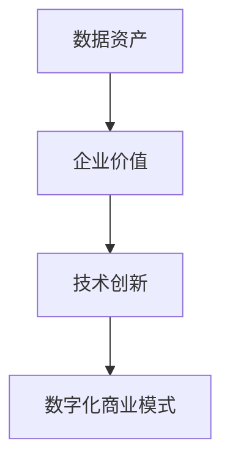
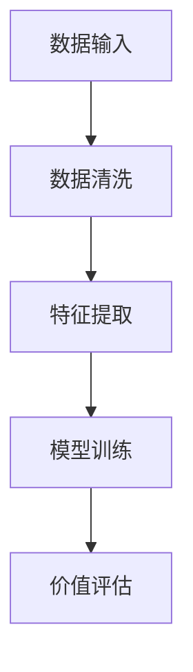
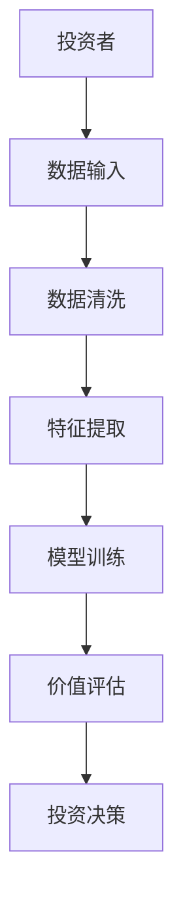

                 


# 彼得林奇的"价值投资"在数字经济时代的重新定义

## 关键词：价值投资，数字经济，数字资产，数字化转型，技术创新

## 摘要：本文将探讨彼得·林奇的价值投资理念在数字经济时代的演变。通过分析数字经济的特点，重新定义价值投资的核心要素和评估方法，提出数据资产价值评估模型和数字化商业模式的可持续性评估框架，为投资者提供新的视角和工具。

---

# 第一部分：彼得·林奇价值投资的背景与重新定义

## 第1章：价值投资的起源与传统理念

### 1.1 价值投资的核心概念

#### 1.1.1 价值投资的定义与起源
价值投资是一种以企业基本面分析为核心的长期投资策略，起源于20世纪初。彼得·林奇作为价值投资的代表人物，强调通过深入研究企业的财务状况、管理团队和行业地位，寻找被市场低估的投资标的。

#### 1.1.2 彼得·林奇的价值投资理念
彼得·林奇认为，成功的投资取决于对企业内在价值的准确评估，而非短期市场波动。他倡导投资者关注企业的成长性和竞争优势，寻找具有持续盈利能力和良好管理的企业。

#### 1.1.3 价值投资的核心要素与边界
价值投资的核心要素包括：
- 企业的财务状况：ROE（净资产收益率）、负债率等。
- 管理团队的能力：管理层的决策能力和战略眼光。
- 行业地位：企业在行业中的竞争优势和市场占有率。

#### 1.1.4 价值投资的边界条件
价值投资的边界包括：
- 企业必须处于稳定的行业环境中。
- 企业财务状况健康，具有持续盈利能力。
- 管理层必须具备高度的专业性和道德水准。

### 1.2 传统价值投资的局限性

#### 1.2.1 传统价值投资的适用场景
传统价值投资在以下场景中表现良好：
- 稳定的行业环境。
- 企业财务状况透明且健康。
- 管理层决策透明且稳健。

#### 1.2.2 数字经济时代对传统投资的挑战
数字经济时代的到来，给传统价值投资带来了新的挑战：
- 数据成为核心资产，传统财务指标无法全面反映企业价值。
- 新兴技术的快速迭代，导致企业竞争优势的动态变化。
- 数字化商业模式的兴起，传统价值评估方法难以适应。

#### 1.2.3 价值投资在数字化转型中的困境
在数字化转型中，价值投资面临以下困境：
- 数据资产的价值难以量化。
- 数字化商业模式的可持续性难以评估。
- 技术创新对企业价值的影响难以预测。

---

## 第2章：数字经济时代的投资新维度

### 2.1 数字经济的核心特征

#### 2.1.1 数据驱动的经济模式
数据成为数字经济的核心资产，企业通过数据的收集、分析和利用，创造新的价值来源。

#### 2.1.2 数字化转型对企业价值的影响
数字化转型改变了企业的运营模式和价值创造方式，企业需要通过数字化技术实现业务创新和效率提升。

#### 2.1.3 新兴技术对投资决策的改变
人工智能、大数据、区块链等新兴技术的应用，使得投资决策更加依赖数据驱动和自动化工具。

### 2.2 数字经济时代的价值评估框架

#### 2.2.1 数据资产的估值方法
数据资产的估值需要考虑以下因素：
- 数据的可用性和质量。
- 数据的可扩展性和应用潜力。
- 数据的安全性和合规性。

#### 2.2.2 数字化商业模式的评估维度
数字化商业模式的评估维度包括：
- 业务模式的创新性。
- 技术实现的可行性。
- 市场需求的可持续性。

#### 2.2.3 技术创新对企业价值的倍增效应
技术创新能够显著提升企业价值，特别是在数字经济时代，技术创新往往带来指数级增长。

---

## 第3章：价值投资在数字经济中的重新定义

### 3.1 数字经济时代的价值投资新理念

#### 3.1.1 数据资产的价值发现
数据资产的价值发现需要结合企业的数据收集能力、数据分析能力和数据应用能力。

#### 3.1.2 数字化商业模式的可持续性评估
数字化商业模式的可持续性评估需要关注企业的技术优势、市场定位和创新能力。

#### 3.1.3 技术创新与企业价值的动态关系
技术创新对企业价值的影响是动态的，需要通过持续的跟踪和评估来捕捉其变化。

### 3.2 价值投资的数字化转型

#### 3.2.1 数字化工具在投资分析中的应用
投资者可以利用大数据分析工具、人工智能算法和区块链技术等数字化工具，提升投资分析的效率和准确性。

#### 3.2.2 数据驱动的投资决策流程
数据驱动的投资决策流程包括：
1. 数据收集：收集企业的财务数据、市场数据和行业数据。
2. 数据分析：利用数据分析工具对数据进行清洗、建模和预测。
3. 投资决策：基于数据分析结果，制定投资策略。

#### 3.2.3 数字化投资组合的构建与优化
投资者可以通过数字化工具构建和优化投资组合，实现风险控制和收益最大化。

---

# 第二部分：价值投资的核心概念与数学模型

## 第4章：价值投资的核心概念与联系

### 4.1 核心概念原理

#### 4.1.1 数据资产的定义与属性
数据资产是指企业所拥有的、能够为企业创造价值的数据资源。数据资产的属性包括：
- 可衡量性：数据的价值可以通过量化指标进行评估。
- 可扩展性：数据可以通过技术手段进行扩展和利用。
- 可持续性：数据资产需要通过持续的管理和更新来保持其价值。

#### 4.1.2 数字化商业模式的特征与优势
数字化商业模式的特征包括：
- 数据驱动：商业模式的核心是数据的收集、分析和利用。
- 创新性：数字化商业模式往往通过技术创新实现业务创新。
- 可扩展性：数字化商业模式可以通过技术手段快速扩展。

#### 4.1.3 技术创新对企业价值的影响机制
技术创新通过以下机制影响企业价值：
- 提高生产效率。
- 降低成本。
- 提升产品和服务的质量。
- 增强企业的市场竞争力。

### 4.2 核心概念对比分析

#### 4.2.1 数据资产与传统资产的对比
| 对比维度 | 数据资产 | 传统资产 |
|----------|----------|----------|
| 资产类型 | 数据、算法、模型 | 土地、建筑、设备 |
| 价值来源 | 数据的利用价值 | 资产的使用价值 |
| 评估方式 | 数据资产价值评估模型 | 传统资产评估方法 |

#### 4.2.2 数字化商业模式与传统商业模式的对比
| 对比维度 | 数字化商业模式 | 传统商业模式 |
|----------|---------------|-------------|
| 核心要素 | 数据、技术、创新 | 产品、渠道、客户 |
| 价值来源 | 数据驱动的创新 | 产品和服务的提供 |
| 评估维度 | 技术创新、数据资产、市场反应 | 财务指标、市场占有率 |

#### 4.2.3 技术创新与企业价值的关联性分析
技术创新与企业价值的关联性分析可以通过以下步骤进行：
1. 确定技术创新的类型（如人工智能、大数据等）。
2. 评估技术创新对企业发展的影响（如提高效率、降低成本等）。
3. 结合企业财务指标，评估技术创新对企业价值的贡献。

### 4.3 实体关系图（ER图）



---

## 第5章：价值投资的数学模型与算法

### 5.1 数学模型概述

#### 5.1.1 数据资产价值评估模型
数据资产价值评估模型可以表示为：
$$
\text{数据资产价值} = \sum_{i=1}^{n} w_i \cdot v_i
$$
其中，\( w_i \) 是数据资产的权重，\( v_i \) 是数据资产的价值。

#### 5.1.2 数字化商业模式的可持续性评估模型
数字化商业模式的可持续性评估模型可以表示为：
$$
\text{可持续性指数} = \frac{\sum_{i=1}^{m} w_i \cdot s_i}{\sum_{i=1}^{m} w_i}
$$
其中，\( w_i \) 是评估指标的权重，\( s_i \) 是指标的评分。

#### 5.1.3 技术创新对企业价值的倍增效应模型
技术创新对企业价值的倍增效应模型可以表示为：
$$
\text{企业价值} = \text{基础价值} \times (1 + \text{技术创新倍增系数})
$$

### 5.2 算法原理

#### 5.2.1 数据清洗算法
数据清洗是数据预处理的重要步骤，包括：
1. 去除重复数据。
2. 处理缺失数据。
3. 纠正错误数据。

#### 5.2.2 特征提取算法
特征提取算法用于从数据中提取有用的特征，包括：
1. 主成分分析（PCA）。
2. 线性判别分析（LDA）。

#### 5.2.3 模型训练算法
模型训练算法包括：
1. 线性回归。
2. 支持向量机（SVM）。
3. 神经网络。

### 5.3 数学公式

#### 5.3.1 数据资产价值评估公式
$$
\text{数据资产价值} = \sum_{i=1}^{n} w_i \cdot v_i
$$

#### 5.3.2 可持续性指数公式
$$
\text{可持续性指数} = \frac{\sum_{i=1}^{m} w_i \cdot s_i}{\sum_{i=1}^{m} w_i}
$$

#### 5.3.3 企业价值倍增公式
$$
\text{企业价值} = \text{基础价值} \times (1 + \text{技术创新倍增系数})
$$

### 5.4 举例说明

#### 5.4.1 数据资产价值评估示例
假设某企业有三个数据资产：客户数据、产品数据和市场数据，其权重分别为0.4、0.3和0.3，价值分别为100、80和70，则数据资产总价值为：
$$
0.4 \times 100 + 0.3 \times 80 + 0.3 \times 70 = 40 + 24 + 21 = 85
$$

#### 5.4.2 可持续性指数计算示例
假设某企业的数字化商业模式有三个评估指标：技术创新（权重0.5）、市场反应（权重0.3）、数据资产（权重0.2），评分分别为90、80、85，则可持续性指数为：
$$
\frac{0.5 \times 90 + 0.3 \times 80 + 0.2 \times 85}{0.5 + 0.3 + 0.2} = \frac{45 + 24 + 17}{1} = 86
$$

---

# 第三部分：系统分析与架构设计

## 第6章：价值投资的系统分析

### 6.1 问题场景介绍
在数字经济时代，价值投资需要考虑数据资产、数字化商业模式和技术创新等多方面的因素。投资者需要通过系统化的分析和评估，重新定义价值投资的核心要素和评估方法。

### 6.2 系统功能设计

#### 6.2.1 领域模型


#### 6.2.2 系统架构设计


### 6.3 系统交互设计

#### 6.3.1 系统交互流程


---

# 第四部分：项目实战

## 第7章：价值投资的数字化转型

### 7.1 项目环境安装

#### 7.1.1 环境要求
- 操作系统：Windows 10 或 macOS 10.15以上。
- Python版本：Python 3.8以上。
- 依赖库：pandas、numpy、scikit-learn。

### 7.2 系统核心实现源代码

#### 7.2.1 数据清洗代码
```python
import pandas as pd

# 读取数据
df = pd.read_csv('data.csv')

# 删除重复数据
df.drop_duplicates(inplace=True)

# 处理缺失数据
df.dropna(inplace=True)
```

#### 7.2.2 特征提取代码
```python
from sklearn.decomposition import PCA

# 确定特征数量
n_components = 3

# 进行PCA
pca = PCA(n_components=n_components)
principal_components = pca.fit_transform(df)
```

#### 7.2.3 模型训练代码
```python
from sklearn.linear_model import LinearRegression

# 训练模型
model = LinearRegression()
model.fit(principal_components, target)
```

---

## 第8章：总结与最佳实践

### 8.1 小结
本文重新定义了彼得·林奇的价值投资理念，提出了数据资产价值评估模型和数字化商业模式的可持续性评估框架，为投资者在数字经济时代提供了新的视角和工具。

### 8.2 注意事项
- 数据资产的价值评估需要结合企业的实际情况。
- 数字化商业模式的可持续性评估需要关注技术创新和市场需求。
- 投资者需要具备技术背景和数据分析能力。

### 8.3 拓展阅读
- 彼得·林奇的《投资最重要的事情》。
- 数字经济相关的书籍和报告。

---

## 作者：AI天才研究院/AI Genius Institute & 禅与计算机程序设计艺术 /Zen And The Art of Computer Programming

