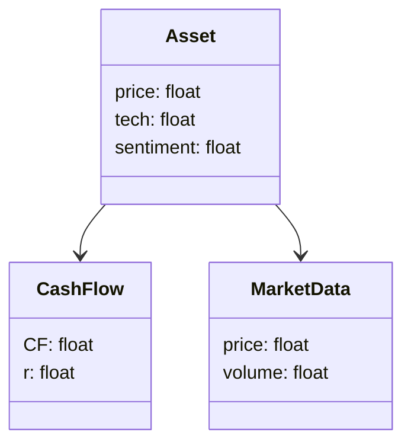
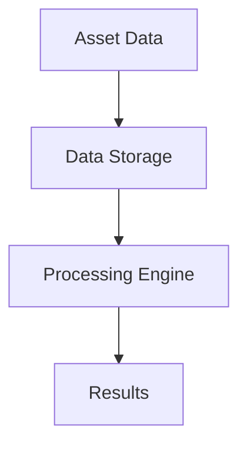
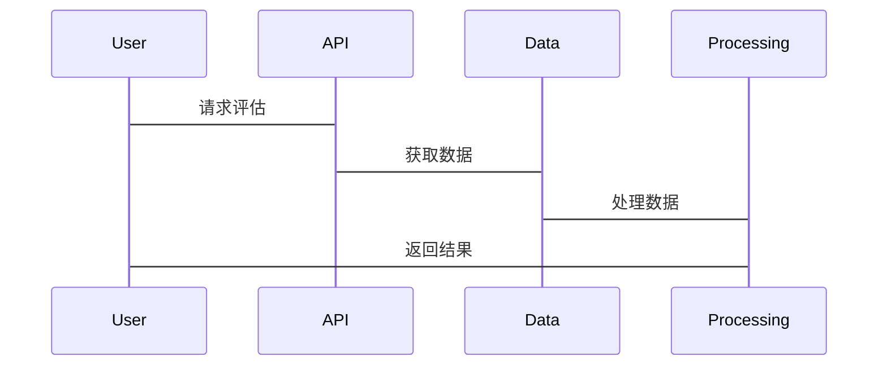

                 


# 彼得林奇的"价值投资"在数字资产时代的框架重构

## 关键词：价值投资，数字资产，彼得林奇，框架重构，算法模型，系统设计

## 摘要：
本文探讨了彼得林奇的经典价值投资理论在数字资产时代的应用与重构。随着数字资产的兴起，传统的价值投资框架面临新的挑战。本文分析了数字资产与传统资产的差异，重构了适合数字资产的价值评估体系，并通过算法模型和系统设计展示了新的框架如何应对数字资产的特殊性。

---

# 第1章: 引言

## 1.1 数字资产时代的投资革命
### 1.1.1 数字资产的兴起
数字资产的兴起是21世纪最显著的金融革命之一。比特币、以太坊等数字资产的出现，不仅改变了传统金融体系，还为价值投资带来了新的挑战和机遇。

### 1.1.2 价值投资的演变
彼得林奇的价值投资理论强调对企业内在价值的深入研究。然而，数字资产的特性（如去中心化、技术驱动）使得传统的价值评估方法不再完全适用。

### 1.1.3 传统框架的局限性
传统价值投资框架主要适用于实体经济中的企业分析，但在数字资产领域，技术变化快、市场波动剧烈，传统的安全边际和估值模型难以直接应用。

## 1.2 重构价值投资框架的必要性
### 1.2.1 数字资产的独特性
数字资产的内在价值不仅取决于技术，还与市场情绪、网络效应密切相关。

### 1.2.2 传统框架的不适用性
传统框架无法充分考虑数字资产的技术迭代和市场波动性。

### 1.2.3 新框架的核心目标
构建一个结合技术分析和基本面分析的混合框架，适用于数字资产的价值评估。

---

# 第2章: 核心概念与联系

## 2.1 数字资产与传统资产的对比
### 2.1.1 资产类型对比
| 资产类型 | 传统资产 | 数字资产 |
|----------|----------|----------|
| 价值驱动 | 财务指标 | 技术指标、市场情绪 |
| 流动性   | 较高     | 极高     |
| 风险     | 稳定     | 波动剧烈 |

### 2.1.2 价值驱动因素对比
- **传统资产**：主要依赖企业财务状况、行业地位。
- **数字资产**：依赖技术进步、网络效应、市场接受度。

### 2.1.3 风险特征对比
- **传统资产**：系统性风险为主。
- **数字资产**：技术风险和市场风险并存。

## 2.2 价值投资框架的核心要素
### 2.2.1 企业内在价值
$$ V = \sum_{t=1}^{\infty} \frac{CF_t}{(1 + r)^t} $$
其中，$CF_t$为未来现金流，$r$为贴现率。

### 2.2.2 市场先生
市场情绪和价格波动对投资者决策的影响。

### 2.2.3 安全边际
$$ MOAT = \frac{V_{\text{估计}}}{V_{\text{市场}}} $$
安全边际越宽，投资风险越小。

## 2.3 数字资产时代的核心变化
### 2.3.1 技术驱动的价值评估
$$ \text{技术价值} = f(\text{TPS}, \text{安全性}, \text{可扩展性}) $$
其中，TPS为每秒交易数，安全性为协议安全性，可扩展性为网络扩展能力。

### 2.3.2 市场波动性加剧
$$ \text{波动率} = \sqrt{\sum_{i=1}^n (P_i - \bar{P})^2 / n} $$
其中，$P_i$为价格，$\bar{P}$为平均价格。

### 2.3.3 新兴的风险因素
包括监管风险、技术漏洞风险等。

---

# 第3章: 数字资产价值评估算法

## 3.1 算法原理概述
### 3.1.1 基于现金流的评估
$$ V = \frac{CF_1}{(1 + r)^1} + \frac{CF_2}{(1 + r)^2} + \cdots + \frac{CF_n}{(1 + r)^n} $$

### 3.1.2 基于市场情绪的评估
$$ \text{情绪指数} = \sum_{i=1}^m w_i \cdot \text{情感分数}_i $$
其中，$w_i$为权重，情感分数为文本分析结果。

### 3.1.3 综合评估模型
$$ V_{\text{综合}} = \alpha V_{\text{现金流}} + \beta V_{\text{技术}} + \gamma V_{\text{市场}} $$
其中，$\alpha + \beta + \gamma = 1$。

## 3.2 算法实现
### 3.2.1 数据获取与清洗
```python
import pandas as pd

# 获取数据
data = pd.read_csv('asset_data.csv')

# 清洗数据
data = data.dropna()
data = data[data['price'] > 0]
```

### 3.2.2 情感分析模型
```python
from textblob import TextBlob

def get_sentiment(text):
    return TextBlob(text).polarity

sentiment = [get_sentiment(text) for text in texts]
```

### 3.2.3 综合评估系统
```python
def evaluate_asset(data):
    # 计算现金流价值
    V_cash = sum(data['CF'] / (1 + r)**i for i, r in enumerate(data['r']))
    
    # 计算技术价值
    V techno = sum(data['tech'] * data['weight'])
    
    # 计算市场价值
    V_market = sum(data['price'] * data['sentiment'])
    
    return V_cash + V_techno + V_market
```

---

# 第4章: 系统分析与架构设计方案

## 4.1 问题场景介绍
数字资产的价值评估需要同时考虑技术、市场和财务因素，传统框架无法满足需求。

## 4.2 系统功能设计
### 4.2.1 领域模型设计


### 4.2.2 功能模块划分
- 数据采集模块
- 情感分析模块
- 技术评估模块
- 综合评估模块

## 4.3 系统架构设计


## 4.4 系统接口设计
- 数据接口：REST API
- 情感分析接口：API调用

## 4.5 系统交互设计


---

# 第5章: 项目实战

## 5.1 环境安装
```bash
pip install pandas textblob
```

## 5.2 系统核心实现源代码
```python
import pandas as pd
from textblob import TextBlob

def evaluate_asset(asset_data):
    V_cash = sum(cf / (1 + r)**i for i, (cf, r) in enumerate(zip(asset_data['CF'], asset_data['r'])))
    V_techno = sum(t * w for t, w in zip(asset_data['tech'], asset_data['weight']))
    V_market = sum(p * s for p, s in zip(asset_data['price'], asset_data['sentiment']))
    return V_cash + V_techno + V_market

# 示例数据
data = {
    'CF': [100, 200, 300],
    'r': [0.05, 0.05, 0.05],
    'tech': [0.8, 0.9, 0.7],
    'weight': [0.3, 0.3, 0.4],
    'price': [10, 20, 15],
    'sentiment': [0.2, 0.3, 0.1]
}
asset_data = pd.DataFrame(data)

result = evaluate_asset(asset_data)
print(result)
```

## 5.3 案例分析
以比特币为例，分析其技术、市场和财务因素，展示如何应用重构后的框架进行评估。

## 5.4 项目小结
重构的价值投资框架在数字资产时代具有广泛的应用前景，但仍需进一步优化。

---

# 第6章: 结论与展望

## 6.1 结论
重构的价值投资框架结合了技术分析和基本面分析，适用于数字资产的价值评估。

## 6.2 展望
未来，随着技术进步，价值投资框架将进一步优化，为数字资产投资提供更有力的支持。

---

# 附录

## 附录A: 术语表
- 内在价值：资产的实际价值。
- 安全边际：估值与市场价格的差额。

## 附录B: 工具推荐
- 数据分析工具：Pandas、NumPy。
- 情感分析工具：TextBlob、NLTK。

---

作者：AI天才研究院/AI Genius Institute & 禅与计算机程序设计艺术 /Zen And The Art of Computer Programming

