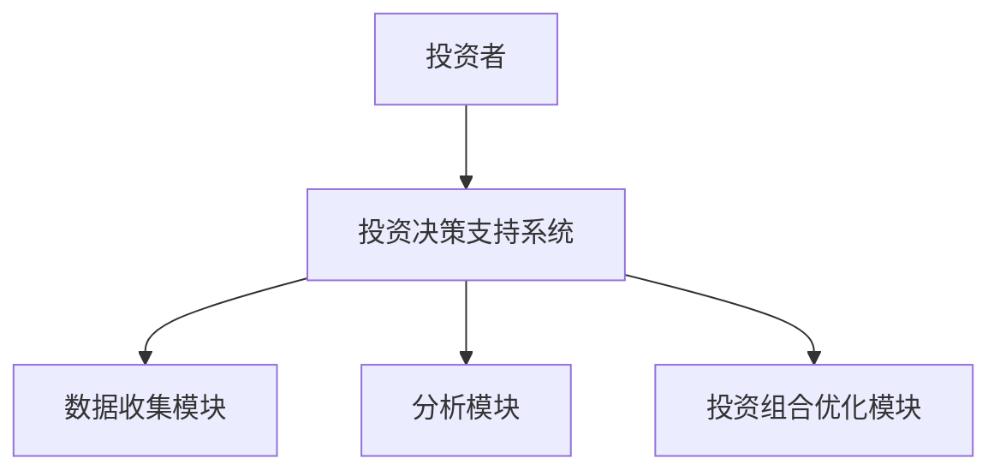
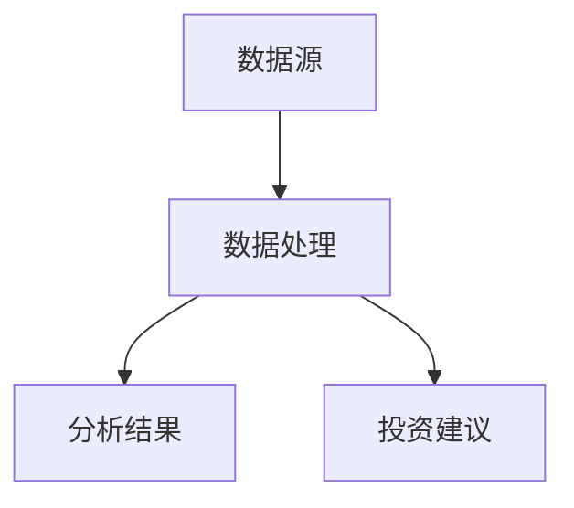

                 


# 彼得林奇的"价值投资"在新兴市场的应用

> 关键词：价值投资、彼得·林奇、新兴市场、投资策略、风险管理、市场分析

> 摘要：本文探讨了彼得·林奇的价值投资理念在新兴市场中的应用，分析了新兴市场的特点及其与成熟市场的差异，提出了适用于新兴市场的价值投资策略，并通过案例分析和系统设计展示了如何在新兴市场中实践这一理念。

---

## 第一部分：引言

### 第1章：引言

#### 1.1 价值投资的基本概念

##### 1.1.1 价值投资的定义
价值投资是一种以公司基本面分析为基础的投资策略，旨在通过识别市场中被低估的公司，长期持有，以期获得超额收益。其核心在于寻找市场价格低于其内在价值的公司。

##### 1.1.2 彼得·林奇的背景与投资理念
彼得·林奇是全球著名的价值投资者，曾管理富达麦哲伦基金，创造了卓越的投资业绩。他强调深入研究公司基本面，寻找具有竞争优势、管理良好且估值合理的公司。

##### 1.1.3 新兴市场的特点与挑战
新兴市场通常指经济快速发展、市场机制尚未完全成熟的国家。这些市场波动性高、信息不透明、监管不完善，但增长潜力巨大。

#### 1.2 价值投资在新兴市场的应用背景

##### 1.2.1 新兴市场与成熟市场的对比
成熟市场：监管完善、信息透明、波动低；新兴市场：增长快、波动大、风险高。

##### 1.2.2 新兴市场的投资机会与风险
机会：高增长、估值低；风险：波动性、信息不对称、政策风险。

##### 1.2.3 彼得·林奇理念的适用性分析
林奇的价值投资理念强调基本面分析和长期持有，适用于新兴市场的高增长环境，但需调整以应对新兴市场的特殊性。

---

## 第二部分：价值投资的核心原理

### 第2章：价值投资的核心原理

#### 2.1 价值投资的基本原理

##### 2.1.1 价值投资的核心概念
- **内在价值**：公司未来现金流的现值。
- **市场价格**：市场波动导致价格与价值偏离。

##### 2.1.2 彼得·林奇的投资策略
- **深度研究**：通过分析财务报表、行业地位等评估公司价值。
- **长期持有**：避免短期波动，等待价值回归。

##### 2.1.3 价值投资的数学模型
内在价值计算常用DCF模型：
$$
\text{内在价值} = \frac{\text{自由现金流}}{\text{折现率}}
$$

#### 2.2 价值投资的核心要素

##### 2.2.1 公司基本面分析
- **财务指标**：ROE（净资产收益率）、P/E（市盈率）、P/B（市净率）。
- **竞争优势**：护城河、市场地位。

##### 2.2.2 市场情绪与估值
- 市场情绪影响价格波动，价值投资者关注偏离价值的市场情绪。
- 估值指标：寻找P/E低于行业平均水平的公司。

##### 2.2.3 风险管理与投资组合
- 分散投资以降低风险。
- 定期评估投资组合，调整持仓。

#### 2.3 价值投资在新兴市场的结合

##### 2.3.1 新兴市场的特殊性
- 经济周期波动大。
- 信息透明度低，公司治理问题多。

##### 2.3.2 价值投资的本地化调整
- 更加注重公司治理和管理层质量。
- 关注高增长行业的龙头企业。

##### 2.3.3 新兴市场中的低估公司识别
- 寻找具有竞争优势且估值低于内在价值的企业。

---

## 第三部分：系统分析与架构设计

### 第3章：系统分析

#### 3.1 问题场景介绍

##### 3.1.1 投资者在新兴市场中的困境
- 信息不透明，难以准确评估公司价值。
- 市场波动大，投资决策风险高。

##### 3.1.2 价值投资策略的本地化需求
- 开发适用于新兴市场的投资决策支持系统。

#### 3.2 系统功能设计

##### 3.2.1 投资者决策支持系统
- 数据收集模块：获取新兴市场的公司数据。
- 分析模块：评估公司价值，识别低估公司。
- 投资组合优化模块：建议投资组合。

##### 3.2.2 数据收集与分析模块
- 采集财务数据、行业信息、市场情绪等。
- 使用数据分析工具（如Python）处理数据。

##### 3.2.3 投资组合优化模块
- 基于风险承受能力优化投资组合。
- 定期评估并调整组合。

#### 3.3 系统架构设计

##### 3.3.1 系统架构图


##### 3.3.2 数据流图


---

## 第四部分：项目实战

### 第4章：项目实战

#### 4.1 环境安装与配置

##### 4.1.1 开发环境搭建
- 使用Jupyter Notebook进行数据分析。
- 安装Python、Pandas、NumPy等库。

##### 4.1.2 数据库安装
- 使用MySQL存储公司数据。
- 数据接口开发：爬虫获取新兴市场数据。

##### 4.1.3 工具链配置
- 安装Anaconda、Git、IDE。

#### 4.2 核心代码实现

##### 4.2.1 数据收集模块
```python
import pandas as pd
import requests

def fetch_data(symbol):
    url = f'https://api.example.com/{symbol}'
    response = requests.get(url)
    return pd.DataFrame(response.json())
```

##### 4.2.2 分析模块
```python
def calculate_intrinsic_value(fcf, wacc):
    return fcf / wacc
```

##### 4.2.3 投资组合优化模块
```python
import numpy as np
from scipy.optimize import minimize

def optimize_portfolio(weights, returns, covariance):
    def objective(weights, returns, covariance):
        return np.dot(weights.T, covariance @ weights) + 1 - np.sum(weights)
    constraints = [{'type': 'eq', 'fun': lambda w: np.sum(w) - 1}]
    result = minimize(objective, np.ones(weights.shape) / len(weights), constraints)
    return result.x
```

#### 4.3 代码应用解读与分析

##### 4.3.1 数据收集模块解读
- 从API获取新兴市场公司的财务数据。
- 数据清洗和预处理，确保数据质量。

##### 4.3.2 分析模块解读
- 计算自由现金流和加权平均资本成本，得出公司内在价值。
- 对比市场价格与内在价值，识别低估公司。

##### 4.3.3 投资组合优化模块解读
- 使用优化算法确定最优权重，分散投资风险。
- 定期评估市场变化，调整投资组合。

#### 4.4 实际案例分析

##### 4.4.1 案例背景
- 新兴市场中的某科技公司，财务数据如下：
  - 自由现金流：$100万
  - 加权平均资本成本：8%
  - 市场价格：$12/股
  - 每股收益（EPS）：$1.5

##### 4.4.2 分析过程
- 计算内在价值：
  $$
  \text{内在价值} = \frac{100}{0.08} = 1250 \text{万}
  $$
- 每股内在价值：$1250万 / 100万股 = $12.5/股
- 市场价格为$12/股，低于内在价值，公司被低估。

##### 4.4.3 投资决策
- 买入该股票，长期持有，等待价值回归。

#### 4.5 项目总结

##### 4.5.1 项目成果
- 成功识别低估公司，构建优化的投资组合。
- 实现了价值投资理念在新兴市场的应用。

##### 4.5.2 经验与教训
- 新兴市场波动大，需密切关注政策和经济变化。
- 数据质量对分析结果影响重大，需确保数据准确。

---

## 第五部分：结论与展望

### 第5章：结论与展望

#### 5.1 结论
- 彼得·林奇的价值投资理念在新兴市场中具有可行性。
- 通过系统分析和项目实战，验证了该策略的有效性。

#### 5.2 未来展望
- 进一步优化投资决策支持系统，提升数据处理能力。
- 研究新兴市场中的特定投资策略，如行业轮动。

---

## 附录

### A. 术语表
- **DCF模型**：现金流折现模型。
- **WACC**：加权平均资本成本。

### B. 参考文献
- 彼得·林奇：《彼得·林奇的投资哲学》。
- 约翰·普林格：《新兴市场投资指南》。

---

作者：AI天才研究院 & 禅与计算机程序设计艺术

