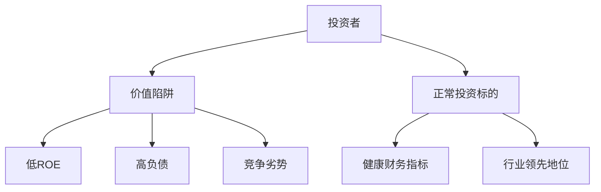
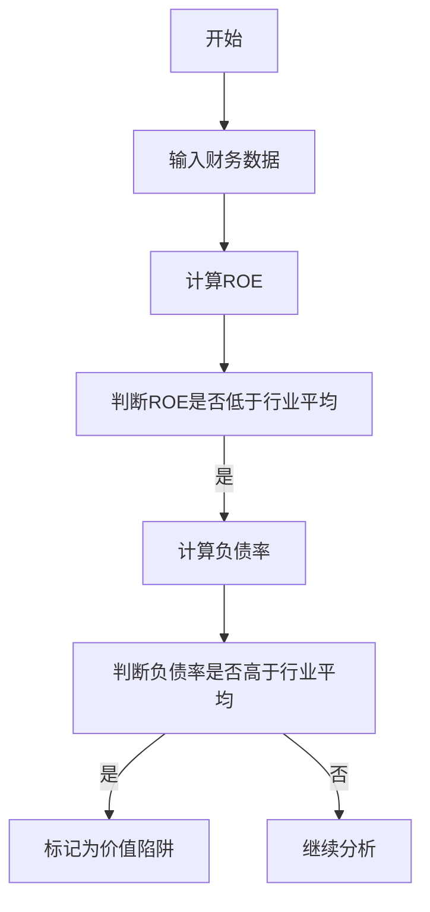
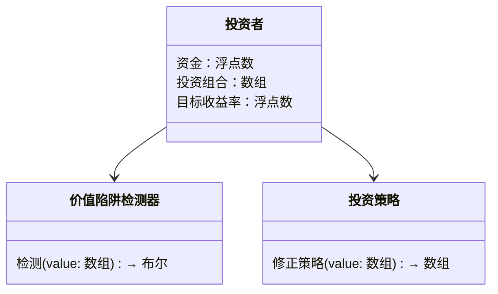
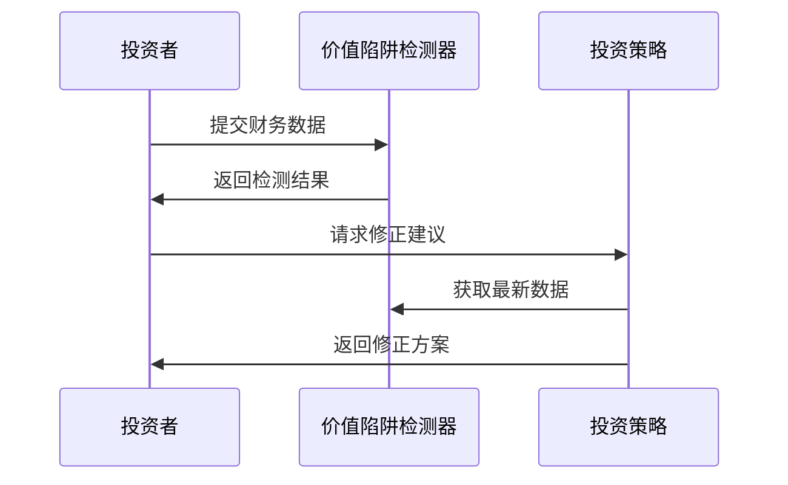

                 


# 彼得林奇的"价值陷阱"修正方法

> 关键词：价值陷阱，彼得林奇，投资策略，价值投资，修正方法，财务分析

> 摘要：本文详细探讨了彼得林奇提出的“价值陷阱”概念，分析其识别方法和修正策略。通过系统化的分析框架、算法原理和实际案例，帮助投资者识别和修正价值陷阱，提升投资决策的准确性。

---

# 第一部分：彼得林奇的"价值陷阱"概述

## 第1章：彼得林奇与价值投资基础

### 1.1 彼得林奇的背景与投资理念

彼得·林奇（Peter Lynch）是全球著名的价值投资者，曾任富达麦哲伦基金的经理，以卓越的投资业绩闻名。他的投资理念强调长期价值，主张通过深入分析公司的基本面来选择投资标的。

### 1.2 价值陷阱的定义与特征

价值陷阱是指那些看似估值低，但实际上存在严重问题的公司。这类公司可能因为行业衰退、管理不善或财务困境，导致其股价被低估，但长期来看难以恢复。

### 1.3 价值陷阱的识别方法

1. **基本面分析**：分析ROE、PE等财务指标，判断公司是否具备投资价值。
2. **行业分析**：评估行业前景，避免选择衰退行业的公司。
3. **市场情绪分析**：避免因市场恐慌而低估的公司。

### 1.4 价值陷阱的修正策略

1. **避免投资**：识别价值陷阱后，立即避免投资。
2. **分散投资**：通过多样化投资降低风险。
3. **长期观察**：持续跟踪，等待转机。

---

## 第2章：价值陷阱的核心概念与联系

### 2.1 核心概念原理

价值陷阱的核心在于公司基本面与市场估值的不匹配。投资者需要区分短期低估与长期困境。

### 2.2 核心概念属性特征对比表格

| 特性       | 价值陷阱         | 正常投资标的     |
|------------|------------------|------------------|
| 财务表现     | 低ROE、高负债     | 健康的财务指标   |
| 行业地位     | 竞争劣势         | 行业领先地位     |
| 市场反应     | 市场过度反应       | 市场合理反应     |

### 2.3 ER实体关系图（Mermaid流程图）



---

## 第3章：价值陷阱修正的算法原理

### 3.1 算法原理概述

修正价值陷阱的算法基于基本面分析，通过财务指标筛选和行业分析，识别并排除潜在陷阱。

### 3.2 算法流程图（Mermaid）



### 3.3 数学模型与公式

$$ \text{ROE} = \frac{\text{净利润}}{\text{平均股东权益}} $$

$$ \text{PE} = \frac{\text{股价}}{\text{每股收益}} $$

---

# 第二部分：系统分析与架构设计

## 第4章：系统分析与架构设计方案

### 4.1 问题场景介绍

投资者需要一个系统来自动识别和修正价值陷阱，提升投资效率。

### 4.2 系统功能设计（领域模型Mermaid类图）



### 4.3 系统架构设计（Mermaid架构图）


### 4.4 系统接口设计

- 输入接口：接收财务数据和市场数据。
- 输出接口：返回价值陷阱标记和修正建议。

### 4.5 系统交互（Mermaid序列图）



---

## 第5章：项目实战

### 5.1 环境安装

安装Python、Pandas和Matplotlib，用于数据处理和可视化。

### 5.2 核心实现代码

```python
import pandas as pd
import numpy as np

def calculate_roe(net_profit, shareholders_equity):
    return net_profit / shareholders_equity

def is_value_trap(roes, industry_roe_avg):
    return roes < industry_roe_avg

# 示例数据
data = {
    '公司': ['A', 'B', 'C'],
    'ROE': [5, 12, 8],
    '行业平均ROE': [10, 8, 9]
}

df = pd.DataFrame(data)

# 计算并标记价值陷阱
df['是否价值陷阱'] = df.apply(lambda x: is_value_trap(x['ROE'], x['行业平均ROE']), axis=1)
```

### 5.3 案例分析

以某行业为例，分析公司A的ROE低于行业平均，判断其为价值陷阱，建议避免投资。

### 5.4 小结

通过代码实现，投资者可以快速识别价值陷阱，提升投资决策效率。

---

## 第6章：最佳实践

### 6.1 小结

本文系统介绍了彼得林奇的价值陷阱理论，结合算法和案例，提供了实际应用指导。

### 6.2 注意事项

1. **持续学习**：市场变化快，需不断更新知识。
2. **风险控制**：避免过度集中投资。
3. **专业工具**：利用数据分析工具提高效率。

### 6.3 拓展阅读

推荐书籍：《彼得·林奇的投资 secrets》。

---

# 作者：AI天才研究院 & 禅与计算机程序设计艺术

