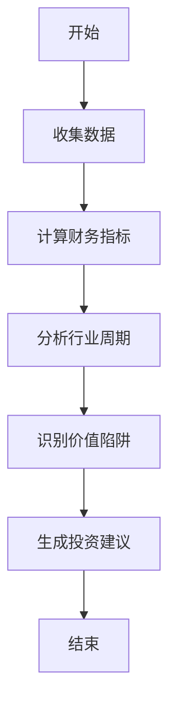

                 


# 彼得林奇的"价值陷阱"在周期性行业的识别

## 关键词：
- 彼得·林奇
- 价值陷阱
- 周期性行业
- 财务指标
- 投资策略

## 摘要：
本文深入探讨了彼得·林奇提出的“价值陷阱”概念，并分析了其在周期性行业中的识别方法。通过财务指标和估值方法，结合系统设计和实际案例分析，帮助投资者识别和规避价值陷阱，提升投资决策的准确性。

---

# 引言

## 1. 价值陷阱与周期性行业的概述

### 1.1 价值陷阱的定义与背景

- **价值陷阱**：指那些看似估值低、吸引力强，但实际上存在严重问题，可能导致投资损失的股票。彼得·林奇强调，识别这些陷阱是投资成功的关键。
- **彼得·林奇的投资理念**：长期投资优质公司，避免短期波动，注重基本面分析。
- **价值陷阱的形成原因**：行业周期波动、公司基本面恶化、市场情绪影响等。

### 1.2 周期性行业的特点

- **周期性行业的定义**：受经济周期影响显著，需求和供给波动大的行业，如制造业、能源、房地产等。
- **波动性**：行业盈利随经济周期波动，高点和低点差异明显。
- **供需变化**：行业产能过剩或不足导致价格和利润波动。

---

## 2. 价值陷阱的核心概念

### 2.1 价值陷阱的特征

- **低估值的假象**：市盈率、市净率等指标看似低于行业平均水平，但公司实际盈利能力和成长性差。
- **行业周期的影响**：行业处于衰退期，公司面临需求下降、库存积压等问题。
- **公司基本面的恶化**：收入下降、利润减少、负债增加，财务状况恶化。

### 2.2 周期性行业的周期分析

- **行业周期的四个阶段**：
  1. **复苏期**：行业从低谷开始回升。
  2. **成长期**：行业快速扩张，需求旺盛。
  3. **成熟期**：行业增速放缓，竞争加剧。
  4. **衰退期**：行业需求下降，企业盈利减少。
- **周期性行业的财务表现**：
  - 盈利波动大，收入和利润受周期影响显著。
  - 资产负债率高，现金流不稳定。

### 2.3 识别价值陷阱的财务指标

- **市盈率（P/E）**：价格与每股收益的比率，衡量股票估值水平。
  $$ P/E = \frac{股票价格}{每股收益} $$
- **市净率（P/B）**：价格与每股净资产的比率，反映资产价值。
  $$ P/B = \frac{股票价格}{每股净资产} $$
- **资产负债率**：衡量公司财务风险。
  $$ 负债率 = \frac{总负债}{总资产} $$

### 2.4 估值方法的选择

- **相对估值法**：比较股票与行业平均市盈率或市净率。
- **绝对估值法**：基于未来现金流折现计算内在价值。
- **行业比较法**：对比行业内其他公司，寻找低估值但基本面差的公司。

---

## 3. 识别价值陷阱的系统设计

### 3.1 系统架构设计

- **数据收集模块**：收集目标行业和公司的财务数据、行业周期信息。
- **分析模块**：计算财务指标，评估公司估值和行业周期。
- **评估模块**：识别价值陷阱，生成投资建议。

### 3.2 系统流程图（Mermaid）



### 3.3 实际案例分析

- **案例：制造业公司A**
  - **市盈率**：假设A公司市盈率为10，行业平均为15。
  - **市净率**：A公司市净率为2，行业平均为1.8。
  - **行业周期**：制造业处于衰退期，需求下降，库存积压。
  - **结论**：A公司可能是一个价值陷阱，尽管估值低，但行业衰退和公司基本面恶化使其风险较高。

---

## 4. 算法与数学模型

### 4.1 算法流程

1. **数据收集**：获取目标公司的财务报表和行业数据。
2. **计算财务指标**：市盈率、市净率、资产负债率等。
3. **分析行业周期**：判断行业所处周期阶段。
4. **识别价值陷阱**：结合财务指标和行业周期，判断是否存在价值陷阱。

### 4.2 数学模型

- **市盈率模型**：$$ P/E = \frac{股票价格}{每股收益} $$
- **市净率模型**：$$ P/B = \frac{股票价格}{每股净资产} $$
- **行业周期模型**：根据行业指标判断周期阶段。

---

## 5. 项目实战

### 5.1 实战环境

- 工具：Excel或Python（使用Pandas、NumPy进行数据处理）。
- 数据来源：公司财务报表、行业报告。

### 5.2 核心代码实现

```python
import pandas as pd

# 假设df是公司数据，包含'市盈率'、'市净率'、'行业周期'等列
def identify_value_trap(df):
    # 定义价值陷阱的标准
    value_trap = []
    for index, row in df.iterrows():
        pe = row['市盈率']
        pb = row['市净率']
        industry_cycle = row['行业周期']
        
        # 行业周期为衰退期，且市盈率和市净率低于行业平均，但公司基本面差
        if industry_cycle == '衰退期' and pe < df['市盈率'].mean() and pb < df['市净率'].mean():
            value_trap.append(index)
    return value_trap

# 应用函数
value_trap_companies = identify_value_trap(df)
print("识别出的价值陷阱公司:", value_trap_companies)
```

### 5.3 案例分析

- **公司B**：市盈率8，市净率1.5，行业处于衰退期。
- **行业平均市盈率**：12，行业平均市净率：1.8。
- **结论**：公司B可能是一个价值陷阱，尽管估值低，但行业衰退和公司基本面可能存在问题。

---

## 6. 总结与注意事项

### 6.1 总结

- 价值陷阱在周期性行业中的识别需要结合财务指标和行业周期分析。
- 财务指标如市盈率、市净率和资产负债率是关键工具。
- 系统化的方法和实际案例分析有助于提高识别准确性。

### 6.2 注意事项

- **行业周期判断**：准确判断行业周期阶段，避免误判。
- **公司基本面分析**：深入分析公司的财务状况，避免仅看表面估值。
- **持续监控**：定期复盘和调整投资策略，应对市场变化。

### 6.3 最佳实践

- **多元化投资**：分散投资不同行业和公司，降低风险。
- **长期视角**：关注公司长期增长潜力，避免短期波动影响判断。

---

## 作者：AI天才研究院/AI Genius Institute & 禅与计算机程序设计艺术 /Zen And The Art of Computer Programming

