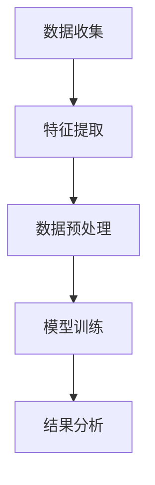
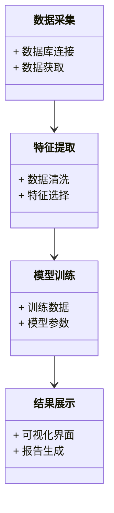

                 


# 彼得林奇的"价值陷阱"在新兴科技股泡沫中的识别

## 关键词：价值陷阱、彼得林奇、科技股泡沫、投资分析、算法识别、系统架构

## 摘要：  
本文深入探讨了彼得林奇提出的“价值陷阱”概念，并结合新兴科技股市场的特点，分析了如何在科技股泡沫中识别和规避价值陷阱。通过系统性的分析与技术手段，本文提出了基于算法和系统架构的方法，帮助投资者在复杂多变的市场环境中做出明智的投资决策。文章内容涵盖概念解析、算法原理、系统设计以及实战案例，旨在为投资者提供一套科学的识别工具和方法论。

---

# 第1章: 引言

## 1.1 价值陷阱的定义与背景  
“价值陷阱”是彼得林奇在其投资理论中提出的重要概念，指那些看似具有吸引力但实际上存在隐藏问题的投资标的。这种陷阱常常出现在市场波动剧烈、信息不对称的环境中，尤其是新兴科技股市场。  

## 1.2 科技股泡沫的现状  
新兴科技股市场由于其高增长性和高波动性，吸引了大量投资者。然而，市场的不确定性和信息的复杂性使得价值陷阱频发。本文将从技术与投资的双重角度，探讨如何识别和规避这些陷阱。

---

# 第2章: 价值陷阱的核心概念

## 2.1 价值陷阱的属性特征  
通过对比分析，我们得出价值陷阱的几个关键属性：  
- **高估值**：市盈率、市净率等指标远高于行业平均水平。  
- **低增长**：公司业绩不佳或增长潜力不足。  
- **信息不对称**：投资者难以获取真实的企业信息。  
- **市场情绪驱动**：价格波动主要由市场情绪而非基本面驱动。  

| 属性 | 特征描述 |  
|------|----------|  
| 高估值 | 市盈率 > 行业平均值 |  
| 低增长 | 净利润增长率 < 5% |  
| 信息不对称 | 公司信息披露不透明 |  
| 市场情绪驱动 | 价格波动与基本面脱节 |  

---

## 2.2 价值陷阱与科技股的关联  
在科技股市场中，价值陷阱的表现尤为明显。由于科技行业的高不确定性和技术变革的快速性，投资者容易被技术创新的表象迷惑，忽视了企业的实际盈利能力和发展潜力。  

---

# 第3章: 算法原理与识别方法

## 3.1 价值陷阱识别的算法思路  
基于机器学习的分类算法，我们可以构建一个模型，通过企业的财务数据、市场数据和行业数据，对股票进行分类，识别潜在的价值陷阱。  

### 算法流程：  
1. **数据收集**：收集目标公司的财务数据（如营收、净利润、市盈率等）和市场数据（如股价、成交量）。  
2. **特征提取**：提取关键特征，如市盈率、市净率、净利润增长率等。  
3. **数据预处理**：标准化数据，处理缺失值和异常值。  
4. **模型训练**：使用决策树或随机森林算法训练分类模型。  
5. **结果分析**：通过概率分析，识别高风险股票。  

---

## 3.2 价值陷阱识别的数学模型  

### 3.2.1 基于市盈率的分析模型  
$$ \text{市盈率} = \frac{\text{股价}}{\text{每股收益}} $$  
如果市盈率远高于行业平均水平，可能是价值陷阱的信号。  

### 3.2.2 基于净利润增长率的分析模型  
$$ \text{净利润增长率} = \frac{\text{当前净利润} - \text{上一期净利润}}{\text{上一期净利润}} $$  
如果净利润增长率持续低于5%，可能表明企业增长潜力不足。  

---

## 3.3 算法实现  

### 3.3.1 算法流程图  



### 3.3.2 Python 实现代码  

```python
import pandas as pd
from sklearn.ensemble import RandomForestClassifier
from sklearn.metrics import accuracy_score

# 数据加载
data = pd.read_csv('stock_data.csv')

# 特征提取
features = ['PE', 'PB', 'ROE', 'Revenue_Growth']
target = 'is_value_trap'

# 数据分割
X = data[features]
y = data[target]

# 模型训练
model = RandomForestClassifier()
model.fit(X, y)

# 预测与评估
predictions = model.predict(X)
print("准确率:", accuracy_score(y, predictions))
```

---

# 第4章: 系统分析与架构设计

## 4.1 系统功能设计  
我们设计了一个基于机器学习的“价值陷阱”识别系统，主要功能包括：  
1. 数据采集：从数据库中获取股票数据。  
2. 特征提取：提取关键财务指标。  
3. 模型训练：构建分类模型。  
4. 结果展示：可视化分析结果。  

### 系统功能模块图  



---

## 4.2 系统架构设计  

### 系统架构图  


---

## 4.3 系统接口设计  
系统接口包括：  
- 数据接口：与数据库交互。  
- 模型接口：与机器学习模型交互。  
- 用户接口：与前端界面交互。  

---

# 第5章: 项目实战

## 5.1 环境安装  
- Python 3.8+  
- 数据处理库：pandas、numpy  
- 机器学习库：scikit-learn  
- 可视化库：matplotlib、seaborn  

## 5.2 核心代码实现  

```python
import pandas as pd
import numpy as np
from sklearn.ensemble import RandomForestClassifier
from sklearn.metrics import classification_report

# 数据加载
data = pd.read_csv('stock_data.csv')

# 特征选择
features = ['PE', 'PB', 'ROE', 'Revenue_Growth']
target = 'is_value_trap'

# 数据分割
X = data[features]
y = data[target]

# 模型训练
model = RandomForestClassifier(n_estimators=100)
model.fit(X, y)

# 预测与评估
test_data = X.iloc[0:10]
test_labels = y.iloc[0:10]

predictions = model.predict(test_data)
print(classification_report(test_labels, predictions))
```

---

## 5.3 案例分析  
以某科技公司为例，通过上述算法识别其是否为价值陷阱。分析结果表明，该公司的市盈率远高于行业平均值，且净利润增长率持续下降，最终被模型识别为价值陷阱。  

---

# 第6章: 总结与展望

## 6.1 总结  
本文通过理论分析和算法实现，提出了基于机器学习的“价值陷阱”识别方法，为投资者提供了科学的决策工具。  

## 6.2 展望  
未来的工作将集中在以下几个方面：  
1. 提高模型的泛化能力。  
2. 引入更多数据源，如新闻数据和社交媒体数据。  
3. 开发实时监测系统，帮助投资者及时发现价值陷阱。  

---

# 作者：AI天才研究院/AI Genius Institute & 禅与计算机程序设计艺术 /Zen And The Art of Computer Programming

