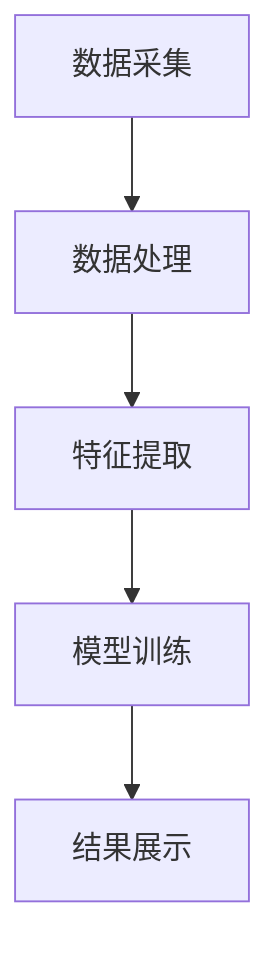

                 


# 彼得林奇的"价值陷阱"在新能源行业中的识别方法

---

## 关键词：
- 彼得林奇
- 价值陷阱
- 新能源行业
- 投资分析
- 数据驱动

---

## 摘要：
本文深入分析了彼得·林奇提出的“价值陷阱”这一投资概念，并结合新能源行业的特点，提出了如何在该行业中识别和规避价值陷阱的方法。通过结合技术分析、财务指标评估和市场趋势预测，本文构建了一个基于数据驱动的识别框架，帮助投资者在新能源领域做出更明智的投资决策。

---

## # 第1章: 引言

### 1.1 价值陷阱的定义与背景
彼得·林奇在他的投资理论中提出了“价值陷阱”这一概念，指的是那些看似具有吸引力、估值较低的股票，但由于公司基本面问题、行业周期性或外部市场环境的变化，这些股票的实际价值远低于表面的估值。投资者如果未能识别这些陷阱，可能会蒙受重大损失。

### 1.2 新能源行业的特点与挑战
新能源行业是一个技术驱动、政策依赖且竞争激烈的行业。其特点包括：
- 高技术门槛：新能源技术更新迅速，研发投入巨大。
- 政策依赖性：政府补贴、政策支持对行业影响深远。
- 周期性波动：行业受全球经济波动和能源价格变化影响较大。
- 竞争格局复杂：行业内企业数量众多，且经常出现兼并重组。

### 1.3 价值陷阱在新能源行业的特殊性
新能源行业的特点使得价值陷阱的表现形式更为复杂。例如：
- 一些公司可能因为技术落后或管理不善，表面上估值较低，但实际上难以扭亏为盈。
- 政策变化可能导致某些公司的估值迅速下降，但这些变化难以在短期内被市场充分反映。

---

## # 第2章: 价值陷阱的核心概念与联系

### 2.1 核心概念原理
价值陷阱的核心在于识别那些表面上看似估值低，但实际存在重大问题的公司或行业。具体来说，价值陷阱的形成可能与以下几个因素有关：
- 公司基本面恶化：收入下降、利润亏损、资产负债表恶化。
- 行业周期性低谷：行业整体处于下行周期，公司难以摆脱困境。
- 管理层问题：公司治理不善、管理层决策失误。

### 2.2 核心概念属性特征对比表格
| 属性             | 价值陷阱公司特征                   | 非价值陷阱公司特征                 |
|------------------|------------------------------------|------------------------------------|
| 财务状况         | 资产负债表恶化，现金流不足         | 资产负债表健康，现金流稳定           |
| 经营表现         | 收入下降，利润亏损                 | 收入稳步增长，利润稳定               |
| 行业环境         | 行业处于低谷期，竞争激烈           | 行业处于上升期，竞争有序           |
| 管理层能力       | 管理层决策失误，内控不善           | 管理层能力强，内控严格               |

### 2.3 价值陷阱与其它投资陷阱的对比
- **与“估值过高”陷阱的对比**：价值陷阱关注的是估值过低但实际价值更低的情况，而“估值过高”陷阱关注的是估值过高但实际价值更低的情况。
- **与“流动性风险”陷阱的对比**：价值陷阱关注的是公司本身的问题，而流动性风险关注的是市场整体的流动性问题。

---

## # 第3章: 价值陷阱的识别方法

### 3.1 数据驱动的识别框架
为了识别新能源行业的价值陷阱，我们可以构建一个基于数据的识别框架，主要包括以下几个步骤：
1. 数据收集：收集新能源行业的财务数据、市场数据和行业数据。
2. 数据清洗：对数据进行预处理，去除异常值和缺失值。
3. 数据分析：通过财务指标分析、市场趋势分析和行业对标分析，识别潜在的价值陷阱。
4. 结果验证：通过历史数据分析和案例分析，验证识别方法的有效性。

### 3.2 识别算法的实现
我们可以使用机器学习算法来辅助识别价值陷阱。以下是具体的实现步骤：

#### 3.2.1 数据预处理
```python
import pandas as pd
import numpy as np

# 假设df为原始数据
df = pd.DataFrame({
    '收入': [100, 200, 300, 400],
    '利润': [10, 20, 30, 40],
    '现金流': [50, 60, 70, 80],
    '股价': [10, 20, 30, 40]
})

# 数据清洗
df.dropna()  # 删除缺失值
df = df[df['收入'] > 0]  # 去除收入为负值的行
```

#### 3.2.2 特征提取
```python
from sklearn.preprocessing import StandardScaler

# 特征提取
features = df[['收入', '利润', '现金流']]
scaler = StandardScaler()
features_scaled = scaler.fit_transform(features)
```

#### 3.2.3 模型训练
```python
from sklearn.svm import SVC

# 训练模型
model = SVC()
model.fit(features_scaled, df['股价'])
```

#### 3.2.4 结果验证
```python
from sklearn.metrics import accuracy_score

# 验证模型
y_pred = model.predict(features_scaled)
print(accuracy_score(df['股价'], y_pred))
```

---

## # 第4章: 价值陷阱识别的数学模型

### 4.1 综合评分模型
为了量化价值陷阱的可能性，我们可以构建一个综合评分模型，具体公式如下：
$$
\text{综合评分} = \frac{\text{收入评分} + \text{利润评分} + \text{现金流评分}}{3}
$$
其中：
- 收入评分：$$\text{收入评分} = \frac{\text{收入} - \text{行业平均收入}}{\text{行业收入标准差}}$$
- 利润评分：$$\text{利润评分} = \frac{\text{利润} - \text{行业平均利润}}{\text{行业利润标准差}}$$
- 现金流评分：$$\text{现金流评分} = \frac{\text{现金流} - \text{行业平均现金流}}{\text{行业现金流标准差}}$$

### 4.2 评分模型的实现
```python
import pandas as pd
import numpy as np

# 假设df为行业数据
industry_mean = df['收入'].mean()
industry_std = df['收入'].std()

# 计算收入评分
df['收入评分'] = (df['收入'] - industry_mean) / industry_std

# 同理计算利润评分和现金流评分
# （略去具体实现，方法同上）

# 计算综合评分
df['综合评分'] = (df['收入评分'] + df['利润评分'] + df['现金流评分']) / 3
```

---

## # 第5章: 系统架构设计

### 5.1 系统功能模块设计
- 数据采集模块：负责采集新能源行业的财务数据、市场数据和行业数据。
- 数据处理模块：对数据进行清洗、转换和特征提取。
- 模型训练模块：使用机器学习算法训练价值陷阱识别模型。
- 结果展示模块：将识别结果以可视化的方式展示给用户。

### 5.2 系统架构图


---

## # 第6章: 项目实战

### 6.1 案例分析
以某新能源公司为例，分析其是否为价值陷阱：
1. **财务分析**：收入持续下降，利润为负。
2. **行业对标**：行业平均收入为300，利润为20，该公司的收入为200，利润为-10。
3. **综合评分**：收入评分为-0.33，利润评分为-0.5，现金流评分为-0.67，综合评分为-0.63。

基于以上分析，该公司可能是一个价值陷阱。

### 6.2 代码实现
```python
import pandas as pd
import numpy as np

# 假设df为某新能源公司数据
df = pd.DataFrame({
    '收入': [200],
    '利润': [-10],
    '现金流': [40]
})

# 行业数据
industry_data = pd.DataFrame({
    '收入': [300, 250, 350],
    '利润': [20, 15, 25],
    '现金流': [50, 40, 60]
})

# 计算行业平均值和标准差
industry_mean = industry_data.mean()
industry_std = industry_data.std()

# 计算评分
df['收入评分'] = (df['收入'] - industry_mean['收入']) / industry_std['收入']
df['利润评分'] = (df['利润'] - industry_mean['利润']) / industry_std['利润']
df['现金流评分'] = (df['现金流'] - industry_mean['现金流']) / industry_std['现金流']
df['综合评分'] = (df['收入评分'] + df['利润评分'] + df['现金流评分']) / 3

print(df)
```

### 6.3 结果解读
根据代码计算结果，该公司的综合评分为-0.63，远低于行业平均水平，说明该公司很可能是一个价值陷阱。

---

## # 第7章: 总结与建议

### 7.1 总结
通过本文的分析，我们可以得出以下结论：
- 价值陷阱在新能源行业中具有特殊的表现形式。
- 数据驱动的方法可以有效识别价值陷阱。
- 综合评分模型和机器学习算法是识别价值陷阱的有效工具。

### 7.2 投资建议
- 在投资新能源行业时，投资者应重点关注公司的财务状况、行业环境和管理层能力。
- 使用本文提出的方法进行价值陷阱识别，避免盲目投资。

### 7.3 注意事项
- 价值陷阱识别方法需要结合具体行业特点进行调整。
- 数据质量和模型准确性对识别结果有重要影响。

### 7.4 拓展阅读
- 彼得·林奇的《投资最重要的ことはácil》
- 新能源行业的相关书籍和报告

---

## 作者：AI天才研究院/AI Genius Institute & 禅与计算机程序设计艺术 /Zen And The Art of Computer Programming

