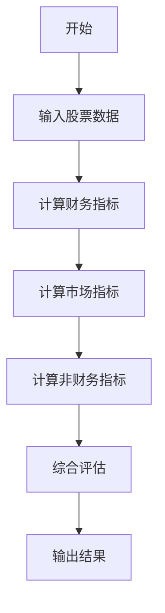
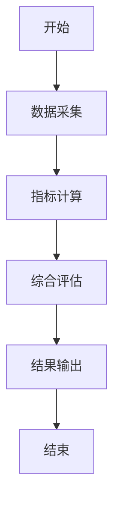

                 


# 彼得林奇的"价值陷阱"在高科技股中的识别

> 关键词：彼得·林奇，价值陷阱，高科技股，投资策略，风险管理

> 摘要：本文深入探讨了彼得·林奇提出的“价值陷阱”概念，并结合高科技股的特点，分析了如何识别和规避这些陷阱。文章从价值陷阱的定义、形成机制、识别方法，到实际应用中的数学模型和系统设计，提供了全面的解析。通过具体案例分析和项目实战，帮助投资者更好地理解和应对价值陷阱带来的挑战。

---

## 第一部分：价值陷阱的背景与概念

### 第1章：价值陷阱的核心概念

#### 1.1 价值陷阱的定义与背景
- **1.1.1 价值陷阱的定义**  
  价值陷阱是指某些股票看似估值低廉，但实际上存在隐藏的问题，如盈利能力下降、财务状况恶化或行业政策变化，导致投资者误判其价值。

- **1.1.2 彼得·林奇对价值陷阱的阐述**  
  彼得·林奇在其投资理论中强调，价值陷阱通常是由于市场情绪或短期波动导致股票价格被高估或低估。投资者需要警惕那些看似便宜但实际存在结构性问题的股票。

- **1.1.3 价值陷阱在投资中的常见表现形式**  
  价值陷阱常见于以下几种情况：
  - 过高的市盈率或市净率。
  - 虽然股价下跌，但公司基本面并未改善。
  - 行业政策变化导致公司前景恶化。

#### 1.2 价值陷阱的形成机制
- **1.2.1 市场情绪与投资者认知偏差**  
  市场情绪的波动和投资者的认知偏差（如过度乐观或悲观）常常导致价值陷阱的形成。

- **1.2.2 企业基本面的潜在问题**  
  公司可能因管理不善、技术创新不足或行业竞争加剧而导致基本面恶化，进而成为价值陷阱。

- **1.2.3 价值陷阱与短期市场波动的关系**  
  短期市场波动可能导致某些股票价格偏离其真实价值，为价值陷阱的形成提供了机会。

#### 1.3 价值陷阱与价值投资的区别
- **1.3.1 价值投资的核心理念**  
  价值投资强调寻找那些被市场低估且具有持续竞争优势的公司。

- **1.3.2 价值陷阱对价值投资者的挑战**  
  价值陷阱常常让投资者误判，将价值陷阱误认为是低估的投资机会。

- **1.3.3 如何区分真正的价值投资机会与价值陷阱**  
  区分的关键在于深入分析公司的财务状况、行业地位和未来前景，而不仅仅是看表面的估值指标。

### 第2章：高科技股中的价值陷阱

#### 2.1 高科技股的行业特性
- **2.1.1 高科技行业的高增长与高风险并存**  
  高科技行业通常具有高增长潜力，但也伴随着高风险，如技术更新换代快和市场竞争激烈。

- **2.1.2 高科技股的估值特点**  
  高科技股的估值往往基于未来的增长预期，而非当前的盈利能力，导致其估值指标（如市盈率）可能远高于行业平均水平。

- **2.1.3 高科技行业的周期性与创新性**  
  高科技行业具有较强的周期性，同时创新是其发展的核心驱动力。

#### 2.2 高科技股中的价值陷阱案例
- **2.2.1 过高的市盈率与市净率**  
  某些高科技股可能因为市场炒作或短期利好而被高估，导致其市盈率和市净率远高于行业平均水平。

- **2.2.2 虚假的高增长与盈利能力下降**  
  一些公司可能通过夸大增长预期或粉饰财务报表来吸引投资者，但实际盈利能力并未显著提升。

- **2.2.3 行业政策变化对个股的影响**  
  政策变化（如行业监管加强）可能对某些高科技公司产生重大影响，导致其股价大幅波动。

---

## 第二部分：价值陷阱的识别方法

### 第3章：价值陷阱的识别指标

#### 3.1 财务指标分析
- **3.1.1 常用财务指标在识别价值陷阱中的应用**  
  通过分析市盈率（P/E）、市净率（P/B）、每股收益（EPS）等指标，识别股票的估值是否合理。

- **3.1.2 营业收入与利润增长的可持续性分析**  
  检查公司的收入和利润增长是否具有可持续性，避免因短期增长而误判公司前景。

- **3.1.3 偿债能力与现金流健康度**  
  通过分析公司的偿债能力和现金流状况，评估其财务健康度。

#### 3.2 市场指标分析
- **3.2.1 市盈率（P/E）与市净率（P/B）的合理区间**  
  确定不同行业和市场环境下，市盈率和市净率的合理区间，避免因估值指标异常而陷入价值陷阱。

- **3.2.2 相对强度指标（RSI）与股价走势分析**  
  通过RSI等技术指标分析股价走势，识别超买或超卖状态。

- **3.2.3 行业估值水平的横向对比**  
  将目标公司的估值指标与行业平均水平进行对比，识别潜在的价值陷阱。

#### 3.3 非财务指标分析
- **3.3.1 管理层稳定性与公司治理结构**  
  调查公司管理层的稳定性及治理结构，避免因管理层问题导致公司前景恶化。

- **3.3.2 行业竞争格局与创新壁垒**  
  分析行业竞争格局，评估公司在技术创新和市场竞争中的优势。

- **3.3.3 宏观经济环境对高科技股的影响**  
  关注宏观经济政策和行业政策变化，评估其对高科技股的影响。

### 第4章：彼得·林奇的选股策略

#### 4.1 彼得·林奇的核心选股理念
- **4.1.1 寻找具有持续竞争优势的企业**  
  林奇强调选择那些具有强大竞争优势和持续增长潜力的公司。

- **4.1.2 重视企业的盈利能力和财务健康度**  
  他建议投资者关注公司的盈利能力、现金流状况和财务杠杆。

- **4.1.3 估值指标的合理性**  
  林奇认为，合理的估值是长期投资回报的关键，避免因过高估值陷入价值陷阱。

#### 4.2 价值陷阱的识别与规避策略
- **4.2.1 通过财务指标分析识别价值陷阱**  
  使用市盈率、市净率等指标，识别那些估值过高的股票。

- **4.2.2 关注行业政策变化与市场环境**  
  留意行业政策变化和宏观经济环境，评估其对高科技股的影响。

- **4.2.3 投资组合分散与风险管理**  
  构建分散化的投资组合，降低单一股票带来的风险。

---

## 第三部分：算法原理与数学模型

### 第5章：价值陷阱识别的算法原理

#### 5.1 算法原理概述
- 价值陷阱识别算法基于财务指标分析、市场指标分析和非财务指标分析，结合机器学习技术，对股票进行综合评估。

#### 5.2 算法流程图


#### 5.3 Python代码实现
```python
import pandas as pd

def calculate_financial_metrics(stock_data):
    stock_data['PE_ratio'] = stock_data['Price'] / stock_data['EPS']
    stock_data['PB_ratio'] = stock_data['Price'] / stock_data['Book_value_per_share']
    stock_data['ROE'] = stock_data['Net_profit'] / stock_data['Total_equity']
    return stock_data

def identify_value_traps(stock_data):
    stock_data = calculate_financial_metrics(stock_data)
    stock_data['Value_trap_flag'] = 0
    stock_data.loc[stock_data['PE_ratio'] > stock_data['PE_ratio'].mean() * 2, 'Value_trap_flag'] = 1
    stock_data.loc[stock_data['ROE'] < stock_data['ROE'].mean() * 0.5, 'Value_trap_flag'] = 1
    return stock_data

# 示例数据
data = {
    'Price': [100, 80, 90, 120],
    'EPS': [10, 8, 9, 15],
    'Book_value_per_share': [5, 4, 6, 8],
    'Net_profit': [50, 40, 45, 60],
    'Total_equity': [100, 80, 90, 120]
}
stock_data = pd.DataFrame(data)
result = identify_value_traps(stock_data)
print(result)
```

#### 5.4 数学模型与公式
- 市盈率（P/E）计算公式：  
  $$ P/E = \frac{\text{股价}}{\text{每股收益}} $$
- 市净率（P/B）计算公式：  
  $$ P/B = \frac{\text{股价}}{\text{每股净资产}} $$
- 净资产收益率（ROE）计算公式：  
  $$ ROE = \frac{\text{净利润}}{\text{净资产}} $$

---

## 第四部分：系统设计与实现

### 第6章：系统设计与实现

#### 6.1 系统功能设计
- **6.1.1 功能模块划分**  
  - 数据采集模块：采集股票数据。
  - 指标计算模块：计算财务、市场和非财务指标。
  - 评估模块：综合评估股票是否为价值陷阱。
  - 输出模块：输出评估结果。

- **6.1.2 系统功能流程图**


#### 6.2 系统架构设计
- **6.2.1 系统架构图**  
  ```mermaid
  graph TD
      API[API接口] --> DataCollector[数据采集器]
      DataCollector --> Database[数据库]
      Database --> Analyzer[指标分析器]
      Analyzer --> Evaluator[评估器]
      Evaluator --> Output[输出模块]
  ```

---

## 第五部分：项目实战

### 第7章：项目实战

#### 7.1 环境安装与配置
- 安装Python和相关库（Pandas、Matplotlib、Scikit-learn）。

#### 7.2 系统核心实现
- 数据采集模块：使用API接口获取股票数据。
- 指标计算模块：计算PE、PB、ROE等指标。
- 评估模块：基于指标计算结果，判断股票是否为价值陷阱。

#### 7.3 案例分析
- 通过实际案例分析，展示如何识别和规避价值陷阱。

---

## 第六部分：总结与展望

### 第8章：总结与展望

#### 8.1 小结
- 本文详细探讨了彼得·林奇的“价值陷阱”概念，并结合高科技股的特点，提供了识别和规避价值陷阱的方法。

#### 8.2 注意事项
- 投资者应结合市场环境和公司基本面，综合评估股票的投资价值。

#### 8.3 拓展阅读
- 推荐阅读彼得·林奇的《价值投资入门》和《投资的智慧》。

---

**作者：AI天才研究院/AI Genius Institute & 禅与计算机程序设计艺术/Zen And The Art of Computer Programming**

