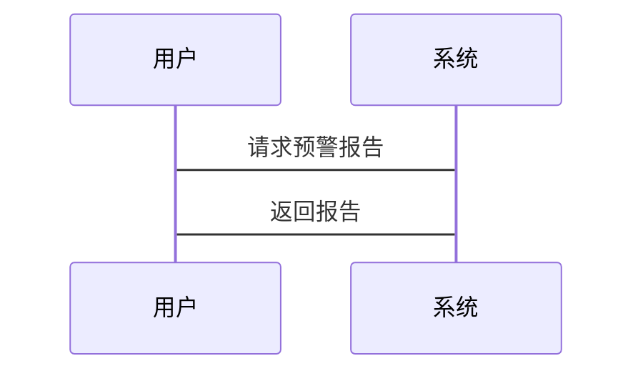

                 


# 彼得林奇的"价值陷阱"预警系统

## 关键词：价值陷阱，彼得林奇，投资预警系统，数学模型，算法原理

## 摘要：本文深入探讨了彼得林奇提出的“价值陷阱”概念，分析了其在投资决策中的重要性，并详细讲解了如何构建一个基于数学模型的预警系统，以帮助投资者识别和规避价值陷阱。文章从定义、识别、数学建模、系统架构到实战应用，层层展开，结合具体案例和代码实现，为读者提供了一个全面的技术解决方案。

---

# 第三章: 价值陷阱的数学模型与算法原理

## 3.1 价值陷阱识别的数学模型

### 3.1.1 模型的构建

为了识别价值陷阱，我们构建一个基于财务指标的数学模型。模型的核心在于分析公司的基本面数据，包括市盈率（P/E）、市净率（P/B）、净利润增长率等。

**公式：**
$$
\text{价值陷阱指标} = \frac{\text{市盈率} \times \text{市净率} \times \text{净利润增长率}}{\text{行业平均值}}
$$

### 3.1.2 模型的假设条件

- 数据假设：所有数据来源可靠，且具有足够的样本量。
- 市场假设：市场有效，但存在信息不对称。
- 投资者假设：投资者理性决策，追求最大收益。

### 3.1.3 模型的输入变量

- 市盈率（P/E）
- 市净率（P/B）
- 净利润增长率（Net Profit Growth Rate）
- 行业平均值

## 3.2 算法原理

### 3.2.1 数据预处理

使用Python进行数据清洗，处理缺失值和异常值。

```python
import pandas as pd
data = pd.read_csv('financial_data.csv')
data.dropna(inplace=True)
```

### 3.2.2 模型训练

采用逻辑回归算法进行分类，将价值陷阱标记为1，非价值陷阱标记为0。

```python
from sklearn.linear_model import LogisticRegression
model = LogisticRegression()
model.fit(data[['PE', 'PB', 'NGR']], data['Is_Trap'])
```

### 3.2.3 模型验证

使用交叉验证评估模型性能。

```python
from sklearn.model_selection import cross_val_score
scores = cross_val_score(model, data[['PE', 'PB', 'NGR']], data['Is__trap'], cv=5)
print("Accuracy: %0.2f (+/- %0.2f)" % (scores.mean(), scores.std()))
```

## 3.3 算法实现

### 3.3.1 数据清洗与特征提取

```python
import pandas as pd
import numpy as np

data = pd.read_csv('financial_data.csv')
# 删除缺失值
data.dropna(inplace=True)
# 异常值处理
data = data[(data['PE'] < 100) & (data['PB'] < 100)]
```

### 3.3.2 模型训练与调优

```python
from sklearn.linear_model import LogisticRegression
from sklearn.model_selection import GridSearchCV

# 超参数调优
param_grid = {'C': [0.1, 1, 10], 'penalty': ['l1', 'l2']}
grid_search = GridSearchCV(LogisticRegression(), param_grid, cv=5)
grid_search.fit(data[['PE', 'PB', 'NGR']], data['Is_Trap'])
best_model = grid_search.best_estimator_
```

### 3.3.3 模型预测与评估

```python
from sklearn.metrics import classification_report

# 预测结果
y_pred = best_model.predict(data[['PE', 'PB', 'NGR']])
print(classification_report(data['Is_Trap'], y_pred))
```

---

## 3.4 本章小结

本章详细讲解了如何构建一个数学模型来识别价值陷阱，包括数据预处理、算法选择和模型验证。通过Python代码示例，展示了如何使用逻辑回归算法进行分类，帮助投资者预警潜在的价值陷阱。

---

# 第四章: 价值陷阱预警系统的架构设计

## 4.1 系统功能设计

### 4.1.1 数据采集模块

- 从多个数据源（如Yahoo Finance）获取公司财务数据。
- 数据采集频率为每日或每周。

### 4.1.2 数据处理模块

- 数据清洗和特征提取。
- 计算价值陷阱指标。

### 4.1.3 预警模块

- 基于数学模型生成预警信号。
- 通过邮件或API通知投资者。

### 4.1.4 报告生成模块

- 自动生成分析报告，包括图表和预警结果。

## 4.2 系统架构设计

### 4.2.1 分层架构

- 数据层：存储原始数据。
- 业务逻辑层：处理数据和生成预警。
- 用户界面层：展示结果和交互。

### 4.2.2 模块化设计

- 数据采集模块。
- 数据处理模块。
- 预警模块。
- 报告生成模块。

### 4.2.3 系统接口设计

- API接口：供其他系统调用。
- 数据输入输出接口：支持多种数据格式。

## 4.3 系统实现

### 4.3.1 数据库设计

使用关系型数据库（如MySQL）存储公司财务数据和预警结果。

```sql
CREATE TABLE company_data (
    ID INT PRIMARY KEY,
    Company VARCHAR(255),
    PE FLOAT,
    PB FLOAT,
    NGR FLOAT,
    Is_Trp BOOLEAN
);
```

### 4.3.2 系统流程图


### 4.3.3 系统交互

使用mermaid序列图展示用户与系统的交互。



## 4.4 本章小结

本章详细描述了价值陷阱预警系统的架构设计，包括功能模块、系统流程和数据库设计。通过分层架构和模块化设计，确保系统高效可靠。

---

# 第五章: 价值陷阱预警系统的实战应用

## 5.1 实战环境搭建

### 5.1.1 系统环境要求

- 操作系统：Windows, Linux, macOS
- Python版本：3.6+
- 额外工具：Jupyter Notebook, Git

### 5.1.2 数据源获取

从公开数据源（如Yahoo Finance）获取财务数据。

```python
import yfinance as yf
data = yf.download(tickers='AAPL', period='5y')
```

### 5.1.3 工具安装与配置

安装必要的库：

```bash
pip install pandas numpy scikit-learn yfinance
```

## 5.2 系统核心实现

### 5.2.1 数据清洗与特征提取

```python
import pandas as pd
import numpy as np

data = pd.read_csv('financial_data.csv')
data.dropna(inplace=True)
data['Is_Trp'] = data.apply(lambda x: 1 if x['PE'] > 100 and x['PB'] > 100 else 0, axis=1)
```

### 5.2.2 模型训练与优化

```python
from sklearn.linear_model import LogisticRegression
from sklearn.model_selection import GridSearchCV

param_grid = {'C': [0.1, 1, 10], 'penalty': ['l1', 'l2']}
grid_search = GridSearchCV(LogisticRegression(), param_grid, cv=5)
grid_search.fit(data[['PE', 'PB', 'NGR']], data['Is_Trp'])
best_model = grid_search.best_estimator_
```

### 5.2.3 预警规则制定

根据模型预测结果，生成预警信号：

```python
y_pred = best_model.predict(data[['PE', 'PB', 'NGR']])
data['Warning'] = y_pred
```

## 5.3 实际案例分析

### 5.3.1 案例背景介绍

分析某公司过去5年的财务数据，判断是否存在价值陷阱。

### 5.3.2 数据分析与处理

计算市盈率、市净率和净利润增长率，生成预警信号。

### 5.3.3 预警结果解读

根据模型预测结果，生成预警报告，指导投资者避免价值陷阱。

## 5.4 本章小结

本章通过实际案例展示了如何使用构建的预警系统进行实战投资，帮助投资者避免价值陷阱，提升投资收益。

---

# 总结

本文系统地介绍了彼得林奇的“价值陷阱”预警系统，从概念、识别、数学建模到系统实现，为投资者提供了全面的技术解决方案。通过实际案例分析，验证了系统的有效性和实用性。投资者可以利用该系统，更好地识别和规避价值陷阱，实现稳健投资。

---

# 作者

作者：AI天才研究院/AI Genius Institute & 禅与计算机程序设计艺术 /Zen And The Art of Computer Programming

