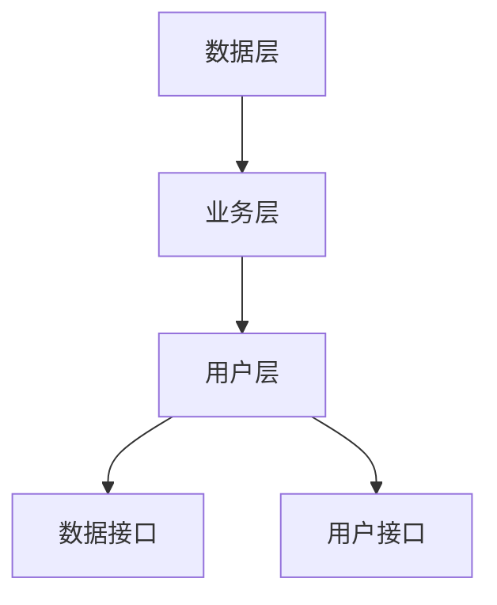
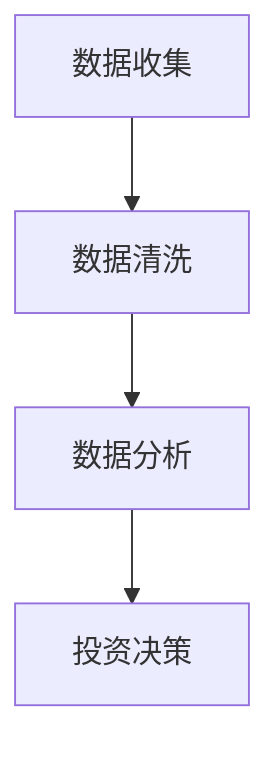

                 


# 彼得林奇的"十倍股"识别方法

> 关键词：彼得林奇、十倍股、投资策略、股票分析、价值投资、成长投资

> 摘要：本文将深入探讨彼得·林奇的“十倍股”识别方法，从他的投资理念到具体的选股标准，再到实际案例分析，系统地解析如何在股票市场中识别具有十倍增长潜力的企业。文章结合理论与实践，为投资者提供一套可操作的分析框架和策略。

---

## # 第1章: 引言

### ## 1.1 彼得·林奇与"十倍股"概述

#### ### 1.1.1 彼得·林奇的投资理念
彼得·林奇是美国著名的职业基金经理，被誉为“最伟大的股票投资人之一”。他的投资理念强调价值投资与成长投资的结合，主张以合理的估值买入具有持续增长潜力的企业。他认为，成功的投资不仅仅是买入优质的股票，更是通过深入研究和长期持有来实现财富的增值。

#### ### 1.1.2 "十倍股"的定义与特征
“十倍股”是指那些能够在较长的时间内为投资者带来10倍甚至更高回报的股票。这类股票通常具有以下特征：
1. 高成长性：公司收入和利润持续快速增长。
2. 低估值：市盈率、市净率等估值指标显著低于行业平均水平。
3. 竞争优势：公司在行业内具有独特的竞争优势，如技术壁垒、品牌优势等。
4. 财务健康：低债务、高ROE（净资产收益率）。
5. 管理层优秀：公司管理层具有良好的声誉和长期愿景。

#### ### 1.1.3 本书的核心目标与价值
本文的核心目标是通过分析彼得·林奇的投资方法，总结出一套系统化的“十倍股”识别方法。通过理论与实践的结合，帮助投资者在实际操作中识别具有十倍增长潜力的企业，降低投资风险，提高投资回报。

---

## # 第2章: 彼得·林奇的投资方法论

### ## 2.1 彼得·林奇的投资哲学

#### ### 2.1.1 价值投资与成长投资的结合
林奇的投资方法是价值投资与成长投资的结合。他既关注企业的内在价值（如ROE、盈利能力），又关注企业的成长潜力（如收入增长率、净利润增长率）。这种双重关注使他能够在企业估值偏低时买入，同时享受企业成长带来的收益。

#### ### 2.1.2 长期投资与耐心的价值
林奇强调长期投资的重要性。他认为，短期市场波动会干扰投资者的判断，而长期持有优质股票则能够穿越市场的牛熊周期，实现财富的稳定增长。

#### ### 2.1.3 风险管理与分散投资
尽管林奇以选股能力强著称，但他也非常注重风险管理。他主张通过分散投资来降低单一股票的风险，并通过持续的研究和跟踪来动态调整投资组合。

### ## 2.2 彼得·林奇的选股标准

#### ### 2.2.1 高成长性企业的识别
林奇认为，具有高成长性的企业是实现十倍收益的关键。他通常关注企业的收入增长率和净利润增长率，尤其是那些能够保持5年甚至更长时间持续增长的企业。

#### ### 2.2.2 低估值企业的判断
在估值方面，林奇注重企业的内在价值与市场估值的匹配。他倾向于买入那些估值低于内在价值的企业，尤其是那些被市场忽视或低估的企业。

#### ### 2.2.3 行业地位与竞争优势
林奇非常注重企业的行业地位和竞争优势。他倾向于选择那些在行业内具有领先地位，且竞争优势明显的企业，如技术壁垒高、品牌影响力强等。

### ## 2.3 彼得·林奇的经典投资策略

#### ### 2.3.1 "烟蒂投资"策略
烟蒂投资是指买入那些基本面良好但被市场忽视的企业。这类企业通常具有低估值、高ROE的特点，且市场关注度较低，因此具有较大的上涨空间。

#### ### 2.3.2 "成长股"投资策略
林奇的成长股投资策略注重选择那些收入和利润持续增长的企业。他通常会通过财务报表分析来判断企业的成长潜力。

#### ### 2.3.3 "分散投资"原则
尽管林奇以选股能力强著称，但他也非常注重分散投资。他通常会将资金分散投资于多只股票，以降低单一股票的风险。

---

## # 第3章: 十倍股的特征分析

### ## 3.1 十倍股的八大特征

#### ### 3.1.1 高ROE（净资产收益率）
高ROE是十倍股的重要特征之一。一般来说，ROE高于行业平均水平的企业具有更强的盈利能力，也更有可能为股东创造价值。

#### ### 3.1.2 高成长性
十倍股通常具有较高的收入增长率和净利润增长率。这类企业往往处于快速成长期，具有较大的市场空间。

#### ### 3.1.3 低估值
低估值是十倍股的重要特征之一。十倍股通常具有较低的市盈率和市净率，与企业内在价值相比具有较大的安全边际。

#### ### 3.1.4 强大的管理层
强大的管理层是十倍股的重要特征之一。一个优秀的管理层能够带领企业不断成长，实现股东价值的最大化。

#### ### 3.1.5 独特的商业模式
独特的商业模式是十倍股的重要特征之一。十倍股通常具有独特的商业模式，能够在竞争中占据优势地位。

#### ### 3.1.6 良好的行业前景
良好的行业前景是十倍股的重要特征之一。十倍股通常处于景气行业，具有较大的市场空间和发展潜力。

#### ### 3.1.7 低债务风险
低债务风险是十倍股的重要特征之一。十倍股通常具有较低的债务负担，财务风险较小。

#### ### 3.1.8 股东权益保护
十倍股通常注重保护股东权益，具有较高的股东回报率和良好的公司治理结构。

#### ### 3.2 十倍股特征对比分析

##### ### 3.2.1 行业对比分析
通过对比不同行业的十倍股特征，可以帮助投资者更好地理解行业的成长潜力和投资价值。

##### ### 3.2.2 企业规模对比分析
通过对比不同规模企业的十倍股特征，可以帮助投资者更好地理解企业的成长潜力和投资价值。

##### ### 3.2.3 财务指标对比分析
通过对比不同企业的财务指标，可以帮助投资者更好地理解企业的财务健康状况和投资价值。

---

## # 第4章: 十倍股识别的系统分析

### ## 4.1 系统分析框架

#### ### 4.1.1 系统分析的定义与目标
系统分析是指通过对企业内外部环境的全面分析，识别出具有十倍增长潜力的企业。系统分析的目标是通过系统化的分析方法，降低投资风险，提高投资收益。

#### ### 4.1.2 系统分析的步骤与方法
系统分析的步骤包括：
1. 数据收集：收集企业的财务数据、行业数据、竞争数据等。
2. 数据清洗：对收集到的数据进行清洗和预处理。
3. 数据分析：通过数据分析识别出具有十倍增长潜力的企业。
4. 投资决策：根据分析结果制定投资策略。

#### ### 4.1.3 系统分析的工具与技术
系统分析的工具与技术包括：
1. 数据分析工具：如Excel、Python等。
2. 统计分析方法：如回归分析、聚类分析等。
3. 可视化工具：如Tableau、Power BI等。

### ## 4.2 数据收集与处理

#### ### 4.2.1 数据来源与可靠性
数据来源包括企业财报、行业报告、新闻报道等。投资者需要选择可靠的数据源，如官方数据、权威媒体等。

#### ### 4.2.2 数据清洗与预处理
数据清洗是系统分析的重要步骤。通过数据清洗，可以消除数据中的噪声，提高数据的质量。

#### ### 4.2.3 数据存储与管理
数据存储与管理是系统分析的重要基础。投资者需要选择合适的数据存储方案，确保数据的安全性和可访问性。

### ## 4.3 系统分析与架构设计

#### ### 4.3.1 系统功能设计
系统功能设计包括数据收集、数据清洗、数据分析、投资决策等模块。

#### ### 4.3.2 系统架构设计
系统架构设计包括数据层、业务层、用户层等模块的设计。

#### ### 4.3.3 系统接口设计
系统接口设计包括数据接口、用户接口等的设计。

#### ### 4.3.4 系统交互设计
系统交互设计包括用户与系统之间的交互流程设计。

---

## # 第5章: 十倍股识别的实战指导

### ## 5.1 选股策略

#### ### 5.1.1 基于基本面分析的选股策略
基于基本面分析的选股策略包括对企业财务数据的分析、行业分析等。

#### ### 5.1.2 基于技术分析的选股策略
基于技术分析的选股策略包括对股票价格走势的分析、技术指标的分析等。

### ## 5.2 案例分析

#### ### 5.2.1 十倍股的经典案例
本文将通过具体案例分析，展示如何通过系统化的分析方法识别出具有十倍增长潜力的企业。

#### ### 5.2.2 案例分析步骤
案例分析步骤包括数据收集、数据分析、投资决策等。

### ## 5.3 代码实现

#### ### 5.3.1 数据清洗与预处理
以下是数据清洗与预处理的Python代码示例：

```python
import pandas as pd
import numpy as np

# 加载数据
data = pd.read_csv('stock_data.csv')

# 删除缺失值
data = data.dropna()

# 去重
data = data.drop_duplicates()

# 转换数据类型
data['date'] = pd.to_datetime(data['date'])
```

#### ### 5.3.2 数据分析与建模
以下是数据分析与建模的Python代码示例：

```python
from sklearn import linear_model

# 数据准备
X = data[['revenue', 'profit']]
y = data['stock_price']

# 建立线性回归模型
model = linear_model.LinearRegression()
model.fit(X, y)

# 预测股票价格
predictions = model.predict(X)
```

---

## # 第6章: 风险管理与投资策略

### ## 6.1 风险管理的重要性
风险管理是投资过程中不可忽视的重要环节。投资者需要通过合理的风险管理策略，降低投资风险，保护投资本金。

### ## 6.2 风险管理策略

#### ### 6.2.1 分散投资
分散投资是降低投资风险的重要策略。投资者可以通过投资于不同的行业、不同的股票等来分散投资风险。

#### ### 6.2.2 设置止损
设置止损是降低投资风险的重要策略。投资者可以通过设定止损点，避免亏损进一步扩大。

#### ### 6.2.3 定期复盘
定期复盘是评估投资策略的重要步骤。投资者需要定期回顾自己的投资组合，评估投资策略的有效性，并根据市场变化进行调整。

### ## 6.3 投资计划的制定

#### ### 6.3.1 投资目标的设定
投资者需要根据自己的财务状况、风险承受能力等设定明确的投资目标。

#### ### 6.3.2 投资策略的制定
投资者需要根据市场环境、企业基本面等制定合适的投资策略。

#### ### 6.3.3 投资计划的执行
投资者需要根据制定的投资策略，执行投资计划，并进行定期跟踪和调整。

---

## # 第7章: 小结与展望

### ## 7.1 小结
本文通过分析彼得·林奇的投资方法，总结出一套系统化的“十倍股”识别方法。通过理论与实践的结合，帮助投资者在实际操作中识别具有十倍增长潜力的企业。

### ## 7.2 展望
未来，随着市场环境的变化和投资理论的发展，投资者需要不断更新和完善自己的投资策略。通过持续学习和实践，投资者可以更好地识别具有十倍增长潜力的企业，实现财富的长期增长。

---

## # 附录

### ## 附录A: 系统架构图


### ## 附录B: 数据分析流程图


---

## # 作者

作者：AI天才研究院/AI Genius Institute & 禅与计算机程序设计艺术/Zen And The Art of Computer Programming

