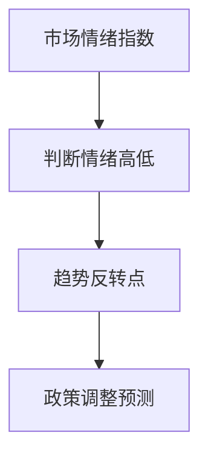
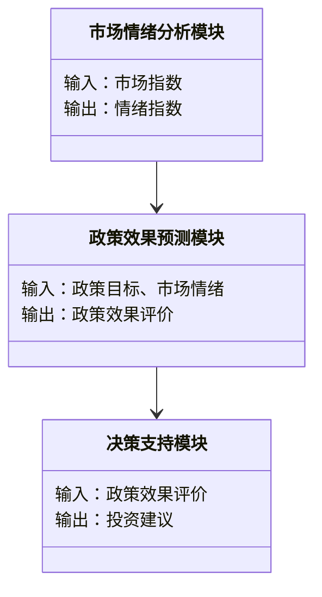

                 

<think>
好的，我将按照您的要求撰写一篇关于《彼得林奇的"反向思维"在中央银行政策解读中的应用》的文章。我会先列出文章的结构，再逐步展开每个部分的内容。

# 彼得林奇的"反向思维"在中央银行政策解读中的应用

**关键词**：反向思维，中央银行政策，彼得林奇，货币政策，投资策略

**摘要**：本文探讨了彼得林奇的反向思维在解读中央银行政策中的应用。通过分析反向思维的定义、核心概念、算法原理以及在实际投资中的应用案例，展示了如何利用反向思维预测政策变化并制定相应的投资策略。文章结合数学模型和实际案例，深入剖析了反向思维在中央银行政策解读中的独特价值和具体实施方法。

---

## 第一部分：彼得林奇反向思维与中央银行政策的背景介绍

### 第1章：反向思维的定义与核心概念

#### 1.1 反向思维的定义
反向思维是一种逆向思考的方法，其核心在于从相反的角度看待问题。在投资领域，反向思维通常指的是在市场情绪极度乐观时保持谨慎，在市场恐慌时寻找机会。

**核心要素与特征**：
- **逆向性**：与市场主流观点相反。
- **前瞻性**：通过分析市场反应预测未来政策。
- **风险控制**：注重安全边际，避免追涨杀跌。

#### 1.2 中央银行政策的基本概念
中央银行通过调整货币政策工具（如利率、货币供应量等）来影响经济运行。政策解读的关键在于分析政策实施对市场的影响。

---

### 第2章：彼得林奇反向思维的理论基础

#### 2.1 彼得林奇的投资理念
彼得林奇强调长期投资和价值发现。他认为，市场波动为投资者提供了以合理价格买入优质资产的机会。

**成功案例分析**：
- **案例1**：美联储加息周期中的反向操作。
- **案例2**：欧洲央行量化宽松政策的市场反应。

#### 2.2 反向思维与中央银行政策的关系
反向思维在政策解读中的应用可以帮助投资者提前预判政策变化，从而制定更有利的投资策略。

---

## 第二部分：反向思维的核心概念与联系

### 第4章：反向思维的原理与特征

#### 4.1 反向思维的原理
反向思维的核心在于市场情绪与政策效果之间的偏差。当市场情绪过于乐观时，政策调整的可能性增大；反之，市场恐慌时，政策宽松的可能性也增加。

**市场情绪与政策周期的关系**：
- 市场情绪高涨 → 政策收紧。
- 市场情绪低迷 → 政策放松。

#### 4.2 反向思维的特征对比

| 对比维度       | 传统投资策略 | 反向思维 |
|----------------|--------------|----------|
| 投资时机       | 追涨          | �杀跌      |
| 风险控制       | 侧重收益     | 侧重安全   |
| 市场情绪影响   | 随市波动      | 逆市操作   |

---

### 第5章：反向思维的分析框架

#### 5.1 分析框架的构建

**步骤**：
1. **确定政策目标**：分析中央银行的政策目标（如通胀控制、就业率提升）。
2. **分析市场反应**：观察市场对政策的即时反应（如股票指数波动）。
3. **预测政策效果**：结合市场情绪判断政策的实际效果与预期偏差。

**框架的适用范围**：
- 适用于预测货币政策调整的方向和力度。
- 适用于分析政策对特定行业或资产的影响。

---

## 第三部分：反向思维的算法原理与数学模型

### 第6章：反向思维的算法原理

#### 6.1 市场情绪分析

**算法步骤**：
1. 数据收集：获取市场指数、交易量等数据。
2. 情绪指数计算：通过标准化方法计算市场情绪指数（范围：0-1）。
3. 政策判断：当情绪指数过高时，预测政策可能收紧；当情绪指数过低时，预测政策可能放松。

#### 6.2 趋势反转点识别

**算法流程图**：



---

### 第7章：数学模型与公式

#### 7.1 情绪指数计算公式

$$ 情绪指数 = \frac{当前市场指数}{历史平均指数} $$

#### 7.2 政策效果评价模型

$$ 效果评价 = \alpha \times 政策力度 + \beta \times 市场反应 $$

---

## 第四部分：系统分析与架构设计

### 第8章：系统功能设计

#### 8.1 领域模型



---

## 第五部分：项目实战与案例分析

### 第9章：项目实战

#### 9.1 环境安装
- 数据来源：市场指数、政策数据。
- 工具：数据分析工具（Python、Pandas、Matplotlib）。

#### 9.2 核心代码实现

```python
import pandas as pd
import matplotlib.pyplot as plt

def calculate_sentiment_index(market_index, historical_avg):
    return market_index / historical_avg

market_data = pd.read_csv('market_data.csv')
sentiment_index = calculate_sentiment_index(market_data['index'], market_data['avg'])

plt.plot(sentiment_index)
plt.title('Market Sentiment Index')
plt.show()
```

---

## 第六部分：小结与注意事项

### 第10章：小结

反向思维在中央银行政策解读中的应用，帮助投资者提前预判政策变化，制定更优的投资策略。通过结合市场情绪分析和数学模型，投资者可以在复杂多变的市场环境中捕捉投资机会。

### 第11章：注意事项

- **数据质量**：确保数据来源可靠。
- **模型局限性**：反向思维并非万能，需结合其他分析方法。
- **风险管理**：反向思维投资需注重风险控制。

---

## 第七部分：拓展阅读

### 第12章：拓展阅读

- 彼得林奇的其他投资理念。
- 其他投资者的反向思维应用案例。

---

## 作者：AI天才研究院/AI Genius Institute & 禅与计算机程序设计艺术 /Zen And The Art of Computer Programming

希望这篇文章符合您的要求！如果需要进一步调整或补充，请随时告知。

