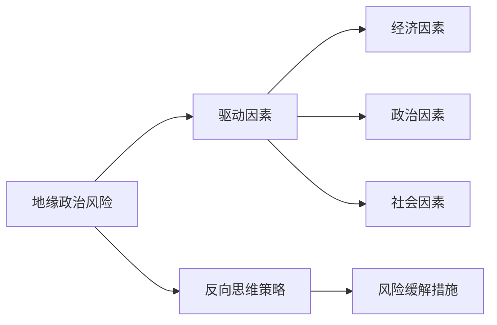
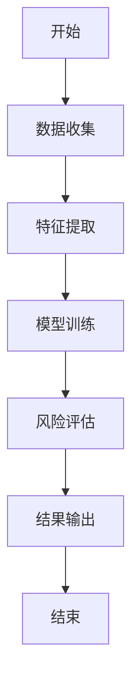
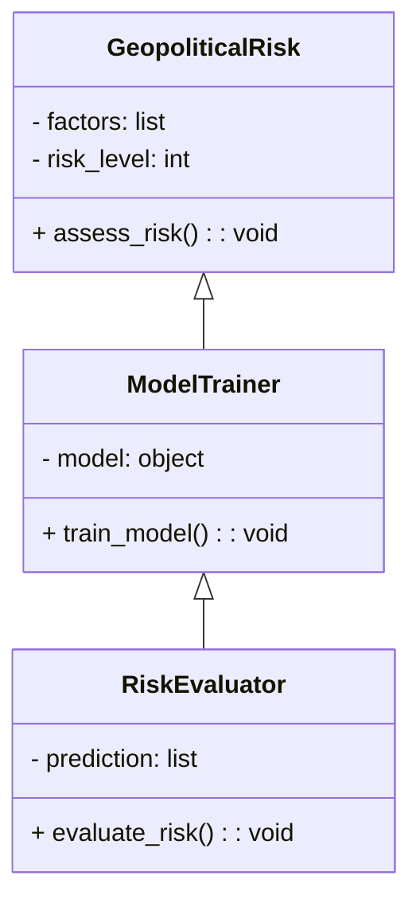
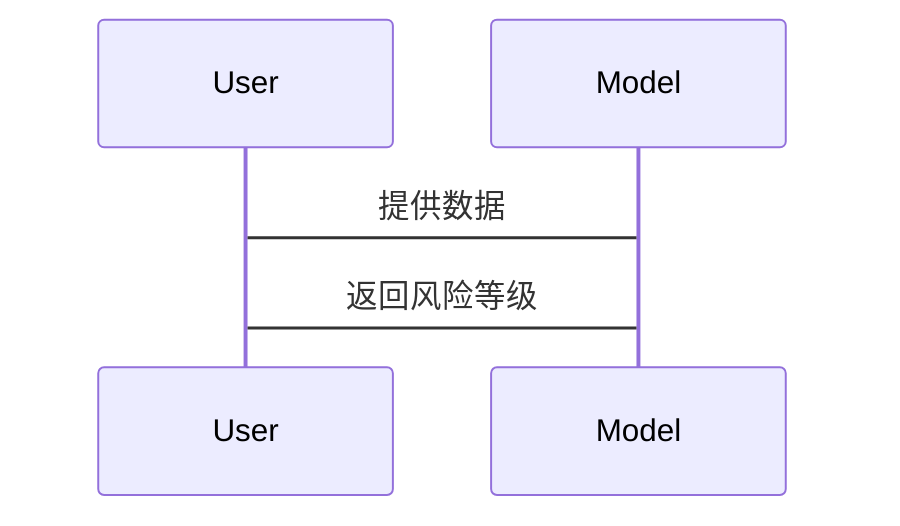

                 


# 彼得林奇的"反向思维"在地缘政治风险量化模型中的应用

## 关键词：反向思维, 地缘政治风险, 量化模型, 彼得林奇, 风险管理, 系统架构, 投资策略

## 摘要：  
本文探讨了彼得林奇的反向思维策略在地缘政治风险量化模型中的应用，通过构建数学模型和系统架构，展示了如何利用反向思维进行风险评估与管理，结合实际案例分析，为地缘政治风险量化提供了新的视角和方法。

---

# 第1章: 地缘政治风险与反向思维概述

## 1.1 地缘政治风险的定义与重要性

### 1.1.1 地缘政治风险的核心概念  
地缘政治风险是指由于地理位置、政治体制、国际关系等因素引发的潜在风险，可能对企业运营、国家政策和全球市场产生重大影响。

### 1.1.2 地缘政治风险对企业的影响  
企业在全球化背景下，可能因地缘政治冲突、贸易限制或政策变化而面临供应链中断、资产损失等风险。

### 1.1.3 反向思维在风险管理中的作用  
反向思维通过从对立面思考问题，帮助识别潜在风险，提前制定应对策略，降低风险影响。

## 1.2 彼得林奇反向思维的起源与核心理念

### 1.2.1 彼得林奇投资策略的背景  
彼得林奇是著名投资经理，其反向思维策略强调在市场恐慌时寻找机会，避免随大流。

### 1.2.2 反向思维的核心原理  
反向思维通过分析对立面，识别市场中的非共识观点，寻找潜在的投资机会。

### 1.2.3 反向思维在地缘政治中的应用潜力  
通过反向思维，可以识别地缘政治风险中的机会，制定灵活的风险管理策略。

## 1.3 地缘政治风险量化模型的构建目标

### 1.3.1 模型构建的基本目标  
量化地缘政治风险，提供风险评估工具，辅助决策。

### 1.3.2 模型的核心假设与边界条件  
假设地缘政治风险由经济、政治和社会因素驱动，模型适用于中短期风险评估。

### 1.3.3 模型的预期应用场景  
为企业和政府提供风险预警和应对策略。

---

# 第2章: 地缘政治风险量化模型的核心概念与联系

## 2.1 核心概念原理

### 2.1.1 地缘政治风险的主要驱动因素  
包括经济制裁、贸易冲突、政治动荡等。

### 2.1.2 反向思维在风险识别中的应用  
通过反向思维识别风险中的机会，制定应对策略。

### 2.1.3 模型的输入变量与输出结果  
输入：经济、政治、社会因素；输出：风险等级。

## 2.2 核心概念属性特征对比表

| 概念       | 稳定性 | 可预测性 | 可控性 |
|------------|--------|----------|--------|
| 地缘政治风险 | 较低    | 中等      | 部分    |
| 反向思维    | 较高    | 较高      | 高      |

## 2.3 实体关系图（ER图）



---

# 第3章: 地缘政治风险量化模型的算法原理

## 3.1 算法流程图



## 3.2 算法实现代码

```python
def geopolitical_risk_assessment():
    import numpy as np
    import pandas as pd
    from sklearn.model_selection import train_test_split
    from sklearn.metrics import accuracy_score

    # 数据加载与预处理
    data = pd.read_csv('geopolitical_data.csv')
    X = data.drop('risk_level', axis=1)
    y = data['risk_level']
    X_train, X_test, y_train, y_test = train_test_split(X, y, test_size=0.2)

    # 模型训练
    from sklearn.ensemble import RandomForestClassifier
    model = RandomForestClassifier()
    model.fit(X_train, y_train)

    # 模型预测与评估
    y_pred = model.predict(X_test)
    print("模型准确率:", accuracy_score(y_test, y_pred))

    return model
```

## 3.3 数学模型与公式

### 3.3.1 概率论模型  
风险概率计算公式：  
$$ P(risk) = \sum_{i=1}^{n} P(factor_i) \times weight_i $$  

### 3.3.2 统计学模型  
风险指数计算公式：  
$$ Index = \alpha \times Factor_1 + \beta \times Factor_2 + \gamma \times Factor_3 $$  

### 3.3.3 机器学习模型  
随机森林模型用于分类，预测风险等级。

---

# 第4章: 系统分析与架构设计方案

## 4.1 领域模型类图



## 4.2 系统架构图


## 4.3 系统接口设计

### 4.3.1 输入接口  
API接口接收地缘政治因素数据。

### 4.3.2 输出接口  
返回风险评估结果。

## 4.4 系统交互序列图



---

# 第5章: 项目实战

## 5.1 环境安装

```bash
pip install numpy pandas scikit-learn
```

## 5.2 核心代码实现

```python
def main():
    model = geopolitical_risk_assessment()
    print("模型训练完成")
```

## 5.3 案例分析

分析某地区的经济、政治和社会因素，预测其地缘政治风险等级。

---

# 第6章: 总结与最佳实践

## 6.1 小结  
反向思维策略在地缘政治风险量化模型中的应用，提供了新的视角和方法。

## 6.2 注意事项  
确保模型输入数据的准确性和及时性。

## 6.3 拓展阅读  
推荐阅读相关书籍和文献，深入理解地缘政治风险的复杂性。

---

# 作者：AI天才研究院/AI Genius Institute & 禅与计算机程序设计艺术 /Zen And The Art of Computer Programming

