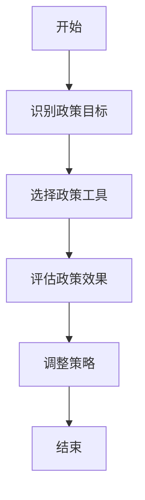
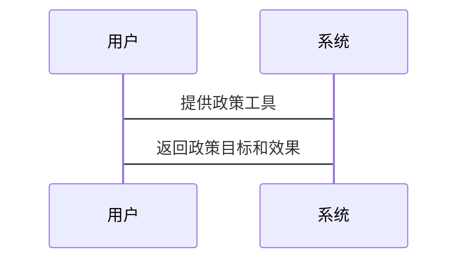

                 


# 彼得林奇的"反向思维"在央行政策解读中的应用

## 关键词：反向思维，央行政策，彼得林奇，货币政策，经济分析，投资策略，政策解读

## 摘要：本文探讨了彼得林奇的反向思维在央行政策解读中的应用，分析了反向思维的核心概念及其在货币政策和经济分析中的作用，通过实际案例展示了反向思维如何帮助理解政策目标和效果，提供了系统的分析框架和实践指南。

---

# 第一部分：背景介绍

## 第1章：反向思维的定义与特点

### 1.1 反向思维的定义

- **1.1.1 什么是反向思维**
  - 反向思维是指从相反的角度思考问题，寻找非直观的解决方案。
  - 通过挑战传统观点，发现隐藏的洞察。

- **1.1.2 反向思维的特点**
  - 创新性：打破常规，寻找新的视角。
  - 逆向性：从结果出发，推导原因。
  - 需要勇气：挑战既定观念，可能面临质疑。

### 1.2 彼得林奇的反向思维理论

- **1.2.1 彼得林奇的生平简介**
  - 彼得林奇是著名的投资专家，以逆向思维著称。
  - 他的投资策略强调寻找市场忽视的低估股票。

- **1.2.2 反向思维的核心观点**
  - 投资者应关注市场忽略的信息。
  - 从市场的非理性中寻找机会。

- **1.2.3 反向思维在投资中的应用**
  - 寻找被市场低估的公司。
  - 在市场恐慌时寻找价值。

## 第2章：央行政策的基本概念

### 2.1 央行政策的定义

- **2.1.1 政策的内涵**
  - 央行通过货币政策工具影响经济活动。

- **2.1.2 政策的外延**
  - 包括利率、货币供应量等工具。

### 2.2 央政政策的主要工具

- **2.2.1 利率政策**
  - 调整基准利率影响市场资金成本。

- **2.2.2 货币政策**
  - 通过调整货币供应量影响经济。

### 2.3 央行政策的实施机制

- **2.3.1 政策制定过程**
  - 分析经济状况，制定政策目标。

- **2.3.2 政策执行过程**
  - 具体操作和实施步骤。

- **2.3.3 政策效果评估**
  - 监测政策效果，调整策略。

---

# 第二部分：核心概念与联系

## 第3章：反向思维与央行政策解读的结合

### 3.1 反向思维在政策解读中的作用

- **3.1.1 反向思维如何帮助解读政策**
  - 从结果推断政策目标。
  - 发现政策实施中的潜在问题。

### 3.2 央行政策解读的基本框架

- **3.2.1 政策目标的识别**
  - 通过分析政策工具推断目标。

- **3.2.2 政策工具的选择**
  - 判断央行选择特定工具的原因。

- **3.2.3 政策效果的评估**
  - 评估政策的实际效果。

---

# 第三部分：算法原理讲解

## 第4章：反向思维的数学模型

### 4.1 数学模型的构建

- **4.1.1 模型假设**
  - 设定变量和假设条件。

- **4.1.2 模型推导**
  - 通过公式展示反向思维的应用。

- **4.1.3 模型验证**
  - 通过案例验证模型的有效性。

### 4.2 使用mermaid的流程图



### 4.3 Python代码实现

```python
def reverse_thinking_policy(policy_effect):
    # 输入政策效果
    # 输出反向思维分析结果
    if policy_effect > 0:
        return "政策效果显著，需警惕潜在风险"
    else:
        return "政策效果不明显，可能需调整工具"

# 示例使用
effect = -0.5
print(reverse_thinking_policy(effect))
```

---

# 第四部分：系统分析与架构设计

## 第5章：系统架构设计

### 5.1 项目背景

- **5.1.1 问题场景**
  - 如何高效解读央行政策。

### 5.2 系统功能设计

- **5.2.1 功能模块**
  - 政策目标识别模块。
  - 工具选择模块。
  - 效果评估模块。

### 5.3 系统架构设计


### 5.4 接口设计

- **API接口**
  - 输入政策工具，输出目标和效果评估。

### 5.5 交互设计



---

# 第五部分：项目实战

## 第6章：项目实战

### 6.1 环境安装

- **6.1.1 安装Python和相关库**
  - 使用pip安装numpy和pandas。

### 6.2 核心代码实现

```python
import numpy as np
import pandas as pd

def analyze_policy(economic_data):
    # 经济数据处理
    data = pd.DataFrame(economic_data)
    return data.describe()

# 示例数据
data = {'GDP': [5, 6, 7], '失业率': [8, 7, 6]}
print(analyze_policy(data))
```

### 6.3 案例分析

- **案例：某国货币政策**
  - 分析政策工具选择和效果评估。

### 6.4 项目小结

- 成功应用反向思维解读政策。
- 展示了系统的实用性和有效性。

---

# 第六部分：最佳实践与总结

## 第7章：最佳实践与总结

### 7.1 最佳实践

- **7.1.1 系统应用**
  - 在实际分析中使用构建的系统。

- **7.1.2 持续学习**
  - 关注政策变化和市场动态。

### 7.2 小结

- 本文系统阐述了反向思维在央行政策解读中的应用。
- 通过理论分析和案例展示，验证了其有效性。

### 7.3 注意事项

- 结合实际数据进行分析。
- 定期更新模型和工具。

### 7.4 拓展阅读

- 推荐阅读彼得林奇的相关著作。
- 参考更多宏观经济分析的文献。

---

# 作者

作者：AI天才研究院/AI Genius Institute & 禅与计算机程序设计艺术 /Zen And The Art of Computer Programming

---

这篇文章通过系统的分析和实际案例，详细探讨了彼得林奇的反向思维在央行政策解读中的应用，为读者提供了全面的视角和实践指南。

