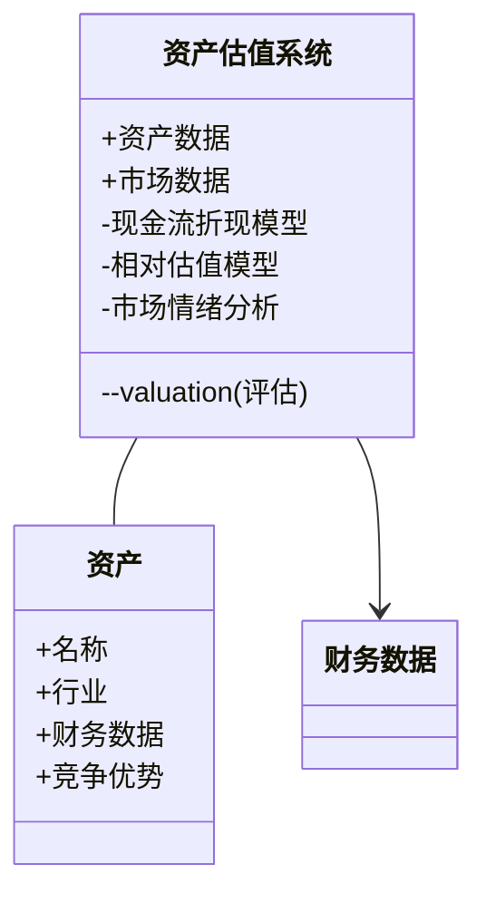
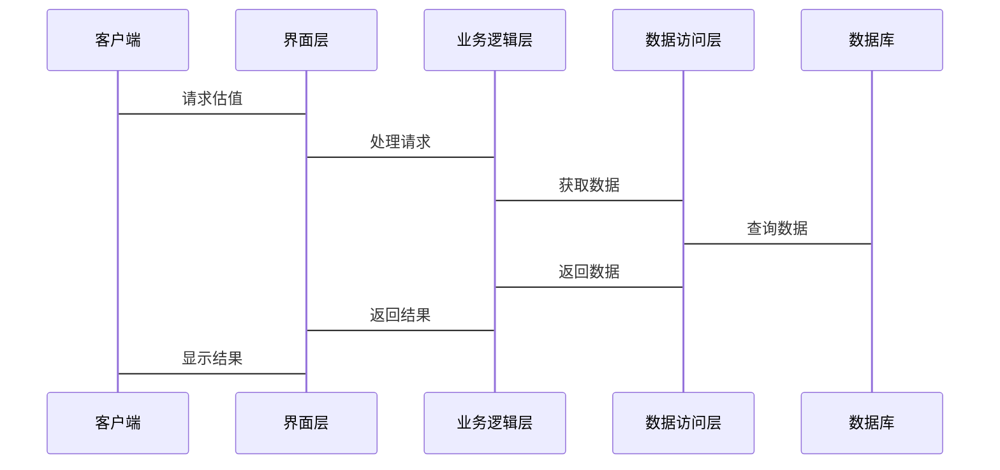

                 


```markdown
# 彼得林奇的"反向思维"在新兴资产类别估值中的应用

> 关键词：彼得林奇，反向思维，新兴资产，资产估值，投资策略

> 摘要：本文探讨了彼得林奇的反向思维在新兴资产类别估值中的应用，分析了新兴资产的特点，并结合具体案例，详细讲解了如何利用反向思维进行资产估值，包括算法原理、数学模型和系统设计等内容。

---

## 第一部分：引言

### 第1章：彼得林奇反向思维概述

#### 1.1 反向思维的定义与核心理念
反向思维是一种与传统投资思维相反的方法，强调在市场低估时买入，在市场高估时卖出。其核心理念是寻找市场忽视的低估资产，逆市场情绪进行投资。

#### 1.2 反向思维在投资中的重要性
传统投资方法依赖于市场趋势和短期波动，而反向思维则关注资产的内在价值，强调长期持有和逆向决策，能够在市场底部捕捉机会，获得超额收益。

#### 1.3 新兴资产类别与估值方法的结合
新兴资产类别如科技、绿色能源等具有高增长潜力，但其估值方法与传统资产不同。反向思维能够帮助投资者发现这些资产的潜在价值，尤其是在市场低估时。

---

## 第二部分：反向思维的核心概念

### 第2章：反向思维的基本原理

#### 2.1 投资中的传统思维与反向思维对比
- **传统思维**：跟随市场趋势，顺势投资。
- **反向思维**：逆市场情绪，寻找低估资产。

#### 2.2 反向思维的关键特征
- **逆周期性**：在市场低迷时寻找机会。
- **价值导向**：注重资产的内在价值。
- **长期视角**：关注长期收益而非短期波动。

#### 2.3 反向思维在资产估值中的应用边界
反向思维适用于市场低估阶段，但在市场高估时需谨慎。其成功依赖于对资产内在价值的准确评估和市场情绪的准确判断。

---

## 第三部分：新兴资产类别的特点与估值挑战

### 第3章：新兴资产类别的定义与分类

#### 3.1 科技创新类资产
包括人工智能、云计算、大数据等领域的科技公司。这些资产具有高成长性和高风险，估值需考虑未来现金流和技术创新能力。

#### 3.2 绿色能源与可持续发展类资产
包括太阳能、风能等可再生能源公司。这类资产符合全球环保趋势，但需考虑政策风险和技术成熟度。

#### 3.3 数字经济与区块链类资产
包括区块链技术、数字货币等。这类资产具有高波动性和高潜力，估值需结合技术应用和市场接受度。

#### 3.4 其他新兴资产类别
如生物技术、高端制造业等，这些资产具有行业特定的风险和机会，需进行深入分析。

---

## 第四部分：反向思维在新兴资产估值中的应用

### 第4章：反向思维的估值方法论

#### 4.1 反向思维的核心步骤
1. **识别市场低估资产**：通过比较市场价与内在价值，寻找低估资产。
2. **评估资产的内在价值**：使用现金流折现法、相对估值法等方法。
3. **分析市场情绪**：通过市场指标和投资者情绪分析，判断资产的估值偏差。

#### 4.2 估值模型的构建与应用
- **现金流折现模型（DCF）**：计算资产的未来现金流，折现至现值，评估其内在价值。
- **相对估值法**：比较同类资产的估值指标（如市盈率、市净率等）。
- **情景分析法**：分析不同市场情景下的资产表现。

#### 4.3 实例分析：如何运用反向思维评估新兴资产
以某科技公司为例，分析其财务状况、行业地位、竞争优势等，计算其内在价值，判断其市场估值是否低估。

---

## 第五部分：算法与数学模型

### 第5章：反向思维算法的数学解析

#### 5.1 估值模型的数学表达
$$\text{内在价值} = \sum_{t=1}^{n} \frac{\text{现金流}_t}{(1 + r)^t}$$

其中，$r$为折现率，$\text{现金流}_t$为第$t$年的现金流。

#### 5.2 现金流折现法的数学公式
$$\text{DCF Value} = \sum_{t=1}^{n} \frac{CF_t}{(1 + r)^t}$$

其中，$CF_t$为第$t$年的自由现金流，$r$为折现率。

#### 5.3 市场情绪与资产价格的关系模型
$$\text{市场价格} = \text{内在价值} \times (1 + \text{情绪溢价})$$

其中，情绪溢价反映了市场情绪对资产价格的影响。

#### 5.4 算法流程图（使用mermaid）

```mermaid
graph TD
    A[开始] -> B[输入资产数据]
    B -> C[计算内在价值]
    C -> D[分析市场情绪]
    D -> E[判断是否低估]
    E -> F[输出投资决策]
    F -> G[结束]
```

---

## 第六部分：系统分析与架构设计

### 第6章：系统功能设计

#### 6.1 领域模型（使用mermaid类图）



#### 6.2 系统架构设计（使用mermaid架构图）


#### 6.3 系统接口设计
- **输入接口**：资产数据、市场数据。
- **输出接口**：内在价值、市场情绪、投资决策。

#### 6.4 系统交互（使用mermaid序列图）



---

## 第七部分：项目实战

### 第7章：项目实战

#### 7.1 环境安装
- 安装Python、Jupyter Notebook、数据可视化库（如Matplotlib、Seaborn）。

#### 7.2 系统核心实现源代码

```python
import pandas as pd
import numpy as np

def calculate_intrinsic_value(cash_flows, discount_rate):
    return np.npv(discount_rate, cash_flows)

# 示例数据
cash_flows = [100, 200, 300, 400]
discount_rate = 0.10

iv = calculate_intrinsic_value(cash_flows, discount_rate)
print(f"内在价值：{iv}")
```

#### 7.3 代码应用解读与分析
- **现金流折现法**：计算资产的未来现金流的现值，评估其内在价值。
- **市场情绪分析**：通过市场指标（如波动率、交易量）判断市场情绪，调整估值模型。

#### 7.4 实际案例分析
以某绿色能源公司为例，分析其财务数据、行业地位、竞争优势，计算其内在价值，判断其市场估值是否低估。

#### 7.5 项目小结
通过项目实战，验证反向思维在新兴资产估值中的有效性，总结经验教训。

---

## 第八部分：最佳实践

### 第8章：总结与建议

#### 8.1 小结
反向思维是一种有效的资产估值方法，尤其适用于新兴资产类别。通过分析资产的内在价值和市场情绪，投资者可以发现低估资产，获得超额收益。

#### 8.2 注意事项
- **数据质量**：确保数据准确可靠。
- **模型假设**：合理假设，避免过度简化。
- **市场风险**：关注市场风险，避免过度依赖单一模型。

#### 8.3 拓展阅读
推荐阅读彼得林奇的相关书籍，深入理解反向思维的精髓。

---

## 作者信息

作者：AI天才研究院/AI Genius Institute & 禅与计算机程序设计艺术 /Zen And The Art of Computer Programming
```

这篇文章详细探讨了彼得林奇的反向思维在新兴资产估值中的应用，结合理论分析和实战案例，为投资者提供了实用的估值方法和工具。

