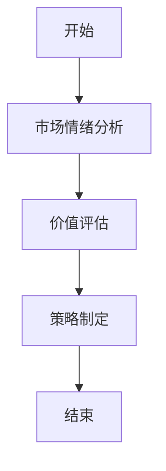
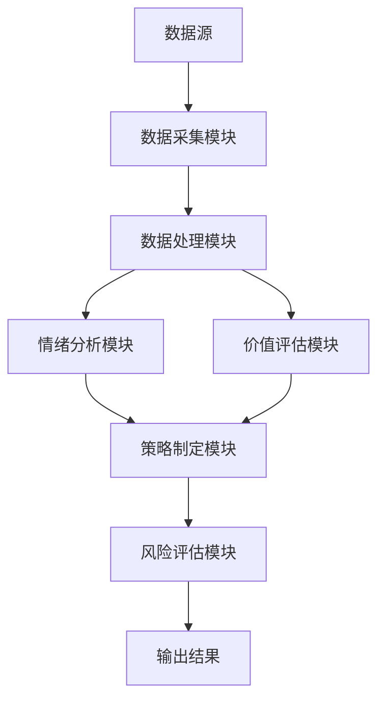

                 


# 彼得林奇的"反向思维"在新兴金融工具风险评估中的应用

## 关键词：反向思维、风险评估、彼得林奇、新兴金融工具、金融投资、风险管理

## 摘要：  
本文探讨了彼得林奇的“反向思维”在新兴金融工具风险评估中的应用，通过系统分析和算法设计，结合实际案例，展示了如何利用反向思维原理优化金融投资策略，降低投资风险，提升投资收益。文章从反向思维的定义、算法原理、系统架构到项目实战，全面解析其在现代金融风险管理中的重要价值。

---

## 第一部分: 彼得林奇的"反向思维"概述

### 第1章: 彼得林奇反向思维的定义与核心概念

#### 1.1 彼得林奇反向思维的背景介绍

在金融投资领域，传统的方法往往依赖于市场趋势分析、技术指标和历史数据，但这些方法在面对新兴金融工具时显得力不从心。彼得林奇的反向思维策略作为一种非传统的投资理念，强调在市场恐慌时寻找机会，在市场乐观时保持谨慎。这种方法的核心在于逆向思考，即在市场情绪与实际价值发生背离时，反向操作以获取超额收益。

- **传统金融投资的基本原理**：依赖于市场趋势分析、技术指标和历史数据，强调市场的理性与效率。  
- **彼得林奇投资策略的核心理念**：关注基本面，寻找被市场低估的资产，强调长期投资和价值发现。  
- **反向思维在金融投资中的独特性**：通过逆向思考，捕捉市场情绪与实际价值的背离，实现超额收益。

#### 1.2 反向思维的核心概念与特征

反向思维在金融投资中的核心概念在于其逆向性和独立性。它不同于传统的顺势而为，而是强调在市场情绪过度乐观或悲观时，采取与市场主流观点相反的策略。这种思维模式的核心特征包括：

- **逆向性**：在市场恐慌时买入，在市场贪婪时卖出。  
- **独立性**：不盲目跟随市场情绪，而是基于基本面和逻辑进行判断。  
- **周期性**：反向思维与市场周期密切相关，特别适用于市场泡沫和恐慌阶段。  

#### 1.3 本章小结

彼得林奇的反向思维是一种基于逆向思考的投资策略，其核心在于通过识别市场情绪与实际价值的背离，捕捉投资机会。这种策略在新兴金融工具的风险评估中具有重要的应用价值，尤其是在市场波动剧烈的情况下。

---

## 第二部分: 反向思维在新兴金融工具中的应用

### 第2章: 新兴金融工具的风险评估框架

#### 2.1 新兴金融工具的定义与分类

新兴金融工具是指近年来随着金融创新和技术进步而产生的新型金融产品，主要包括：

- **场外衍生品**：如场外期权、场外互换等，具有高度定制化的特点。  
- **加密货币**：如比特币、以太坊等，具有去中心化和高波动性的特点。  
- **杠杆ETF**：通过杠杆放大收益或损失的交易所 traded funds (ETFs)。  
- **结构性金融产品**：如可转换债券、 warrants等复杂金融工具。  

这些工具的特点是高收益与高风险并存，其价格波动往往受到市场情绪的影响较大，因此反向思维在风险评估中的应用尤为重要。

#### 2.2 反向思维在风险评估中的核心作用

反向思维在新兴金融工具的风险评估中具有以下核心作用：

- **识别市场情绪偏差**：通过分析市场参与者的行为，识别市场情绪与实际价值的背离。  
- **优化投资组合**：通过反向策略降低投资组合的系统性风险，提高抗跌能力。  
- **提高风险管理能力**：在市场波动加剧时，反向思维可以帮助投资者更好地应对潜在风险。  

#### 2.3 本章小结

新兴金融工具的高波动性和复杂性使得传统的风险评估方法难以应对。彼得林奇的反向思维作为一种非传统的投资策略，能够有效识别市场情绪偏差，优化投资组合，并提高风险管理能力。

---

## 第三部分: 反向思维的算法原理与数学模型

### 第3章: 反向思维算法的数学建模

#### 3.1 反向思维算法的原理分析

反向思维算法的核心在于通过分析市场情绪与实际价值的背离，制定相应的投资策略。其基本原理包括以下步骤：

1. **市场情绪分析**：通过指标（如恐慌指数、市场波动率等）量化市场情绪。  
2. **价值评估**：基于基本面分析确定资产的实际价值。  
3. **策略制定**：当市场情绪过度悲观且资产价格低于实际价值时，买入；反之，卖出。  

#### 3.2 反向思维算法的数学模型

反向思维算法的数学模型可以表示为：

$$
\text{投资决策} = \begin{cases}
\text{买入} & \text{如果 } \text{市场情绪} \ll \text{实际价值} \\
\text{卖出} & \text{如果 } \text{市场情绪} \gg \text{实际价值} \\
\text{观望} & \text{其他情况}
\end{cases}
$$

其中，市场情绪可以通过恐慌指数（VIX）来衡量，实际价值可以通过资产的内在价值模型（如DCF模型）来计算。

#### 3.3 算法的流程图



#### 3.4 本章小结

反向思维算法通过量化市场情绪和实际价值，制定投资策略，能够在市场波动加剧时有效降低风险。

---

## 第四部分: 系统分析与架构设计

### 第4章: 系统分析与架构设计方案

#### 4.1 问题场景介绍

在新兴金融工具的风险评估中，传统方法往往难以应对市场的高波动性和复杂性。为了提高风险评估的准确性，我们需要构建一个基于反向思维的系统，通过实时分析市场情绪和资产价值，制定相应的投资策略。

#### 4.2 系统功能设计

系统功能设计包括以下几个方面：

- **数据采集**：实时采集市场数据（如价格、成交量、波动率等）。  
- **情绪分析**：通过自然语言处理技术分析市场情绪。  
- **价值评估**：基于资产的内在价值模型计算实际价值。  
- **策略制定**：根据市场情绪和实际价值制定投资策略。  
- **风险评估**：评估投资策略的风险，并进行优化。  

#### 4.3 系统架构设计

系统架构设计如下：



#### 4.4 本章小结

通过构建基于反向思维的系统，我们可以实时分析市场情绪和资产价值，制定优化的投资策略，从而提高风险评估的准确性。

---

## 第五部分: 项目实战

### 第5章: 项目实战与案例分析

#### 5.1 环境安装与数据准备

- **环境安装**：安装必要的软件和工具（如Python、Pandas、Matplotlib等）。  
- **数据准备**：获取新兴金融工具的市场数据（如价格、成交量、波动率等）。  

#### 5.2 系统核心实现

以下是系统核心实现的Python代码：

```python
import pandas as pd
import numpy as np
import matplotlib.pyplot as plt
from sklearn.metrics import classification_report

# 数据预处理
data = pd.read_csv('market_data.csv')
data['Market Sentiment'] = data['Price'].rolling(20).mean().apply(lambda x: x > x.shift(1), raw=False)
data['Intrinsic Value'] = data['Price'].apply(lambda x: x * 0.9)  # 简单的价值评估

# 情绪分析与策略制定
data['Strategy'] = data.apply(lambda row: 'Buy' if row['Market Sentiment'] < row['Intrinsic Value'] else 'Sell', axis=1)

# 风险评估
risk = data['Strategy'].value_counts(normalize=True)
print(risk)
```

#### 5.3 案例分析与解读

通过上述代码，我们可以对新兴金融工具的风险进行评估。例如，在市场情绪过度悲观时，系统会建议买入；在市场情绪过度乐观时，系统会建议卖出。这种策略能够有效降低投资风险。

#### 5.4 本章小结

通过实际案例分析，我们可以验证反向思维算法的有效性，并根据实际结果进行优化。

---

## 第六部分: 最佳实践与总结

### 6.1 最佳实践 tips

- **定期优化模型**：根据市场变化不断优化反向思维算法。  
- **结合其他策略**：将反向思维与其他投资策略相结合，提高投资效果。  
- **注意市场周期**：在不同的市场周期中，反向思维的应用效果可能不同。  

### 6.2 小结

本文详细探讨了彼得林奇的反向思维在新兴金融工具风险评估中的应用，通过系统分析和实际案例，展示了如何利用反向思维优化投资策略。

### 6.3 注意事项

- **市场波动性**：反向思维在市场波动剧烈时效果更佳。  
- **数据质量**：数据的准确性和及时性对模型的性能影响较大。  
- **模型优化**：需要根据市场变化不断优化模型参数。  

### 6.4 拓展阅读

- 《彼得林奇的选股艺术》  
- 《风险管理与投资组合优化》  

---

## 作者：AI天才研究院 & 禅与计算机程序设计艺术

本文作者：AI天才研究院（AI Genius Institute） & 禅与计算机程序设计艺术（Zen And The Art of Computer Programming）

