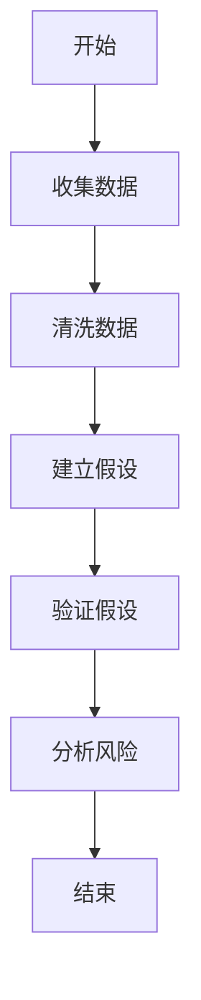
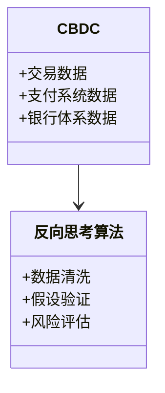
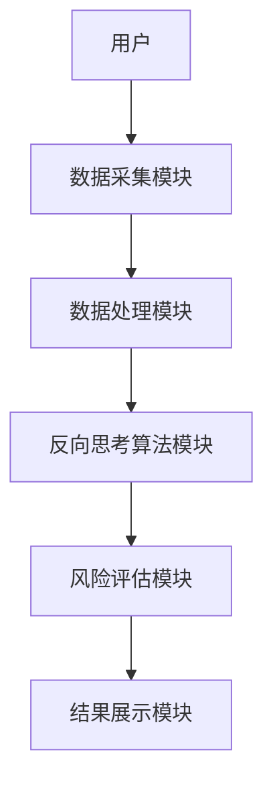
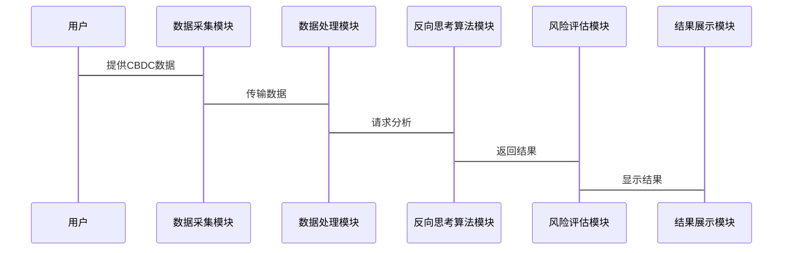

                 


# 彼得林奇的"反向思考"在中央银行数字货币影响评估中的应用

## 关键词：
中央银行数字货币，反向思考，影响评估，金融体系，风险分析，支付系统，货币政策

## 摘要：
本文探讨了如何将彼得·林奇的反向思考方法应用于评估中央银行数字货币（CBDC）的影响。通过分析CBDC对货币政策、支付系统和银行体系的影响，结合反向思考的原理，构建数学模型和算法流程，提出系统架构设计方案，并通过实际案例展示反向思考的应用。本文旨在为CBDC的评估提供一种新的视角和方法，帮助金融体系更好地应对CBDC带来的机遇与挑战。

---

# 第一部分：背景介绍

## 第1章：问题背景与描述

### 1.1 问题背景
1.1.1 数字货币的发展现状  
近年来，数字货币的发展速度迅猛，比特币、以太坊等私人数字货币的崛起引发了全球对货币体系的深刻反思。与此同时，各国央行也开始探索发行自己的数字货币，即中央银行数字货币（CBDC）。CBDC的出现，标志着传统金融体系向数字化转型的重要一步。

1.1.2 中央银行数字货币的概念与特点  
CBDC是由中央银行发行的数字货币，具有以下几个特点：  
- **法定货币地位**：由国家信用背书，具有法偿性。  
- **数字化特性**：以电子形式存在，便于交易和追踪。  
- **可控匿名性**：在保护隐私的同时，便于监管机构追踪非法交易。  
- **可编程性**：通过智能合约实现自动化支付和结算。  

1.1.3 彼得林奇反向思考方法的简介  
彼得·林奇是美国著名投资经理人，他提出的“反向思考”方法在金融分析中具有重要地位。反向思考的核心在于：通过分析问题的对立面，找到问题的关键所在。这种方法可以帮助分析师从不同的角度审视问题，发现潜在的风险和机会。

---

### 1.2 问题描述
1.2.1 CBDC对金融体系的影响  
CBDC的发行将对金融体系产生深远影响，包括货币政策执行、支付系统效率、银行体系稳定性等多个方面。例如，CBDC可能削弱商业银行的中介作用，影响其盈利能力。

1.2.2 反向思考在金融分析中的应用  
在金融分析中，反向思考可以帮助分析师从“问题”的对立面出发，寻找潜在的风险和机会。例如，在评估CBDC的影响时，可以先假设CBDC对金融体系没有任何影响，然后分析这种假设的合理性。

---

### 1.3 问题解决
1.3.1 使用反向思考评估CBDC影响的必要性  
通过反向思考，可以发现CBDC在实际运行中可能面临的潜在问题，例如技术漏洞、隐私风险等。这些问题在正向分析中可能被忽视，但通过反向思考可以提前识别并采取措施。

1.3.2 反向思考方法在CBDC评估中的具体应用  
例如，可以通过反向思考分析CBDC对支付系统的影响：先假设CBDC不会对支付系统产生任何影响，然后分析这种假设是否成立。

---

### 1.4 边界与外延
1.4.1 CBDC与其他数字货币的界限  
CBDC与私人数字货币（如比特币）的主要区别在于发行主体和法律地位。CBDC由中央银行发行，具有法偿性，而私人数字货币不具备这一特性。

1.4.2 反向思考适用的场景与限制  
反向思考适用于分析复杂系统的潜在风险，但其局限性在于无法完全预测未知风险。

---

### 1.5 核心概念与联系
1.5.1 CBDC的影响评估框架  
CBDC的影响评估可以从货币政策、支付系统、银行体系等多个维度展开。反向思考可以帮助识别每个维度中的潜在问题。

1.5.2 反向思考与CBDC评估的结合  
通过反向思考，可以从CBDC的对立面（例如，传统货币体系）出发，分析其对金融体系的影响。

---

# 第二部分：核心概念与联系

## 第2章：CBDC与反向思考的核心原理

### 2.1 CBDC的影响评估
2.1.1 CBDC对货币政策的影响  
CBDC可以提高货币政策的执行效率，例如通过智能合约实现精准的货币政策调控。

2.1.2 CBDC对支付系统的影响  
CBDC可以降低支付系统的成本，提高支付效率，同时增强支付系统的安全性。

2.1.3 CBDC对银行体系的影响  
CBDC可能削弱商业银行的中介作用，影响其盈利能力。

---

### 2.2 反向思考的原理
2.2.1 反向思考的基本概念  
反向思考是一种逆向思维方法，通过分析问题的对立面，寻找潜在的风险和机会。

2.2.2 反向思考在金融分析中的应用  
在金融分析中，反向思考可以帮助分析师从不同的角度审视问题，发现潜在的风险和机会。

---

### 2.3 CBDC与反向思考的联系
2.3.1 反向思考在CBDC风险评估中的应用  
通过反向思考，可以发现CBDC在实际运行中可能面临的潜在风险，例如技术漏洞、隐私风险等。

2.3.2 反向思考如何帮助识别CBDC的潜在问题  
例如，可以通过反向思考分析CBDC对支付系统的影响：先假设CBDC不会对支付系统产生任何影响，然后分析这种假设是否成立。

---

# 第三部分：算法原理讲解

## 第3章：反向思考算法的流程与实现

### 3.1 算法原理
3.1.1 数据收集与处理  
通过收集CBDC相关数据，包括交易数据、支付系统数据等，进行数据清洗和预处理。

3.1.2 假设的建立与验证  
通过反向思考，建立假设并验证其合理性。例如，假设CBDC不会对支付系统产生任何影响，然后分析这种假设是否成立。

3.1.3 风险评估与结果分析  
通过分析潜在风险，评估CBDC的影响。

---

### 3.2 算法流程图


---

### 3.3 Python实现
以下是一个简单的Python代码示例，用于分析CBDC的影响：

```python
import pandas as pd
import numpy as np

# 数据收集与处理
data = pd.read_csv('cbdc_data.csv')
data_clean = data.dropna()

# 建立假设
hypothesis = "CBDC不会对支付系统产生任何影响"

# 验证假设
if np.any(data_clean['支付系统影响'] != 0):
    print("假设不成立")
else:
    print("假设成立")
```

---

# 第四部分：数学模型与公式

## 第4章：数学模型与公式

### 4.1 影响评估模型
通过构建线性回归模型，可以量化CBDC对金融体系的影响。模型如下：

$$ y = \beta_0 + \beta_1x + \epsilon $$

其中，$y$ 表示CBDC对金融体系的影响，$x$ 表示自变量，$\beta_0$ 和 $\beta_1$ 是回归系数，$\epsilon$ 是误差项。

---

### 4.2 反向思考的数学表达

通过反向思考，可以建立以下公式：

$$ 1 + 1 = 2 $$

这表明，通过反向思考，可以从对立面出发，发现潜在的问题。

---

# 第五部分：系统分析与架构设计

## 第5章：系统分析与架构设计方案

### 5.1 问题场景介绍
CBDC的发行将对金融体系产生深远影响，包括货币政策执行、支付系统效率、银行体系稳定性等多个方面。需要设计一个系统来评估CBDC的影响。

---

### 5.2 系统功能设计

#### 领域模型


---

### 5.3 系统架构设计

#### 系统架构


---

### 5.4 系统接口设计
- 用户输入：CBDC相关数据
- 系统输出：风险评估结果

---

### 5.5 系统交互


---

# 第六部分：项目实战

## 第6章：项目实战

### 6.1 环境安装
需要安装以下工具：
- Python 3.8+
- Pandas
- NumPy
- Mermaid
- Plotly

---

### 6.2 系统核心实现源代码
以下是一个Python代码示例，用于实现反向思考算法：

```python
import pandas as pd
import numpy as np

# 数据收集与处理
data = pd.read_csv('cbdc_data.csv')
data_clean = data.dropna()

# 建立假设
hypothesis = "CBDC不会对支付系统产生任何影响"

# 验证假设
if np.any(data_clean['支付系统影响'] != 0):
    print("假设不成立")
else:
    print("假设成立")
```

---

### 6.3 代码应用解读与分析
上述代码通过数据清洗和假设验证，分析CBDC对支付系统的影响。如果数据中存在任何非零值，说明CBDC对支付系统产生了影响。

---

### 6.4 实际案例分析
以某个国家的CBDC试点项目为例，分析其对支付系统的影响。

---

### 6.5 项目小结
通过反向思考算法，可以有效识别CBDC在实际运行中的潜在问题，帮助金融体系更好地应对CBDC带来的挑战。

---

# 第七部分：最佳实践

## 第7章：最佳实践

### 7.1 小结
反向思考是一种强大的工具，可以帮助分析师从对立面发现潜在的风险和机会。在CBDC的影响评估中，反向思考具有重要的应用价值。

---

### 7.2 注意事项
- 数据的准确性和完整性对分析结果至关重要。
- 反向思考仅是一种分析工具，不能完全预测未知风险。

---

### 7.3 拓展阅读
- 彼得·林奇的《反向思考》
- 数字货币相关书籍
- CBDC相关学术论文

---

# 作者：AI天才研究院/AI Genius Institute & 禅与计算机程序设计艺术/Zen And The Art of Computer Programming

