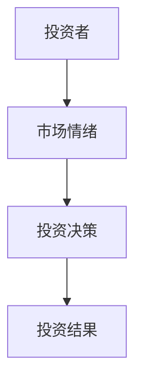
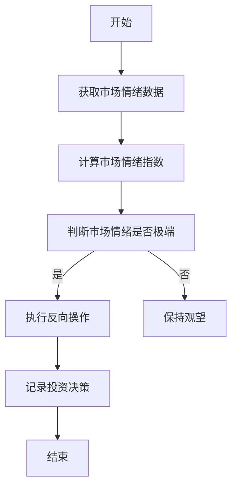

                 


# 彼得林奇的"反向思考"投资方法

**关键词**：彼得林奇、反向思考、投资方法、算法原理、系统架构、Python代码

**摘要**：本文详细介绍了彼得林奇的"反向思考"投资方法，从其核心理念、算法原理到系统架构设计，再到实际案例分析，全面解析了如何在投资领域运用反向思维。文章结合技术语言，通过mermaid流程图、Python代码和数学公式，深入阐述了反向思考的投资策略，并展示了如何将该方法应用于实际投资系统中。

---

# 第一部分：彼得林奇的"反向思考"投资方法概述

## 第1章：反向思考的起源与背景

### 1.1 投资领域的逆向思维

#### 1.1.1 传统投资思维的局限性
传统投资方法往往依赖于市场趋势和历史数据，但市场情绪的非理性波动常常导致投资决策的失误。传统的基于均值回归的投资策略忽略了市场情绪的极端性，容易在市场恐慌或过度乐观时犯错。

#### 1.1.2 逆向思维在投资中的价值
逆向思维的核心在于“买别人恐慌，卖别人贪婪”。通过分析市场情绪的极端性，投资者可以在市场底部买入，在市场顶部卖出，从而在市场波动中获利。

#### 1.1.3 彼得林奇与反向思考的结合
彼得林奇作为全球著名投资经理，其成功的投资策略离不开对市场情绪的深刻理解。他通过反向思考，在市场低迷时寻找被低估的股票，在市场繁荣时避免过度投资。

### 1.2 彼得林奇的投资理念

#### 1.2.1 彼得林奇的生平简介
彼得·林奇是富达投资集团的传奇经理人，管理着麦哲伦基金，创造了辉煌的投资业绩。他的成功不仅在于对市场的深刻理解，更在于他对投资理念的坚持。

#### 1.2.2 彼得林奇的投资哲学
彼得林奇强调长期投资和价值发现。他认为，市场短期波动无法预测，但长期趋势可以通过基本面分析来把握。反向思考是他在市场底部发现价值的利器。

#### 1.2.3 反向思考在彼得林奇投资策略中的地位
反向思考是彼得林奇策略的核心。他通过分析市场情绪，判断市场是否处于极端状态，并在此时进行反向操作。

### 1.3 反向思考的核心要素

#### 1.3.1 市场情绪与投资决策的关系
市场情绪是反向思考的核心。当市场情绪极度悲观时，可能是买入的好时机；当市场情绪极度乐观时，可能是卖出的信号。

#### 1.3.2 逆向思维的逻辑框架
逆向思维的逻辑框架包括市场情绪分析、市场周期判断和投资决策制定三个步骤。

#### 1.3.3 反向思考与价值投资的结合
反向思考与价值投资的结合使彼得林奇能够在市场底部发现优质股票，实现长期收益。

### 1.4 本章小结
本章介绍了反向思考的起源、彼得林奇的投资理念以及反向思考的核心要素。通过分析市场情绪和投资周期，反向思考为投资者提供了在市场波动中获利的独特方法。

---

## 第2章：反向思考的核心概念与联系

### 2.1 反向思考的原理

#### 2.1.1 投资市场的非理性特征
市场参与者的情绪波动导致市场的非理性。当市场情绪过于乐观时，股票价格可能被高估；当市场情绪过于悲观时，股票价格可能被低估。

#### 2.1.2 逆向思维的逻辑模型
逆向思维的逻辑模型包括市场情绪分析、市场周期判断和投资决策制定三个步骤。

#### 2.1.3 市场情绪周期与投资机会的关系
市场情绪周期分为四个阶段：乐观、狂热、恐慌和底部。投资者需要在市场情绪处于狂热或恐慌阶段时进行反向操作。

### 2.2 反向思考与传统投资方法的对比

#### 2.2.1 价值投资与反向思考的异同
价值投资注重基本面分析，而反向思考注重市场情绪分析。两者都强调长期投资，但侧重点不同。

#### 2.2.2 技术分析与反向思考的结合
技术分析提供了市场情绪的量化指标，如RSI（相对强度指数）和MACD（移动平均收敛散度）。反向思考可以通过技术指标判断市场情绪是否极端。

#### 2.2.3 风险控制在反向思考中的应用
反向思考强调风险控制，投资者应在市场情绪极端时进行操作，并设置止损点以规避风险。

### 2.3 反向思考的核心要素对比表格

| 核心要素 | 价值投资 | 反向思考 |
|----------|-----------|-----------|
| 投资目标 | 长期收益 | 市场波动收益 |
| 分析重点 | 基本面分析 | 市场情绪分析 |
| 操作时机 | 市场平稳时 | 市场情绪极端时 |

### 2.4 反向思考的ER实体关系图


### 2.5 本章小结
本章通过对比分析，展示了反向思考与传统投资方法的异同，并通过表格和图表直观地呈现了反向思考的核心要素。

---

## 第3章：反向思考的算法原理

### 3.1 算法原理概述

#### 3.1.1 算法的输入与输出
输入：市场情绪数据、股票价格数据  
输出：投资决策（买入、卖出或持有）

#### 3.1.2 算法的逻辑流程
1. 数据采集：获取市场情绪指标（如RSI、MACD）和股票价格数据。
2. 数据分析：判断市场情绪是否处于极端状态。
3. 投资决策：根据市场情绪判断是否进行反向操作。

#### 3.1.3 算法的数学模型
市场情绪指数计算公式：
$$ \text{市场情绪指数} = \frac{\text{RSI} + \text{MACD}}{2} $$

### 3.2 算法流程图


### 3.3 算法实现代码

#### 3.3.1 Python代码示例
```python
import pandas as pd
import numpy as np

def calculate_market_sentiment(rs

