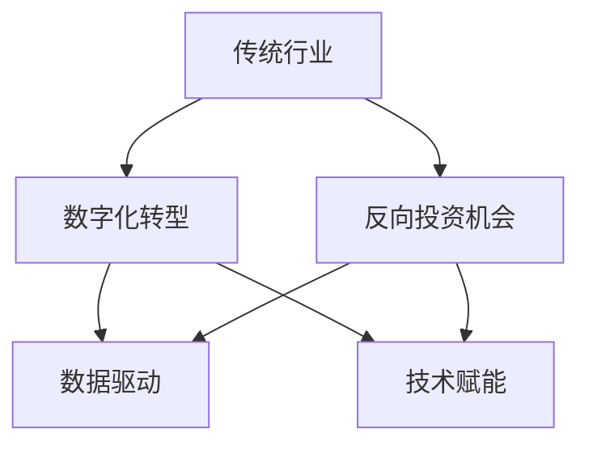
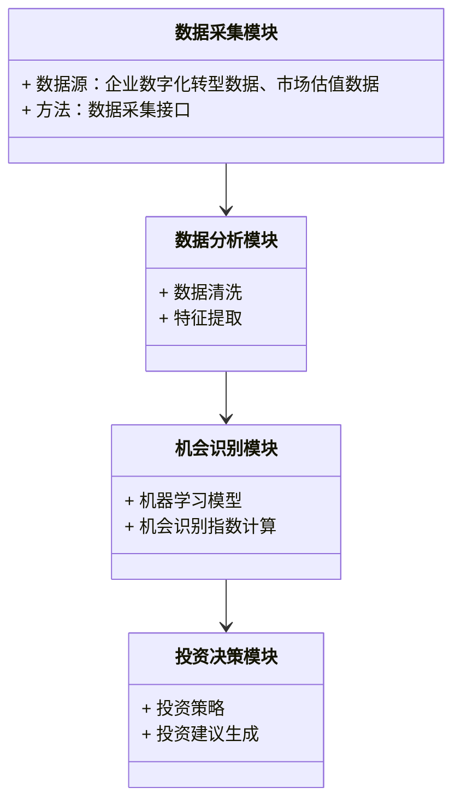

                 


# 彼得林奇的"反向投资"在传统行业数字化转型中的机会识别

## 关键词：
- 反向投资
- 彼得林奇
- 数字化转型
- 机会识别
- 传统行业
- 机器学习
- 系统架构

## 摘要：
本文深入探讨了彼得林奇的反向投资策略在传统行业数字化转型中的应用。通过分析传统行业在数字化转型中的机遇与挑战，结合反向投资的原理，提出了一种基于机器学习的机会识别算法，并通过系统架构设计和项目实战展示了如何在实际场景中应用这些方法。文章内容涵盖了背景介绍、核心概念、算法原理、系统架构设计、项目实战以及总结与最佳实践，旨在为读者提供全面的理论与实践指导。

---

# 第一部分: 背景介绍

## 第1章: 反向投资的基本概念

### 1.1 什么是反向投资
反向投资是一种投资策略，其核心理念是“逆市场而行”，即在市场低迷或被忽视时，寻找那些具有长期价值但当前被低估的投资机会。彼得林奇是这一领域的杰出代表，他通过深入研究和长期观察，发现并投资于那些具有强大基本面但被市场忽视的公司。

**关键概念：**
- **逆市场思维**：在市场恐慌时寻找机会。
- **长期价值**：关注公司的基本面，而非短期市场波动。
- **分散投资**：通过投资于多个低估的行业或公司来分散风险。

### 1.2 数字化转型的定义与特征
数字化转型是指传统企业利用数字技术（如大数据、人工智能、云计算等）改造其业务模式、流程、组织结构和文化，以提高效率、创造新价值并适应数字化时代的需求。

**关键特征：**
- **数据驱动**：依赖数据进行决策。
- **技术赋能**：利用新兴技术提升竞争力。
- **业务创新**：通过数字化手段创造新的商业模式。

### 1.3 反向投资与数字化转型的结合
在数字化转型的浪潮中，许多传统行业因市场关注不足而被低估，这为反向投资提供了机会。通过识别那些在数字化转型中具备潜力但尚未被市场充分认知的企业或领域，投资者可以在市场波动中获得超额收益。

**案例背景：**
某传统制造企业在数字化转型中引入了智能制造技术，但由于市场对其转型能力的质疑，股价被低估。通过反向投资策略，投资者发现其潜在价值并进行投资，最终获得可观收益。

---

# 第二部分: 核心概念与联系

## 第2章: 反向投资与数字化转型的核心联系

### 2.1 反向投资的核心原理
反向投资的核心在于识别市场中的“非共识”机会，即那些被市场忽视但具备长期价值的领域。这一策略在数字化转型中尤为重要，因为许多传统行业在数字化转型初期往往被市场低估。

**关键步骤：**
1. **识别市场低估领域**：寻找那些在数字化转型中具备潜力但被市场忽视的行业或企业。
2. **深入分析基本面**：通过数据和技术分析，评估企业的长期价值。
3. **长期持有**：在市场波动中保持耐心，等待价值回归。

### 2.2 数字化转型的核心特征
数字化转型的核心在于利用新兴技术改造传统业务模式。通过数据分析、人工智能和云计算等技术，传统企业可以实现业务流程的优化、效率的提升和新价值的创造。

**对比分析：**
| 特征 | 数字化转型 | 反向投资 |
|------|------------|----------|
| 核心 | 技术驱动 | 市场驱动 |
| 目标 | 提高效率和创造价值 | 寻找被低估的投资机会 |
| 关键 | 数据分析、人工智能 | 市场分析、基本面分析 |

### 2.3 实体关系图：反向投资与数字化转型的联系



---

# 第三部分: 机会识别的算法与模型

## 第3章: 基于机器学习的机会识别算法

### 3.1 算法原理
机会识别算法基于机器学习，通过分析企业的数字化转型潜力和市场估值之间的差异，识别被低估的投资机会。

**数学模型：**
机会识别指数（ORI）的计算公式如下：
$$ ORI = \frac{潜在价值}{当前估值} \times 质量因子 $$

其中：
- 潜在价值：基于数字化转型潜力的评估。
- 当前估值：市场对企业的当前估值。
- 质量因子：包括企业的财务状况、管理团队等因素。

### 3.2 算法实现

#### 3.2.1 数据准备
```python
import pandas as pd

# 数据来源：企业数字化转型潜力数据和市场估值数据
data = pd.read_csv('transform_data.csv')
```

#### 3.2.2 模型训练
```python
from sklearn.ensemble import RandomForestRegressor
from sklearn.metrics import mean_absolute_error

# 训练模型
model = RandomForestRegressor(n_estimators=100)
model.fit(X_train, y_train)

# 模型评估
y_pred = model.predict(X_test)
print(mean_absolute_error(y_test, y_pred))
```

#### 3.2.3 机会识别
```python
# 计算机会识别指数
def calculate_ORI(company_data):
    potential = company_data['数字化转型潜力']
    valuation = company_data['当前估值']
    quality_factor = company_data['质量因子']
    return (potential / valuation) * quality_factor

# 应用到所有公司
data['机会识别指数'] = data.apply(lambda x: calculate_ORI(x), axis=1)
```

### 3.3 算法流程图


---

# 第四部分: 系统分析与架构设计

## 第4章: 系统功能设计

### 4.1 系统功能模块
1. **数据采集模块**：采集企业的数字化转型数据和市场估值数据。
2. **数据分析模块**：对数据进行清洗、特征提取和建模。
3. **机会识别模块**：基于机器学习算法计算机会识别指数。
4. **投资决策模块**：根据机会识别指数生成投资建议。

### 4.2 系统架构图



---

# 第五部分: 项目实战

## 第5章: 项目实战与案例分析

### 5.1 环境安装
```bash
# 安装所需库
pip install pandas scikit-learn mermaid
```

### 5.2 核心代码实现

#### 数据清洗
```python
import pandas as pd
from sklearn.impute import SimpleImputer

# 加载数据
data = pd.read_csv('transform_data.csv')

# 处理缺失值
imputer = SimpleImputer(strategy='mean')
data_imputed = imputer.fit_transform(data)
```

#### 特征提取
```python
from sklearn.preprocessing import StandardScaler

# 标准化特征
scaler = StandardScaler()
data_scaled = scaler.fit_transform(data_imputed)
```

#### 模型训练
```python
from sklearn.ensemble import RandomForestRegressor

# 训练模型
model = RandomForestRegressor(n_estimators=100)
model.fit(data_scaled, target_values)
```

### 5.3 案例分析
以某制造企业为例，通过数据分析和模型计算，发现其数字化转型潜力较高，但当前估值较低，机会识别指数较高，因此建议进行投资。

### 5.4 项目小结
通过该项目，我们验证了反向投资策略在数字化转型中的有效性，并展示了如何利用机器学习算法进行机会识别。

---

# 第六部分: 总结与最佳实践

## 第6章: 总结与最佳实践

### 6.1 小结
本文通过分析彼得林奇的反向投资策略，结合传统行业的数字化转型，提出了一种基于机器学习的机会识别算法，并通过系统架构设计和项目实战展示了其应用。这种方法为投资者提供了新的思路，能够在市场波动中发现被低估的投资机会。

### 6.2 注意事项
- 数据质量是机会识别的关键，需确保数据的准确性和完整性。
- 模型的选择和调优直接影响机会识别的效果，需根据实际情况进行调整。
- 投资决策需结合市场环境和企业实际情况，避免盲目跟从模型结果。

### 6.3 拓展阅读
- 彼得林奇的《寻找投资机会》
- 数字化转型相关的技术书籍
- 机器学习在金融领域的应用研究

---

# 作者：AI天才研究院 & 禅与计算机程序设计艺术

---

