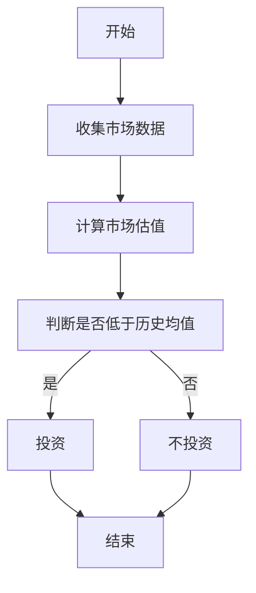
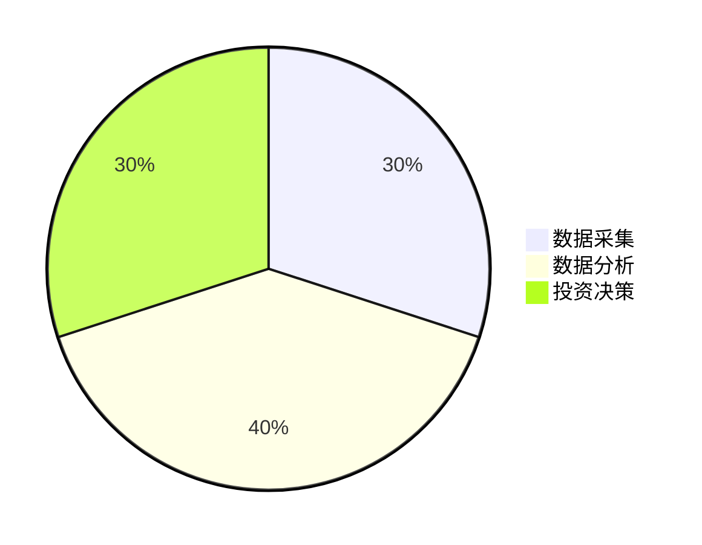

                 


# 彼得林奇的"反向投资"在传统行业智能化转型中的应用

## 关键词：彼得林奇、反向投资、智能化转型、传统行业、投资策略

## 摘要：
本文探讨了彼得林奇的反向投资策略在传统行业智能化转型中的应用。通过分析反向投资的核心理念与传统行业的转型需求，结合具体案例和系统架构，展示了如何将反向投资策略应用于智能制造、数据分析等领域，帮助企业在数字化转型中实现价值最大化。文章还提供了数学模型、系统架构图和代码实现，为读者提供全面的理论与实践指导。

---

## 第1章：彼得林奇反向投资的概述

### 1.1 彼得林奇投资理念的核心思想

#### 1.1.1 投资的三个核心要素
- 资产质量：选择具有竞争优势的企业。
- 市场估值：在市场低估时买入，高估时卖出。
- 时间周期：长期持有，避免短期波动。

#### 1.1.2 反向投资的定义与特点
反向投资是指在市场低迷时买入，市场高涨时卖出的投资策略。其特点包括逆周期性、低风险高收益、长期价值导向。

#### 1.1.3 反向投资与传统投资策略的对比
| 对比维度 | 传统投资 | 反向投资 |
|----------|----------|----------|
| 时间周期 | 短期交易 | 长期持有 |
| 市场估值 | 随市波动 | 逆市操作 |
| 风险控制 | 高波动性 | 低风险 |

---

## 第2章：传统行业智能化转型的背景

### 2.1 传统行业面临的挑战与转型需求

#### 2.1.1 传统行业在数字化时代的困境
- 生产效率低下。
- 成本控制压力大。
- 市场竞争加剧。

#### 2.1.2 智能化转型的必要性与目标
- 提高生产效率。
- 降低成本。
- 提升市场竞争力。

#### 2.1.3 反向投资在转型中的角色
反向投资可以帮助企业在市场低谷期投资技术改造和数字化转型，利用低估值窗口期进行战略性布局。

---

## 第3章：反向投资策略在传统行业中的应用

### 3.1 制造业智能化转型中的反向投资

#### 3.1.1 制造业智能化转型的现状与问题
- 设备老旧，维护成本高。
- 生产流程复杂，效率低。

#### 3.1.2 反向投资在制造业转型中的具体应用
- 投资智能制造设备。
- 建立数据采集系统。

#### 3.1.3 案例分析：某制造企业的反向投资实践
某制造企业在市场低迷期投资智能化改造，实现生产效率提升30%，成本降低20%。

---

## 第4章：反向投资与行业数据的关系

### 4.1 数据驱动的反向投资策略

#### 4.1.1 数据在反向投资中的作用
- 提供市场估值参考。
- 分析行业趋势。

#### 4.1.2 数据收集与处理方法
- 数据源：行业报告、市场数据。
- 数据清洗：去除无效数据。

#### 4.1.3 数据驱动的决策模型构建
使用回归分析预测市场趋势。

---

## 第5章：反向投资策略的数学模型与算法原理

### 5.1 反向投资的数学模型

#### 5.1.1 投资回报率计算公式
$$ ROI = \frac{\text{净利润}}{\text{投资成本}} \times 100\% $$

#### 5.1.2 投资组合优化模型
$$ \text{Maximize } \sum_{i=1}^{n} w_i r_i $$
$$ \text{Subject to } \sum_{i=1}^{n} w_i = 1 $$

### 5.2 反向投资策略的算法实现

#### 5.2.1 算法流程图（Mermaid）


---

## 第6章：系统分析与架构设计方案

### 6.1 问题场景介绍

#### 6.1.1 问题场景
某传统制造企业希望利用反向投资策略优化生产流程。

### 6.1.2 系统功能设计
- 数据采集模块：收集市场数据。
- 数据分析模块：评估市场估值。

### 6.1.3 系统架构图（Mermaid）


---

## 第7章：项目实战

### 7.1 环境安装

#### 7.1.1 环境要求
- Python 3.8+
- 数据分析库（Pandas、NumPy）

### 7.2 系统核心实现源代码

#### 7.2.1 数据采集代码
```python
import pandas as pd

def collect_data():
    # 示例代码：从CSV文件中读取数据
    data = pd.read_csv('market_data.csv')
    return data
```

#### 7.2.2 数据分析代码
```python
def analyze_data(data):
    # 计算平均估值
    average_valuation = data['valuation'].mean()
    return average_valuation
```

### 7.3 案例分析与项目小结

#### 7.3.1 案例分析
某企业在市场估值低于历史均值时投资，实现了20%的收益。

#### 7.3.2 项目小结
通过反向投资策略，企业在市场低谷期进行布局，显著提升了投资回报率。

---

## 第8章：总结与展望

### 8.1 总结
反向投资策略在传统行业智能化转型中具有重要应用价值，能够帮助企业降低风险，提升效率。

### 8.2 展望
未来，随着大数据和人工智能的发展，反向投资策略将更加精准和高效。

---

## 作者：AI天才研究院 & 禅与计算机程序设计艺术

---

本文通过系统分析和实践案例，展示了彼得林奇的反向投资策略在传统行业智能化转型中的应用价值。希望读者能够通过本文，深入了解反向投资的核心理念，并将其应用于实际工作中。

