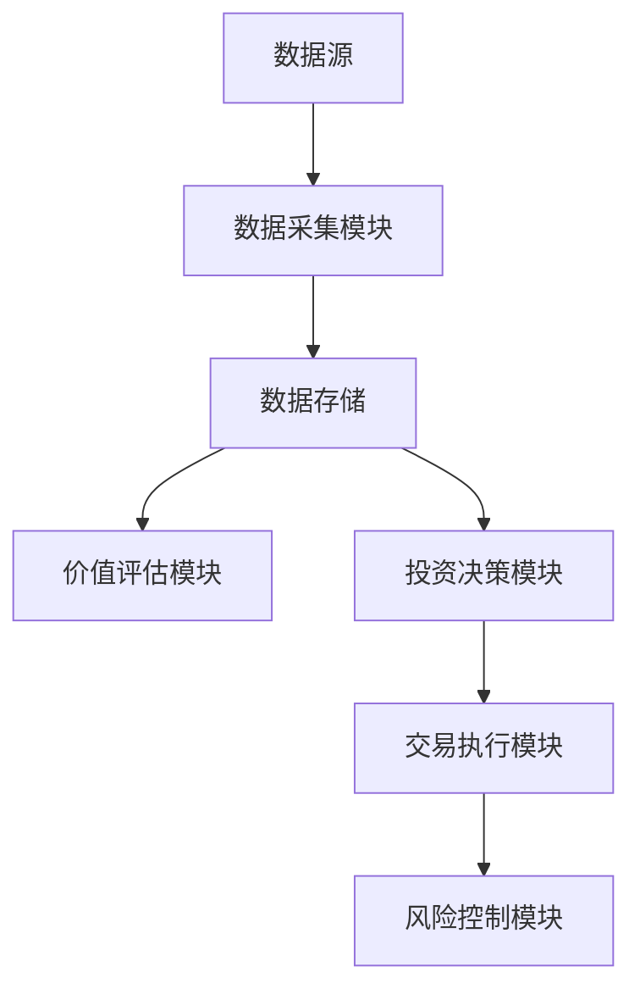

                 


# 彼得林奇的"反向投资"在传统行业转型中的应用

> 关键词：反向投资，彼得林奇，传统行业转型，数字化转型，投资策略

> 摘要：本文探讨了彼得林奇的反向投资策略在传统行业转型中的应用，通过理论分析、数学建模和实际案例，展示了如何利用反向投资帮助传统企业实现数字化转型，提升竞争力。

---

## 第1章: 反向投资的背景与核心概念

### 1.1 反向投资的定义与核心要素

#### 1.1.1 什么是反向投资
反向投资是指在市场低迷或被忽视时买入资产，在市场繁荣时卖出资产的一种投资策略。其核心在于逆市场情绪操作，寻找被低估的投资机会。

#### 1.1.2 反向投资的核心要素
- **市场周期**：识别市场周期波动，寻找低谷买入、高位卖出的机会。
- **价值评估**：基于基本面分析，识别资产的真实价值。
- **逆向思维**：与市场情绪相反，寻找市场忽视的机会。

#### 1.1.3 反向投资的边界与外延
反向投资并非适用于所有市场环境，需结合行业特点和市场环境灵活运用。

### 1.2 反向投资的理论基础

#### 1.2.1 彼得林奇的反向投资理论
彼得林奇强调长期投资和价值发现，认为市场短期波动不可预测，但长期趋势可以通过基本面分析把握。

#### 1.2.2 市场周期与反向投资的关系
市场周期分为复苏期、增长期、成熟期和衰退期，反向投资在衰退期和成熟期后期更具优势。

#### 1.2.3 反向投资与传统投资策略的对比
- **传统投资**：基于短期价格波动，技术分析为主。
- **反向投资**：基于长期价值，基本面分析为主。

### 1.3 传统行业转型的背景与挑战

#### 1.3.1 传统行业面临的转型压力
- 技术变革（如数字化、智能化）对传统行业冲击巨大。
- 消费者需求变化快，传统企业难以适应。

#### 1.3.2 数字化转型的核心问题
- 业务模式重构：从传统模式转向数字化运营。
- 组织结构优化：适应快速变化的市场需求。
- 数字化能力构建：引入新技术和数据驱动的决策方式。

#### 1.3.3 反向投资在转型中的作用
- 识别转型机会：在传统行业衰退期投资优质企业。
- 优化资源配置：利用反向投资策略优化企业资产配置。

---

## 第2章: 反向投资的理论框架与数学模型

### 2.1 反向投资的核心原理

#### 2.1.1 市场波动与投资机会
市场波动创造投资机会，反向投资通过逆周期操作获利。

#### 2.1.2 价值评估与市场定价
资产的真实价值与市场价格存在偏差，反向投资通过发现这种偏差获利。

#### 2.1.3 投资决策的逻辑框架
- **第一步**：分析市场周期，判断当前所处阶段。
- **第二步**：评估资产价值，寻找低估机会。
- **第三步**：制定投资计划，分阶段执行。

### 2.2 反向投资的数学模型

#### 2.2.1 市场周期模型
$$ P = f(t, s) $$
其中，$P$ 表示市场价格，$t$ 表示时间，$s$ 表示市场状态。

#### 2.2.2 价值评估模型
$$ V = \sum_{i=1}^{n} w_i \cdot v_i $$
其中，$V$ 表示企业价值，$w_i$ 表示第$i$个因素的权重，$v_i$ 表示第$i$个因素的价值贡献。

#### 2.2.3 投资决策模型
$$ D = \begin{cases} 
\text{买入} & \text{if } V > P \\
\text{卖出} & \text{if } V < P \\
\text{观望} & \text{otherwise}
\end{cases} $$

### 2.3 反向投资的策略选择

#### 2.3.1 基于价值的选股策略
- 筛选市盈率（P/E）低于行业平均水平的企业。
- 重点考察企业的盈利能力（ROE）和成长性（Revenue Growth）。

#### 2.3.2 基于市场的逆向操作
- 在市场恐慌时买入优质资产。
- 在市场狂热时逐步卖出。

#### 2.3.3 风险控制与仓位管理
- 设置止损点，避免重大损失。
- 分批建仓，降低市场波动影响。

---

## 第3章: 传统行业的现状与转型需求

### 3.1 传统行业面临的挑战

#### 3.1.1 技术变革对企业的影响
- 数字化转型要求企业引入新技术，如大数据、人工智能等。
- 传统企业的技术积累不足，转型难度大。

#### 3.1.2 消费者需求的变化
- 消费者行为向线上转移，传统渠道受冲击。
- 个性化需求增加，传统企业难以快速响应。

#### 3.1.3 竞争格局的改变
- 新兴企业利用新技术快速崛起。
- 跨界竞争加剧，传统企业面临更大压力。

### 3.2 传统行业转型的核心问题

#### 3.2.1 业务模式的重构
- 从单纯生产转向提供服务。
- 从线下渠道转向线上线下融合。

#### 3.2.2 组织结构的优化
- 建立灵活的组织架构，快速响应市场变化。
- 引入敏捷开发模式，提升创新能力。

#### 3.2.3 数字化能力的建设
- 建设数据中台，整合企业数据资源。
- 引入智能化工具，提升运营效率。

### 3.3 反向投资在传统行业转型中的应用

#### 3.3.1 识别转型机会
- 在传统行业衰退期寻找具备转型潜力的企业。
- 关注管理层素质，选择具有转型能力的企业。

#### 3.3.2 评估转型风险
- 评估企业转型的可行性，包括资金、技术、人才等因素。
- 分析行业竞争格局，判断转型成功的可能性。

#### 3.3.3 制定投资策略
- 分阶段投资，逐步增加仓位。
- 在转型初期低价买入，待企业成功转型后卖出。

---

## 第4章: 反向投资策略在传统行业中的应用

### 4.1 反向投资的行业选择

#### 4.1.1 行业分析与筛选
- 选择市场规模大、竞争充分的行业。
- 重点关注行业周期处于低谷的行业。

#### 4.1.2 企业基本面评估
- 分析企业的盈利能力、成长性和财务状况。
- 关注企业管理层的素质和战略规划。

#### 4.1.3 市场情绪与估值分析
- 通过市场情绪指标判断投资机会。
- 对比市盈率、市净率等估值指标，寻找低估企业。

### 4.2 反向投资的实施步骤

#### 4.2.1 确定投资目标
- 明确投资目标行业和企业。
- 制定详细的投资计划。

#### 4.2.2 制定投资计划
- 分阶段执行投资计划，避免一次性投入过大。
- 根据市场变化动态调整投资策略。

#### 4.2.3 监控与调整
- 定期评估投资组合表现。
- 根据市场变化及时调整投资策略。

### 4.3 反向投资的风险管理

#### 4.3.1 风险识别与评估
- 识别市场风险、企业风险和操作风险。
- 评估各类风险的影响程度。

#### 4.3.2 风险控制措施
- 设置止损点，控制单个投资的风险敞口。
- 分散投资，降低组合风险。

#### 4.3.3 风险应对策略
- 在市场下跌时增加仓位，利用反向投资策略应对市场风险。
- 在市场上涨时逐步减仓，锁定利润。

---

## 第5章: 实际案例分析

### 5.1 案例背景介绍

#### 5.1.1 行业选择
- 选择制造业中的传统制造企业作为案例。

#### 5.1.2 企业基本情况
- 企业成立于1990年，主要生产传统机械产品。
- 由于行业竞争加剧，企业近年来利润下滑。

#### 5.1.3 转型需求
- 企业希望通过数字化转型提升竞争力。
- 引入智能制造技术，优化生产流程。

### 5.2 反向投资策略实施

#### 5.2.1 市场分析
- 制造业处于周期性低谷，企业估值被低估。
- 企业具备转型潜力，管理层积极寻求变革。

#### 5.2.2 投资决策
- 在市场低迷时买入企业股票。
- 分阶段增加仓位，逐步提高持股比例。

#### 5.2.3 转型实施
- 企业引入大数据技术，优化生产流程。
- 与科技公司合作，开发智能化生产设备。

### 5.3 投资效果评估

#### 5.3.1 股价表现
- 在市场复苏时，企业股价上涨，投资收益显著。

#### 5.3.2 企业绩效
- 生产效率提升，成本降低，利润增长。
- 市场竞争力增强，客户满意度提高。

#### 5.3.3 投资回报
- 投资回报率远超行业平均水平，证明反向投资策略的有效性。

---

## 第6章: 系统架构与技术实现

### 6.1 系统架构设计

#### 6.1.1 系统功能模块
- 数据采集模块：收集市场数据和企业信息。
- 价值评估模块：基于数学模型评估企业价值。
- 投资决策模块：根据评估结果制定投资策略。
- 风险控制模块：监控投资组合，调整风险敞口。

#### 6.1.2 系统架构图


### 6.2 系统实现

#### 6.2.1 数据采集模块
- 使用Python的`pandas`库处理市场数据。
- 通过API接口获取企业财务数据。

#### 6.2.2 价值评估模块
- 使用`numpy`进行数值计算。
- 基于价值评估模型计算企业价值。

#### 6.2.3 投资决策模块
- 根据市场周期和企业价值制定投资策略。
- 输出投资建议和交易信号。

#### 6.2.4 风险控制模块
- 监控投资组合的波动性。
- 根据市场变化动态调整投资策略。

### 6.3 技术实现示例

#### 6.3.1 价值评估代码
```python
import pandas as pd
import numpy as np

def calculate_value(fundamentals):
    # 假设fundamentals是一个包含企业基本面数据的DataFrame
    # 计算市盈率
    pe_ratio = fundamentals['profit'] / fundamentals['price']
    # 计算市净率
    pb_ratio = fundamentals['book_value'] / fundamentals['price']
    # 综合评估价值
    value = pd.Series({
        'PE Ratio': pe_ratio,
        'PB Ratio': pb_ratio
    })
    return value

# 示例数据
data = {
    'profit': [100, 200, 300],
    'book_value': [500, 600, 700],
    'price': [10, 15, 20]
}
df = pd.DataFrame(data)
value = calculate_value(df)
print(value)
```

#### 6.3.2 投资决策代码
```python
def investment_strategy(value, market_cycle):
    if value['PE Ratio'] < industry_pe and value['PB Ratio'] < industry_pb:
        return 'Buy'
    elif market_cycle == 'Peak':
        return 'Sell'
    else:
        return 'Hold'

# 示例数据
industry_pe = 15
industry_pb = 2.5
value = {'PE Ratio': 12, 'PB Ratio': 2}
market_cycle = 'Growth'

decision = investment_strategy(value, market_cycle)
print(decision)
```

---

## 第7章: 总结与展望

### 7.1 总结

#### 7.1.1 核心观点回顾
- 反向投资是一种有效的投资策略，尤其适用于传统行业转型。
- 通过基本面分析和市场周期判断，可以在传统行业转型中找到投资机会。

#### 7.1.2 实践价值
- 反向投资策略可以帮助投资者在传统行业转型中获利。
- 通过系统化的分析和风险管理，提高投资成功的概率。

### 7.2 展望

#### 7.2.1 未来趋势
- 数字化转型将继续推动传统行业变革。
- 反向投资策略将更加依赖于数据分析和人工智能技术。

#### 7.2.2 投资者建议
- 保持对市场的敏感性，及时捕捉投资机会。
- 加强对企业的基本面研究，提高投资决策的准确性。

#### 7.2.3 持续学习
- 关注行业动态，了解新技术和新趋势。
- 不断优化投资策略，适应市场变化。

---

## 附录: 参考文献与工具

### 附录A: 参考文献
1. 彼得林奇. 《彼得林奇投资哲学》
2. 哈佛商学院. 《企业转型与创新》
3. 格雷厄姆. 《投资学原理》

### 附录B: 工具推荐
1. 数据分析工具：Python、R
2. 估值模型：Finnovate、Morningstar
3. 交易执行工具：Interactive Brokers、Robinhood

---

## 作者：AI天才研究院 & 禅与计算机程序设计艺术

本文由AI天才研究院与禅与计算机程序设计艺术联合撰写，转载请注明出处。

