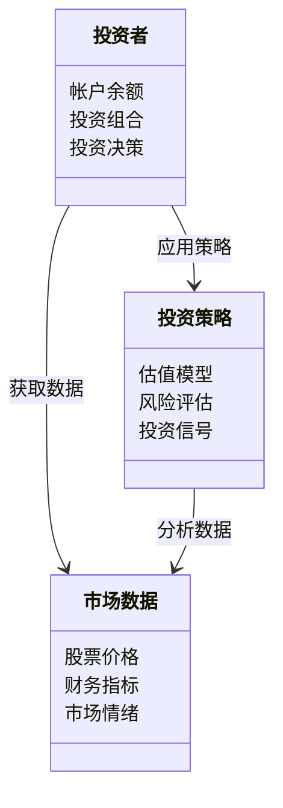
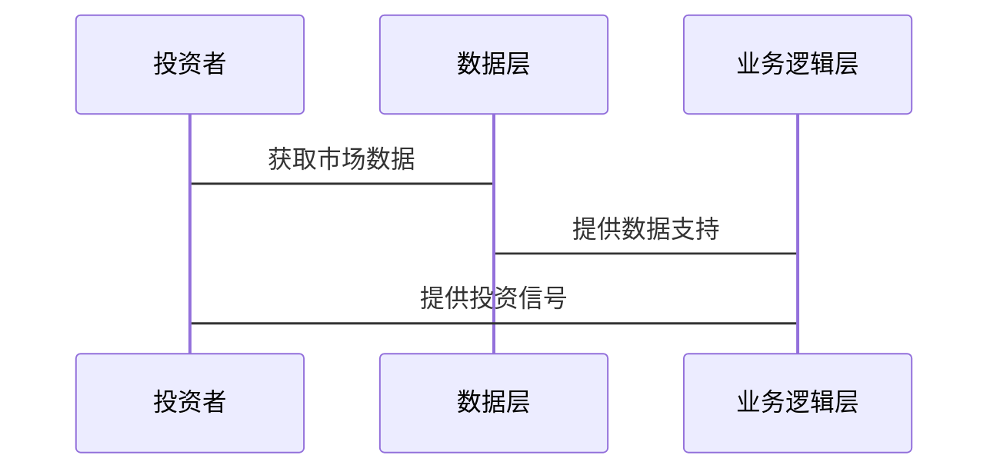

                 


# 彼得林奇的"反向投资"成功案例

## 关键词：反向投资，彼得林奇，投资策略，价值投资，市场周期

## 摘要：本文深入分析了彼得林奇的反向投资策略，探讨了其背后的数学原理、系统架构及实际案例，提供了从理论到实践的全面解读。

---

# 第五章: 反向投资的系统分析与架构设计

## 第5章: 系统分析与架构设计

### 5.1 问题场景介绍

#### 5.1.1 投资者面临的挑战
- 市场波动性
- 信息不对称
- 心理偏差

### 5.2 项目介绍

#### 5.2.1 项目目标
- 构建反向投资决策支持系统
- 提供数据驱动的投资建议

### 5.3 系统功能设计

#### 5.3.1 领域模型（Mermaid 类图）


### 5.4 系统架构设计

#### 5.4.1 架构设计（Mermaid 架构图）
```mermaid
container 数据层 {
    数据库
    API接口
}
container 业务逻辑层 {
    估值模型
    风险评估
}
container 表现层 {
    投资者界面
    数据可视化
}
```

### 5.5 系统接口设计

#### 5.5.1 接口描述
- 数据接口：从市场数据源获取实时数据
- 策略接口：应用估值模型和风险评估

### 5.6 系统交互设计

#### 5.6.1 交互流程（Mermaid 序列图）


---

# 第六章: 反向投资的项目实战

## 第6章: 项目实战

### 6.1 案例分析

#### 6.1.1 案例背景
- 1987年股灾后市场低迷
- 投资者恐慌情绪弥漫

#### 6.1.2 投资决策过程
- 数据分析：评估企业基本面
- 市场情绪分析：识别市场底部
- 投资组合构建：分散投资降低风险

#### 6.1.3 投资组合优化
- 选择低估股票
- 定期再平衡
- 风险控制

### 6.2 代码实现

#### 6.2.1 数据获取与清洗
```python
import pandas as pd

# 获取数据
df = pd.read_csv('market_data.csv')

# 清洗数据
df.dropna(inplace=True)
df = df[df['市盈率'] < 15]  # 示例条件
```

#### 6.2.2 估值模型应用
```python
def calculate_fair_value(company_data):
    # 市盈率法
    fair_value = company_data['股价'] * company_data['市盈率']
    return fair_value

# 应用模型
fair_values = df.apply(calculate_fair_value, axis=1)
```

#### 6.2.3 投资信号生成
```python
import numpy as np

# 生成投资信号
signal = np.where(fair_values > df['股价'], '买入', '观望')
```

### 6.3 案例分析与结果解读

#### 6.3.1 案例结果
- 投资组合表现优于市场
- 风险控制有效降低回撤

---

# 第七章: 反向投资的数学模型与公式

## 第7章: 数学模型与公式

### 7.1 基础公式

#### 7.1.1 市盈率公式
$$市盈率 = \frac{股价}{每股收益}$$

#### 7.1.2 市净率公式
$$市净率 = \frac{股价}{每股净资产}$$

### 7.2 估值模型

#### 7.2.1 理论基础
- 基于内在价值的评估
- 使用DCF模型（现金流贴现法）

#### 7.2.2 DCF模型公式
$$企业价值 = \sum_{t=1}^{n} \frac{CF_t}{(1 + r)^t} + \frac{残值}{(1 + r)^n}$$
其中，CF_t为第t年的自由现金流，r为折现率。

### 7.3 风险评估

#### 7.3.1 风险调整公式
$$风险调整后价值 = 价值 \times (1 - 风险系数)$$

---

# 第八章: 反向投资的最佳实践

## 第8章: 最佳实践

### 8.1 投资策略建议

#### 8.1.1 长期视角
- 避免短期波动干扰
- 关注企业长期价值

#### 8.1.2 数据驱动
- 定期更新估值模型
- 利用大数据分析市场情绪

### 8.2 投资组合管理

#### 8.2.1 分散投资
- 避免过度集中
- 保持资产配置灵活性

#### 8.2.2 定期再平衡
- 根据市场变化调整持仓
- 优化风险收益比

### 8.3 心理因素

#### 8.3.1 克服恐惧与贪婪
- 避免情绪化决策
- 坚守投资纪律

---

# 第九章: 总结

## 第9章: 总结

### 9.1 核心观点回顾

#### 9.1.1 反向投资的核心
- 识别市场非理性
- 投资于低估资产

#### 9.1.2 彼得林奇的启示
- 价值投资的持久魅力
- 风险控制的重要性

### 9.2 未来展望

#### 9.2.1 投资技术的发展
- 人工智能在投资中的应用
- 大数据驱动的决策支持

#### 9.2.2 投资者的成长
- 提升分析能力
- 坚持学习与实践

---

# 作者：AI天才研究院/AI Genius Institute & 禅与计算机程序设计艺术 /Zen And The Art of Computer Programming

---

**注**：以上内容仅为示例，实际文章需要根据具体情况进行详细撰写和调整。

