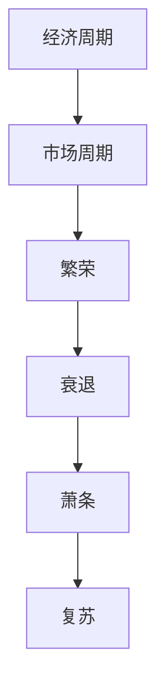
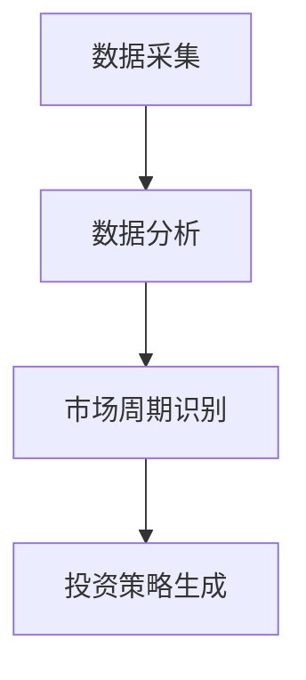

                 


# 彼得林奇的"反周期"投资在不同地域市场的应用

> 关键词：反周期投资，彼得林奇，市场周期，地域市场，投资策略

> 摘要：本文深入探讨了彼得·林奇的反周期投资策略在不同地理区域的应用。通过分析全球主要市场的特点，结合系统化的投资架构设计，展示了如何在不同市场周期中有效实施反周期投资。文章还提供了具体的Python代码示例和数学模型，帮助读者更好地理解和应用这些策略。

---

# 引言

彼得·林奇是全球最著名的基金经理之一，以其反周期投资策略闻名。反周期投资的核心在于在市场低谷时投资，以期望在市场复苏时获得超额收益。本文将探讨这一策略在全球主要市场中的应用，分析不同地区的市场特点和经济环境，以及如何优化投资策略以适应这些差异。

---

## 第二章: 反周期投资的理论基础

### 2.1 市场周期理论

市场周期理论是反周期投资的基石。市场通常经历以下几个阶段：繁荣、衰退、萧条和复苏。反周期投资者关注的是市场处于萧条阶段时的投资机会。

#### 2.1.1 经济周期与市场周期的关系

经济周期与市场周期密切相关。在经济衰退期间，市场往往会经历调整，为反周期投资者提供买入机会。图1展示了经济周期与市场周期的关系。



#### 2.1.2 市场周期指标

常用的市场周期指标包括市盈率（P/E）、市净率（P/B）和股息率等。当这些指标处于历史低位时，市场可能处于萧条阶段，适合进行反周期投资。

---

## 第三章: 全球主要市场的地域特点分析

### 3.1 美国市场

#### 3.1.1 美国市场的特点

美国市场是全球最大的股票市场之一，具有高度流动性和多样性。其经济实力和政策稳定性使其成为反周期投资的理想目标。

#### 3.1.2 美国市场的周期性分析

美国市场的周期性较为明显，受经济政策和国际环境影响较大。例如，2008年金融危机后，市场经历了深度调整，为反周期投资者提供了机会。

#### 3.1.3 美国市场中的反周期投资机会

在市场衰退期间，投资者可以关注具有强大基本面的公司，如公用事业和医疗保健行业。

### 3.2 欧洲市场

#### 3.2.1 欧洲市场的特点

欧洲市场以多元化和复杂性著称，受到欧债危机和英国退欧等事件的影响较大。

#### 3.2.2 欧洲市场的周期性分析

欧洲市场的周期性相对温和，但由于多国政策协调的复杂性，市场波动性较高。

#### 3.2.3 欧洲市场中的反周期投资机会

在经济低迷期间，投资者可以关注德国等经济强国的蓝筹股，以及具有稳定收益的公用事业和金融行业。

### 3.3 亚洲市场

#### 3.3.1 亚洲市场的特点

亚洲市场增长迅速，但受区域政治和经济政策的影响较大，如中国的经济转型和印度的快速增长。

#### 3.3.2 亚洲市场的周期性分析

亚洲市场的周期性较为复杂，受内部政策和外部经济环境的影响较大。

#### 3.3.3 亚洲市场中的反周期投资机会

在经济衰退期间，投资者可以关注具有强大内需的行业，如科技和消费领域。

---

## 第四章: 系统化的投资架构设计

### 4.1 投资管理系统框架

为了有效实施反周期投资策略，需要构建一个系统化的投资架构，包括数据采集、分析、决策支持和执行等模块。

#### 4.1.1 数据采集模块

数据采集模块负责收集全球主要市场的历史数据和实时数据，包括股票价格、经济指标等。

#### 4.1.2 数据分析模块

数据分析模块利用统计和机器学习方法，对市场周期进行识别和预测。图2展示了数据分析模块的流程。



#### 4.1.3 决策支持模块

决策支持模块根据分析结果，生成投资建议，包括买入时机、投资标的和风险控制。

#### 4.1.4 投资执行模块

投资执行模块负责根据决策支持模块的建议，执行具体的交易操作。

---

## 第五章: 项目实战与代码实现

### 5.1 环境安装

为了进行反周期投资分析，需要安装以下工具：

- Python编程语言
- 数据分析库（如Pandas、NumPy）
- 可视化库（如Matplotlib、Seaborn）
- 数据源（如Yahoo Finance API）

### 5.2 核心代码实现

以下是反周期投资分析的核心代码示例：

```python
import pandas as pd
import numpy as np
import matplotlib.pyplot as plt
import yfinance as yf

# 下载数据
def get_data(ticker, start, end):
    data = yf.download(ticker, start=start, end=end)
    return data['Close']

# 计算市盈率
def calculate_pe(ticker, data):
    df = get_data(ticker, '2010-01-01', '2023-01-01')
    pe = df / earnings_per_share(ticker)
    return pe

# 计算股息率
def calculate_dividend_yield(ticker):
    df = get_data(ticker, '2010-01-01', '2023-01-01')
    dividend = df.shift(1)
    return dividend / df.mean()

# 示例分析
ticker = 'AAPL'
pe = calculate_pe(ticker)
dividend_yield = calculate_dividend_yield(ticker)

plt.figure(figsize=(12, 6))
plt.plot(pe, label='PE Ratio')
plt.plot(dividend_yield, label='Dividend Yield')
plt.title('Apple PE Ratio and Dividend Yield')
plt.xlabel('Date')
plt.ylabel('Value')
plt.legend()
plt.show()
```

### 5.3 实际案例分析

以苹果公司为例，计算其市盈率和股息率的变化趋势，判断其是否处于反周期投资机会。

---

## 第六章: 总结与展望

### 6.1 总结

彼得林奇的反周期投资策略在全球主要市场中具有广泛的应用价值。不同地区的市场特点和经济环境决定了投资策略的调整方向。

### 6.2 展望

未来，随着技术的进步和数据的丰富，反周期投资策略将更加智能化和个性化。投资者需要不断学习和适应市场变化，以实现长期稳定的投资收益。

---

## 作者信息

作者：AI天才研究院/AI Genius Institute & 禅与计算机程序设计艺术 /Zen And The Art of Computer Programming

