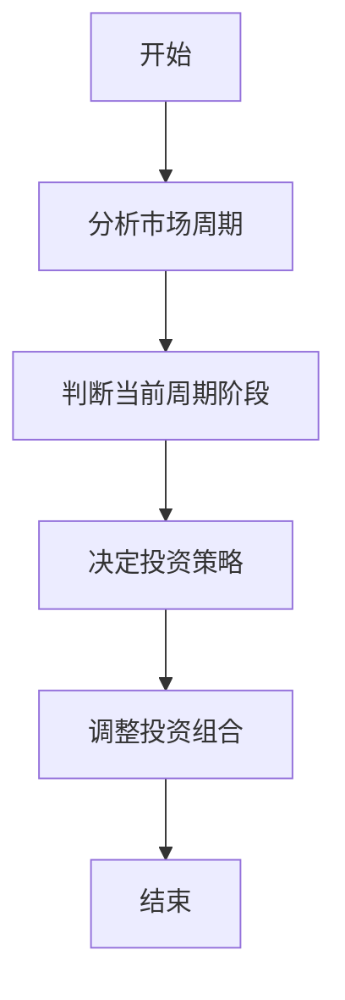
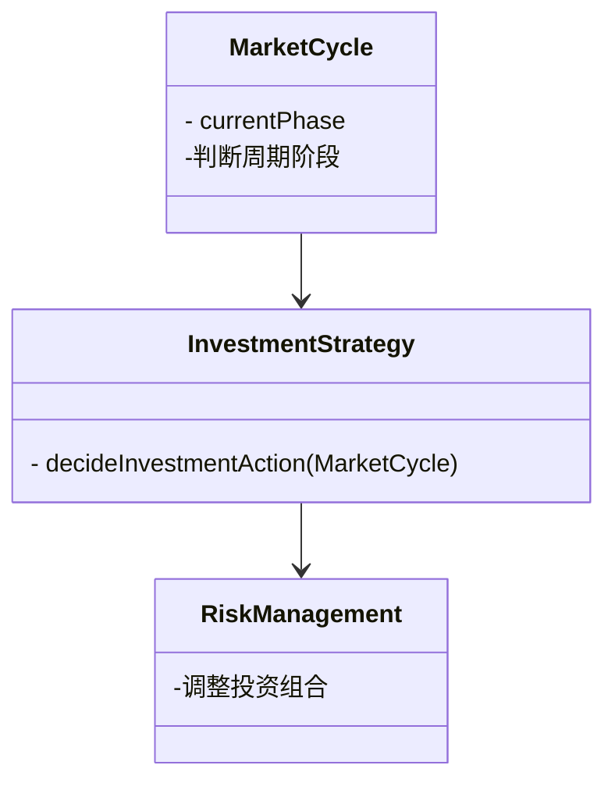

                 


# 彼得林奇的"反周期"投资在加密资产市场的风险管理策略

## 关键词：彼得·林奇，反周期投资，加密资产市场，风险管理，投资策略

## 摘要：本文探讨了彼得·林奇的反周期投资策略在加密资产市场中的应用，分析了加密资产市场的波动性、周期性及其风险管理策略。通过构建数学模型、系统架构设计和实际案例分析，详细阐述了如何在加密市场中优化投资组合、动态调整风险敞口，并结合量化分析工具提供实践指导。

---

# 第1章：引言

## 1.1 背景介绍

### 1.1.1 加密资产市场的特点
加密资产市场具有高度波动性，市场参与者广泛，且周期性明显。与传统金融市场相比，加密市场受技术进步、政策监管和市场情绪影响较大。

### 1.1.2 问题背景
加密资产市场的高波动性和不稳定性使得风险管理尤为重要。传统的风险管理方法可能不完全适用于加密市场。

### 1.1.3 问题描述
本文探讨如何将彼得·林奇的反周期投资策略应用于加密市场，以优化风险管理。

### 1.1.4 边界与外延
本文仅关注加密资产市场的风险管理策略，不涉及其他金融市场的分析。

---

# 第2章：彼得·林奇的反周期投资策略

## 2.1 核心概念与原理

### 2.1.1 反周期投资的定义
反周期投资是指在市场低谷时投资，而在市场高点时退出，逆向投资策略。

### 2.1.2 林奇策略的核心要素
- 基本面分析：通过研究公司的基本面决定其内在价值。
- 市场估值判断：通过比较市场价与内在价值，判断是否处于低谷或高点。
- 风险控制：严格的风险评估和仓位管理。

### 2.1.3 算法原理

#### 2.1.3.1 算法流程图


#### 2.1.3.2 数学模型
$$ \text{投资决策} = \begin{cases} 
\text{买入} & \text{如果市场处于低谷} \\
\text{卖出} & \text{如果市场处于高点} 
\end{cases} $$

### 2.1.4 系统架构设计

#### 2.1.4.1 领域模型


#### 2.1.4.2 系统架构
```mermaid
archi
    系统：反周期投资策略系统
        数据层：市场数据源（加密资产价格、交易量）
        业务逻辑层：市场周期判断、投资决策、风险管理
        表现层：投资建议、风险报告
```

---

# 第3章：加密资产市场的周期性分析

## 3.1 市场周期的四个阶段

### 3.1.1 萎靡阶段
市场处于低谷，价格低迷，交易量低。

### 3.1.2 吸筹阶段
价格开始回升，交易量逐渐增加，投资者开始进场。

### 3.1.3 高涨阶段
价格快速上涨，交易量达到峰值，市场情绪乐观。

### 3.1.4 调整阶段
价格开始回调，交易量下降，市场情绪转为谨慎。

## 3.2 影响市场周期的主要因素

### 3.2.1 技术进步
区块链技术的升级和新项目的推出会影响市场。

### 3.2.2 政策监管
各国政府的政策变化对市场有重大影响。

### 3.2.3 市场情绪
投资者情绪波动是导致市场周期变化的重要因素。

---

# 第4章：反周期投资策略在加密市场中的风险管理

## 4.1 投资时机的选择

### 4.1.1 低谷期投资
在市场处于萎靡阶段时，选择优质资产进行投资。

### 4.1.2 高涨期退出
在市场处于高涨阶段时，逐步退出投资，锁定收益。

## 4.2 投资标的的选择

### 4.2.1 选择具有强大基本面的加密资产
如比特币、以太坊等主流币种。

### 4.2.2 分散投资
通过投资多种资产分散风险。

## 4.3 投资组合的构建

### 4.3.1 动态调整
根据市场周期变化，动态调整投资组合的构成。

### 4.3.2 风险对冲
使用衍生品进行风险对冲，如期货、期权等。

---

# 第5章：系统实现与案例分析

## 5.1 环境安装

### 5.1.1 数据获取
使用CoinMarketCap或CoinGecko获取加密资产价格数据。

### 5.1.2 数据预处理
清洗数据，处理缺失值，标准化数据。

## 5.2 核心算法实现

### 5.2.1 市场周期判断
使用时间序列分析（ARIMA模型）判断当前市场阶段。

```python
from statsmodels.tsa.arima_model import ARIMA
import pandas as pd

# 加载数据
data = pd.read_csv('crypto_prices.csv')

# 训练模型
model = ARIMA(data['price'], order=(5,1,0)).fit()

# 预测下一阶段
forecast = model.forecast(steps=1)
```

### 5.2.2 投资决策
根据市场周期阶段，执行买入或卖出操作。

```python
def investment_decision(current_phase):
    if current_phase == '低谷':
        return '买入'
    elif current_phase == '高点':
        return '卖出'
    else:
        return '观望'
```

## 5.3 案例分析

### 5.3.1 案例背景
2020年比特币价格从低谷回升，应用反周期策略进行投资。

### 5.3.2 实施步骤
- 识别市场处于低谷阶段。
- 买入比特币。
- 在价格上涨至高点时卖出，锁定收益。

### 5.3.3 结果分析
通过反周期策略，投资组合在2020年的比特币上涨中获得了较高的收益。

---

# 第6章：总结与展望

## 6.1 总结

### 6.1.1 核心观点
彼得·林奇的反周期投资策略在加密市场中具有较高的适用性，尤其是在市场周期性明显的环境中。

### 6.1.2 实践意义
通过动态调整投资组合，投资者可以有效管理风险，提高投资收益。

## 6.2 展望

### 6.2.1 进一步优化
结合更多市场指标和机器学习算法，优化市场周期判断的准确性。

### 6.2.2 拓展研究
研究不同加密资产之间的联动效应，优化分散投资策略。

---

# 附录

## 附录A：术语表

- 反周期投资：在市场低谷时投资，市场高点时退出。
- 市场周期：市场波动的四个阶段：低谷、吸筹、高涨、调整。

## 附录B：工具推荐

- 数据分析工具：Python、Pandas、NumPy。
- 图表绘制工具：Matplotlib、Seaborn。
- 量化交易工具：QuantLib、Backtrader。

## 附录C：数据来源

- 加密资产价格数据：CoinMarketCap、CoinGecko。
- 市场情绪数据：Twitter情感分析、Google Trends。

---

作者：AI天才研究院/AI Genius Institute & 禅与计算机程序设计艺术 /Zen And The Art of Computer Programming

