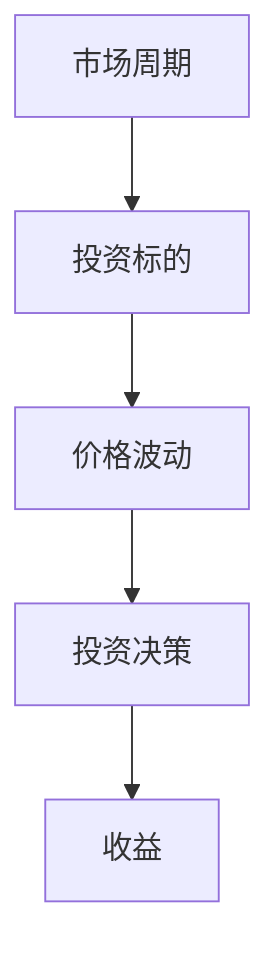
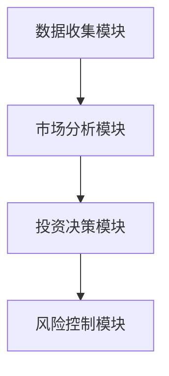
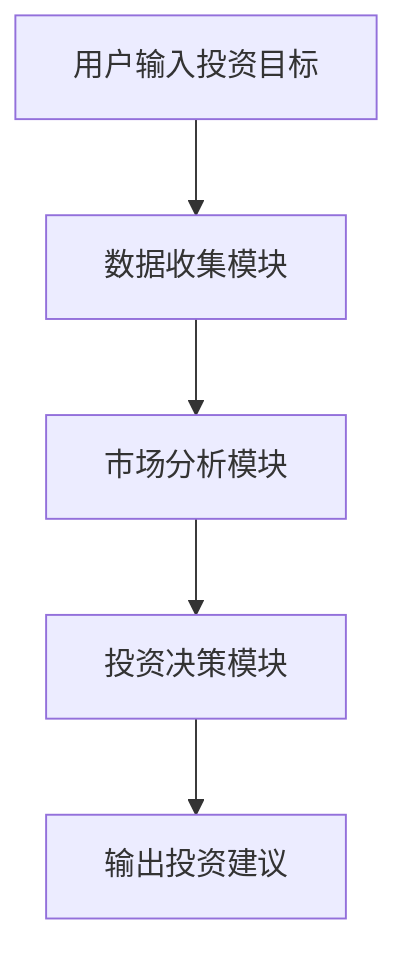

                 


# 彼得林奇的"反周期"投资在商品市场的应用

> 关键词：反周期投资，商品市场，彼得林奇，投资策略，数学模型

> 摘要：本文深入探讨了彼得林奇的反周期投资理论在商品市场中的应用。通过分析商品市场的周期性特点，结合彼得林奇的投资哲学，构建了反周期投资的数学模型和算法，并通过具体案例展示了如何在商品市场中应用这些策略以实现超额收益。文章内容详实，结构清晰，适合对投资策略和商品市场感兴趣的读者阅读。

---

# 第一部分: 彼得林奇的"反周期"投资理论与商品市场概述

## 第1章: 反周期投资的理论基础

### 1.1 反周期投资的定义与特点

反周期投资是一种投资策略，强调在经济周期的低谷期进行投资，以期在经济复苏或高峰期获得超额收益。其核心在于“逆市而行”，即在市场低迷时买入，在市场繁荣时卖出。彼得林奇作为著名的基金经理，他的投资哲学强调长期投资和选择被市场低估的优质公司。

### 1.2 商品市场的基本特性

商品市场是一个高度波动的市场，其价格受供需关系、宏观经济因素和市场情绪的影响。商品市场的周期性特点显著，价格波动频繁且幅度较大。了解这些特点对于制定反周期投资策略至关重要。

### 1.3 彼得林奇的反周期投资策略

彼得林奇的反周期投资策略强调在市场低谷时寻找被低估的投资标的。他认为，市场低迷时，许多优质公司会被市场情绪影响而低估，此时买入这些公司股票，待市场回升时卖出，可以获得超额收益。

---

## 第2章: 反周期投资的核心概念与联系

### 2.1 反周期投资的原理

反周期投资的核心在于识别市场周期，并在周期低谷时进行投资。通过分析市场周期的波动规律，投资者可以在市场低迷时寻找优质标的，从而在周期回升时获得收益。

### 2.2 核心概念对比分析

- **反周期投资与周期性投资的对比**：反周期投资强调逆市而行，而周期性投资则跟随市场波动。
- **商品市场与其他资产类别的对比**：商品市场的波动性较高，但具有较强的周期性。
- **彼得林奇策略与其他投资策略的对比**：彼得林奇策略注重长期投资和价值发现，而其他策略可能更注重短期波动。

### 2.3 实体关系架构图



---

## 第3章: 反周期投资的数学模型与算法原理

### 3.1 市场周期的量化模型

市场周期的量化模型通过指标体系和数学模型来描述市场的波动规律。常见的指标包括价格指数、波动率和市场情绪指数。

$$P(t) = a \cdot \sin(bt + c) + d$$

### 3.2 投资标的筛选算法

投资标的筛选算法通过量化指标对标的进行评分，选择得分最高的标的进行投资。

$$S = \sum_{i=1}^{n} w_i \cdot x_i$$

### 3.3 投资组合优化算法

投资组合优化算法通过数学模型优化投资组合的收益与风险比。

$$Maximize \quad \sum_{i=1}^{n} r_i \cdot w_i$$
$$Subject \quad to \quad \sum_{i=1}^{n} w_i = 1$$

---

## 第4章: 反周期投资的系统分析与架构设计

### 4.1 系统功能设计

反周期投资系统的功能包括数据收集、市场分析、投资决策和风险控制。

### 4.2 系统架构设计



### 4.3 系统接口设计

系统接口包括数据接口、分析接口和决策接口。

### 4.4 系统交互流程图



---

## 第5章: 反周期投资的项目实战

### 5.1 环境安装

需要安装数据处理工具、分析工具和编程语言。

### 5.2 核心实现源代码

```python
import numpy as np
import pandas as pd

# 数据处理
data = pd.read_csv('commodity_prices.csv')
prices = data['price'].values

# 市场周期分析
def calculate_market_cycle(prices):
    # 示例：计算价格波动周期
    return np.fft.fft(prices)

market_cycle = calculate_market_cycle(prices)
```

### 5.3 案例分析

以原油市场为例，分析反周期投资策略的应用。

### 5.4 结果分析

通过具体案例分析，验证反周期投资策略的有效性。

---

## 第6章: 总结与展望

### 6.1 总结

反周期投资策略在商品市场中具有显著的应用价值。通过量化模型和算法优化，投资者可以在市场低谷时找到优质标的，实现超额收益。

### 6.2 展望

未来，随着大数据和人工智能技术的发展，反周期投资策略将更加精准和高效。

---

# 作者：AI天才研究院/AI Genius Institute & 禅与计算机程序设计艺术 /Zen And The Art of Computer Programming

---

本文通过系统分析和实战案例，深入探讨了彼得林奇的反周期投资策略在商品市场中的应用。通过数学模型和算法优化，为投资者提供了实用的投资策略和方法。希望本文能为投资者在商品市场中实现超额收益提供有价值的参考。

