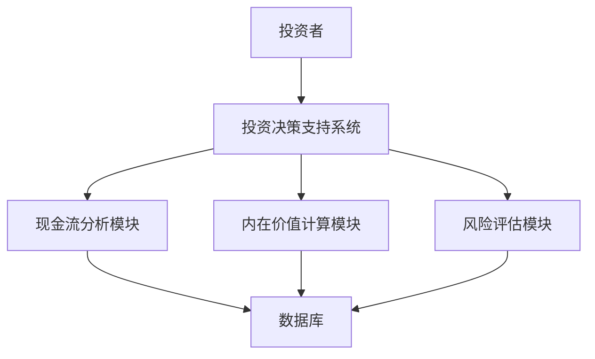

                 


# 彼得林奇的"墓地投资法"

## 关键词：彼得林奇，墓地投资法，投资策略，现金流分析，风险管理，长期投资，心理行为

## 摘要：  
彼得林奇的"墓地投资法"是一种独特的投资策略，强调长期价值投资和风险管理。本文将详细分析该方法的核心概念、算法原理、系统架构，并通过实际案例进行实战分析，帮助读者理解如何在投资中应用这一方法。

---

# 第1章: 背景介绍

## 1.1 投资背景与问题背景

### 1.1.1 现金流分析的重要性
现金流是企业健康的核心指标。健康的现金流意味着企业能够持续运营，而不依赖于外部融资。现金流分析帮助投资者评估企业的盈利能力和抗风险能力。

### 1.1.2 投资者面临的常见问题
投资者常面临信息过载、情绪波动和市场不确定性。这些问题可能导致非理性决策，影响投资回报。

### 1.1.3 墓地投资法的提出背景
彼得林奇的墓地投资法源于对传统投资策略的反思。传统策略常忽视长期价值，过度关注短期波动。墓地投资法则强调长期视角，帮助投资者在市场波动中保持理性。

## 1.2 墓地投资法的核心概念

### 1.2.1 投资者的心理与行为分析
投资者常受贪婪和恐惧驱动，导致决策失误。墓地投资法通过分析这些心理因素，帮助投资者制定理性决策。

### 1.2.2 投资决策的逻辑框架
墓地投资法基于现金流分析，强调企业的内在价值。投资者应关注企业基本面，而非市场短期波动。

### 1.2.3 墓地投资法的结构与要素
墓地投资法涉及企业评估、市场分析、风险管理和投资组合优化。通过分析这些要素，投资者可以制定有效的投资策略。

## 1.3 墓地投资法的结构与要素

### 1.3.1 核心要素的定义与属性
- **现金流分析**：评估企业盈利能力和偿债能力。
- **内在价值评估**：计算企业的真实价值。
- **市场情绪分析**：识别市场波动对企业的影响。
- **风险管理**：制定有效的风险控制策略。

### 1.3.2 投资决策的逻辑流程
1. 评估企业现金流。
2. 分析市场情绪。
3. 计算内在价值。
4. 制定投资策略。

### 1.3.3 墓地投资法的ER实体关系图
```mermaid
er
    entity 投资者 {
        id: 投资者ID
        name: 投资者姓名
        cash_flow: 现金流
        investment_strategy: 投资策略
    }
    entity 投资标的 {
        id: 标的ID
        name: 标的名称
        market_value: 市场价值
        risk_level: 风险等级
    }
    entity 投资决策 {
        id: 决策ID
        decision_time: 决策时间
        decision_type: 决策类型
        related_investor: 投资者
        related_asset: 投资标的
    }
    投资者 --> 投资决策: 作出决策
    投资标的 --> 投资决策: 决策依据
```

---

# 第2章: 投资策略的算法原理

## 2.1 投资决策的逻辑分析

### 2.1.1 现金流分析的算法
现金流分析通过计算企业的经营活动、投资活动和筹资活动的现金流，评估企业的盈利能力和偿债能力。公式如下：
$$\text{现金流} = \text{经营活动现金流} + \text{投资活动现金流} + \text{筹资活动现金流}$$

### 2.1.2 内在价值计算
内在价值是企业未来现金流的现值。公式为：
$$\text{内在价值} = \sum_{t=1}^{n} \frac{\text{现金流}_t}{(1 + r)^t}$$
其中，r是折现率，n是预测年数。

### 2.1.3 风险评估
风险评估基于标准差和贝塔系数。标准差公式：
$$\text{标准差} = \sqrt{\frac{1}{N} \sum_{i=1}^{N} (x_i - \bar{x})^2}$$
贝塔系数公式：
$$\beta = \frac{\text{协方差}(r_i, r_m)}{\text{方差}(r_m)}$$
其中，r_i是资产收益，r_m是市场收益。

---

## 2.2 投资决策算法实现

### 2.2.1 现金流分析的Python实现
```python
def calculate_cash_flow(revenue, expenses, capital_expenditure, dividends):
    return revenue - expenses - capital_expenditure - dividends

# 示例数据
revenue = 1000000
expenses = 700000
capital_expenditure = 100000
dividends = 0
cash_flow = calculate_cash_flow(revenue, expenses, capital_expenditure, dividends)
print("现金流:", cash_flow)
```

### 2.2.2 内在价值计算的Python实现
```python
def calculate_intrinsic_value(cash_flows, discount_rate, growth_rate):
    return sum(cash_flows * (1 + growth_rate)**i / (1 + discount_rate)**i for i in range(len(cash_flows)))

# 示例数据
cash_flows = [100000, 150000, 200000]
discount_rate = 0.1
growth_rate = 0.05
intrinsic_value = calculate_intrinsic_value(cash_flows, discount_rate, growth_rate)
print("内在价值:", intrinsic_value)
```

### 2.2.3 风险评估的Python实现
```python
def calculate_beta(returns, market_returns):
    covariance = np.cov(returns, market_returns)[0, 1]
    variance = np.var(market_returns)
    return covariance / variance

# 示例数据
returns = [0.1, 0.05, -0.02, 0.08]
market_returns = [0.08, 0.06, 0.04, 0.02]
beta = calculate_beta(returns, market_returns)
print("贝塔系数:", beta)
```

---

# 第3章: 系统分析与架构设计

## 3.1 系统功能设计

### 3.1.1 投资者行为分析模块
该模块分析投资者的心理和行为，帮助制定理性决策。

### 3.1.2 投资决策支持模块
提供现金流分析、内在价值计算和风险评估功能。

### 3.1.3 投资组合管理模块
优化投资组合，分散风险。

## 3.2 系统架构设计

### 3.2.1 系统架构图


### 3.2.2 系统接口设计
- API接口：提供现金流分析、内在价值计算和风险评估的API。
- 数据接口：连接数据库，获取企业数据。

---

# 第4章: 项目实战

## 4.1 环境安装

### 4.1.1 安装Python和相关库
安装Python和numpy、pandas、matplotlib。

## 4.2 核心代码实现

### 4.2.1 现金流分析代码
```python
import numpy as np

def calculate_cash_flow(revenue, expenses, capital_expenditure, dividends):
    return revenue - expenses - capital_expenditure - dividends

# 示例数据
revenue = 1000000
expenses = 700000
capital_expenditure = 100000
dividends = 0
cash_flow = calculate_cash_flow(revenue, expenses, capital_expenditure, dividends)
print("现金流:", cash_flow)
```

### 4.2.2 内在价值计算代码
```python
def calculate_intrinsic_value(cash_flows, discount_rate, growth_rate):
    return sum(cash_flows * (1 + growth_rate)**i / (1 + discount_rate)**i for i in range(len(cash_flows)))

# 示例数据
cash_flows = [100000, 150000, 200000]
discount_rate = 0.1
growth_rate = 0.05
intrinsic_value = calculate_intrinsic_value(cash_flows, discount_rate, growth_rate)
print("内在价值:", intrinsic_value)
```

### 4.2.3 风险评估代码
```python
def calculate_beta(returns, market_returns):
    covariance = np.cov(returns, market_returns)[0, 1]
    variance = np.var(market_returns)
    return covariance / variance

# 示例数据
returns = [0.1, 0.05, -0.02, 0.08]
market_returns = [0.08, 0.06, 0.04, 0.02]
beta = calculate_beta(returns, market_returns)
print("贝塔系数:", beta)
```

## 4.3 案例分析

### 4.3.1 案例背景
某企业现金流稳定，但市场情绪波动较大。通过墓地投资法分析，评估其内在价值和风险。

### 4.3.2 实战分析
使用上述代码计算现金流、内在价值和贝塔系数，评估投资风险。

---

# 第5章: 最佳实践与总结

## 5.1 小结
墓地投资法强调长期价值投资，帮助投资者制定理性决策。

## 5.2 注意事项
投资者需注意市场波动、企业基本面变化和宏观经济因素。

## 5.3 拓展阅读
推荐阅读彼得林奇的《富人习惯》和《投资的智慧》。

---

# 作者信息

作者：AI天才研究院/AI Genius Institute & 禅与计算机程序设计艺术 /Zen And The Art of Computer Programming

---

希望这篇文章能帮助读者理解彼得林奇的墓地投资法，并将其应用于实际投资中。

