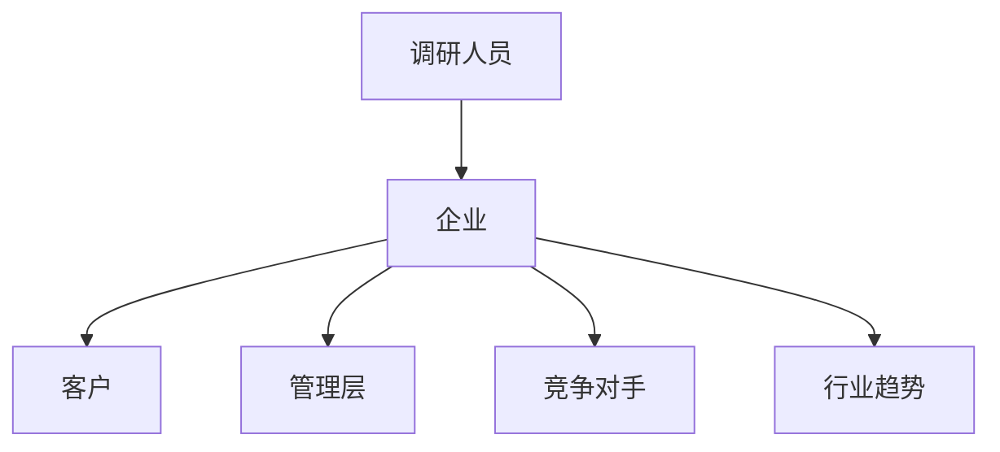
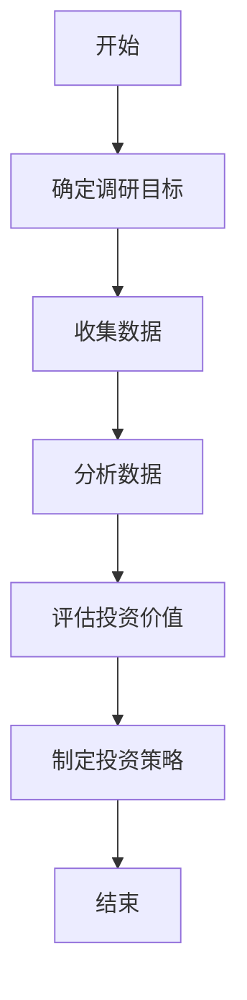
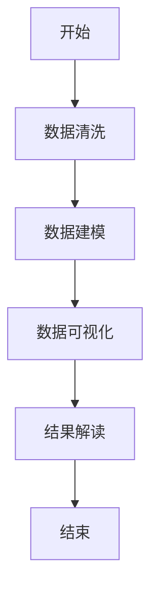
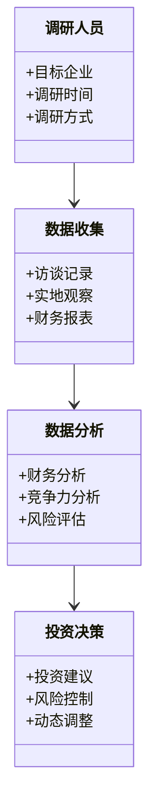
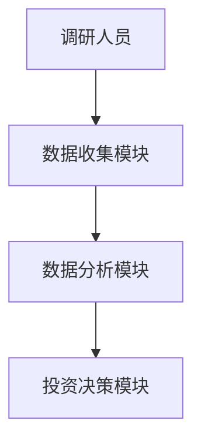

                 


# 彼得林奇的"实地调研"在不同行业的重点

## 关键词：彼得林奇，实地调研，投资分析，行业分析，投资策略

## 摘要：  
彼得·林奇作为全球著名投资经理，其“实地调研”方法在投资决策中具有重要地位。本文系统介绍了实地调研的核心概念、算法原理、系统架构，并结合实际案例，深入分析了该方法在不同行业的应用，最后总结了最佳实践和注意事项。

---

## 第一部分: 实地调研的背景与核心概念

### 第1章: 实地调研的定义与重要性

#### 1.1 实地调研的定义  
实地调研是通过实地考察、访谈、数据分析等方式，深入了解企业运营状况、行业趋势和潜在风险，以辅助投资决策的一种方法。

#### 1.2 实地调研的重要性  
- **信息准确性**：通过实地调研获得的第一手信息，比依赖公开数据更可靠。
- **竞争优势识别**：帮助企业发现潜在机会和竞争优势。
- **风险控制**：及时发现潜在风险，降低投资损失。

#### 1.3 彼得·林奇实地调研的特点  
- **事实为基础**：以实际数据和信息为依据。
- **多维度分析**：涵盖企业内外部环境、财务状况、管理层能力等。
- **动态调整**：根据调研结果实时调整投资策略。

---

### 第2章: 实地调研的核心概念与联系

#### 2.1 核心概念原理  
实地调研的核心在于通过多维度的数据收集和分析，评估企业的投资价值。其逻辑框架包括信息收集、分析和决策三个阶段。

#### 2.2 核心概念属性对比  
表2.1：不同调研方法的特征对比  

| 方法      | 数据来源   | 数据类型   | 数据分析   | 适用场景             |
|-----------|------------|------------|------------|----------------------|
| 实地调研   | 第一手资料 | 结构化与非结构化 | 定量与定性 | 投资决策、风险管理 |
| 二手调研   | 公开数据   | 结构化       | 定量分析   | 初步筛选、趋势分析 |

#### 2.3 ER实体关系图  
图2.1：实地调研的核心实体关系图（Mermaid）



---

## 第二部分: 实地调研的算法原理

### 第3章: 实地调研的流程与方法

#### 3.1 实地调研的流程  
图3.1：实地调研流程图（Mermaid）



#### 3.2 数据分析方法  
图3.2：数据分析流程图（Mermaid）



#### 3.3 数学模型  
- **投资价值评估公式**：$$ V = \frac{CF}{(r - g)} $$
  - $CF$：未来现金流
  - $r$：折现率
  - $g$：增长率

- **风险评估公式**：$$ R = \sqrt{\sum (w_i^2 \times \sigma_i^2)} $$
  - $w_i$：权重
  - $\sigma_i$：标准差

---

### 第4章: 实地调研的系统分析与架构设计

#### 4.1 问题场景介绍  
投资决策中存在信息不对称问题，实地调研通过多维度数据收集和分析，解决这一难题。

#### 4.2 系统功能设计  
图4.1：系统功能模块图（Mermaid类图）



#### 4.3 系统架构设计  
图4.2：系统架构图（Mermaid架构图）



---

## 第三部分: 实地调研的项目实战

### 第5章: 环境安装与配置

#### 5.1 环境要求  
- 数据收集工具：Excel、调研表格
- 数据分析工具：Python、Pandas、Matplotlib
- 系统运行环境：Windows/Mac/Linux

### 第5章: 核心实现源代码

#### 代码5.1: 数据收集模块代码

```python
import pandas as pd

# 数据收集模块
def collect_data(company, year):
    # 模拟数据收集
    data = {
        '收入': [company.revenue(year)],
        '利润': [company.net_profit(year)],
        '员工数': [company.staff_count()]
    }
    return pd.DataFrame(data)
```

#### 代码5.2: 数据分析模块代码

```python
def analyze_data(df):
    # 计算财务比率
    ratios = {
        '毛利率': df['毛利率'].mean(),
        '净利率': df['净利率'].mean(),
        'ROE': df['ROE'].mean()
    }
    return ratios
```

### 第5章: 实际案例分析

#### 案例1: 科技行业  
**公司A**：通过实地调研发现其研发投入高，但市场拓展能力不足，建议调整战略。

#### 案例2: 医疗行业  
**公司B**：调研显示其产品线单一，市场竞争激烈，建议多元化发展。

#### 案例3: 金融行业  
**公司C**：管理层稳定性差，存在较大的经营风险。

---

## 第四部分: 实地调研的最佳实践

### 第6章: 总结与注意事项

#### 6.1 总结  
实地调研是投资决策中的关键环节，通过多维度信息收集和分析，帮助投资者做出科学决策。

#### 6.2 注意事项  
- **数据真实性**：确保数据来源可靠。
- **调研频率**：定期更新调研结果。
- **动态调整**：根据市场变化及时调整策略。

#### 6.3 拓展阅读  
推荐书籍：《彼得·林奇的成功投资》、《投资之道》。

---

## 作者：AI天才研究院 & 禅与计算机程序设计艺术

---

通过本文的系统介绍和详细分析，读者可以全面理解彼得·林奇的实地调研方法及其在不同行业的应用。希望本文对投资决策者和研究人员有所帮助。

