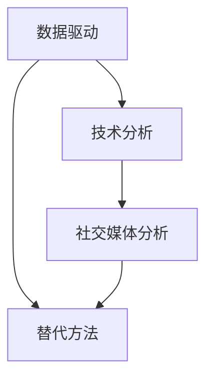
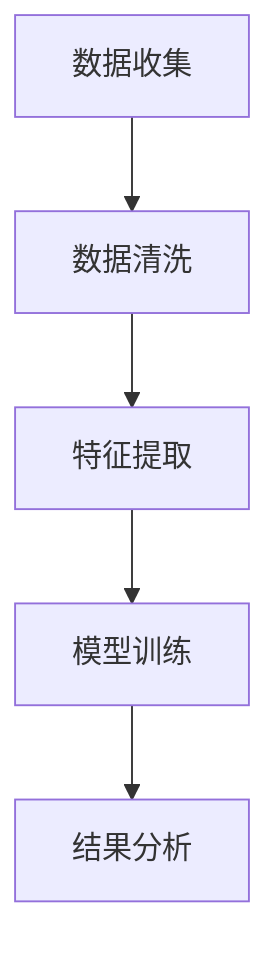
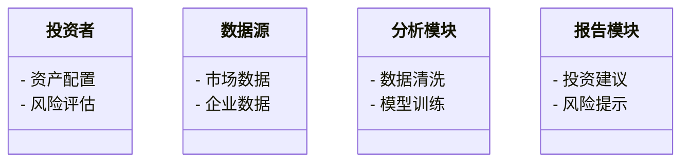
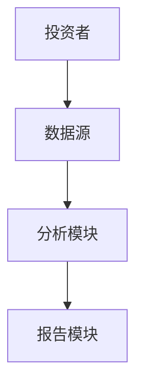
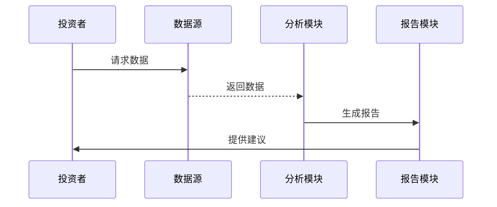

                 


# 彼得林奇的"实地调研"在虚拟经济时代的替代方法探索

> 关键词：虚拟经济、彼得·林奇、实地调研、替代方法、数据驱动、技术分析、社交媒体

> 摘要：随着虚拟经济的快速发展，传统的实地调研方法在投资领域面临挑战。本文探讨如何在虚拟经济时代替代彼得·林奇的实地调研方法，通过数据分析、技术分析和社交媒体分析等手段，提供新的投资策略。文章详细介绍了替代方法的核心概念、算法原理、系统架构和项目实战，为投资领域提供新的视角。

---

## 第一部分：虚拟经济时代背景与实地调研的演变

### 第1章：虚拟经济的现状与挑战

#### 1.1 虚拟经济的定义与特点
- **虚拟经济的定义**：虚拟经济是指依赖数字技术，通过虚拟货币、区块链等技术进行交易和投资的经济形态。
- **虚拟经济的核心特征**：去中心化、透明性、实时性和全球化。
- **虚拟经济对传统投资的影响**：传统调研方法在虚拟经济中效率降低，需要新的分析手段。

#### 1.2 彼得·林奇实地调研方法的背景
- **彼得·林奇的投资理念**：注重企业基本面分析，强调实地调研的重要性。
- **实地调研的核心要素**：与管理层沟通、考察生产现场、评估企业竞争力。
- **传统调研方法的局限性**：在虚拟经济中，实地调研成本高、时间长，难以获取实时数据。

---

### 第2章：虚拟经济时代实地调研的替代方法

#### 2.1 替代方法的核心概念
- **数据驱动的调研方式**：利用大数据分析企业财务数据和市场趋势。
- **技术分析与模式识别**：通过技术指标和算法识别市场趋势。
- **社交媒体与网络数据的应用**：分析社交媒体上的投资者情绪和市场动态。

#### 2.2 替代方法的优劣势对比

| 方法 | 优势 | 劣势 |
|------|------|------|
| 数据驱动 | 高效、精准 | 数据量大，处理复杂 |
| 技术分析 | 实时性高 | 易受市场波动影响 |
| 社交媒体分析 | 情感分析丰富 | 数据噪声大 |

**实体关系图（Mermaid）**：



---

## 第3章：替代方法的算法原理

### 3.1 数据分析算法

#### 3.1.1 大数据分析流程（Mermaid）


#### 3.1.2 算法实现代码
```python
import pandas as pd
import numpy as np
from sklearn import linear_model

# 示例数据
data = pd.DataFrame({
    'feature': np.random.rand(100),
    'target': np.random.rand(100)
})

# 线性回归模型
model = linear_model.LinearRegression()
model.fit(data[['feature']], data['target'])

# 预测结果
predictions = model.predict(data[['feature']])
print("预测结果:", predictions)
```

#### 3.1.3 数学模型（Latex公式）
- 回归分析：$$ y = \beta_0 + \beta_1x + \epsilon $$
- 聚类分析：$$ d(x, y) = \sqrt{(x_1 - y_1)^2 + (x_2 - y_2)^2} $$

---

### 第4章：系统架构与设计

#### 4.1 系统功能模块

##### 4.1.1 领域模型类图（Mermaid）


#### 4.2 系统架构图（Mermaid）


#### 4.3 接口与交互设计（Mermaid）


---

## 第5章：项目实战与案例分析

### 5.1 环境与工具安装
- **开发环境**：Python、Jupyter Notebook
- **数据获取工具**：Pandas、requests库
- **可视化工具**：Matplotlib、Seaborn

### 5.2 核心代码实现
#### 5.2.1 数据分析代码
```python
import pandas as pd
import requests
from bs4 import BeautifulSoup

# 获取社交媒体数据
url = 'https://example.com/social_data'
response = requests.get(url)
soup = BeautifulSoup(response.text, 'html.parser')
data = pd.read_html(soup.prettify())
```

#### 5.2.2 案例分析与结果解读
- **案例背景**：分析某虚拟货币的市场趋势。
- **分析结果**：通过算法预测未来价格走势，提供投资建议。

---

## 第6章：总结与展望

### 6.1 替代方法的优势与挑战
- **优势**：高效、精准、实时性强。
- **挑战**：数据质量、算法复杂性、市场波动性。

### 6.2 未来发展方向
- 结合人工智能技术，提升算法性能。
- 开发更先进的数据可视化工具，帮助投资者更好地理解市场。

### 6.3 最佳实践Tips
- **数据源选择**：确保数据来源可靠。
- **算法优化**：定期更新模型，适应市场变化。
- **风险管理**：合理配置资产，分散投资风险。

---

## 附录：扩展阅读与资源
- 推荐书籍：《虚拟经济的崛起与影响》
- 在线资源：虚拟经济分析平台、大数据分析工具教程

---

## 作者信息
作者：AI天才研究院 & 禅与计算机程序设计艺术

---

通过这篇文章，我们详细探讨了虚拟经济时代替代彼得·林奇实地调研方法的必要性、方法和实现。希望这些内容能为投资领域的专业人士提供新的思路和工具。

