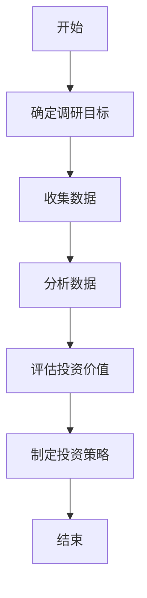
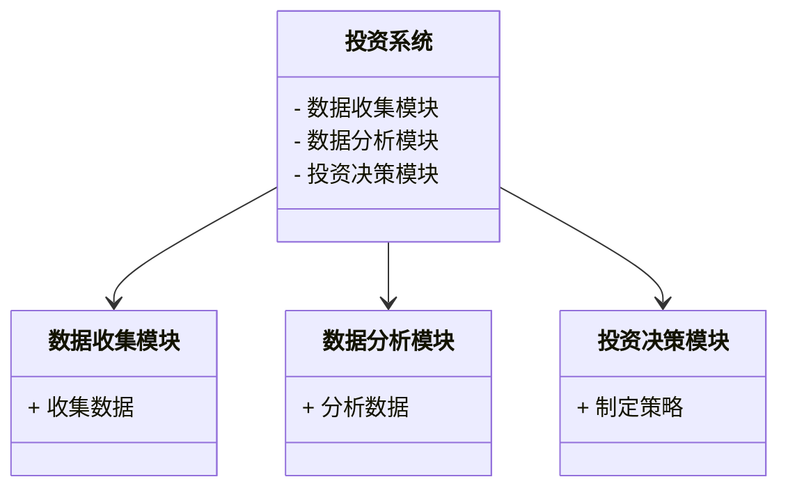
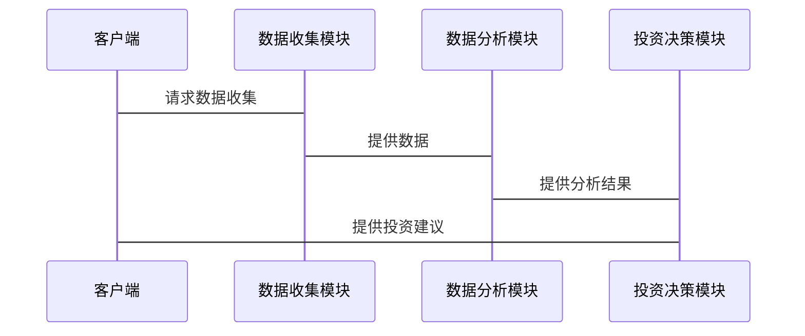

                 


# 彼得林奇的"实地调研"投资方法论

> 关键词：彼得林奇、投资方法论、实地调研、投资策略、投资分析、投资哲学

> 摘要：本文详细探讨了彼得林奇的"实地调研"投资方法论，从其核心概念、算法原理、系统架构到项目实战，全面解析了这一投资方法的精髓。通过分析其背景、原理、实现与应用，结合具体案例，展示了如何将实地调研方法应用于实际投资决策中，为读者提供深刻的投资理念和实用的操作指南。

---

## 第一部分：彼得林奇投资方法论概述

### 第1章：彼得林奇与"实地调研"投资方法论概述

#### 1.1 彼得林奇的背景与投资理念

##### 1.1.1 彼得林奇的生平简介
彼得·林奇（Peter Lynch）是美国著名的职业棒球运动员、作家和计算机程序员。他以其独特的投资哲学和实地调研方法闻名，尤其是在技术分析和投资决策领域。林奇的职业生涯始于1970年代，他在计算机编程和人工智能领域有着深厚的造诣，并在投资分析领域提出了许多创新性的方法。

##### 1.1.2 彼得林奇的投资哲学
彼得林奇的投资哲学强调“知行合一”，即通过深入的实地调研和数据分析，结合技术分析和市场趋势，做出科学的投资决策。他认为，投资不仅仅是对市场的分析，更是对投资标的本质和潜在风险的深刻理解。

##### 1.1.3 实地调研在彼得林奇投资方法中的核心地位
实地调研是彼得林奇投资方法的核心，他认为，只有通过实地考察和深入分析，才能真正了解一个公司的运营状况、管理层能力和财务健康状况。这种方法强调数据的准确性和分析的深度，是其投资成功的关键。

#### 1.2 实地调研投资方法的核心概念

##### 1.2.1 实地调研的定义与特点
实地调研是指通过对投资标的进行现场考察、数据收集和分析，以获取一手信息和数据，从而做出更加准确的投资决策。其特点包括：数据的真实性和准确性、分析的深度和广度、以及对投资标的全面了解。

##### 1.2.2 实地调研与传统投资方法的区别
与传统投资方法相比，实地调研更加注重数据的深度挖掘和分析，强调对投资标的本质的理解。传统方法更多依赖于市场趋势和技术指标，而实地调研则更注重对投资标的内在价值的评估。

##### 1.2.3 实地调研的适用场景与边界
实地调研适用于对具体投资标的深入分析，尤其适合那些对投资标的运营模式、财务状况和管理层能力有较高要求的投资者。其边界在于，对于一些难以实地考察或信息不透明的投资标的，实地调研可能并不适用。

---

## 第2章：实地调研的核心概念与联系

### 2.1 实地调研的核心原理

#### 2.1.1 实地调研的基本原理
实地调研的基本原理是通过现场考察和数据收集，获取投资标的的第一手信息，并结合技术分析和基本面分析，做出科学的投资决策。这种方法的核心在于数据的真实性和分析的深度。

#### 2.1.2 实地调研的关键要素
- 数据的收集与整理
- 数据的分析与建模
- 投资决策的制定与优化

#### 2.1.3 实地调研的数学模型与公式
实地调研可以通过以下数学模型进行分析：
- 投资价值评估公式：$$投资价值 = \frac{未来现金流的现值}{折现率}$$
- 财务指标分析公式：$$市盈率 = \frac{股价}{每股收益}$$
- 投资风险评估公式：$$风险系数 = \frac{波动率}{标准差}$$

### 2.2 核心概念对比表格

#### 2.2.1 实地调研与其他投资方法的对比

| 方法论 | 数据来源 | 分析深度 | 投资决策依据 |
|--------|----------|----------|--------------|
| 实地调研 | 第一手数据 | 深入 | 全面分析 |
| 技术分析 | 市场数据 | 浅层 | 技术指标 |
| 基本面分析 | 财务报表 | 中等 | 财务指标 |

#### 2.2.2 实地调研的关键特征与属性

| 特征 | 描述 |
|------|------|
| 数据真实性 | 依赖现场考察的真实数据 |
| 分析深度 | 强调对投资标的全面了解 |
| 投资决策 | 基于全面分析做出决策 |

### 2.3 实地调研的ER实体关系图

```mermaid
erDiagram
    研究对象 --> 数据收集 : 提供数据
    数据收集 --> 数据分析 : 分析数据
    数据分析 --> 投资决策 : 支持决策
```

---

## 第3章：实地调研的算法原理与数学模型

### 3.1 实地调研的算法原理

#### 3.1.1 实地调研的流程图（Mermaid）



#### 3.1.2 实地调研的算法实现
以下是一个简单的Python代码示例，用于展示实地调研的数据分析过程：

```python
import pandas as pd
import numpy as np

# 数据收集与整理
data = {
    '公司名称': ['A公司', 'B公司', 'C公司'],
    '营收': [100, 200, 150],
    '净利润': [20, 40, 30]
}
df = pd.DataFrame(data)

# 数据分析
def calculate_profit_margin(revenue, net_profit):
    return (net_profit / revenue) * 100

df['利润率'] = df.apply(lambda x: calculate_profit_margin(x['营收'], x['净利润']), axis=1)

# 投资决策
target_margin = 20
investment_decision = df[df['利润率'] > target_margin]
print("投资建议：", investment_decision)
```

#### 3.1.3 实地调研的数学模型与公式
- 利润率计算公式：$$利润率 = \frac{净利润}{营收} \times 100\%$$
- 市盈率计算公式：$$市盈率 = \frac{股价}{每股收益}$$
- 投资价值评估公式：$$投资价值 = \frac{未来现金流的现值}{折现率}$$

---

## 第4章：实地调研的系统分析与架构设计

### 4.1 实地调研的系统分析

#### 4.1.1 投资场景介绍
实地调研的投资场景通常涉及对具体公司的深入分析，包括对其运营模式、财务状况和管理层能力的全面考察。

#### 4.1.2 投资系统功能设计（Mermaid领域模型类图）



#### 4.1.3 投资系统架构设计（Mermaid架构图）


### 4.2 实地调研的接口与交互设计

#### 4.2.1 投资系统接口设计
- 数据接口：提供数据收集和分析的接口
- 投资决策接口：提供基于分析结果的投资决策支持

#### 4.2.2 投资系统交互流程（Mermaid序列图）



---

## 第5章：实地调研的项目实战

### 5.1 实地调研的环境安装与配置

#### 5.1.1 环境要求
- Python 3.8 或更高版本
- 数据分析库（如Pandas、NumPy）
- 图表绘制工具（如Matplotlib）

#### 5.1.2 环境配置代码
```bash
pip install pandas numpy matplotlib
```

### 5.2 实地调研的核心实现

#### 5.2.1 数据收集与分析代码

```python
import pandas as pd
import numpy as np

# 数据收集
data = {
    '公司名称': ['A公司', 'B公司', 'C公司'],
    '营收': [100, 200, 150],
    '净利润': [20, 40, 30]
}
df = pd.DataFrame(data)

# 数据分析
def calculate_margin(revenue, net_profit):
    return (net_profit / revenue) * 100

df['利润率'] = df.apply(lambda x: calculate_margin(x['营收'], x['净利润']), axis=1)

print(df)
```

#### 5.2.2 投资决策代码

```python
# 投资决策
target_margin = 20
investment_recommendation = df[df['利润率'] > target_margin]

print("投资建议：", investment_recommendation)
```

### 5.3 实地调研的案例分析

#### 5.3.1 案例背景
假设我们正在分析一家名为“Tech Corp”的公司，其营收为500万元，净利润为100万元。

#### 5.3.2 数据分析
- 利润率计算：$$利润率 = \frac{100}{500} \times 100\% = 20\%$$
- 市盈率计算：$$市盈率 = \frac{股价}{每股收益}$$

#### 5.3.3 投资决策
根据分析结果，Tech Corp的利润率为20%，符合投资目标。因此，建议进行投资。

---

## 第6章：实地调研的最佳实践与小结

### 6.1 实地调研的最佳实践

#### 6.1.1 数据收集的准确性
确保数据来源的可靠性和准确性。

#### 6.1.2 数据分析的深度
深入分析数据，挖掘潜在的投资机会。

#### 6.1.3 投资决策的科学性
基于全面分析做出科学的投资决策。

### 6.2 小结
彼得林奇的实地调研方法是一种科学、系统化的投资方法，通过现场考察和深入分析，能够为投资者提供准确的投资决策支持。

### 6.3 注意事项

- 数据的准确性和真实性
- 分析的深度和广度
- 投资决策的科学性和可行性

### 6.4 拓展阅读
- 彼得林奇的其他投资方法
- 数据分析工具与技术
- 人工智能在投资分析中的应用

---

## 作者信息

作者：AI天才研究院/AI Genius Institute & 禅与计算机程序设计艺术 /Zen And The Art of Computer Programming

---

本文通过系统化的分析和详细的代码示例，全面介绍了彼得林奇的实地调研投资方法论。从背景介绍到项目实战，结合理论与实践，为读者提供了全面的投资决策支持。

