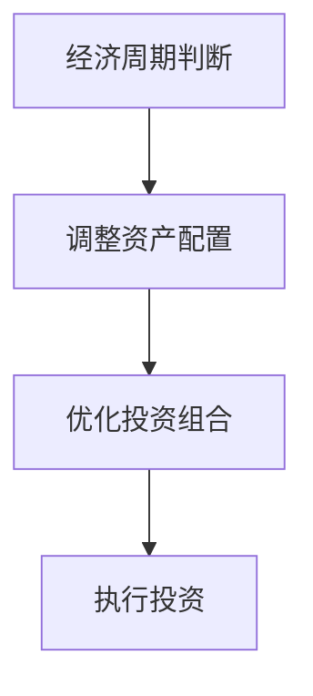
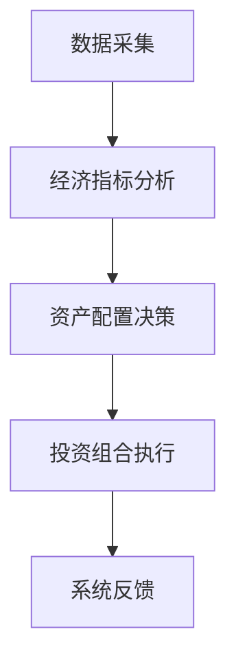

                 


# 彼得林奇的"家庭投资"在不同经济周期的资产配置调整

> 关键词：彼得·林奇，家庭投资，经济周期，资产配置，投资策略

> 摘要：本文将深入探讨彼得·林奇的家庭投资理念，并分析其在不同经济周期下的资产配置策略。通过结合经济周期的特征和家庭投资的核心思想，提出一套动态调整的资产配置方法，帮助投资者在不同经济环境下优化投资组合，降低风险，实现长期稳健收益。

---

## 第一部分：经济周期与家庭投资理念

### 1.1 经济周期的基本概念

#### 1.1.1 经济周期的定义与特征
经济周期是指经济活动在长期趋势中呈现的周期性波动，通常包括复苏、过热、滞胀和衰退四个阶段。每个阶段的经济特征和市场表现不同，对投资决策有重要影响。

- **复苏期**：经济逐渐恢复，企业盈利增长，市场信心回升。
- **过热期**：经济增长过快，通胀上升，市场可能出现泡沫。
- **滞胀期**：经济增长停滞，通胀高企，市场波动加剧。
- **衰退期**：经济活动萎缩，企业盈利下降，市场恐慌情绪蔓延。

#### 1.1.2 不同经济周期对投资的影响
- **复苏期**：适合增加股票配置，捕捉经济回升的收益。
- **过热期**：通胀上升，债券等固定收益资产可能表现不佳，需警惕市场泡沫。
- **滞胀期**：企业盈利下降，但低通胀环境下债券可能表现较好。
- **衰退期**：现金为王，债券是避险选择，股票风险较大。

#### 1.1.3 资产配置的基本原理
资产配置是将资金分配到不同资产类别（股票、债券、现金等）中，以实现风险和收益的平衡。经济周期的变化要求资产配置策略也随之调整。

---

### 1.2 彼得·林奇的家庭投资理念

#### 1.2.1 家庭投资的核心思想
彼得·林奇强调长期投资、分散投资和价值投资。他认为，投资的核心是寻找具有持续增长潜力的企业，并长期持有，避免频繁交易。

#### 1.2.2 长期投资与价值投资的结合
- 长期投资：通过持有优质资产，降低短期市场波动的影响。
- 价值投资：寻找被市场低估的资产，长期持有，等待价值回归。

#### 1.2.3 家庭投资与经济周期的关系
家庭投资理念强调在不同经济周期下灵活调整资产配置，既要抓住经济增长的机会，也要避免经济下行的风险。

---

## 第二部分：资产配置策略与经济周期

### 2.1 资产配置的核心原则

#### 2.1.1 分散投资的重要性
分散投资可以降低单一资产的风险，避免因某一资产的波动导致整体投资组合受损。

#### 2.1.2 风险与收益的平衡
在不同经济周期下，资产的风险和收益表现不同。例如，在衰退期，股票风险较大，而债券和现金的风险较低。

#### 2.1.3 资产配置的动态调整
资产配置不是一成不变的，需要根据经济周期的变化进行动态调整，以适应市场环境的变化。

---

### 2.2 不同经济周期下的资产配置策略

#### 2.2.1 经济复苏期的资产配置
- **股票**：经济复苏期企业盈利增长，股票表现较好。
- **债券**：经济复苏期通胀上升，债券收益可能受到压制。
- **现金**：适当减少现金配置，增加股票和债券配置。

#### 2.2.2 经济过热期的资产配置
- **股票**：市场可能出现泡沫，需警惕回调风险。
- **债券**：通胀上升，债券收益率可能下降。
- **现金**：适当增加现金配置，规避市场风险。

#### 2.2.3 经济滞胀期的资产配置
- **股票**：企业盈利下降，股票表现不佳。
- **债券**：滞胀环境下债券可能表现较好。
- **现金**：保持较高现金配置，避免资产贬值。

#### 2.2.4 经济衰退期的资产配置
- **股票**：经济衰退期企业盈利下降，股票风险较大。
- **债券**：债券是较好的避险资产。
- **现金**：现金为王，避免投资风险。

---

## 第三部分：资产配置的数学模型与算法原理

### 3.1 资产配置的数学模型

#### 3.1.1 均值-方差优化模型
均值-方差优化模型是现代投资组合理论（MPT）的核心，旨在在给定风险下最大化收益，或在给定收益下最小化风险。

$$ \text{目标函数：} \min_w \sigma^2 \quad \text{subject to} \quad \mu^T w = R $$

其中，$w$是资产权重向量，$\sigma^2$是投资组合的方差，$\mu$是资产预期收益向量，$R$是目标收益。

#### 3.1.2 现代投资组合理论（MPT）
MPT强调通过分散投资降低风险，并通过资产配置优化投资组合的收益与风险比。

#### 3.1.3 风险调整后的收益模型
风险调整后的收益模型考虑了资产的风险溢价，帮助投资者在不同经济周期下选择合适的资产。

---

### 3.2 资产配置的算法实现

#### 3.2.1 使用Python进行资产配置模拟
以下代码示例展示了如何使用Python模拟不同经济周期下的资产配置：

```python
import numpy as np
import pandas as pd

# 示例经济周期数据
economic_cycle = pd.Series([1, 2, 3, 4], index=['复苏期', '过热期', '滞胀期', '衰退期'])

# 不同资产的预期收益和风险
assets = {
    '股票': {'收益': 0.15, '风险': 0.2},
    '债券': {'收益': 0.05, '风险': 0.03},
    '现金': {'收益': 0.02, '风险': 0.01}
}

# 根据经济周期调整资产配置
for cycle in economic_cycle.index:
    current_cycle = economic_cycle[cycle]
    if current_cycle == 4:  # 衰退期
        print("衰退期：增加债券和现金配置，减少股票配置")
    elif current_cycle == 3:  # 滞胀期
        print("滞胀期：保持债券配置，减少股票和现金配置")
    elif current_cycle == 2:  # 过热期
        print("过热期：减少债券配置，增加股票和现金配置")
    else:  # 复苏期
        print("复苏期：增加股票配置，减少债券和现金配置")
```

#### 3.2.2 资产配置的动态调整算法
动态调整算法根据经济周期的变化，实时调整资产配置比例。



---

## 第四部分：系统架构与投资决策框架

### 4.1 投资决策系统的模块化设计

#### 4.1.1 数据采集模块
- 数据源：宏观经济指标（GDP、通胀率、 unemployment rate 等）。
- 数据处理：清洗、转换和存储。

#### 4.1.2 经济指标分析模块
- 分析当前经济周期。
- 生成资产配置建议。

#### 4.1.3 资产配置决策模块
- 根据经济周期调整资产配置比例。
- 输出投资组合优化方案。

#### 4.1.4 投资组合执行模块
- 执行交易指令。
- 监控投资组合表现。

#### 4.1.5 系统反馈模块
- 监测市场变化。
- 根据反馈调整配置。

---

### 4.2 系统架构的Mermaid流程图



---

## 第五部分：项目实战与案例分析

### 5.1 实战环境搭建

#### 5.1.1 数据源选择与获取
- 数据来源：公开经济数据（如GDP、通胀率、失业率等）。
- 数据获取工具：Python的`pandas`和`requests`库。

#### 5.1.2 系统工具安装与配置
- 安装Python、Jupyter Notebook、`numpy`、`pandas`、`matplotlib`等工具。
- 配置开发环境。

#### 5.1.3 编程语言与库的选择
- 编程语言：Python。
- 库：`pandas`、`numpy`、`matplotlib`。

---

### 5.2 核心代码实现

#### 5.2.1 经济周期指标的量化代码
```python
import pandas as pd
import numpy as np

# 示例经济数据
data = {
    'GDP': [2.5, 3.2, 1.8, -0.5],
    '通胀率': [2.0, 3.5, 4.2, 1.8],
    '失业率': [5.0, 4.5, 6.2, 7.1]
}
df = pd.DataFrame(data)

# 判断经济周期
def determine_cycle(df):
    if df['GDP'].mean() > 0 and df['通胀率'].mean() < 2:
        return "复苏期"
    elif df['GDP'].mean() > 3 and df['通胀率'].mean() > 3:
        return "过热期"
    elif df['GDP'].mean() < 1 and df['通胀率'].mean() > 3:
        return "滞胀期"
    else:
        return "衰退期"

current_cycle = determine_cycle(df)
print(f"当前经济周期：{current_cycle}")
```

---

### 5.3 案例分析与结果解读

#### 5.3.1 经济衰退期的资产调整案例
假设当前经济处于衰退期，根据彼得·林奇的家庭投资理念，应增加债券和现金配置，减少股票配置。

#### 5.3.2 经济过热期的资产调整案例
假设当前经济处于过热期，应减少债券配置，增加股票和现金配置，以规避通胀风险。

---

## 第六部分：总结与最佳实践

### 6.1 投资策略总结
- 灵活调整资产配置，根据经济周期变化优化投资组合。
- 长期投资与价值投资相结合，注重风险控制。

### 6.2 最佳实践 tips
- 定期评估投资组合的表现，及时调整配置。
- 保持对经济指标的关注，抓住投资机会。
- 避免情绪化投资，坚持长期策略。

### 6.3 注意事项
- 投资有风险，需谨慎评估自身风险承受能力。
- 资产配置需结合个人财务状况和投资目标。

### 6.4 拓展阅读
- 彼得·林奇的书籍：《彼得·林奇的投资策略》。
- 经济周期相关研究：《经济周期理论与应用》。

---

## 作者：AI天才研究院/AI Genius Institute & 禅与计算机程序设计艺术 /Zen And The Art of Computer Programming

---

通过本文的分析和案例，读者可以更好地理解彼得·林奇的家庭投资理念，并在不同经济周期下灵活调整资产配置，实现长期稳健的投资收益。

