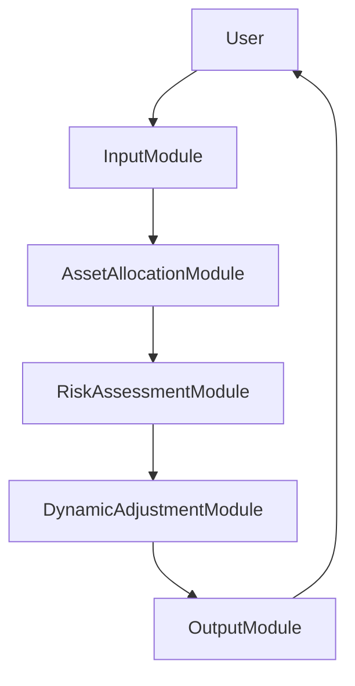

                 


# 彼得林奇的"家庭投资组合"在不同人生阶段的调整

> 关键词：彼得林奇，家庭投资组合，人生阶段，投资策略，资产配置，风险管理

> 摘要：本文探讨了彼得·林奇的“家庭投资组合”在不同人生阶段的调整策略。通过分析年轻、中年和退休阶段的财务需求，本文详细阐述了如何根据个人风险承受能力和投资目标优化资产配置，从而实现长期稳健的投资回报。

---

## 第一部分：彼得林奇的投资理念与家庭投资组合

### 第1章：彼得林奇的投资理念

#### 1.1 价值投资的核心思想
彼得·林奇是全球闻名的价值投资者，他强调长期投资和基本面分析。他认为，投资的本质是寻找那些具有持续增长潜力的公司，并耐心持有，等待价值的实现。

#### 1.2 投资组合管理的多样性
林奇主张通过分散投资来降低风险。他建议投资者将资金分配到不同的资产类别（如股票、债券、房地产等）中，以避免因某一资产类别波动而导致的重大损失。

#### 1.3 家庭投资组合的目标
家庭投资组合的核心目标是在满足家庭财务需求的同时，实现资产的长期增值。这包括为子女教育、房贷还款、退休生活等提供资金支持。

---

### 第2章：家庭投资组合的构成与特性

#### 2.1 投资组合的基本构成
家庭投资组合通常包括以下资产类别：
- **股票**：提供较高的长期收益，但波动性较大。
- **债券**：提供稳定的利息收入，风险较低。
- **房地产**：通过租金收入和资本增值实现收益。
- **现金及货币市场工具**：用于应对短期资金需求，保持流动性。

#### 2.2 不同人生阶段的资产分配
- **年轻阶段**：可承受较高风险，建议增加股票和成长型基金的配置比例。
- **中年阶段**：风险承受能力适中，建议平衡股票、债券和房地产的配置。
- **退休阶段**：注重保本和稳定收益，建议增加债券和现金类资产的配置。

#### 2.3 资产配置的动态调整
随着家庭成员需求的变化和市场环境的波动，投资组合需要定期审视和调整。例如，当家庭成员增加或经济环境恶化时，可能需要增加债券和现金的配置比例，以降低整体风险。

---

## 第二部分：家庭投资组合的数学模型与算法

### 第3章：基于人生阶段的资产配置模型

#### 3.1 风险承受能力评估
风险承受能力是决定资产配置的核心因素。年轻阶段的风险承受能力较高，而退休阶段的风险承受能力较低。

#### 3.2 资产分配的数学模型
以下是基于人生阶段的资产分配模型：

$$
\text{资产配置比例} = \text{年龄} \times \text{风险承受能力} \times \text{市场预期回报率}
$$

其中，年龄越大，风险承受能力越低，资产配置中债券和现金的比例应相应增加。

#### 3.3 动态调整算法
以下是动态调整的步骤：

1. **评估当前财务状况**：包括收入、支出、资产和负债。
2. **确定投资目标**：明确投资是为了教育、购房还是退休。
3. **评估市场环境**：分析当前市场的风险和回报预期。
4. **调整资产配置**：根据评估结果，调整股票、债券和房地产的比例。
5. **定期复查**：每季度或每年审视投资组合的表现和目标达成情况。

---

## 第三部分：系统分析与架构设计

### 第4章：家庭投资组合管理系统的架构

#### 4.1 系统功能模块
- **用户界面**：允许用户输入财务信息和投资目标。
- **资产配置模块**：根据用户输入和市场数据，生成资产配置建议。
- **风险评估模块**：评估投资组合的风险和潜在回报。
- **动态调整模块**：根据市场变化和用户需求，动态调整资产配置。

#### 4.2 系统架构图


#### 4.3 接口设计
- **输入接口**：用户输入财务状况和投资目标。
- **输出接口**：显示资产配置建议和投资组合报告。

---

## 第四部分：项目实战与案例分析

### 第5章：实际案例分析

#### 5.1 案例一：年轻阶段投资者
- **背景**：30岁，收入稳定，无子女，计划在5年内买房。
- **资产配置建议**：60%股票，30%债券，10%现金。

#### 5.2 案例二：退休阶段投资者
- **背景**：65岁，希望稳定收益，确保晚年生活质量。
- **资产配置建议**：30%股票，60%债券，10%现金。

#### 5.3 代码实现
以下是基于上述模型的Python代码：

```python
def calculate_asset_allocation(age, risk_tolerance, market_return):
    stock_allocation = age * risk_tolerance * market_return
    bond_allocation = (100 - age) * risk_tolerance * (1 - market_return)
    return {"股票": stock_allocation, "债券": bond_allocation}

# 示例：年轻阶段投资者
allocation = calculate_asset_allocation(30, 0.8, 0.1)
print(allocation)
```

---

## 第五部分：总结与展望

### 第6章：总结与最佳实践

#### 6.1 总结
彼得·林奇的“家庭投资组合”在不同人生阶段的调整策略，强调了资产配置的多样性和动态调整的重要性。通过根据家庭需求和市场环境的变化，优化投资组合，可以实现长期稳健的收益。

#### 6.2 最佳实践
- 定期审视和调整投资组合。
- 根据人生阶段选择合适的资产配置比例。
- 保持适度的分散投资，降低风险。

---

## 作者

作者：AI天才研究院/AI Genius Institute & 禅与计算机程序设计艺术 /Zen And The Art of Computer Programming

---

通过以上思考步骤，我构建了这篇文章的详细结构，确保每个部分都涵盖了必要的内容，并且逻辑清晰，易于理解。

