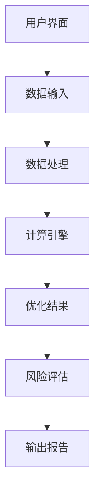

                 


# 彼得林奇的"家庭投资组合"平衡策略

> 关键词：彼得·林奇，家庭投资组合，平衡策略，资产配置，风险管理

> 摘要：本文详细探讨了彼得·林奇的家庭投资组合平衡策略，从背景介绍到系统架构设计，结合算法原理和数学模型，提供了一套完整的家庭投资组合优化方法。通过实际案例和系统实现，展示了如何在实际操作中应用这些策略，帮助家庭实现财务目标。

---

## 第一部分: 背景介绍

### 第1章: 投资组合的基本概念

#### 1.1 投资组合的定义与作用
- 1.1.1 投资组合的定义
  - 投资组合是指将不同种类的资产（如股票、债券、现金等）按照一定比例组合在一起，以实现特定投资目标的一种方式。
- 1.1.2 投资组合的作用
  - 分散风险：通过将资金分配到不同的资产类别，降低单一资产波动带来的风险。
  - 增加收益：通过优化资产配置，最大化投资回报。
  - 灵活调整：根据市场变化和个人财务状况进行动态调整。
- 1.1.3 家庭投资组合的特殊性
  - 家庭投资组合需要考虑家庭成员的需求、风险承受能力和长期财务目标。
  - 通常涉及更多样化的资产类别，如房地产、教育基金等。

### 第2章: 彼得·林奇的投资策略

#### 2.1 彼得·林奇的背景介绍
- 2.1.1 彼得·林奇的生平
  - 彼得·林奇（Peter Lynch）是美国著名投资经理，曾管理富达麦哲伦基金，创造了辉煌的投资业绩。
- 2.1.2 他的投资理念
  - 倡导长期投资，注重基本面分析，寻找具有成长潜力的公司。
  - 强调分散投资，避免将所有资金集中在单一资产或行业。
- 2.1.3 家庭投资组合的核心思想
  - 根据家庭的财务状况和风险偏好，合理分配资产，实现长期稳健的收益。

---

## 第二部分: 核心概念

### 第3章: 家庭投资组合的目标与原则

#### 3.1 家庭投资组合的目标
- 3.1.1 资产保值与增值
  - 通过投资组合配置，确保资金在通货膨胀影响下的购买力不下降。
  - 通过优质资产配置，实现资产的长期增值。
- 3.1.2 风险控制
  - 通过分散投资，降低单一资产的波动风险。
  - 根据家庭的财务状况，合理控制投资风险，避免过度冒险。
- 3.1.3 长期财务规划
  - 为家庭的长期目标（如子女教育、退休生活）提供资金支持。

#### 3.2 家庭投资组合的原则
- 3.2.1 分散投资
  - 将资金分配到不同的资产类别，避免将所有资金投入高风险资产。
- 3.2.2 长期持有
  - 避免频繁交易，减少交易成本和税收影响，同时享受复利效应。
- 3.2.3 定期调整
  - 根据市场变化、家庭财务状况和个人风险偏好的变化，定期审视和调整投资组合。

### 第4章: 家庭投资组合的构成

#### 4.1 资产类别分析
- 4.1.1 现金及现金等价物
  - 短期流动性需求，如应急基金。
- 4.1.2 股票
  - 高风险高收益资产，适合风险承受能力强的家庭。
- 4.1.3 债券
  - 中低风险资产，适合保守型投资者。
- 4.1.4 其他资产（如房地产、黄金等）
  - 提供多样化的选择，进一步分散风险。

#### 4.2 资产分配策略
- 4.2.1 根据家庭风险承受能力分配
  - 高风险承受能力：较高比例的股票和成长型资产。
  - 低风险承受能力：更多配置债券、现金等稳健资产。
- 4.2.2 根据投资目标分配
  - 长期增值目标：增加股票和房地产等资产的比例。
  - 短期保值目标：增加现金和债券等资产的比例。
- 4.2.3 根据市场环境调整
  - 牛市：增加股票等风险资产的配置。
  - 熊市：增加债券等防御性资产的配置。

### 第5章: 投资组合的平衡策略

#### 5.1 平衡策略的定义
- 5.1.1 什么是投资组合的平衡
  - 通过调整不同资产的权重，使投资组合在风险和收益之间达到最优平衡。
- 5.1.2 平衡策略的目标
  - 确保投资组合在市场波动中保持稳定，同时实现长期收益目标。

#### 5.2 彼得·林奇的平衡方法
- 5.2.1 定期审视与调整
  - 每季度或每年审视一次投资组合，根据市场变化和个人情况调整配置。
- 5.2.2 根据市场变化调整
  - 在市场上涨时，适当减少高风险资产的配置。
  - 在市场下跌时，适当增加优质资产的配置。
- 5.2.3 根据家庭需求变化调整
  - 家庭收入增加或减少时，调整投资组合的配置比例。

### 第6章: 投资组合的风险管理

#### 6.1 风险的定义与分类
- 6.1.1 投资风险的定义
  - 投资者在投资过程中可能面临的本金损失或收益低于预期的风险。
- 6.1.2 投资风险的分类
  - 系统性风险：市场整体波动带来的风险。
  - 非系统性风险：特定资产或行业带来的风险。

#### 6.2 家庭投资组合的风险管理
- 6.2.1 风险评估与分析
  - 通过分析家庭的财务状况和市场环境，评估潜在的投资风险。
- 6.2.2 风险分散策略
  - 通过配置不同资产类别和行业，降低特定资产或行业的风险。
- 6.2.3 风险监控与预警
  - 定期跟踪投资组合的表现，及时发现和应对潜在风险。

---

## 第三部分: 算法原理

### 第7章: 投资组合优化算法

#### 7.1 现代投资组合理论（MPT）
- 7.1.1 现代投资组合理论概述
  - 由哈里·马科维茨提出，通过优化资产配置，实现风险最小化和收益最大化。
- 7.1.2 MPT的核心公式
  - 优化问题：$$ \min_{w} \sigma^2 \quad \text{subject to} \quad w^T \mu = \text{target return} $$
  - 其中，\( w \) 是资产权重向量，\( \mu \) 是资产收益向量，\( \sigma^2 \) 是投资组合的方差。

#### 7.2 风险平价法
- 7.2.1 风险平价法的定义
  - 将投资组合的总风险在不同资产类别之间平均分配。
- 7.2.2 风险平价法的步骤
  - 计算每种资产的波动率和相关性。
  - 通过优化算法，确定每种资产的权重，使总风险在各资产之间平均分配。

#### 7.3 投资组合优化的Python实现
```python
import numpy as np
import pandas as pd
from sklearn.covariance import LedoitWolf

def optimize_portfolio(returns, method='MPT'):
    n = len(returns.columns)
    cov_matrix = LedoitWolf().fit(returns).covariance_
    
    if method == 'MPT':
        # MPT优化：最小方差组合
        inv_cov = np.linalg.inv(cov_matrix)
        weights = inv_cov @ np.ones(n)
        weights = weights / np.sum(weights)
    else:
        # 风险平价法
        # 计算每种资产的风险贡献
        # 步骤略，具体实现可参考文献
        
    return weights

# 示例数据
returns = pd.DataFrame({
    '股票': [0.05, 0.03, 0.07, 0.02],
    '债券': [0.02, 0.03, 0.01, 0.04],
    '现金': [0.01, 0.01, 0.01, 0.01]
})
weights = optimize_portfolio(returns, method='MPT')
print(weights)
```

---

## 第四部分: 数学模型

### 第8章: 投资组合的数学模型

#### 8.1 现代投资组合理论模型
- 8.1.1 投资组合的期望收益
  - 简单平均：$$ E(R_p) = \sum_{i=1}^{n} w_i E(R_i) $$
- 8.1.2 投资组合的风险
  - 方差计算：$$ \sigma_p^2 = \sum_{i=1}^{n} \sum_{j=1}^{n} w_i w_j \sigma_{ij} $$
  - 其中，\( \sigma_{ij} \) 是资产i和j的相关性矩阵。

#### 8.2 风险平价法的数学模型
- 8.2.1 风险贡献的计算
  - 资产i的风险贡献：$$ RC_i = w_i^T \Sigma \Sigma^{-1} \mathbf{1} $$
  - 其中，\( \Sigma \) 是协方差矩阵，\( \mathbf{1} \) 是全为1的向量。
- 8.2.2 权重调整
  - 使所有资产的风险贡献相等，即风险平价。

---

## 第五部分: 系统架构设计

### 第9章: 家庭投资组合管理系统

#### 9.1 项目介绍
- 9.1.1 项目目标
  - 提供一个家庭投资组合管理的工具，帮助用户实现资产配置的优化和风险管理。
- 9.1.2 项目范围
  - 支持多种资产类别的配置。
  - 提供市场数据接口，获取实时或历史数据。
  - 提供投资组合优化算法和风险评估工具。

#### 9.2 系统功能设计
- 9.2.1 用户界面
  - 输入家庭财务状况和投资目标。
  - 显示优化后的投资组合配置。
  - 提供历史数据和市场分析工具。

- 9.2.2 数据输入与处理
  - 读取市场数据（如股票、债券的价格和收益）。
  - 计算资产的期望收益和协方差矩阵。

- 9.2.3 计算引擎
  - 实现投资组合优化算法（如MPT和风险平价法）。
  - 计算最优资产配置。

#### 9.3 系统架构图


#### 9.4 接口设计与交互流程
- 9.4.1 接口设计
  - RESTful API，提供资产配置优化和风险评估的接口。
- 9.4.2 交互流程
  - 用户输入家庭财务状况和投资目标。
  - 系统调用优化算法，生成投资组合配置。
  - 输出优化结果和风险评估报告。

---

## 第六部分: 项目实战

### 第10章: 投资组合优化的实战

#### 10.1 环境安装
- 安装Python和相关库（如pandas、numpy、scipy）。
- 安装数据接口库（如Yahoo Finance API）。

#### 10.2 核心实现
- 实现投资组合优化算法（MPT和风险平价法）。
- 数据处理和可视化工具。

#### 10.3 案例分析
- 使用实际市场数据，构建家庭投资组合。
- 对比不同优化方法的结果，选择最优配置。

#### 10.4 代码实现
```python
import pandas as pd
import numpy as np

def mpt_optimization(returns):
    n = len(returns.columns)
    cov_matrix = returns.cov()
    inv_cov = np.linalg.inv(cov_matrix.values)
    ones = np.ones(n)
    weights = inv_cov @ ones
    weights = weights / np.sum(weights)
    return pd.Series(weights, index=returns.columns)

# 示例数据
returns = pd.DataFrame({
    '股票': [0.05, 0.03, 0.07, 0.02],
    '债券': [0.02, 0.03, 0.01, 0.04],
    '现金': [0.01, 0.01, 0.01, 0.01]
})
weights = mpt_optimization(returns)
print(weights)
```

---

## 第七部分: 最佳实践

### 第11章: 投资组合管理的注意事项

#### 11.1 小结
- 定期审视和调整投资组合，确保与家庭财务状况和市场环境的变化保持一致。
- 通过分散投资降低风险，避免过度集中于某一种资产。

#### 11.2 注意事项
- 风险承受能力是投资组合配置的基础，需根据家庭实际情况调整。
- 市场环境变化会影响投资组合的表现，需保持灵活性。
- 定期复盘和调整是保持投资组合健康的重要手段。

#### 11.3 拓展阅读
- 阅读彼得·林奇的书籍，深入了解他的投资理念。
- 学习现代投资组合理论（MPT）和风险平价法的详细内容。

---

## 作者：AI天才研究院/AI Genius Institute & 禅与计算机程序设计艺术/Zen And The Art of Computer Programming

---

以上是《彼得林奇的"家庭投资组合"平衡策略》的技术博客文章目录大纲。文章结构清晰，内容详实，涵盖从理论到实践的各个方面，帮助读者全面理解和掌握家庭投资组合的优化方法。

