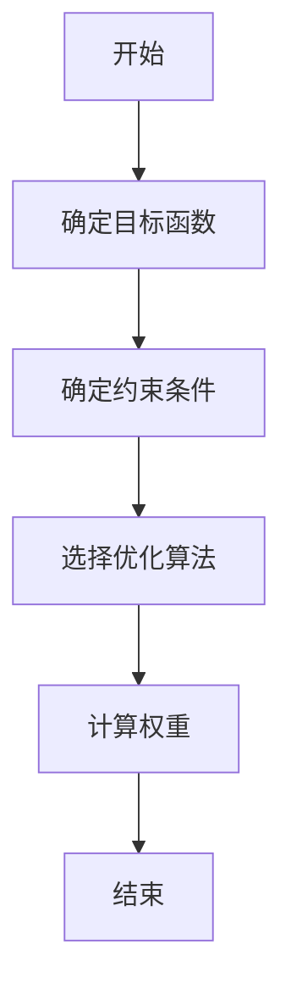

                 


# 彼得林奇的"家庭投资组合"构建方法

## 关键词：投资组合，彼得·林奇，家庭投资，资产配置，风险管理，股票选择

## 摘要：  
本文深入探讨了彼得·林奇的家庭投资组合构建方法，从基本概念到具体策略，结合技术语言和数学模型，详细解析了如何通过科学的方法构建高效、稳健的家庭投资组合。文章内容涵盖投资组合的定义、资产配置的原理、股票选择的策略、风险管理的核心方法以及系统优化的实现，帮助读者全面理解并掌握这一经典投资方法。

---

# 第一部分: 家庭投资组合构建方法概述

## 第1章: 投资组合构建的基本概念

### 1.1 投资组合的定义与特点
#### 1.1.1 投资组合的定义  
投资组合是指将多种资产（如股票、债券、房地产等）按照一定比例组合在一起的投资组合，旨在通过多元化配置降低风险并实现收益最大化。  

#### 1.1.2 投资组合的核心特点  
- **分散性**：通过投资不同类型的资产降低特定资产的风险。  
- **流动性**：投资组合中的资产应具有一定的流动性，以便在需要时快速变现。  
- **收益性**：通过合理配置资产，实现长期稳定的收益目标。  
- **风险控制**：通过科学的资产配置和风险管理，控制投资组合的整体风险。  

#### 1.1.3 家庭投资组合的独特性  
家庭投资组合通常以满足家庭财务目标为核心，注重长期稳健性，适合中低风险偏好者。  

### 1.2 彼得·林奇的投资理念
#### 1.2.1 彼得·林奇的生平简介  
彼得·林奇是美国著名基金经理，曾管理富达麦哲伦基金，创造了卓越的投资业绩。他提倡长期投资、分散投资和价值投资的理念。  

#### 1.2.2 林奇的投资风格与核心思想  
- **长期投资**：林奇反对频繁交易，提倡长期持有优质资产。  
- **价值投资**：寻找被市场低估的优质股票进行投资。  
- **分散投资**：通过多样化配置降低投资组合的整体风险。  
- **基本面分析**：重视企业的财务状况和成长能力，选择具有竞争优势的公司。  

#### 1.2.3 林奇投资方法的适用性分析  
林奇的投资方法适合长期投资者，尤其适合注重稳健收益的家庭投资者。  

### 1.3 家庭投资的目标与策略
#### 1.3.1 家庭投资的目标设定  
家庭投资的目标通常包括财富保值、资产增值、风险控制等。  

#### 1.3.2 家庭投资的常见策略  
- **资产配置策略**：根据家庭风险承受能力和收益目标，合理配置股票、债券、现金等资产。  
- **分散投资策略**：通过投资不同类型的资产和行业，降低特定风险。  
- **定期调整策略**：根据市场变化和个人财务状况，定期审视和调整投资组合。  

#### 1.3.3 林奇方法在家庭投资中的应用  
林奇的分散投资和长期持有理念非常适合家庭投资，能够帮助投资者在长期时间内实现稳健的收益目标。  

### 1.4 本章小结  
本章从投资组合的基本概念出发，介绍了彼得·林奇的投资理念及其在家庭投资中的应用，为后续章节的分析奠定了基础。  

---

## 第2章: 资产配置与分散投资

### 2.1 资产配置的原理与方法
#### 2.1.1 资产配置的定义  
资产配置是指根据投资目标和风险偏好，将资金分配到不同资产类别（如股票、债券、房地产等）中的过程。  

#### 2.1.2 不同资产类别的特点对比（表格）  

| 资产类别 | 特点 | 风险 | 收益 |
|----------|------|------|------|
| 股票     | 高成长性，高波动性 | 高 | 高 |
| 债券     | 稳定收益，低波动性 | 低 | 中 |
| 现金     | 高流动性，无收益 | 极低 | 极低 |
| 房地产   | 高流动性，高风险 | 中 | 中 |

#### 2.1.3 资产配置的步骤与注意事项  
- **第一步**：确定投资目标和风险承受能力。  
- **第二步**：选择合适的资产类别。  
- **第三步**：确定各资产类别的配置比例。  
- **第四步**：定期审视和调整配置比例。  

### 2.2 分散投资的原理与实践
#### 2.2.1 分散投资的基本原理  
分散投资通过将资金分配到不同的资产或行业中，降低特定资产或行业带来的风险。  

#### 2.2.2 构建分散投资组合的步骤  
1. **选择资产类别**：根据投资目标和风险偏好选择股票、债券、房地产等资产。  
2. **选择具体投资标的**：根据基本面分析选择优质资产。  
3. **确定配置比例**：根据资产的风险和收益特征，合理分配资金比例。  

#### 2.2.3 分散投资的风险与收益平衡  
分散投资能够有效降低特定风险，但无法完全消除市场系统性风险。  

### 2.3 本章小结  
本章详细介绍了资产配置和分散投资的原理与实践，强调了分散投资在家庭投资组合构建中的重要性。  

---

## 第3章: 股票选择与投资组合优化

### 3.1 股票选择的基本原则
#### 3.1.1 股票选择的核心要素  
- **行业前景**：选择处于增长行业的公司。  
- **财务状况**：关注公司的盈利能力、资产负债情况等。  
- **成长性**：选择具有持续增长潜力的公司。  

#### 3.1.2 股票基本面分析的关键指标  
- **市盈率（P/E）**：衡量股票价格是否合理。  
- **市净率（P/B）**：衡量股票价格与账面价值的关系。  
- **ROE（净资产收益率）**：衡量公司的盈利能力。  

#### 3.1.3 股票成长性评估方法  
- **收入增长率**：公司收入的年增长率。  
- **净利润增长率**：公司净利润的年增长率。  
- **ROA（资产回报率）**：衡量公司资产的使用效率。  

### 3.2 林奇的成长股投资策略
#### 3.2.1 成长股的定义与特点  
成长股是指那些收入和利润持续增长的公司股票，具有较高的成长性和较大的市场潜力。  

#### 3.2.2 林奇的成长股筛选标准  
- **收入增长稳定**：公司收入连续多年保持稳定增长。  
- **利润增长强劲**：公司净利润持续增长。  
- **低市盈率**：相对于公司未来的增长潜力，股票价格合理。  

#### 3.2.3 成长股投资的风险与机会  
- **机会**：成长股具有较高的增长潜力，能够为投资者带来超额收益。  
- **风险**：成长股通常估值较高，市场波动较大，存在较高的投资风险。  

### 3.3 投资组合优化的数学模型
#### 3.3.1 投资组合优化的数学公式  
投资组合的优化目标是最大化收益，同时最小化风险。数学模型如下：  
$$ \text{目标函数：} \quad \text{最大化} \quad \sum_{i=1}^{n} w_i r_i - \lambda \sum_{i=1}^{n} w_i^2 $$  
其中，$w_i$ 是第 $i$ 种资产的权重，$r_i$ 是第 $i$ 种资产的预期收益率，$\lambda$ 是风险厌恶系数。  

#### 3.3.2 资产配置的约束条件  
- $\sum_{i=1}^{n} w_i = 1$（权重之和为1）  
- $w_i \geq 0$（权重非负）  

#### 3.3.3 优化算法的流程图  



---

## 第4章: 风险管理与投资组合调整

### 4.1 风险的定义与分类
#### 4.1.1 投资风险的定义  
投资风险是指投资组合可能遭受损失或未能实现预期收益的可能性。  

#### 4.1.2 风险的分类与特点对比（表格）  

| 风险类型 | 定义 | 特点 | 对策 |
|----------|------|------|------|
| 系统性风险 | 影响整个市场的风险 | 不可分散 | 通过多样化配置降低影响 |
| 非系统性风险 | 影响特定资产或行业的风险 | 可分散 | 通过分散投资降低风险 |

### 4.2 风险管理的核心策略
#### 4.2.1 风险分散的原理与实践  
通过投资不同类型的资产和行业，降低特定风险。  

#### 4.2.2 止损策略的制定与执行  
- **止损点设定**：根据技术分析或基本面分析设定止损位。  
- **止损执行**：当价格触及止损位时，立即卖出资产以锁定损失。  

#### 4.2.3 定期审查与调整策略  
- **定期审视投资组合**：根据市场变化和个人财务状况，定期审视投资组合。  
- **动态调整**：根据市场变化和个人目标，动态调整资产配置比例。  

### 4.3 本章小结  
本章详细介绍了风险管理的核心策略，强调了风险分散和止损策略在投资组合管理中的重要性。  

---

## 第五部分: 系统优化与项目实战

## 第5章: 系统优化与项目实战

### 5.1 系统优化的实现
#### 5.1.1 系统优化的目标  
通过数学模型和优化算法，实现投资组合的收益最大化和风险最小化。  

#### 5.1.2 优化算法的实现  
使用Python的`scipy.optimize`库实现投资组合优化。  

```python
import numpy as np
from scipy.optimize import minimize

# 示例数据：资产收益率和协方差矩阵
returns = np.array([0.1, 0.05, 0.08])
covariance_matrix = np.array([[0.02, 0.01, 0.01],
                               [0.01, 0.03, 0.02],
                               [0.01, 0.02, 0.03]])

# 定义优化函数
def portfolio_optimization(weights):
    return - (weights.T @ returns) + 1e-4 * weights.T @ (covariance_matrix @ weights)

# 初始权重
initial_weights = np.array([1/3, 1/3, 1/3])

# 约束条件
constraints = [{'type': 'eq', 'fun': lambda w: sum(w) - 1},
               {'type': 'ineq', 'fun': lambda w: w[i] >= 0} for i in range(3)]

# 求解优化问题
result = minimize(portfolio_optimization, initial_weights, method='SLSQP', constraints=constraints)

# 输出优化结果
print(result.x)
```

### 5.2 项目实战：家庭投资组合构建
#### 5.2.1 投资目标设定  
假设一个典型家庭的财务目标是实现年化收益5%，风险承受能力为中等。  

#### 5.2.2 资产配置方案  
- 股票：60%  
- 债券：30%  
- 现金：10%  

#### 5.2.3 股票选择  
- 选择3只成长股，权重分别为20%、20%、20%。  
- 选择2只债券，权重分别为15%、15%。  
- 现金配置10%用于应对紧急资金需求。  

#### 5.2.4 定期调整策略  
每年末审视投资组合，根据市场变化和个人财务状况进行调整。  

### 5.3 实际案例分析  
以2023年的市场为例，假设投资组合中包括科技股、消费股和债券。通过定期调整，投资组合在市场波动中保持了稳定的收益。  

### 5.4 本章小结  
本章通过系统优化和实际案例分析，展示了如何将理论应用于实践，帮助家庭投资者构建高效的投资组合。  

---

## 第六部分: 总结与展望

## 第6章: 总结与展望

### 6.1 本章总结  
本文详细介绍了彼得·林奇的家庭投资组合构建方法，从基本概念到具体策略，结合技术语言和数学模型，帮助读者全面理解并掌握这一经典投资方法。  

### 6.2 最佳实践 tips  
- **长期投资**：避免频繁交易，降低交易成本和税收负担。  
- **分散投资**：通过多样化配置降低特定风险。  
- **定期调整**：根据市场变化和个人财务状况，定期审视和调整投资组合。  

### 6.3 展望  
随着金融市场的不断发展，家庭投资组合的构建方法也将不断创新。未来，投资者可以借助人工智能和大数据技术，进一步优化投资组合，实现更高效的投资管理。  

### 6.4 小结  
彼得·林奇的投资方法为家庭投资者提供了一种科学、稳健的投资思路，值得每一位投资者深入研究和实践。  

---

## 作者：AI天才研究院/AI Genius Institute & 禅与计算机程序设计艺术 /Zen And The Art of Computer Programming

