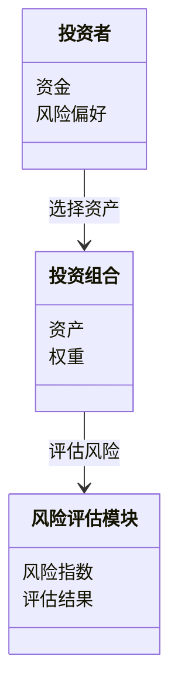
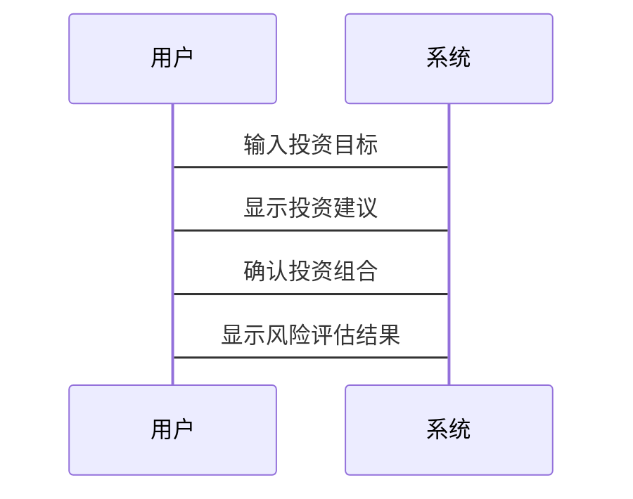

                 


# 彼得林奇的"家庭投资"风险控制方法

## 关键词
- 彼得·林奇
- 家庭投资
- 风险控制
- 投资策略
- 数学模型

## 摘要
本文系统地介绍了彼得·林奇的家庭投资风险控制方法，从背景、核心概念、算法原理到系统设计和项目实战，详细阐述了如何在家庭投资中有效控制风险。通过分析风险评估流程、数学模型和系统架构，本文为家庭投资者提供了一套实用的风险控制策略，帮助他们在复杂多变的市场中实现稳健投资。

---

## 第1章: 家庭投资与风险控制的背景介绍

### 1.1 家庭投资的核心概念
#### 1.1.1 问题背景与问题描述
家庭投资是指个人或家庭通过将资金投入股票、债券、房地产等资产，以实现财富增值的过程。然而，投资过程中面临市场波动、经济周期变化等多种风险，可能导致投资损失。因此，如何在家庭投资中有效控制风险，成为投资者关注的核心问题。

#### 1.1.2 家庭投资的目标与特点
家庭投资的目标通常包括财富保值、增值和资产配置。与机构投资相比，家庭投资更注重长期稳健，资金规模较小，风险承受能力有限。此外，家庭投资者往往缺乏专业的投资知识和资源，因此需要简单有效的风险控制方法。

#### 1.1.3 风险控制的必要性与意义
风险控制是确保家庭投资目标实现的关键。通过科学的风险管理，投资者可以在市场波动中降低损失，实现资产的长期稳定增长。有效的风险控制策略能够帮助家庭投资者在复杂市场中做出理性决策，避免情绪化投资。

---

### 1.2 彼得·林奇投资方法的核心理念
#### 1.2.1 林奇投资方法的起源与演变
彼得·林奇是美国著名的投资专家，以其在富达麦哲伦基金的成功投资经历闻名。他的投资方法注重长期价值，强调深入研究公司基本面，选择具有竞争优势的企业进行投资。

#### 1.2.2 家庭投资与机构投资的差异
家庭投资规模较小，注重长期稳健，而机构投资规模大，追求超额收益。林奇的方法在家庭投资中更具实用性，强调分散投资和长期持有，避免频繁交易。

#### 1.2.3 林奇方法的核心要素与原则
林奇强调长期投资、分散风险和深入研究。他建议投资者选择具有强大竞争优势、管理良好且财务健康的公司，避免短期波动的影响。

---

## 第2章: 家庭投资风险控制的核心概念与联系

### 2.1 风险控制的原理与机制
#### 2.1.1 投资风险的分类与特征
投资风险主要分为市场风险、流动性风险、信用风险和操作风险。家庭投资者需要关注市场波动对投资组合的影响。

#### 2.1.2 林奇方法中的风险识别与评估
林奇通过分析公司基本面和市场趋势，识别潜在风险。他强调分散投资，避免过度集中在某一行业或资产。

#### 2.1.3 风险控制的策略与工具
林奇建议家庭投资者通过分散投资、定期再平衡和长期持有来控制风险。他推荐使用指数基金和优质个股相结合的方式。

### 2.2 核心概念对比分析
#### 2.2.1 家庭投资与机构投资的风险特征对比
家庭投资规模小，风险承受能力有限，而机构投资规模大，风险分散能力强。林奇方法在两者之间找到了平衡点。

#### 2.2.2 不同风险控制方法的优劣势分析
传统风险控制方法如均值-方差模型适合机构投资者，而林奇的方法更适用于家庭投资者，强调长期持有和分散投资。

#### 2.2.3 林奇方法与其他投资策略的异同
林奇方法注重基本面研究和长期投资，与价值投资相似，但更注重分散风险和操作简单。

---

## 第3章: 家庭投资风险控制的算法原理

### 3.1 林奇方法的风险评估流程
#### 3.1.1 数据采集与初步分析
收集公司财务数据、行业趋势和市场信息，初步分析潜在风险。

#### 3.1.2 风险因子的筛选与权重分配
筛选关键风险因子，如市盈率、市净率和ROE，分配权重进行综合评估。

#### 3.1.3 风险评估模型的构建与验证
构建基于因子的评估模型，验证其有效性和准确性。

### 3.2 风险控制的优化算法
#### 3.2.1 基于历史数据的风险预测模型
通过历史数据预测未来风险，优化投资组合。

#### 3.2.2 动态调整的风险控制策略
根据市场变化动态调整投资组合，分散风险。

#### 3.2.3 非线性优化的数学模型
使用非线性优化模型，寻找风险与收益的最佳平衡点。

---

## 第4章: 家庭投资风险控制的数学模型与公式

### 4.1 风险评估的数学模型
#### 4.1.1 风险指数的计算公式
$$
\text{风险指数} = \sum_{i=1}^{n} w_i \times r_i
$$
其中，\(w_i\)为风险因子权重，\(r_i\)为风险因子值。

#### 4.1.2 投资组合风险的数学表达
$$
\text{投资组合风险} = \sqrt{\sum_{i=1}^{n} \sum_{j=1}^{n} w_i w_j \sigma_i \sigma_j \rho_{ij}}
$$
其中，\(\sigma_i\)为资产i的波动率，\(\rho_{ij}\)为资产i和j的相关系数。

#### 4.1.3 风险与收益的平衡方程
$$
\text{收益} = \text{风险指数} \times \text{投资金额}
$$

### 4.2 风险控制的优化模型
#### 4.2.1 基于均值-方差的优化模型
$$
\min \sigma^2 \quad \text{subject to} \quad \mu \geq \text{目标收益}
$$
其中，\(\mu\)为投资组合的期望收益，\(\sigma^2\)为方差。

#### 4.2.2 带约束条件的优化问题
$$
\min \sum_{i=1}^{n} w_i c_i \quad \text{subject to} \quad \sum_{i=1}^{n} w_i = 1
$$
其中，\(c_i\)为投资组合的约束条件。

#### 4.2.3 风险调整后的投资组合模型
$$
\text{优化权重} = \argmin_w \sum_{i=1}^{n} w_i \sigma_i^2 \quad \text{subject to} \quad \sum_{i=1}^{n} w_i = 1
$$

---

## 第5章: 家庭投资风险控制的系统分析与架构设计

### 5.1 系统分析与设计
#### 5.1.1 问题场景与需求分析
家庭投资者需要一个简单有效的系统，帮助他们评估和控制投资风险。

#### 5.1.2 系统功能设计（领域模型）
使用mermaid绘制领域模型类图，展示投资者、投资组合和风险评估模块之间的关系。



#### 5.1.3 系统架构设计（分层架构）
使用mermaid绘制系统架构图，展示数据采集、分析模块和用户界面的分层结构。


### 5.2 系统接口与交互设计
#### 5.2.1 系统接口设计
定义系统接口，如获取市场数据和评估风险。

#### 5.2.2 用户交互流程
使用mermaid绘制交互流程图，展示用户如何使用系统进行投资决策。



#### 5.2.3 系统监控与反馈机制
系统实时监控市场变化，及时反馈风险信息，帮助投资者调整投资策略。

---

## 第6章: 家庭投资风险控制的项目实战

### 6.1 项目环境与工具安装
#### 6.1.1 环境搭建与工具选择
安装Python、Pandas和Matplotlib，用于数据处理和可视化。

#### 6.1.2 数据源获取与预处理
从Yahoo Finance获取股票数据，清洗和整理数据。

#### 6.1.3 投资模拟器的安装与配置
安装投资模拟器，设置初始资金和投资策略。

### 6.2 核心算法实现
#### 6.2.1 风险评估模块实现
编写Python代码，计算风险指数。

```python
import pandas as pd
import numpy as np

def calculate_risk_factor(returns):
    # 计算波动率
    volatility = returns.std()
    # 计算最大回撤
    max_drawdown = (returns.max() - returns.min()) / returns.max()
    return volatility, max_drawdown
```

#### 6.2.2 风险控制策略实现
实现动态调整投资组合的代码。

```python
def optimize_portfolio(weights, returns):
    # 计算投资组合风险
    portfolio_risk = np.sqrt(weights.T @ returns.cov() @ weights)
    return portfolio_risk
```

#### 6.2.3 投资组合优化实现
使用优化算法寻找最优权重。

```python
import scipy.optimize as optimize

def optimize(weights, returns):
    n = len(weights)
    # 定义目标函数
    def objective(x):
        return (x.T @ returns.cov() @ x).astype(float)
    # 定义约束条件
    constraints = [{'type': 'eq', 'fun': lambda x: sum(x) - 1}]
    # 最优化
    result = optimize.minimize(objective, np.ones(n)/n, constraints=constraints)
    return result.x
```

### 6.3 实际案例分析与详细解读
通过具体案例分析，展示如何应用林奇方法进行风险控制。

### 6.4 项目小结
总结项目成果，强调林奇方法的有效性和实用性。

---

## 第7章: 家庭投资风险控制的最佳实践与小结

### 7.1 最佳实践与注意事项
#### 7.1.1 风险控制的常见误区
避免过度集中在单一资产，定期评估和调整投资组合。

#### 7.1.2 家庭投资的长期策略
坚持长期投资，避免频繁交易，选择优质资产。

#### 7.1.3 风险控制工具的选择与使用
合理使用指数基金和个股结合，分散投资风险。

### 7.2 项目总结与拓展阅读
#### 7.2.1 项目成果与经验总结
通过系统分析和实战项目，验证了林奇方法的有效性。

#### 7.2.2 拓展阅读与进一步学习
推荐相关书籍和资源，帮助读者深入学习投资风险管理。

---

## 作者
作者：AI天才研究院/AI Genius Institute  
联系邮箱：contact@aigenius.com  
网站：https://aigenius.com

