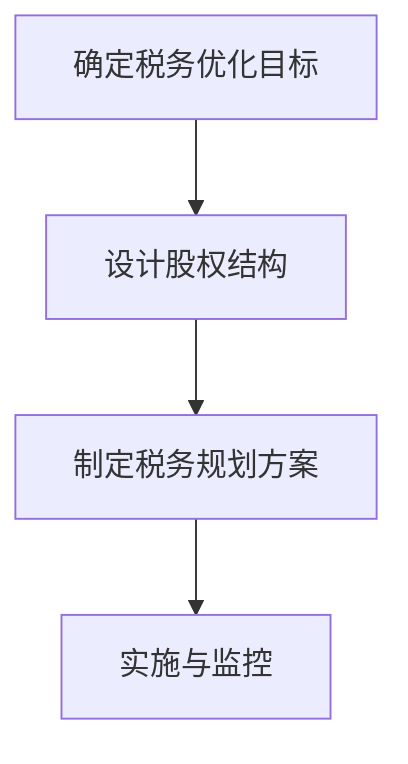
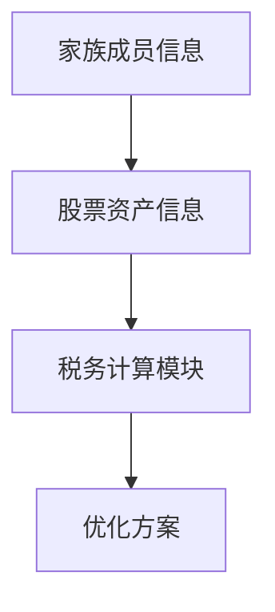
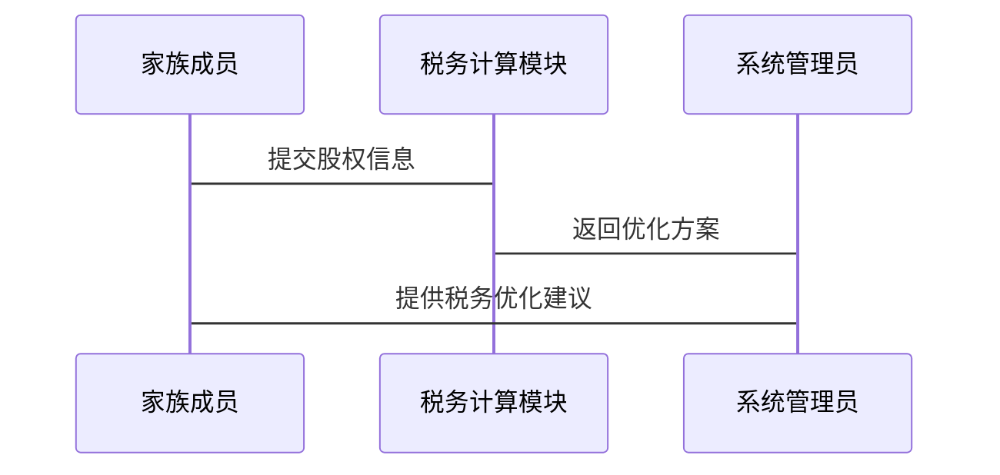

                 


# 彼得林奇的"家庭股票"在跨代财富传承中的税务优化

> 关键词：跨代财富传承，税务优化，彼得林奇，家庭股票，财富管理，税务规划

> 摘要：本文深入探讨了彼得林奇提出的“家庭股票”概念在跨代财富传承中的税务优化策略。通过分析“家庭股票”的定义、特点以及与其他财富传承工具的对比，结合实际案例和系统设计，详细阐述了如何利用“家庭股票”进行税务优化，为读者提供实用的指导和建议。

---

# 第一部分: 背景介绍

## 第1章: 跨代财富传承的背景与挑战

### 1.1 跨代财富传承的背景

#### 1.1.1 财富传承的历史演变
财富传承是人类社会长期以来的重要课题。随着经济发展和家族财富的积累，跨代财富传承的需求日益增加。从古代的财产继承到现代的资产多元化配置，财富传承的方式不断演变。

#### 1.1.2 当代财富传承的主要挑战
- 经济全球化带来的资产多样化，使得传统继承方式难以应对复杂税务问题。
- 税务政策的复杂性增加，如遗产税、赠与税等对财富传承的影响。
- 家族内部利益协调的难度，如家族成员之间的利益分配问题。

#### 1.1.3 财富传承中的税务问题
财富传承中的税务负担直接影响家族财富的保值与增值。如何在传承过程中最小化税务支出，成为家族财富管理的重要课题。

### 1.2 彼得林奇的"家庭股票"概念

#### 1.2.1 彼得林奇的投资者身份
彼得·林奇是美国著名投资家，以其成功的投资策略和长期管理富达麦哲伦基金的业绩闻名。他的投资理念强调长期持有优质股票，注重公司基本面分析。

#### 1.2.2 彼得林奇的投资哲学
彼得林奇的投资哲学强调长期价值投资，避免短期波动，注重公司盈利能力和行业地位。这种理念为“家庭股票”的提出奠定了基础。

#### 1.2.3 "家庭股票"的定义与背景
“家庭股票”是指家族成员共同持有的股票，通常用于家族财富传承。其核心在于通过股权结构设计，实现财富的跨代传承，同时优化税务负担。

---

## 第2章: 家族财富传承的重要性

### 2.1 家族财富传承的核心要素

#### 2.1.1 家族财富的定义与分类
- 家族财富包括金融资产、不动产、企业股权等多种形式。
- 跨代传承需要考虑资产的保值与增值，避免因税务问题导致财富缩水。

#### 2.1.2 家族财富传承的目标与意义
- 保障家族成员的基本生活需求。
- 维持家族企业的持续发展。
- 传承家族文化和价值观。

#### 2.1.3 家族财富传承的常见模式
- 遗产信托：通过信托结构实现财富隔离和税务优化。
- 家族基金会：通过公益基金会进行财富管理和分配。
- 直接赠与：简单但可能面临高税务负担。

---

# 第二部分: 核心概念与联系

## 第3章: "家庭股票"的核心概念与税务优化策略

### 3.1 "家庭股票"的税务优化原理

#### 3.1.1 股权结构的税务影响
- 通过控股公司架构，分散税务风险。
- 股权分配策略，如设立家族信托持有股票，降低遗产税负担。

#### 3.1.2 股票传承中的税务计算
- 遗产税计算：根据股票市值和所在地遗产税率确定税款。
- 赠与税计算：股票赠与需考虑赠与税的税率和免征条件。

#### 3.1.3 股票持有期间的税务优化
- 长期持有策略：避免短期资本利得税。
- 股票分红策略：合理安排分红时间，优化税务负担。

### 3.2 "家庭股票"与其他财富传承工具的对比

#### 3.2.1 遗产信托的比较
- 信托结构灵活性高，但设立和维护成本较高。
- 信托可有效隔离资产，避免遗产税，但需考虑管理费用。

#### 3.2.2 家族基金会的比较
- 基金会具有公益性质，适合大规模财富传承。
- 操作复杂，需符合相关法规要求。

#### 3.2.3 直接赠与的比较
- 操作简单，但可能面临赠与税的高税率。
- 适用于小规模财富传承，风险较低。

### 3.3 税务优化策略的实施步骤

#### 3.3.1 确定税务优化目标
- 明确传承目标，如减少遗产税负担，保持资产流动性。
- 分析家族成员的需求，制定个性化策略。

#### 3.3.2 设计股权结构
- 设立控股公司，分散股权持有。
- 通过家族信托持有股票，确保资产隔离。

#### 3.3.3 制定税务规划方案
- 合理安排股票分配时间，避开高峰期。
- 利用税收优惠政策，如地区税收优惠。

---

# 第三部分: 算法原理讲解

## 第4章: 税务优化算法的数学模型

### 4.1 税务优化的基本公式

#### 4.1.1 遗产税计算公式
$$ \text{遗产税} = \text{遗产总额} \times \text{遗产税率} $$

#### 4.1.2 赠与税计算公式
$$ \text{赠与税} = \text{赠与金额} \times \text{赠与税率} $$

#### 4.1.3 综合税务优化公式
$$ \text{总税务支出} = \text{遗产税} + \text{赠与税} + \text{其他相关税费} $$

### 4.2 税务优化策略的算法流程



### 4.3 具体案例分析

#### 案例背景
某家族持有价值1000万美元的股票，计划将这部分资产传承给下一代。

#### 税务计算
- 遗产税税率：5%（假设遗产税率为5%）。
- 赠与税税率：3%（假设赠与税率为3%）。

#### 优化方案
- 将股票通过家族信托持有，避免直接遗产。
- 分阶段赠与，降低赠与税负担。

#### 计算结果
- 遗产税：0（通过信托结构避免遗产税）。
- 赠与税：1000万 × 3% = 30万美元。
- 总税务支出：30万美元。

---

# 第四部分: 系统分析与架构设计

## 第5章: 系统功能设计与架构

### 5.1 问题场景介绍
- 家族成员希望通过“家庭股票”进行财富传承。
- 需要设计一个系统来管理股权结构和税务规划。

### 5.2 系统功能设计

#### 5.2.1 领域模型


#### 5.2.2 系统架构


### 5.3 系统交互流程



---

# 第五部分: 项目实战

## 第6章: 项目核心实现与案例分析

### 6.1 环境安装与配置
- 安装Python和相关库（如pandas、numpy）。
- 配置数据库环境。

### 6.2 核心代码实现

```python
import pandas as pd

def calculate_tax(value, tax_rate):
    return value * tax_rate

def optimize_stock_distribution(stock_value, tax_rate):
    tax = calculate_tax(stock_value, tax_rate)
    return f"建议将股票价值{stock_value}美元通过信托结构持有，可节省税款{tax:.2f}美元"

# 示例数据
stock_value = 10000000
tax_rate = 0.05  # 遗产税率

result = optimize_stock_distribution(stock_value, tax_rate)
print(result)
```

### 6.3 案例分析

#### 案例背景
某家族持有价值1000万美元的股票，计划传承给下一代。

#### 优化方案
- 将股票通过家族信托持有，避免遗产税。
- 分阶段赠与，降低赠与税。

#### 计算结果
- 遗产税：0（通过信托结构避免）。
- 赠与税：1000万 × 3% = 30万美元。

---

# 第六部分: 总结与展望

## 第7章: 总结与展望

### 7.1 最佳实践 tips
- 合理设计股权结构，利用信托等工具优化税务。
- 定期审查和调整税务规划方案，应对法规变化。

### 7.2 项目小结
通过“家庭股票”进行跨代财富传承，能够在税务优化方面取得显著效果，但需综合考虑股权结构、税务政策和家族需求。

### 7.3 注意事项
- 确保股权结构合法合规，避免税务风险。
- 定期评估税务规划方案，确保其有效性。

### 7.4 拓展阅读
- 推荐阅读《富爸爸穷爸爸》等书籍，深入了解财富管理策略。
- 关注相关税收政策变化，及时调整传承方案。

---

# 作者：AI天才研究院/AI Genius Institute & 禅与计算机程序设计艺术 /Zen And The Art of Computer Programming

---

本文通过详细的分析和实际案例，展示了彼得林奇的“家庭股票”在跨代财富传承中的税务优化策略。从背景介绍到系统设计，再到项目实战，全面解析了如何通过合理规划实现财富保值与传承。希望本文能为读者在财富管理和税务优化方面提供有价值的参考。

