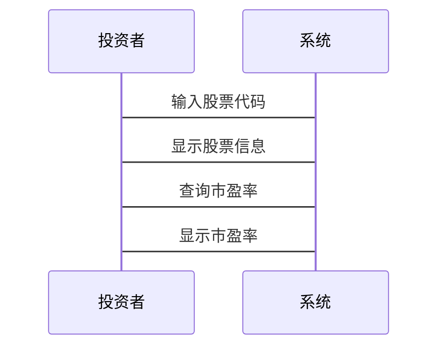

                 

<think>
好的，我将按照您的要求逐步分析和撰写这篇文章。首先，让我们从《彼得林奇的"家庭股票"投资法则》的概述开始。

### 第一部分: 彼得林奇"家庭股票"投资法则概述

#### 第1章: 投资的基本概念

##### 1.1 什么是股票

股票是企业在筹集资金时发行给投资者的所有权证书。每一张股票都代表了对一家公司的一部分所有权。投资者通过购买股票成为公司的股东，有权参与公司的利润分配，并在特定情况下行使投票权。

股票市场是投资者买卖股票的场所，通常分为主板市场和创业板市场。主板市场主要上市公司规模较大，创业板市场则主要面向成长型企业。

##### 1.2 为什么进行股票投资

股票投资的目的是为了获得资本增值和股息收益。资本增值是指股票价格的上涨带来的收益，而股息收益则是公司向股东分配的利润部分。股票投资相较于其他投资方式，具有较高的收益潜力，但也伴随着较高的风险。

投资与投机的区别在于投资注重长期价值，而投机则侧重于短期价格波动。彼得林奇主张长期投资，避免短期波动的干扰。

##### 1.3 股票市场的基本运作

股票市场的运作涉及上市公司、投资者、经纪商等多个主体。投资者通过经纪商在二级市场上买卖股票，影响股票价格的主要是供需关系、公司业绩、宏观经济环境等因素。

#### 第2章: 彼得林奇的投资理念

##### 2.1 彼得林奇的个人投资哲学

彼得林奇是著名的投资家，他的投资哲学以价值投资为核心。他强调购买那些具有持续盈利能力和良好管理的公司的股票，并长期持有，避免频繁交易。

长期投资的重要性在于市场波动的短期性，长期持有优质股票能够平滑短期波动带来的影响，最终获得资本增值。

风险控制是投资过程中不可忽视的一部分。彼得林奇建议投资者分散投资，避免过度集中于某一只股票或行业，以降低风险。

##### 2.2 家庭股票投资法则的背景

彼得林奇的家庭股票投资法则是他长期投资经验的总结，旨在为普通投资者提供一套简单易行的投资策略。他发现许多个人投资者在投资过程中容易受到市场情绪的影响，做出非理性决策。

家庭股票与机构投资的主要区别在于资金规模、投资期限和风险承受能力。家庭股票投资通常资金规模较小，投资期限灵活，风险承受能力相对较低。

##### 2.3 家庭股票与机构投资的区别

家庭股票投资更加注重长期稳定的收益，而机构投资则更关注短期绩效和市场趋势。家庭股票投资者通常不具备专业的研究团队，因此更依赖于对公司基本面的深入分析。

---

### 第二部分: 家庭股票投资法则的核心概念

#### 第3章: 家庭股票投资法则的原理

##### 3.1 家庭股票投资法则的核心要素

##### 3.1.1 选股标准

彼得林奇的选股标准包括以下几个方面：

1. **公司基本面**：关注公司的财务状况、盈利能力、成长能力等。
2. **行业地位**：选择行业内的龙头公司，具有竞争优势。
3. **管理团队**：管理团队的素质和稳定性是公司长期发展的关键。
4. **估值水平**：股票价格是否合理，市盈率、市净率等指标是否处于合理范围。

##### 3.1.2 投资期限

家庭股票投资通常采用长期投资策略，避免频繁交易。长期投资能够有效降低交易成本和税务负担，同时平滑市场波动的影响。

##### 3.1.3 资金分配

分散投资是降低风险的重要手段。彼得林奇建议将资金分散投资于多只股票，避免过度集中。一般来说，分散投资于10只以上的股票能够有效降低非系统性风险。

##### 3.2 家庭股票与机构股票的对比

##### 3.2.1 投资目标的差异

家庭股票投资注重长期稳定的收益，追求资本增值和股息收入。机构投资则更关注短期绩效和市场趋势，追求超额收益。

##### 3.2.2 风险承受能力的差异

家庭股票投资者通常风险承受能力较低，无法承受较大的本金损失。机构投资者则有更高的风险承受能力，能够承担更多的市场波动。

##### 3.2.3 投资策略的差异

家庭股票投资策略简单易行，适合普通投资者。机构投资策略通常更加复杂，涉及大量专业的研究和分析。

#### 第4章: 家庭股票投资法则的数学模型

##### 4.1 股票价值评估公式

##### 4.1.1 市盈率（P/E）计算公式

市盈率（P/E）= 股票价格 / 每股收益

例如，某股票价格为50元，每股收益为5元，则P/E = 10。

##### 4.1.2 市净率（P/B）计算公式

市净率（P/B）= 股票价格 / 每股净资产

例如，某股票价格为30元，每股净资产为15元，则P/B = 2。

##### 4.1.3 股息率计算公式

股息率 = 每股股息 / 股票价格 × 100%

例如，某股票每股股息为2元，股票价格为20元，则股息率 = 10%。

---

### 第三部分: 家庭股票投资法则的系统分析

#### 第5章: 家庭股票投资系统的架构设计

##### 5.1 问题场景介绍

家庭股票投资者需要一个简单有效的系统来辅助选股和投资决策。系统需要考虑股票的基本面、估值水平以及市场趋势等因素。

##### 5.2 系统功能设计

##### 5.2.1 领域模型（Mermaid 类图）


##### 5.3 系统架构设计（Mermaid架构图）

```mermaid
archi
    title 家庭股票投资系统架构
    网络层 --> 应用层
    应用层 --> 数据层
    数据层 --> 股票数据库
    数据层 --> 投资者数据库
    应用层 --> 投资者界面
```

##### 5.4 系统接口设计

系统需要提供以下接口：

1. 数据输入接口：接收股票数据和投资者信息。
2. 数据处理接口：计算股票估值、生成投资建议。
3. 结果输出接口：显示投资组合和市场分析结果。

##### 5.5 系统交互设计（Mermaid序列图）



---

### 第四部分: 家庭股票投资法则的项目实战

#### 第6章: 项目实战

##### 6.1 环境安装

首先，安装Python和必要的库：

```bash
pip install pandas numpy matplotlib
```

##### 6.2 系统核心实现源代码

以下是股票分析系统的Python代码：

```python
import pandas as pd
import numpy as np
import matplotlib.pyplot as plt

# 读取股票数据
data = pd.read_csv('stock_data.csv')

# 计算市盈率
pe = data['股价'] / data['每股收益']

# 计算市净率
pb = data['股价'] / data['每股净资产']

# 计算股息率
dividend_yield = data['股息'] / data['股价'] * 100

# 绘制市盈率分布图
plt.hist(pe, bins=10, alpha=0.5, label='市盈率')
plt.xlabel('市盈率')
plt.ylabel('频数')
plt.legend()
plt.show()

# 打印结果
print("市盈率均值:", np.mean(pe))
print("市净率均值:", np.mean(pb))
print("股息率均值:", np.mean(dividend_yield))
```

##### 6.3 代码应用解读与分析

以上代码读取股票数据后，分别计算了市盈率、市净率和股息率，并绘制了市盈率分布图。通过这些指标，可以帮助投资者判断股票的估值水平。

##### 6.4 实际案例分析

以某公司为例：

- 股票价格：50元
- 每股收益：5元
- 每股净资产：15元
- 股息：2元

计算得到：

- 市盈率：10
- 市净率：3.33
- 股息率：4%

通过这些指标，可以判断该股票是否具有投资价值。

##### 6.5 项目小结

通过实战项目，我们了解了如何利用Python进行股票数据分析，掌握了市盈率、市净率和股息率的计算方法，并能够通过图表直观地展示分析结果。

---

### 第五部分: 家庭股票投资法则的最佳实践

#### 第7章: 最佳实践

##### 7.1 投资建议

- **分散投资**：避免过度集中于某一只股票或行业。
- **长期持有**：坚持价值投资，避免短期波动的干扰。
- **定期调整**：根据市场变化和个人财务状况，适当调整投资组合。

##### 7.2 小结

彼得林奇的家庭股票投资法则为普通投资者提供了一套简单有效的投资策略。通过长期持有优质股票，分散投资风险，普通投资者也能够实现财富的稳健增长。

##### 7.3 注意事项

- **风险提示**：股票投资存在市场风险，投资者需谨慎决策。
- **持续学习**：保持对市场和公司的关注，及时调整投资策略。
- **合规投资**：遵守相关法律法规，合法合规地进行投资活动。

##### 7.4 拓展阅读

推荐书籍：

- 《彼得·林奇的成功投资》
- 《股票投资实战技巧》
- 《价值投资入门》

---

### 结语

彼得林奇的家庭股票投资法则是价值投资的经典案例。通过本文的详细讲解和实战分析，我们掌握了家庭股票投资的核心要素、数学模型和系统设计方法。希望这些内容能够帮助您在股票投资中获得稳健的收益。

作者：AI天才研究院/AI Genius Institute & 禅与计算机程序设计艺术 /Zen And The Art of Computer Programming

