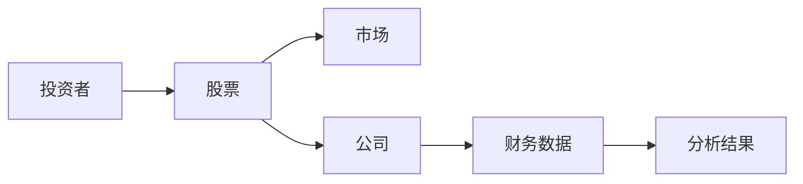
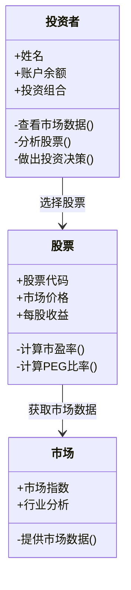
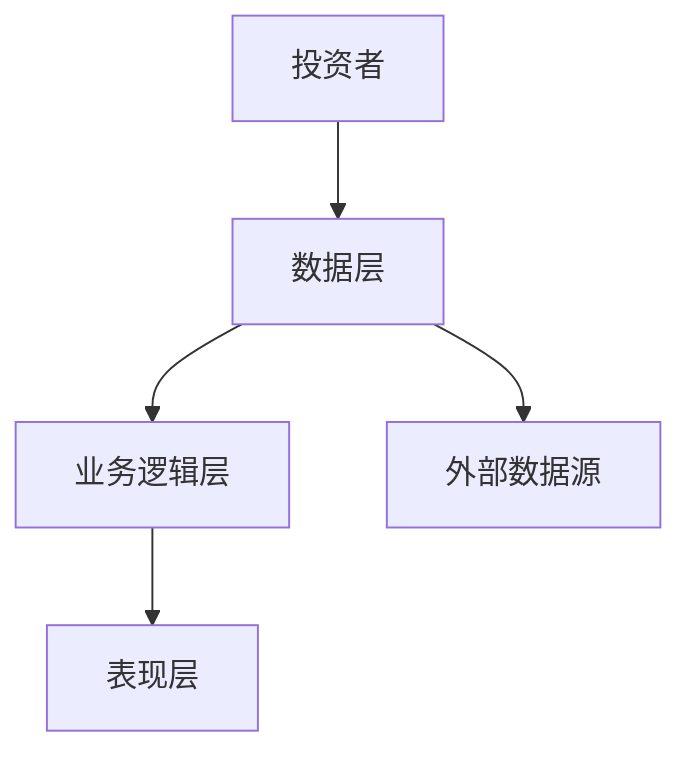
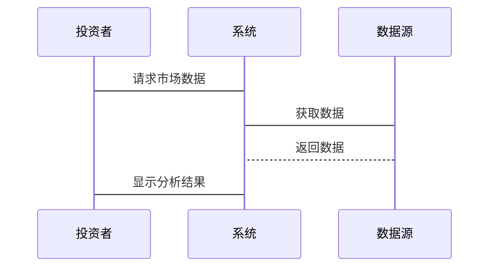

                 


# 彼得林奇的"家庭股票"长期跟踪方法

---

## 关键词：彼得林奇、长期跟踪、家庭股票、投资策略、价值投资、股票分析、投资方法

---

## 摘要：本文详细探讨了彼得·林奇的“家庭股票”长期跟踪方法，分析了该方法的核心概念、算法原理、系统设计与实现，并通过实际案例展示了其在投资中的应用。文章从背景介绍、核心概念、算法原理、系统设计、项目实战等多个维度展开，为读者提供了全面而深入的指导。

---

## 第一部分: 引言

## 第2章: 长期跟踪股票的背景与目标

### 2.3 长期跟踪股票的策略与方法

#### 2.3.1 彼得林奇的长期跟踪策略
- 彼得林奇的投资哲学
- 长期跟踪的核心理念
- 如何选择“家庭股票”

#### 2.3.2 长期跟踪的实现方法
- 定期复盘与分析
- 数据记录与可视化
- 调整与优化策略

---

## 第三部分: 核心概念与联系

## 第3章: 股票分析的核心概念

### 3.1 股票分析的核心概念
- 市场价值与内在价值
- 基本面分析与技术分析
- 彼得林奇的分析框架

### 3.2 核心概念的联系

#### 3.2.1 核心概念对比表格
| 概念          | 定义与特征           | 关键指标         | 相关公式         |
|---------------|----------------------|-----------------|-----------------|
| 市盈率 (PE)   | 每股市价与每股收益的比值 | PE = 市价 / 每股收益 | $$PE = \frac{P}{E}$$ |
| 市净率 (PB)   | 每股市价与每股净资产的比值 | PB = 市价 / 每股净资产 | $$PB = \frac{P}{B}$$ |
| 市销率 (P/S)  | 每股市价与每股销售额的比值 | P/S = 市价 / 每股销售额 | $$P/S = \frac{P}{S}$$ |
| 市盈率增长比 (PEG) | 市盈率与预期增长率的比值 | PEG = PE / 预期增长率 | $$PEG = \frac{PE}{G}$$ |

#### 3.2.2 ER 实体关系图



---

## 第四部分: 算法原理讲解

## 第4章: 彼得林奇的长期跟踪算法

### 4.1 算法原理概述

#### 4.1.1 分析流程


#### 4.1.2 关键算法步骤
1. 数据收集与清洗
2. 市场价与内在价值的计算
3. 市盈率与PEG比率的计算
4. 投资决策的制定

### 4.2 算法数学模型

#### 4.2.1 市盈率模型
$$PE = \frac{P}{E}$$
- $P$：股票的市场价格
- $E$：每股收益

#### 4.2.2 PEG比率模型
$$PEG = \frac{PE}{G}$$
- $PE$：市盈率
- $G$：预期年增长率

#### 4.2.3 实际案例分析
假设某股票的市场价格为$50，每股收益为$5，预期年增长率为10%：
$$PE = \frac{50}{5} = 10$$
$$PEG = \frac{10}{0.1} = 100$$
该股票的PEG比率为100，表明其价格可能被高估。

---

## 第五部分: 系统分析与架构设计方案

## 第5章: 长期跟踪系统的构建

### 5.1 项目介绍

#### 5.1.1 项目背景
- 系统目标：实现对“家庭股票”的长期跟踪与分析
- 项目范围：涵盖数据收集、分析、决策支持
- 项目参与者：投资者、数据分析师、系统开发人员

### 5.2 系统功能设计

#### 5.2.1 领域模型


#### 5.2.2 系统架构设计


### 5.3 接口设计与交互

#### 5.3.1 系统交互流程


---

## 第六部分: 项目实战

## 第6章: 实现长期跟踪系统的实战

### 6.1 环境安装

#### 6.1.1 安装 Python 环境
```bash
# 安装 Python 和 pip
sudo apt update
sudo apt install python3 python3-pip
```

#### 6.1.2 安装必要的库
```bash
pip install pandas numpy matplotlib seaborn
```

### 6.2 核心代码实现

#### 6.2.1 数据收集与清洗
```python
import pandas as pd
import numpy as np

# 示例数据
data = {
    '股票代码': ['AAPL', 'MSFT', 'GOOGL'],
    '市场价格': [150, 300, 120],
    '每股收益': [10, 15, 12],
    '预期增长率': [0.08, 0.07, 0.09]
}
df = pd.DataFrame(data)
```

#### 6.2.2 市盈率与PEG比率计算
```python
# 计算市盈率
df['PE'] = df['市场价格'] / df['每股收益']

# 计算PEG比率
df['PEG'] = df['PE'] / df['预期增长率']

print(df)
```

#### 6.2.3 可视化分析
```python
import matplotlib.pyplot as plt
import seaborn as sns

sns.set(style="whitegrid", palette="muted")
plt.figure(figsize=(10,6))
sns.scatterplot(x='PE', y='PEG', hue='股票代码', data=df)
plt.xlabel('市盈率')
plt.ylabel('PEG比率')
plt.title('股票分析')
plt.show()
```

---

## 第七部分: 最佳实践

## 第7章: 彼得林奇方法的实践总结

### 7.1 小结
- 彼得林奇的长期跟踪方法的核心在于基本面分析与长期持有
- 通过定期复盘与调整策略，投资者可以优化投资组合
- 系统化的方法能够提高分析效率与准确性

### 7.2 注意事项
- 风险控制：避免过度集中投资
- 数据准确性：确保数据来源可靠
- 保持耐心：长期跟踪需要时间和耐心

### 7.3 拓展阅读
- 彼得林奇的书籍《彼得林奇选股术》
- 价值投资的经典理论
- 现代投资组合理论（MPT）

---

## 作者：AI天才研究院/AI Genius Institute & 禅与计算机程序设计艺术 /Zen And The Art of Computer Programming

