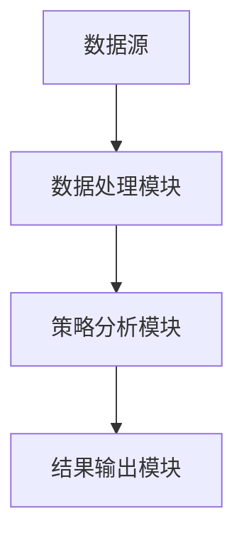
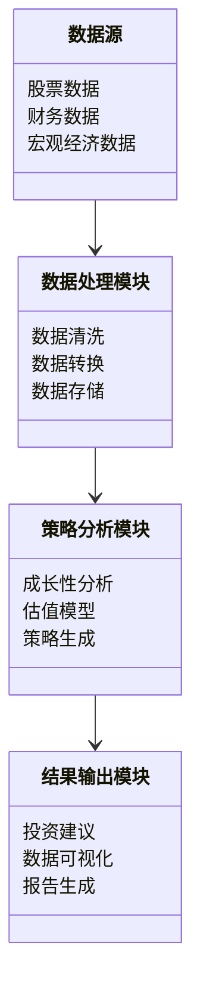

                 


# 彼得林奇的"小盘成长股"在不同货币政策环境下的选股策略

> 关键词：彼得林奇，小盘成长股，货币政策，投资策略，股票分析

> 摘要：本文深入探讨了彼得林奇的“小盘成长股”投资策略，并结合不同的货币政策环境，分析了该策略在实际投资中的应用。通过理论分析与实际案例相结合，本文揭示了在不同货币政策下，如何选择和优化小盘成长股投资组合，以实现长期稳定的收益。文章还提供了数学模型和系统架构设计，为投资者提供了科学的决策支持。

---

## 第一部分：彼得林奇的“小盘成长股”投资策略概述

### 第1章：小盘成长股的核心概念

#### 1.1 小盘成长股的定义与特征

##### 1.1.1 小盘成长股的定义
小盘成长股是指市值较小但具有高成长潜力的股票。这类股票通常属于新兴行业或快速扩张的公司，具有较高的增长预期。

##### 1.1.2 小盘成长股的核心特征
- **低估值**：相对于其成长潜力，小盘成长股通常具有较低的市盈率或市净率。
- **高成长性**：公司收入和利润增长率较高，且具有较强的行业竞争优势。
- **流动性风险**：由于市值较小，交易量可能较低，市场波动较大。

##### 1.1.3 小盘成长股与大盘股的对比
| 特性       | 小盘成长股 | 大盘成长股 |
|------------|------------|------------|
| 市值       | 较小       | 较大       |
| 成长性     | 较高       | 较稳定     |
| 估值       | 较低       | 较高       |
| 风险       | 较高       | 较低       |

#### 1.2 彼得林奇的投资理念

##### 1.2.1 彼得林奇的选股标准
彼得林奇在选股时注重以下几点：
- 公司具有明确的行业地位。
- 公司具有较高的成长性。
- 公司估值合理。

##### 1.2.2 小盘成长股的投资逻辑
- 小盘成长股具有较高的增值潜力。
- 小盘股在市场波动中更具弹性。
- 小盘股的投资机会往往被市场忽视。

##### 1.2.3 长期投资与价值发现
彼得林奇强调长期投资，注重挖掘被市场低估的公司，通过持续跟踪和研究，发现其成长潜力。

#### 1.3 货币政策对股市的影响

##### 1.3.1 货币政策的定义与分类
货币政策是政府通过调节货币供应量和利率，影响经济活动的政策工具。常见的货币政策包括宽松、紧缩和中性三种类型。

##### 1.3.2 不同货币政策对股市的影响
- **宽松货币政策**：降低利率，增加货币供应，提升股市估值。
- **紧缩货币政策**：提高利率，减少货币供应，抑制股市泡沫。
- **中性货币政策**：保持利率稳定，避免过度波动。

##### 1.3.3 货币政策与股票估值的关系
货币政策直接影响市场流动性，进而影响股票的估值和价格。宽松货币政策通常会推高股市估值，而紧缩货币政策则会抑制股市表现。

---

### 第2章：小盘成长股的筛选标准

#### 2.1 成长性分析

##### 2.1.1 收入与利润增长率
- 收入增长率：公司收入的年增长率。
- 净利润增长率：公司净利润的年增长率。

##### 2.1.2 营业利润率与净利润率
- 营业利润率 = 营业利润 / 营业收入。
- 净利润率 = 净利润 / 营业收入。

##### 2.1.3 行业地位与竞争优势
- 行业地位：公司在行业中的排名和市场份额。
- 竞争优势：公司在产品、技术或成本上的优势。

#### 2.2 小盘股的估值方法

##### 2.2.1 市盈率（P/E）分析
$$ P/E = \frac{\text{股价}}{\text{每股收益}} $$

##### 2.2.2 市净率（P/B）分析
$$ P/B = \frac{\text{股价}}{\text{每股净资产}} $$

##### 2.2.3 市销率（P/S）分析
$$ P/S = \frac{\text{股价}}{\text{每股收入}} $$

#### 2.3 财务健康状况评估

##### 2.3.1 负债率与流动性分析
- 负债率 = 总负债 / 总资产。
- 流动比率 = 流动资产 / 流动负债。

##### 2.3.2 盈利能力与现金流分析
- 净资产收益率（ROE）= 净利润 / 净资产。
- 经营活动现金流净额：公司经营活动产生的现金流。

##### 2.3.3 财务造假的识别方法
- 关注财务数据的异常波动。
- 通过行业对比分析财务数据的合理性。

---

### 第3章：不同货币政策环境下的投资策略

#### 3.1 货币宽松环境下的投资策略

##### 3.1.1 低利率环境下的小盘成长股机会
- 利率降低，资金成本下降，小盘成长股的估值上升。
- 市场流动性增加，小盘股更容易被发现和投资。

##### 3.1.2 货币宽松对成长股估值的提升作用
- 低利率环境下，成长股的高成长性更容易被市场认可。
- 股票的市盈率和市净率通常会上升。

##### 3.1.3 选择高成长性企业的策略
- 优先选择收入和利润增长率高的公司。
- 关注行业前景广阔的新兴行业。

#### 3.2 货币紧缩环境下的投资策略

##### 3.2.1 高利率环境下的小盘成长股风险
- 利率上升，企业融资成本增加，影响成长性。
- 市场流动性下降，小盘股的波动性增加。

##### 3.2.2 货币紧缩对成长股的影响
- 成长股的估值可能被压制。
- 高成长性公司可能面临更高的融资难度。

##### 3.2.3 优质成长股的投资机会
- 选择财务健康、现金流充裕的公司。
- 优先考虑行业龙头或具有竞争优势的公司。

#### 3.3 中性货币政策环境下的投资策略

##### 3.3.1 中性环境下的小盘成长股表现
- 市场波动较小，小盘成长股的表现相对稳定。
- 优质成长股的估值处于合理区间。

##### 3.3.2 选择成长与估值平衡的企业
- 综合考虑公司的成长性和估值水平。
- 优先选择具有较高成长性和合理估值的公司。

##### 3.3.3 风险控制与投资组合优化
- 分散投资，降低风险。
- 定期调整投资组合，保持合理配置。

---

### 第4章：数学模型与估值方法

#### 4.1 成长股的数学模型

##### 4.1.1 收入与利润增长率模型
$$ \text{收入增长率} = \frac{\text{本期收入} - \text{上期收入}}{\text{上期收入}} $$
$$ \text{净利润增长率} = \frac{\text{本期净利润} - \text{上期净利润}}{\text{上期净利润}} $$

##### 4.1.2 现金流折现模型（DCF）
$$ \text{企业价值} = \sum_{t=1}^{n} \frac{\text{自由现金流}}{(1 + r)^t} + \frac{\text{终值}}{(1 + r)^n} $$

##### 4.1.3 市盈率与市净率的对比分析
$$ \text{市盈率} = \frac{\text{股价}}{\text{每股收益}} $$
$$ \text{市净率} = \frac{\text{股价}}{\text{每股净资产}} $$

#### 4.2 小盘股的估值公式

##### 4.2.1 市盈率（P/E）计算公式
$$ P/E = \frac{\text{股价}}{\text{每股收益}} $$

##### 4.2.2 市净率（P/B）计算公式
$$ P/B = \frac{\text{股价}}{\text{每股净资产}} $$

##### 4.2.3 市销率（P/S）计算公式
$$ P/S = \frac{\text{股价}}{\text{每股收入}} $$

#### 4.3 货币政策与股票估值的关系

##### 4.3.1 利率与股票估值模型
$$ \text{股票估值} = \frac{\text{现金流}}{(1 + r)^n} $$
其中，\( r \) 为利率。

##### 4.3.2 货币政策对股票流动性的影响
货币政策通过影响市场流动性，进而影响股票的买卖价差和交易量。

##### 4.3.3 货币政策与股票价格的相关性分析
- 在宽松货币政策下，股票价格通常会上涨。
- 在紧缩货币政策下，股票价格通常会下跌。

---

### 第5章：系统分析与架构设计方案

#### 5.1 系统分析框架

##### 5.1.1 投资策略分析模块
- 数据收集与处理。
- 成长性分析与估值模型。

##### 5.1.2 数据收集与处理模块
- 数据源：股票数据、财务数据、宏观经济数据。
- 数据清洗与预处理。

##### 5.1.3 系统架构设计模块
- 数据流图：展示数据流动与处理过程。
- 类图：展示系统中的类及其关系。

#### 5.2 系统架构设计

##### 5.2.1 数据流图


##### 5.2.2 类图


---

### 第6章：项目实战与总结

#### 6.1 项目实战

##### 6.1.1 环境配置
- 安装Python和相关库（如pandas、numpy、matplotlib）。
- 数据源：获取小盘成长股的股票数据和宏观经济数据。

##### 6.1.2 数据收集与处理
```python
import pandas as pd
import numpy as np

# 获取股票数据
def get_stock_data(tickers):
    data = {}
    for ticker in tickers:
        data[ticker] = pd.read_csv(f'data/{ticker}.csv')
    return data

# 数据清洗
def data_cleaning(data):
    cleaned_data = {}
    for ticker, df in data.items():
        df.dropna(inplace=True)
        cleaned_data[ticker] = df
    return cleaned_data
```

##### 6.1.3 策略实现
```python
def growth_stock_selection(data, growth_rate=20%, valuation_ratio=15):
    selected_stocks = []
    for ticker, df in data.items():
        # 计算收入增长率
        revenue_growth = (df['收入'].iloc[-1] - df['收入'].iloc[-2]) / df['收入'].iloc[-2]
        # 计算净利润增长率
        net_profit_growth = (df['净利润'].iloc[-1] - df['净利润'].iloc[-2]) / df['净利润'].iloc[-2]
        # 计算市盈率
        pe = df['股价'].iloc[-1] / df['每股收益'].iloc[-1]
        # 计算市净率
        pb = df['股价'].iloc[-1] / df['每股净资产'].iloc[-1]
        # 判断是否符合筛选条件
        if revenue_growth > growth_rate and pe < valuation_ratio:
            selected_stocks.append(ticker)
    return selected_stocks
```

##### 6.1.4 回测与分析
```python
selected_stocks = growth_stock_selection(cleaned_data)
print("选中的小盘成长股：", selected_stocks)
```

#### 6.2 总结

##### 6.2.1 投资策略的有效性
- 在不同货币政策环境下，小盘成长股的投资策略具有较高的收益潜力。
- 通过合理的估值模型和筛选标准，可以有效控制风险。

##### 6.2.2 风险管理与优化
- 定期调整投资组合，避免过度集中。
- 通过多元化投资降低风险。

##### 6.2.3 未来的研究方向
- 进一步优化筛选模型，引入更多指标。
- 结合宏观经济指标，优化投资策略。

---

## 作者：AI天才研究院/AI Genius Institute & 禅与计算机程序设计艺术/Zen And The Art of Computer Programming

