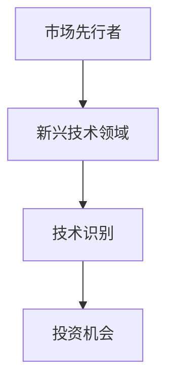
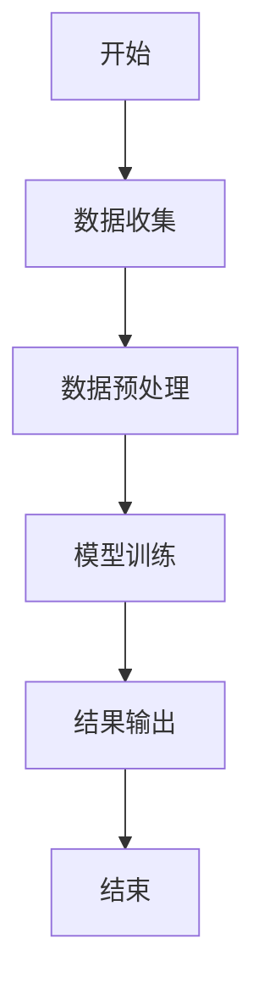
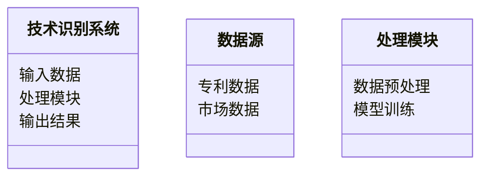
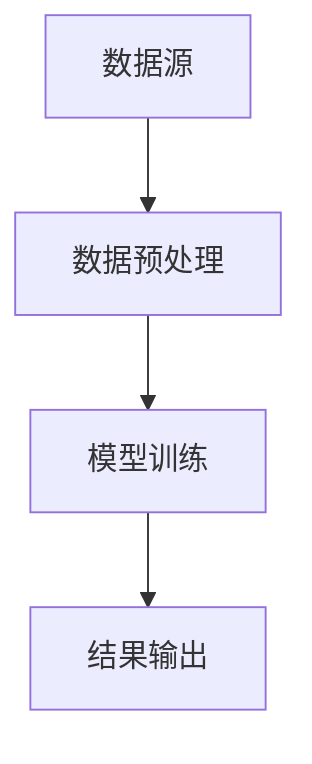
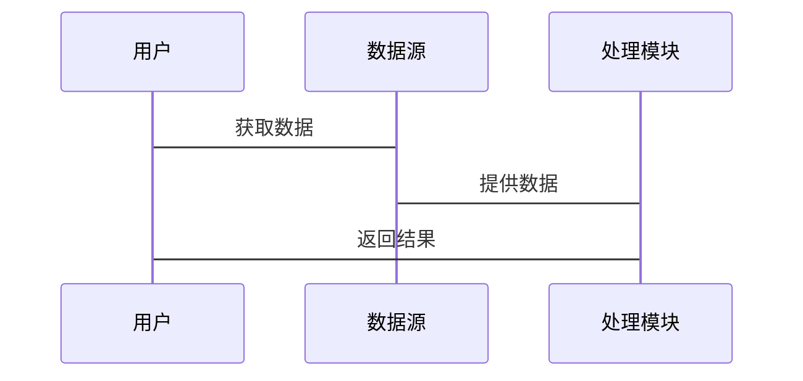

                 


```markdown
# 彼得林奇的"市场先行者"在新兴技术领域的识别方法

## 关键词：彼得林奇，市场先行者，新兴技术，技术识别，投资策略

## 摘要：本文详细探讨了彼得林奇的"市场先行者"理论在新兴技术领域中的应用，通过分析技术识别的核心概念、算法原理、系统架构及实际案例，为投资者提供了一套基于市场先行者策略的技术识别方法。

---

## 第1章: 背景介绍与核心概念

### 1.1 彼得林奇的市场先行者理论
#### 1.1.1 市场先行者的定义
市场先行者是指在市场变化初期能够识别出新兴技术或趋势，并提前布局的投资者或企业。这一概念源于彼得·林奇的投资策略，强调在市场波动初期抓住机会。

#### 1.1.2 理论的起源与演变
彼得·林奇的市场先行者理论起源于对市场趋势的敏锐洞察，他通过分析市场数据和企业基本面，总结出一套识别市场先行者的指标和方法。

#### 1.1.3 理论在投资领域的应用
市场先行者理论在投资领域主要用于识别具有成长潜力的企业和行业，帮助投资者在市场变化初期做出正确的投资决策。

### 1.2 新兴技术领域的识别方法
#### 1.2.1 新兴技术的定义与特征
新兴技术是指在特定时间内出现，具有创新性和潜力的技术领域，如人工智能、区块链、5G等。

#### 1.2.2 技术识别的关键指标
- 技术创新性：技术是否具有突破性或颠覆性。
- 市场需求：是否有明确的市场需求和应用场景。
- 专利数量：技术相关的专利数量和质量。
- 市场份额：技术在市场中的占有率。

#### 1.2.3 市场先行者在技术识别中的作用
市场先行者通过分析技术的市场潜力、竞争环境和未来发展趋势，提前布局具有潜力的技术领域。

### 1.3 问题背景与目标
#### 1.3.1 技术识别的挑战
- 技术更新快，信息不对称。
- 市场波动大，风险高。

#### 1.3.2 投资者面临的机遇与风险
- 机遇：早期投资新兴技术领域可能获得高回报。
- 风险：技术失败或市场淘汰的风险。

#### 1.3.3 理论目标与实际应用的结合
通过市场先行者理论，投资者可以在新兴技术领域中找到具有潜力的技术，提前布局，降低投资风险。

---

## 第2章: 核心概念与联系

### 2.1 核心概念原理
#### 2.1.1 市场先行者的属性特征
- 先见性：能够提前识别市场变化。
- 灵活性：能够快速调整投资策略。

#### 2.1.2 新兴技术的生命周期模型
新兴技术通常经历萌芽期、发展期、成熟期和衰退期。

#### 2.1.3 技术识别的多维度分析
从技术、市场、经济等多个维度对新兴技术进行综合分析。

### 2.2 核心概念对比表
| 技术识别方法 | 优点 | 缺点 |
|--------------|------|------|
| 基于专利的分析 | 数据全面 | 数据量大，分析复杂 |
| 基于市场的分析 | 结果直观 | 受市场波动影响大 |
| 基于专家意见的分析 | 专业性强 | 受主观因素影响 |

### 2.3 实体关系图


---

## 第3章: 算法原理与实现

### 3.1 算法原理
#### 3.1.1 基于关键词的文本分析算法
通过分析技术领域的关键词，识别新兴技术的趋势。

#### 3.1.2 市场趋势预测模型
利用历史数据和机器学习模型预测市场趋势。

#### 3.1.3 技术成熟度评估指标
通过技术成熟度指数（TMI）量化技术的成熟程度。

### 3.2 算法流程图


### 3.3 Python实现示例
```python
def calculate_tmi(technology_data):
    # 计算技术成熟度指数
    tmi = 0
    for data in technology_data:
        tmi += data['patents'] * 0.3 + data['market_share'] * 0.4 + data['growth_rate'] * 0.3
    return tmi
```

### 3.4 数学模型
技术成熟度指数（TMI）的计算公式为：
$$ TMI = 0.3 \times P + 0.4 \times M + 0.3 \times G $$
其中，P代表专利数量，M代表市场占有率，G代表增长率。

---

## 第4章: 系统分析与架构设计

### 4.1 系统功能设计
#### 4.1.1 领域模型


#### 4.1.2 系统架构


#### 4.1.3 接口和交互


---

## 第5章: 项目实战

### 5.1 环境安装
- 安装Python和相关库（如Pandas、Scikit-learn）。

### 5.2 核心实现
```python
import pandas as pd
from sklearn import linear_model

def main():
    data = pd.read_csv('technology.csv')
    # 数据预处理
    processed_data = data.dropna()
    # 模型训练
    model = linear_model.LinearRegression()
    model.fit(processed_data[['patents', 'market_share']], processed_data['growth_rate'])
    # 结果输出
    print(model.predict([[5, 0.2]]))
```

### 5.3 实际案例分析
以人工智能领域为例，分析其技术成熟度和市场潜力。

### 5.4 项目小结
通过实际案例分析，验证了市场先行者理论在新兴技术识别中的有效性。

---

## 第6章: 最佳实践与注意事项

### 6.1 小结
市场先行者理论为新兴技术识别提供了有效的指导方法。

### 6.2 注意事项
- 定期更新数据，保持模型的准确性。
- 结合多种方法进行技术识别，降低风险。

### 6.3 拓展阅读
推荐阅读彼得·林奇的相关著作，深入理解市场先行者理论。

---

## 作者：AI天才研究院 & 禅与计算机程序设计艺术
```

