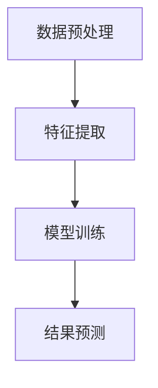
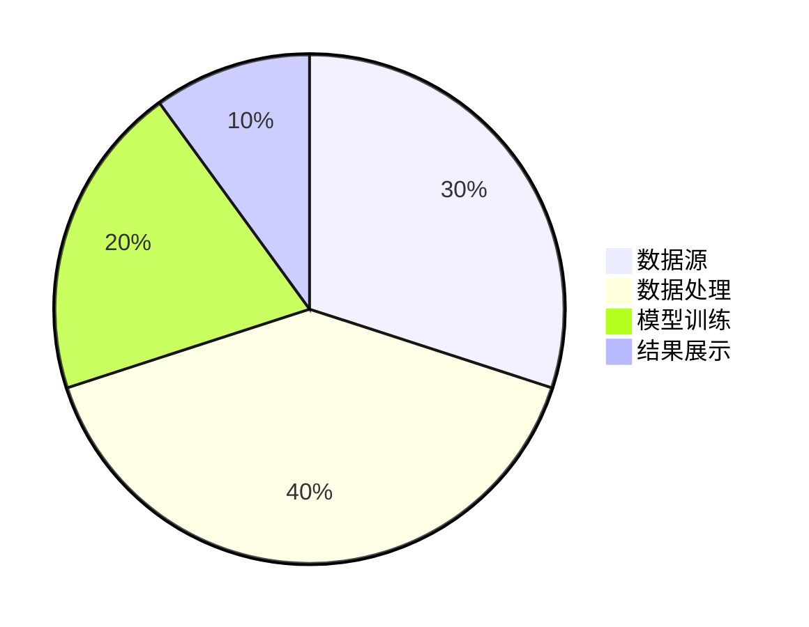

                 


# 彼得林奇的"市场情绪"指标在不同资产类别中的预测能力

## 关键词：市场情绪，彼得林奇，资产类别，预测能力，投资策略

## 摘要：本文深入探讨了彼得林奇提出的市场情绪指标在不同资产类别中的预测能力。通过分析市场情绪的定义、计算方法及其对资产价格的影响，结合统计模型和机器学习算法，本文构建了一个完整的预测系统，并通过实际案例展示了如何应用这些指标进行投资决策。文章最后总结了最佳实践建议，帮助投资者在实际操作中有效利用市场情绪指标。

---

## 第1章：市场情绪的定义与重要性

### 1.1 市场情绪的内涵
市场情绪是指投资者在市场中的整体情绪状态，通常表现为乐观或悲观。它反映了投资者对市场的看法和行为，影响着资产价格的波动。

### 1.2 彼得林奇的市场情绪理论
彼得林奇在其投资策略中强调了市场情绪的重要性，认为投资者的情绪波动是市场波动的主要原因之一。他提出了市场情绪指标，用于衡量市场的乐观或悲观程度。

---

## 第2章：市场情绪指标的核心概念

### 2.1 常见市场情绪指标
1. **恐慌指数（VIX）**：反映市场波动性的指标，数值越高，市场情绪越恐慌。
2. **投资者信心指数**：通过调查投资者信心来衡量市场情绪。
3. **市场情绪指数（Momentum）**：通过资产价格的变化率来衡量市场情绪。

### 2.2 指标的计算方法
以恐慌指数为例，其计算公式为：
$$ VIX = \sqrt{\frac{1}{n} \sum_{i=1}^{n} (R_i - \mu)^2} $$
其中，$R_i$为资产的收益率，$\mu$为平均收益率，$n$为样本数量。

---

## 第3章：市场情绪对不同资产类别的影响

### 3.1 股票市场的情绪分析
股票市场的波动性较高，市场情绪对其影响显著。当市场情绪乐观时，股票价格往往上涨；反之，市场情绪悲观时，股票价格下跌。

### 3.2 债券市场的情绪分析
债券市场的市场情绪相对稳定，但市场情绪的变化仍会影响债券的收益率。市场情绪乐观时，债券需求增加，收益率下降；市场情绪悲观时，债券需求减少，收益率上升。

### 3.3 商品市场的情绪分析
商品市场的波动性较大，市场情绪对其影响尤为明显。例如，黄金作为避险资产，市场情绪悲观时需求增加，价格上升。

---

## 第4章：市场情绪指标的数学模型与算法

### 4.1 统计模型
1. **回归分析**：通过回归模型预测资产价格与市场情绪的关系。
2. **时间序列分析**：利用ARIMA模型预测市场情绪的变化趋势。

### 4.2 机器学习模型
1. **支持向量机（SVM）**：用于分类市场情绪状态。
2. **随机森林**：用于预测市场情绪对资产价格的影响。

### 4.3 算法流程图


---

## 第5章：系统架构与接口设计

### 5.1 系统功能设计
1. 数据采集模块：从金融市场获取实时数据。
2. 数据处理模块：清洗和转换数据。
3. 模型构建模块：训练市场情绪预测模型。
4. 结果展示模块：可视化预测结果。

### 5.2 系统架构图


---

## 第6章：项目实战与代码实现

### 6.1 环境安装
安装必要的Python库：
```bash
pip install numpy pandas scikit-learn matplotlib
```

### 6.2 核心代码实现
1. 数据处理：
```python
import pandas as pd
import numpy as np

# 加载数据
data = pd.read_csv('market_data.csv')

# 数据清洗
data.dropna()
```

2. 模型训练：
```python
from sklearn.ensemble import RandomForestClassifier

# 训练随机森林模型
model = RandomForestClassifier()
model.fit(X_train, y_train)
```

3. 结果可视化：
```python
import matplotlib.pyplot as plt

# 绘制市场情绪变化图
plt.plot(predictions, label='预测值')
plt.xlabel('时间')
plt.ylabel('市场情绪')
plt.show()
```

---

## 第7章：总结与展望

### 7.1 本书内容总结
市场情绪指标是投资者进行决策的重要工具。通过分析不同资产类别的市场情绪，投资者可以更好地预测市场走势，优化投资策略。

### 7.2 最佳实践建议
1. 结合多种市场情绪指标进行综合分析。
2. 定期更新模型，以适应市场变化。
3. 注意市场情绪的短期波动，避免过度依赖情绪指标。

---

## 作者信息

作者：AI天才研究院 & 禅与计算机程序设计艺术

---

**这篇文章通过详细分析彼得林奇的市场情绪指标，结合统计模型和机器学习算法，构建了一个完整的预测系统，并通过实际案例展示了其在不同资产类别中的应用。希望读者能够通过本文，更好地理解和应用市场情绪指标，提升投资决策的准确性。**

