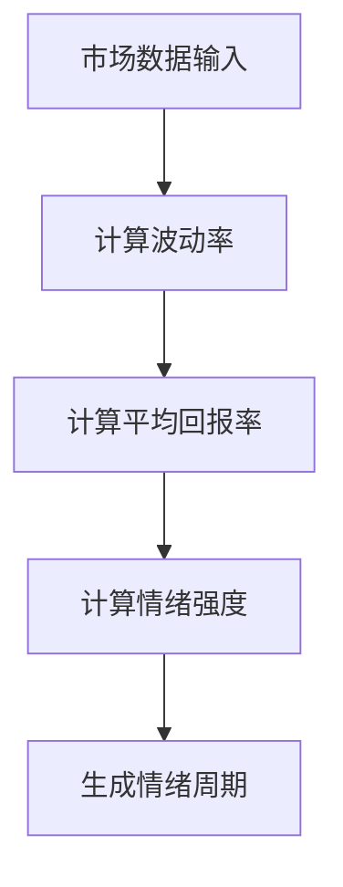
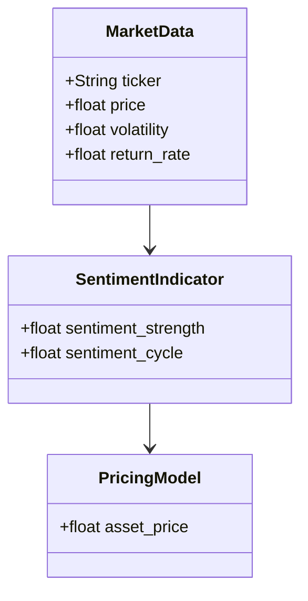
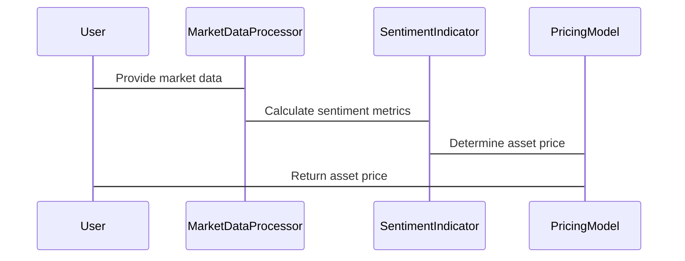

                 


# 彼得林奇的"市场情绪"指标在跨资产类别定价中的应用

## 关键词：
- 彼得林奇
- 市场情绪指标
- 跨资产定价
- 投资者情绪
- 行为金融学

## 摘要：
彼得林奇的市场情绪指标是一种基于投资者情绪和市场波动性来评估资产定价的工具。本文详细探讨了该指标的数学模型、跨资产应用及其在实际投资中的效果，结合案例分析和系统设计，展示了其在不同资产类别中的应用潜力。

---

## 第一部分：彼得林奇的市场情绪指标概述

### 第1章：彼得林奇市场情绪指标的背景与核心概念

#### 1.1 市场情绪指标的定义与核心要素

##### 1.1.1 市场情绪指标的定义
市场情绪指标（Market Sentiment Indicator）是用来量化投资者情绪和市场情绪的工具，通过分析市场参与者的心理状态来预测资产价格的波动。彼得林奇提出的市场情绪指标结合了行为金融学的理论，强调情绪在市场定价中的作用。

##### 1.1.2 市场情绪的核心要素
- **情绪强度**：投资者情绪的剧烈程度，通常与市场波动率相关。
- **情绪周期**：市场情绪从乐观到悲观再到乐观的周期性变化。
- **市场参与度**：投资者在市场中的活跃程度。

##### 1.1.3 彼得林奇市场情绪指标的独特性
彼得林奇的指标结合了情绪强度和情绪周期，强调情绪的周期性波动对市场定价的影响。

#### 1.2 市场情绪指标的理论基础

##### 1.2.1 行为金融学基础
行为金融学认为，投资者的决策受到情绪和认知偏差的影响，情绪指标反映了这种非理性行为。

##### 1.2.2 投资者情绪与市场波动的关系
市场情绪波动会影响资产价格，情绪高涨时资产价格可能被高估，情绪低落时可能被低估。

##### 1.2.3 彼得林奇市场情绪指标的哲学基础
彼得林奇认为，市场情绪是市场波动的核心驱动力，通过量化情绪可以更好地理解市场定价机制。

---

### 第2章：市场情绪指标的数学模型与公式

#### 2.1 情绪指标的数学表达

##### 2.1.1 情绪强度公式
$$情绪强度 = \frac{市场波动率}{市场平均回报率}$$

- 市场波动率通常用标准差衡量。
- 市场平均回报率用资产的平均收益率计算。

##### 2.1.2 情绪周期模型
$$情绪周期 = \sin(\theta)$$

- θ为时间变量，情绪周期通过正弦函数模拟周期性波动。

#### 2.2 情绪指标的统计分析

##### 2.2.1 方差分析
$$方差 = \sum_{i=1}^{n} (x_i - \mu)^2$$

- 计算市场情绪的波动性。

##### 2.2.2 相关系数计算
$$相关系数 = \frac{Cov(X,Y)}{\sigma_X \sigma_Y}$$

- 度量市场情绪与其他资产价格的相关性。

#### 2.3 情绪指标的算法流程图



---

## 第二部分：市场情绪指标在跨资产定价中的应用

### 第3章：市场情绪指标在跨资产定价中的应用

#### 3.1 股票市场中的应用

##### 3.1.1 股票情绪指标的计算与分析

- 使用情绪强度公式分析股票市场的波动性。

##### 3.1.2 情绪指标对股票定价的影响

- 情绪高涨时，股票价格可能被高估，反之则可能低估。

##### 3.1.3 实际案例分析

- 例如，2020年新冠疫情对股票市场情绪的影响，情绪指数从高到低，导致股价大幅波动。

#### 3.2 债券市场中的应用

##### 3.2.1 债券情绪指标的计算方法

- 使用类似的情绪强度公式，但考虑债券的信用风险和利率风险。

##### 3.2.2 情绪指标对债券定价的影响

- 情绪高涨时，债券价格可能上升，但需考虑利率风险。

##### 3.2.3 案例分析与结果解读

- 例如，2021年美联储加息预期对债券市场情绪的影响。

#### 3.3 其他资产类别的应用

##### 3.3.1 基金与ETF的情绪指标应用

- 使用情绪指标评估基金的风险溢价。

##### 3.3.2 商品市场的应用

- 情绪指标用于评估大宗商品价格的波动性。

##### 3.3.3 多资产组合的情绪指标分析

- 组合管理中，情绪指标用于分散风险和优化资产配置。

---

## 第三部分：系统架构与项目实战

### 第4章：系统架构与项目实战

#### 4.1 系统功能设计

##### 4.1.1 领域模型类图



#### 4.2 系统架构设计

##### 4.2.1 系统架构图


#### 4.3 系统接口设计

##### 4.3.1 接口交互图



#### 4.4 项目实战

##### 4.4.1 环境安装

- 安装Python、Pandas、NumPy等库。

##### 4.4.2 核心代码实现

```python
import numpy as np
import pandas as pd

def calculate_sentiment_strength(volatility, average_return):
    return volatility / average_return

def calculate_sentiment_cycle(theta):
    return np.sin(theta)

# 示例数据
data = pd.DataFrame({
    'volatility': [0.2, 0.3, 0.25],
    'return_rate': [0.05, 0.03, 0.04]
})

# 计算情绪强度
sentiment_strength = data['volatility'] / data['return_rate']

# 计算情绪周期
theta = np.linspace(0, 2*np.pi, 3)
sentiment_cycle = np.sin(theta)
```

##### 4.4.3 案例分析

- 使用实际市场数据，如标普500指数，计算其情绪强度和周期。

##### 4.4.4 结果解读与分析

- 解释计算结果对资产定价的影响。

---

## 结语

彼得林奇的市场情绪指标在跨资产定价中的应用展示了情绪因素在市场定价中的重要性。通过数学模型和系统设计，投资者可以更好地理解市场波动，并做出更明智的投资决策。

---

## 作者：AI天才研究院/AI Genius Institute & 禅与计算机程序设计艺术 /Zen And The Art of Computer Programming

