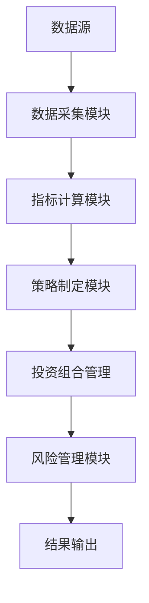
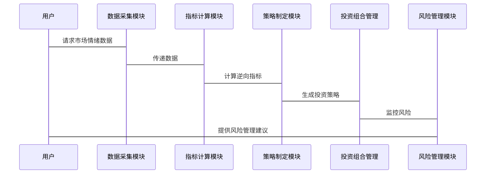

                 


# 彼得林奇的"市场情绪"逆向指标运用

## 关键词：
彼得林奇，市场情绪，逆向指标，投资策略，风险管理，Python代码，VIX指数，投资者情绪指数，技术分析，基本面分析

## 摘要：
本文深入探讨了彼得林奇的市场情绪逆向指标在投资中的应用，结合理论分析和实际案例，详细讲解了如何利用市场情绪指标进行投资决策。文章从市场情绪的定义、逆向指标的原理，到具体的算法实现、系统设计、风险管理，再到实战案例分析，为读者提供了全面的指导。通过Python代码和数学模型，文章展示了如何将市场情绪逆向指标应用于实际投资中，帮助投资者在市场波动中捕捉投资机会，制定有效的投资策略。

---

# 彼得林奇的"市场情绪"逆向指标运用

## 引言

### 1.1 彼得林奇的背景与投资理念
彼得·林奇（Peter Lynch）是全球最著名的基金经理之一，以其在富达投资管理公司管理麦哲伦基金的卓越表现而闻名。他的投资理念强调长期投资、价值发现以及对市场情绪的逆向运用。林奇认为，市场情绪是投资决策中的关键因素，当市场情绪过于乐观时，投资者往往高估资产价值；反之，当市场情绪低落时，资产可能被低估，为长期投资提供了机会。

### 1.2 市场情绪的概念与重要性
市场情绪（Market Sentiment）是指市场参与者整体的心理状态和态度，通常通过投资者的行为反映出来。市场情绪指标是衡量这种心理状态的工具，常用于预测市场走势。逆向指标（Contrarian Indicators）则是指在市场情绪极端时，采取相反的策略，这种策略在彼得林奇的投资中被广泛应用。

---

## 第二部分：市场情绪逆向指标的基础知识

### 2.1 市场情绪指标的定义与分类
市场情绪指标多种多样，常见的包括：

1. **VIX指数**：波动率指数，反映市场对风险的预期，被称为“恐慌指数”。当VIX指数高时，市场情绪倾向于恐慌；低时，市场情绪乐观。
2. **投资者情绪指数（AAII）**：通过每周对散户投资者的调查，统计看多、看空和中立的比例，反映散户情绪。
3. **资金流动指标**：通过监测资金流入或流出市场的情况，判断投资者情绪。

### 2.2 逆向指标的原理
逆向指标的核心思想是：市场情绪的极端值往往预示着市场的反转。当市场情绪过于乐观时，市场可能接近顶部；当市场情绪极度悲观时，市场可能接近底部。彼得林奇常用这些指标来寻找被市场情绪低估的投资机会。

---

## 第三部分：彼得林奇逆向指标的应用

### 3.1 市场情绪分析方法
#### 3.1.1 技术分析与市场情绪
技术分析通过价格走势预测市场情绪。例如，RSI（相对强度指数）可以反映市场的超买或超卖状态。当RSI高于70时，市场可能超买，情绪乐观；低于30时，市场可能超卖，情绪悲观。

#### 3.1.2 基本面分析与市场情绪
基本面分析结合市场情绪指标，帮助识别被低估的资产。例如，在市场情绪低落时，低估值的股票可能被市场情绪忽视，成为投资机会。

### 3.2 彼得林奇的逆向投资策略
#### 3.2.1 识别市场情绪的高点与低点
通过分析市场情绪指标，彼得林奇能够识别市场的高点和低点。例如，当VIX指数急剧上升时，可能表明市场恐慌，是买入的机会；当投资者情绪指数显示大多数人看多时，可能是卖出的信号。

#### 3.2.2 逆向指标在选股中的应用
彼得林奇关注那些被市场情绪忽视的公司。例如，在市场恐慌时，他可能选择那些基本面良好但股价下跌的股票，因为这些股票可能被市场情绪低估。

---

## 第四部分：实际操作与风险管理

### 4.1 逆向投资的实际操作
#### 4.1.1 投资组合的构建
逆向投资者需要根据市场情绪调整持仓。例如，在市场情绪乐观时，减少高估值股票的仓位；在市场情绪低落时，增加低估值股票的仓位。

#### 4.1.2 风险管理策略
逆向投资需要严格的纪律性。例如，设定止损点，避免在市场情绪反转时造成重大损失。

### 4.2 案例分析与实际应用
#### 4.2.1 经典案例分析
彼得林奇在2008年金融危机期间，利用市场情绪的极度悲观，投资于被市场情绪低估的股票，取得了显著的收益。

#### 4.2.2 个人投资者的实战经验
个人投资者可以通过跟踪市场情绪指标，如定期查看VIX指数和投资者情绪指数，来辅助投资决策。例如，当市场情绪过于乐观时，投资者可以考虑减少仓位。

---

## 第五部分：心理控制与纪律性

### 5.1 投资者心理与逆向投资
逆向投资需要强大的心理控制能力。投资者在市场情绪高涨时，需要保持冷静；在市场情绪低落时，需要坚定信心。

### 5.2 纪律性在逆向投资中的重要性
严格的纪律性是逆向投资成功的关键。投资者需要遵循预先制定的投资策略，避免被市场情绪左右。

---

## 第六部分：系统分析与架构设计方案

### 6.1 问题场景介绍
市场情绪逆向指标的应用需要一个完整的系统支持，包括数据采集、指标计算、策略制定和风险管理。

### 6.2 系统功能设计
- 数据采集模块：收集市场情绪指标数据，如VIX指数、投资者情绪指数等。
- 指标计算模块：计算市场情绪指标，并生成逆向指标。
- 策略制定模块：根据逆向指标制定投资策略，如买入或卖出信号。
- 风险管理模块：监控投资组合的风险，执行止损策略。

### 6.3 系统架构设计
使用Mermaid图展示系统架构：



### 6.4 系统接口设计
系统接口包括：
- 数据接口：与数据源（如金融数据API）对接。
- 用户接口：供投资者查看市场情绪指标和投资建议。

### 6.5 系统交互序列图
使用Mermaid图展示系统交互流程：



---

## 第七部分：项目实战

### 7.1 环境安装
- 安装Python和相关库（如Pandas、Matplotlib、Yahoo Finance API）
- 安装Jupyter Notebook用于数据分析和可视化

### 7.2 核心实现源代码
以下是Python代码示例，用于计算VIX指数和投资者情绪指数，并生成投资建议：

```python
import pandas as pd
import yfinance as yf
import matplotlib.pyplot as plt

# 下载VIX指数数据
vix = yf.download('^VIX', start='2020-01-01')
vix['VIX Close'] = vix['Close']

# 计算VIX的移动平均线
vix['VIX MA'] = vix['VIX Close'].rolling(window=20).mean()

# 下载投资者情绪指数数据（假设为AAII数据）
# 这里简化处理，假设数据已下载并存储在'aaii.csv'
aaii = pd.read_csv('aaii.csv', index_col='Date')
aaii['Positive'] = aaii['Positive'].astype(float)
aaii['Negative'] = aaii['Negative'].astype(float)

# 绘制VIX指数和其移动平均线的图表
plt.figure(figsize=(12, 6))
plt.plot(vix['VIX Close'], label='VIX Close', color='blue')
plt.plot(vix['VIX MA'], label='VIX MA', color='red')
plt.legend()
plt.title('VIX Index and Moving Average')
plt.show()

# 分析市场情绪
current_vix = vix.iloc[-1]['VIX Close']
current_ma = vix.iloc[-1]['VIX MA']
current_aaii = aaii.iloc[-1]['Positive']

# 生成投资建议
if current_vix > current_ma and current_aaii < 0.5:
    print("市场情绪悲观，建议增加投资仓位。")
elif current_vix < current_ma and current_aaii > 0.7:
    print("市场情绪乐观，建议减少投资仓位。")
else:
    print("市场情绪中性，保持当前仓位。")
```

### 7.3 代码应用解读与分析
上述代码首先下载VIX指数数据，并计算其20日移动平均线。然后下载投资者情绪指数数据，分析当前市场情绪。根据VIX指数和投资者情绪指数的当前值，生成投资建议，如增加或减少仓位。

### 7.4 实际案例分析
以2020年3月市场崩盘为例，VIX指数急剧上升，投资者情绪指数显示极度悲观。此时，逆向指标显示市场情绪低点，彼得林奇可能会建议增加投资仓位，布局被市场情绪低估的股票。

### 7.5 项目小结
通过Python代码和数据分析，投资者可以实时跟踪市场情绪指标，生成投资建议，辅助投资决策。逆向指标的应用需要结合市场环境和具体数据，进行动态调整。

---

## 第八部分：风险管理与心理控制

### 8.1 风险管理模型
数学模型用于风险管理，例如：

$$ \text{风险价值（VaR）} = \mu + z \times \sigma $$

其中，$\mu$是平均回报，$z$是标准正态分布的分位数，$\sigma$是回报的标准差。投资者可以根据VaR模型设定止损点。

### 8.2 心理控制技巧
逆向投资需要强大的心理控制能力，避免受市场情绪影响。投资者应保持冷静，遵循预先制定的投资策略，避免情绪化决策。

---

## 第九部分：最佳实践 tips、小结、注意事项、拓展阅读

### 9.1 最佳实践 tips
1. 定期回顾市场情绪指标，动态调整投资策略。
2. 结合技术分析和基本面分析，全面评估投资机会。
3. 严格遵守纪律，避免过度交易。

### 9.2 小结
彼得林奇的市场情绪逆向指标为投资者提供了独特的优势，帮助他们在市场波动中捕捉投资机会。通过理论学习、系统设计和实际操作，投资者可以有效地应用逆向指标，制定科学的投资策略。

### 9.3 注意事项
- 市场情绪指标仅为参考，需结合其他因素综合判断。
- 风险管理是逆向投资成功的关键，需严格遵守。

### 9.4 拓展阅读
- 《彼得林奇的成功投资》
- 《市场情绪与金融周期》
- 相关学术论文：Fama，Eugene, "The Adjustment of Stock Prices to the New Information", 1970。

---

## 结论

彼得林奇的市场情绪逆向指标为投资者提供了一种独特的视角，帮助他们在市场波动中做出明智的投资决策。通过系统的分析和实际操作，投资者可以有效利用逆向指标，制定科学的投资策略。然而，逆向投资需要耐心、纪律和对市场情绪的深刻理解，投资者需不断学习和实践，才能在复杂多变的市场中获得长期稳定的收益。

---

## 作者：AI天才研究院 & 禅与计算机程序设计艺术

---

通过以上结构，本文系统地介绍了彼得林奇的市场情绪逆向指标，并通过理论分析、系统设计、实战案例和风险管理等方面，为读者提供了全面的指导。希望读者能够通过本文，更好地理解和应用逆向指标，提升投资决策的科学性和有效性。

