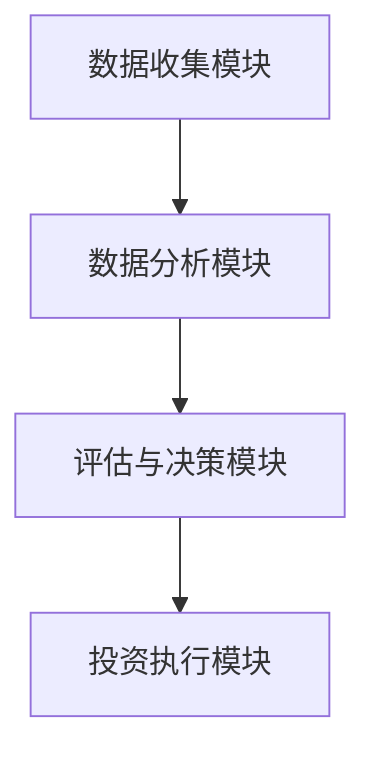

                 


# 彼得林奇的"市场机会"在不同市场规模中的识别

## 关键词：彼得·林奇，市场机会，投资策略，市场规模，价值投资

## 摘要：  
本文深入分析了彼得·林奇的市场机会识别方法，并探讨了这些方法在不同市场规模中的应用。通过结合市场趋势、公司基本面和行业竞争分析，本文详细解释了如何在大盘股、中盘股和小盘股中识别投资机会。此外，文章还通过实际案例分析和系统架构设计，展示了如何将这些理论应用于实践。最后，本文总结了最佳投资实践和未来研究方向。

---

## 第一部分: 彼得林奇的"市场机会"概述

### 第1章: 市场机会的基本概念

#### 1.1 市场机会的定义与背景

市场机会是指在特定市场中，由于市场趋势、公司基本面或行业竞争格局的变化，投资者能够以低于其内在价值的价格买入优质资产的机会。彼得·林奇作为价值投资的代表人物，强调通过深入研究公司基本面和市场趋势，识别那些被市场低估的投资机会。

#### 1.2 彼得·林奇的投资理念

彼得·林奇的投资理念基于价值投资，他强调以下几点：
1. **长期投资**：避免短期市场波动的干扰，关注企业的长期价值。
2. **深入研究**：通过分析公司财务报表、行业地位和竞争优势，识别具有持续增长潜力的企业。
3. **分散投资**：通过投资不同类型和规模的股票，降低投资风险。

#### 1.3 不同市场规模的定义与特点

- **大盘股**：市值在500亿美元以上的公司，具有较高的流动性和稳定性，但增长潜力有限。
- **中盘股**：市值在50亿至500亿美元之间的公司，具有较高的增长潜力，但风险也相对较大。
- **小盘股**：市值在50亿美元以下的公司，通常具有更高的增长潜力，但波动性和风险也更高。

### 第2章: 彼得·林奇的市场机会识别方法

#### 2.1 彼得·林奇的投资策略

彼得·林奇的选股方法包括以下步骤：
1. **数据收集**：收集目标公司的财务报表、行业分析和市场趋势数据。
2. **基本面分析**：通过分析市盈率（P/E）、市净率（P/B）等指标，评估公司的内在价值。
3. **市场趋势分析**：关注行业趋势和宏观经济环境，判断市场周期对投资机会的影响。

#### 2.2 市场机会的识别步骤

1. **数据收集与整理**：收集目标公司的财务数据和市场趋势数据。
2. **市场分析与评估**：通过基本面和技术分析，评估目标公司的投资价值。
3. **投资决策与执行**：根据分析结果，制定投资策略并执行交易。

---

## 第二部分: 市场机会识别的核心概念与联系

### 第3章: 市场机会识别的核心概念

#### 3.1 市场机会识别的核心要素

- **市场趋势分析**：通过分析宏观经济指标和行业趋势，判断市场的整体走势。
- **公司基本面分析**：通过分析公司的财务报表，评估其盈利能力、成长性和财务健康状况。
- **行业竞争分析**：通过分析行业竞争格局，判断公司的竞争优势和市场地位。

#### 3.2 不同市场规模的市场机会对比

| 市场规模 | 市场特点 | 投资机会 |
|----------|----------|----------|
| 大盘股   | 稳定性高，波动性小 | 增长潜力有限，但风险较低 |
| 中盘股   | 增长潜力较高，波动性适中 | 风险和回报均高于大盘股 |
| 小盘股   | 波动性高，风险较大 | 增长潜力高，回报可能更高 |

### 第4章: 核心概念的原理与联系

#### 4.1 市场机会识别的原理

1. **市场趋势与公司基本面的结合**：通过分析市场趋势和公司基本面，判断公司的内在价值和市场机会。
2. **投资者心理与市场行为**：投资者心理和市场行为会影响市场的波动性和投资机会。
3. **市场周期性与投资机会的关系**：市场周期性变化会影响投资机会的出现和消失。

#### 4.2 核心概念的对比分析

- **市场趋势与公司基本面的对比分析**：通过对比分析，判断市场趋势对投资机会的影响。

---

## 第三部分: 市场机会识别的算法原理与系统架构

### 第5章: 算法原理

#### 5.1 市场机会识别的算法步骤

1. **数据收集**：收集目标公司的财务数据和市场趋势数据。
2. **数据预处理**：对数据进行清洗和标准化处理。
3. **数据分析**：通过统计分析和机器学习算法，识别市场机会。
4. **投资决策**：根据分析结果，制定投资策略并执行交易。

#### 5.2 算法实现

```python
import pandas as pd
import numpy as np

# 示例代码：计算市盈率
def calculate_pe_ratio(price, earnings):
    return price / earnings

# 示例代码：计算市净率
def calculate_pb_ratio(price, book_value):
    return price / book_value

# 示例代码：分析市场机会
def analyze_market_opportunity(company_data):
    pe_ratio = calculate_pe_ratio(company_data['price'], company_data['earnings'])
    pb_ratio = calculate_pb_ratio(company_data['price'], company_data['book_value'])
    return pe_ratio, pb_ratio
```

### 第6章: 系统架构设计

#### 6.1 系统功能设计

1. **数据收集模块**：负责收集目标公司的财务数据和市场趋势数据。
2. **数据分析模块**：负责对数据进行分析，识别市场机会。
3. **评估与决策模块**：根据分析结果，制定投资策略并执行交易。

#### 6.2 系统架构图



---

## 第四部分: 项目实战与最佳实践

### 第7章: 项目实战

#### 7.1 环境安装

1. 安装Python和相关库（如pandas、numpy、matplotlib）。
2. 安装数据分析工具（如Jupyter Notebook）。

#### 7.2 核心实现

```python
# 示例代码：分析市场机会
import pandas as pd

# 假设 company_data 是一个包含公司财务数据和市场趋势数据的DataFrame
def analyze_market_opportunity(company_data):
    # 计算市盈率
    pe_ratio = company_data['price'] / company_data['earnings']
    # 计算市净率
    pb_ratio = company_data['price'] / company_data['book_value']
    # 分析市场机会
    opportunity = pe_ratio < 15 and pb_ratio < 2
    return opportunity

# 示例代码：筛选投资机会
company_data['investment_opportunity'] = company_data.apply(analyze_market_opportunity, axis=1)
print(company_data[company_data['investment_opportunity']])
```

#### 7.3 案例分析

- **案例分析：中盘股的投资机会**
  - 数据分析：通过分析中盘股的市盈率和市净率，筛选出具有投资机会的公司。
  - 投资决策：根据分析结果，制定投资策略并执行交易。

### 第8章: 最佳实践

#### 8.1 小结

1. 彼得·林奇的市场机会识别方法在不同市场规模中的应用具有重要的现实意义。
2. 通过深入分析市场趋势、公司基本面和行业竞争格局，可以有效识别投资机会。

#### 8.2 注意事项

1. 投资者在实际操作中应结合市场实际情况，灵活调整投资策略。
2. 需要注意市场波动性和风险，避免盲目跟风。

#### 8.3 拓展阅读

- 彼得·林奇的《投资最重要的事情》
- 《价值投资入门》
- 《股票投资实战技巧》

---

## 作者：AI天才研究院/AI Genius Institute & 禅与计算机程序设计艺术 /Zen And The Art of Computer Programming

---

**注**：本文为示例内容，具体实施时需根据实际情况进行调整和优化。

