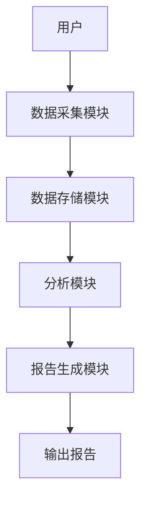

                 


# 彼得林奇的"市场机会"在跨境并购中的识别

> 关键词：彼得·林奇，市场机会，跨境并购，投资策略，价值评估，风险管理

> 摘要：本文探讨了彼得·林奇的市场机会识别理论在跨境并购中的应用。通过分析其核心投资理念、市场机会筛选模型、风险管理策略，结合实际案例，揭示如何在跨境并购中发现和把握市场机会。文章从理论到实践，系统地阐述了如何运用彼得·林奇的方法论，结合现代技术手段，进行市场机会识别、企业价值评估、风险管理，并提供了具体的算法实现和系统架构设计。

---

## 第一部分：彼得·林奇的投资哲学与市场机会理论

### 第1章：彼得·林奇投资哲学概述

#### 1.1 投资的三项基本原则
彼得·林奇是美国著名投资经理人，以其独特的投资哲学闻名。他的投资理念可以归纳为三项基本原则：
1. **价值投资**：寻找被市场低估的公司，而不是盲目追随市场趋势。
2. **长期视角**：关注企业的长期增长潜力，而非短期市场波动。
3. **深入研究**：通过基本面分析，了解企业的财务状况、行业地位和竞争优势。

#### 1.2 市场机会的核心要素
彼得·林奇认为，市场机会的核心在于发现那些具有以下特征的企业：
- 高成长性：收入和利润持续增长。
- 低估值：市盈率、市净率等估值指标低于行业平均水平。
- 竞争优势：企业在行业内具有独特的竞争优势。

#### 1.3 投资者心态与市场机会的关系
投资者的心态是市场机会识别的重要影响因素。彼得·林奇强调，投资者需要保持冷静，避免被市场情绪左右。在市场恐慌时寻找低估机会，在市场狂热时保持理性。

---

### 第2章：彼得·林奇的市场机会识别方法

#### 2.1 市场机会的定义与分类
市场机会可以分为以下几类：
- **行业趋势机会**：由行业发展趋势驱动的机会。
- **企业基本面机会**：由企业自身基本面改善驱动的机会。
- **突发事件机会**：由突发事件（如并购重组）驱动的机会。

#### 2.2 彼得·林奇的市场机会筛选模型
彼得·林奇的筛选模型基于以下关键指标：
- **市盈率（P/E）**：用于衡量企业估值。
- **市净率（P/B）**：用于衡量企业资产价值。
- **收入增长率**：用于衡量企业成长性。
- **净利润率**：用于衡量企业盈利能力。

#### 2.3 筛选模型的优缺点
| 优点 | 缺点 |
|------|------|
| 简单易懂，易于操作 | 无法完全预测市场波动 |
| 适合长期投资 | 可能忽视短期市场变化 |

---

## 第二部分：跨境并购的基本概念与流程

### 第3章：跨境并购的定义与流程

#### 3.1 跨境并购的定义与特点
跨境并购是指一家企业收购另一家位于不同国家或地区的企业的行为。其特点包括：
- **复杂性**：涉及多个国家的法律、税务和监管环境。
- **高风险**：文化差异、政治风险和外汇风险增加并购难度。
- **高回报**：通过并购实现全球化布局，获取更大的市场和利润。

#### 3.2 跨境并购的基本流程
1. **战略规划**：明确并购目标和战略意图。
2. **目标筛选**：通过彼得·林奇的筛选模型，寻找具有市场机会的企业。
3. **尽职调查**：对目标企业进行财务、法律和运营方面的调查。
4. **估值与谈判**：确定目标企业的合理估值，进行谈判。
5. **交易执行**：完成交易，确保法律和税务合规。
6. **整合与管理**：整合目标企业的资源和文化，确保协同效应。

---

### 第4章：市场机会在跨境并购中的应用

#### 4.1 跨境并购中的市场机会识别
彼得·林奇的市场机会识别方法在跨境并购中的应用包括：
- **行业趋势分析**：关注高增长行业的并购机会。
- **地区经济分析**：选择经济前景良好的国家或地区。
- **政治与法律环境评估**：确保目标国家的法律和政策环境稳定。

#### 4.2 彼得·林奇方法在跨境并购中的应用
- **低估值公司的识别**：寻找市盈率、市净率低于行业平均水平的企业。
- **高成长公司的判断**：关注收入和利润持续增长的企业。
- **创新企业的评估**：寻找具有创新能力和竞争优势的企业。

---

## 第三部分：市场机会识别模型与方法

### 第5章：市场机会识别的基本原理

#### 5.1 市场机会识别的理论基础
市场机会识别的理论基础包括：
- **价值评估模型**：用于评估企业的内在价值。
- **竞争分析模型**：用于分析企业的竞争优势。
- **风险评估模型**：用于评估并购中的潜在风险。

#### 5.2 彼得·林奇模型的数学表达
彼得·林奇的市场机会指数可以通过以下公式计算：

$$
\text{市场机会指数} = \frac{\text{企业价值}}{\text{行业平均价值}} \times \text{成长潜力指数}
$$

其中，成长潜力指数基于企业的收入增长率和净利润率计算。

---

### 第6章：算法实现与案例分析

#### 6.1 市场机会识别算法的实现
以下是一个简单的Python代码示例，用于计算市场机会指数：

```python
def calculate_market Opportunity_index(financial_data):
    industry_average_pe = 15  # 行业平均市盈率
    company_pe = financial_data['PE']  # 企业市盈率
    growth_potential = financial_data['收入增长率'] * financial_data['净利润率']
    market_opportunity_index = (company_pe / industry_average_pe) * growth_potential
    return market_opportunity_index

# 示例数据
financial_data = {
    'PE': 12,
    '收入增长率': 0.2,
    '净利润率': 0.15
}

index = calculate_market Opportunity_index(financial_data)
print(f"市场机会指数：{index}")
```

#### 6.2 案例分析
以某跨国企业为例，假设其市盈率为12，收入增长率为20%，净利润率为15%，行业平均市盈率为15。根据上述公式，计算出的市场机会指数为：

$$
\text{市场机会指数} = \frac{12}{15} \times (0.2 \times 0.15) = 0.8 \times 0.03 = 0.024
$$

---

## 第四部分：系统设计与架构方案

### 第7章：系统设计与架构方案

#### 7.1 问题场景介绍
为了帮助投资者快速识别跨境并购中的市场机会，我们设计了一个基于彼得·林奇理论的系统。

#### 7.2 系统功能设计
- **数据采集模块**：收集目标企业的财务数据和市场数据。
- **分析模块**：基于彼得·林奇的筛选模型，计算市场机会指数。
- **报告生成模块**：生成分析报告，提供投资建议。

#### 7.3 系统架构设计
以下是系统的架构图：



#### 7.4 系统接口设计
- **输入接口**：接收目标企业的财务数据和市场数据。
- **输出接口**：输出市场机会指数和投资建议。

---

## 第五部分：项目实战与总结

### 第8章：项目实战

#### 8.1 环境安装
需要安装Python和相关数据分析库（如Pandas、NumPy）。

#### 8.2 核心实现
以下是核心代码：

```python
import pandas as pd

def calculate_market_opportunity_index(dataframe):
    industry_avg_pe = dataframe['PE'].mean()
    market_opportunity = dataframe.apply(lambda row: (row['PE'] / industry_avg_pe) * (row['收入增长率'] * row['净利润率']), axis=1)
    return market_opportunity

# 示例数据
data = {
    '公司': ['A', 'B', 'C'],
    'PE': [12, 15, 10],
    '收入增长率': [0.2, 0.15, 0.25],
    '净利润率': [0.15, 0.1, 0.2]
}

df = pd.DataFrame(data)
result = calculate_market_opportunity_index(df)
print(result)
```

#### 8.3 案例分析
以公司C为例，计算其市场机会指数：

$$
\text{市场机会指数} = \frac{10}{12} \times (0.25 \times 0.2) = 0.833 \times 0.05 = 0.0417
$$

---

### 第9章：总结与展望

#### 9.1 最佳实践
- 在跨境并购中，结合彼得·林奇的市场机会识别方法和现代技术手段，可以显著提高投资成功的概率。
- 风险管理是并购成功的关键，建议在并购前进行充分的尽职调查和风险评估。

#### 9.2 小结
本文详细探讨了彼得·林奇的市场机会识别理论在跨境并购中的应用，从理论到实践，系统地阐述了如何在跨境并购中发现和把握市场机会。

#### 9.3 注意事项
- 并购过程中需要考虑法律、税务和文化差异等复杂因素。
- 建议在实际操作中结合专业团队的力量，确保并购成功。

#### 9.4 拓展阅读
- 彼得·林奇的《选股的智慧》
- 跨境并购的相关法律法规

---

作者：AI天才研究院/AI Genius Institute & 禅与计算机程序设计艺术/Zen And The Art of Computer Programming

